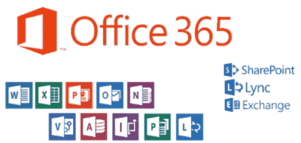

# 什么是 Microsoft Office 365？ Excel on Cloud 的好处

> 原文： [https://www.guru99.com/excel-in-the-cloud-office-365.html](https://www.guru99.com/excel-in-the-cloud-office-365.html)

## 什么是 Office 365？

Office 365 是 Microsoft 的一套程序，可以在本地运行，也可以同步到云存储。 可以从访问程序。 借助 Office 365，您可以在任何地方进行工作，并与世界各地的同事共享工作文档。 Office 365 支持的设备：

*   台式计算机–安装为 Microsoft Office 365
*   Web – Office Online 允许您使用 Office 应用程序的轻量级版本来创建和编辑文档。
*   移动设备–智能手机和平板电脑

Excel 也是 Office 365 附带的程序的一部分。您也可以在基于云的版本中使用 excel 桌面版本中提供的强大功能。

## Office 365 的优点

*   提高用户生产力
*   能够从多个设备和位置访问文档
*   与同事轻松共享文档
*   使用 OneDrive 的 1 TB 存储
*   如何订阅 Office 365
*   如果您丢失了计算机或崩溃了，可以轻松地从云中恢复数据。

## Office 365 的缺点

*   由于这是基于云的服务，因此如果 Office 365 的云服务发生故障，则可能会发生中断
*   如果用户不遵循安全最佳实践，那么从多个设备/位置轻松访问也可能带来安全风险。

## 如何订阅 Office 365

如果您想试用 Office 365 或获取更多详细信息，可以访问此链接。 [https://products.office.com/en-us/business/office](https://products.office.com/en-us/business/office) 或 [https://products.office.com/en-us/try](https://products.office.com/en-us/try) 。 由于这是一项基于订阅的服务，因此您需要每月付费。 您可以免费试用 30 天。

## Office 365 支持的设备？

*   Android 驱动的设备
*   iOS 手机和 iOS 平板电脑
*   Windows 供电的设备（智能手机和平板电脑）
*   Windows 操作系统
*   OS X 操作系统

## 摘要

计算世界正朝着云计算和移动计算方向发展。 大多数用户可以使用移动设备，例如智能手机&平板电脑和高速互联网。 大多数软件公司已经利用这种强大的云和[移动](/mobile-testing.html)计算技术来开发可提高用户生产力的移动应用程序。

Office 365 是 Microsoft Office 的强大的基于云的版本，其中还包括 excel。 Office 365 使您能够从多个设备和位置访问，创建和编辑 excel 文档。 由于您可以在世界任何地方工作，因此极大地提高了生产率。