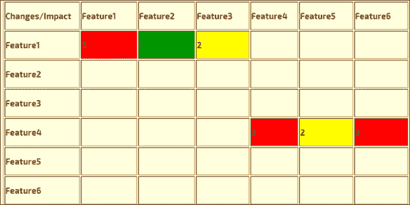
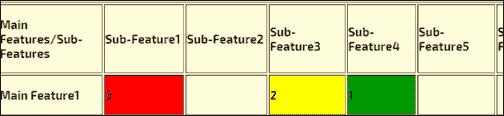

# 软件测试中的影响分析

> 原文： [https://www.guru99.com/impact-analysis-software-testing.html](https://www.guru99.com/impact-analysis-software-testing.html)

### 什么是影响分析？

影响分析定义为分析已部署产品或应用程序中更改的影响。 它提供有关由于应用程序的特定部分或功能的更改而可能受到影响的系统区域的信息。

分析了对需求，设计&体系结构，对测试的影响以及对进度的影响。

随着将新功能集成到应用程序或产品中，必须检查这些新功能或更改对系统性能的影响。 因此，进行影响分析。

在本教程中，您将学习-

*   [什么是影响分析？](#1)
*   [为什么要进行变更影响分析？](#2)
*   [什么是影响分析文档？](#Document)
*   [如何显示影响分析影响力水平](#3)
*   [变更影响分析的最佳做法](#4)

### 为什么要进行变更影响分析？

*   这样做是为了了解实施更改的可能结果。 在产品中引入太多功能会降低产品的整体性能。
*   如果团队决定实施产品变更，以识别所有可能必须修改的文件，文档和模型
*   估算实施变更所需的工作量
*   识别实施变更所需的任务
*   它将列出对特定元素的依赖性

### 什么是影响分析文档？

Impact Analysis 文档可以用作清单。 它用于在处理变更请求之前对其进行评估。 影响分析文档应提供以下详细信息：

*   问题的简要说明
*   解释或显示缺陷如何导致失败和/或效率低下的示例
*   包括复杂程度的估算
*   包括修复成本和时间的估算
*   要测试的功能
*   列出为更改创建的新测试用例
*   参考文件-提及参考文件，技术规格等

**示例：**

影响分析文件。

1.  变更请求 ID：
2.  标题：
3.  描述：
4.  日期准备：
5.  优先级估算：
    *   相对利益
    *   相对罚款
    *   相对成本
    *   相对风险
6.  预计总工作量：…..小时
7.  估计损失的精力：……..小时
8.  预计时间表影响：……天
9.  质量影响；
10.  受影响的其他要求：
11.  受影响的其他任务：
12.  整合问题：

### 如何显示影响分析的影响程度

可以按照颜色代码标记影响分析，以表示更改的严重性或更改对系统的影响。 颜色代码可以是如下所示的任何颜色。

*   **红色-强**
*   **黄色-中度**
*   **绿弱**

上表说明了已实施更改的影响

*   标记为红色的特征表示已更改的主要特征，标记为黄色的特征受更改影响较小，标记为绿色的特征最少。
*   垂直提到的特征类似于那些已更改的特征，而水平提到的那些执行更改可能会影响的特征。 例如，在上面的示例中，特征 1 的更改会影响特征 3
*   对于较大的项目，其特征和功能更多，那么上表可能没有任何用处。 在这种情况下，将采用另一种方法，其中开发人员会直接标出由于主要功能的变化而产生的影响程度。 如下所示，其中“主要功能”的影响被标记为各个子功能。

**进行影响分析需要解决的示例问题**

*   进行拟议变更有哪些不利副作用或风险？
*   是否需要任何工具来实施和测试更改？
*   如果接受更改，将会损失多少已经投入的精力？
*   建议的更改是否会对性能要求产生不利影响？
*   为了验证建议的更改，是否需要其他用户输入？
*   变更会增加产品成本吗？
*   提议的变更是否是现有员工具备的知识和技能？
*   拟议的变更是否对任何计算机资源提出了不可接受的要求？

### 变更影响分析的最佳实践

*   在开始使用 Impact Analysis 之前，请确保测试请求不包含有关项目部分受更改影响的信息。
*   开发人员和测试人员之间必须保持持续的沟通，不要错过在最终产品中实施所需的任何更改
*   标识是否需要更改，删除或添加任何用户界面。
*   估计所需的验收，系统或集成测试用例的数量
*   确定提议的更改对另一个项目计划，配置管理计划或质量保证计划的任何影响。

**摘要**

*   影响分析将确保需要更改应用程序的哪一部分
*   分析对系统的影响，包括需求，设计&体系结构，对测试的影响等。
*   It helps to analyze what level of regression testing is required