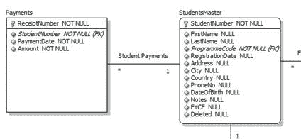
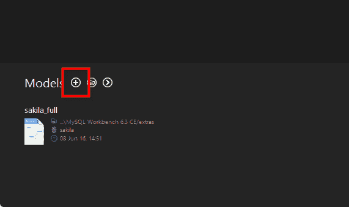
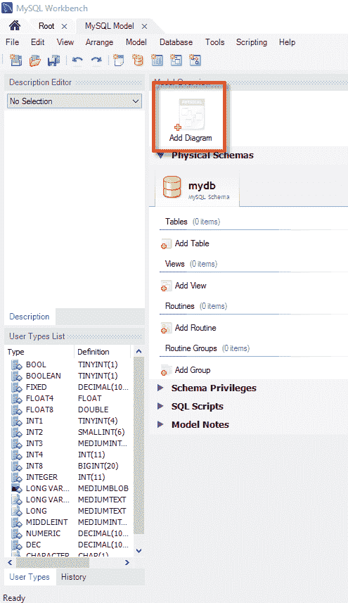
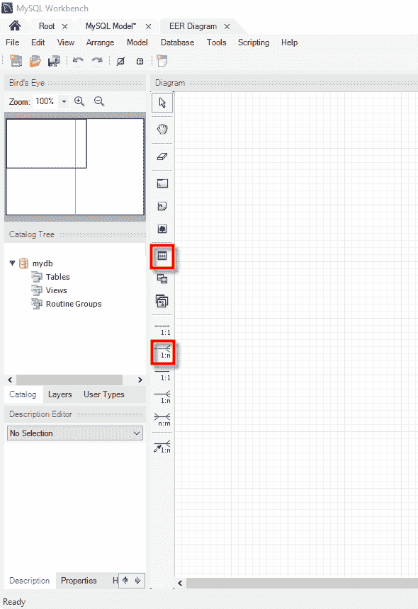
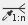
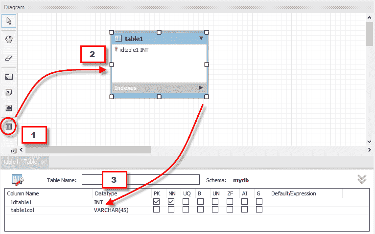
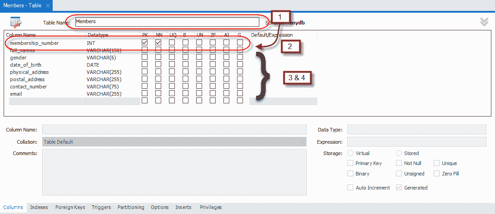
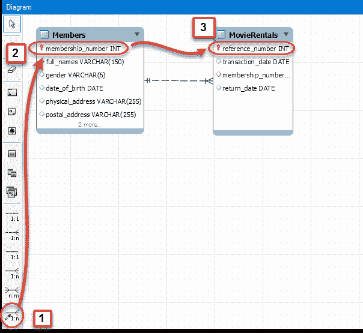
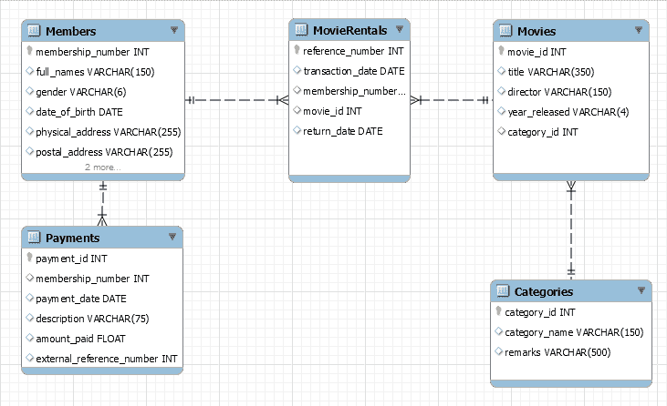

# 什么是 ER 建模？ 通过示例学习

> 原文： [https://www.guru99.com/er-modeling.html](https://www.guru99.com/er-modeling.html)

## 什么是 ER 建模？

**实体关系模型**（ER 建模）是用于数据库设计的图形方法。 它是高级数据模型，用于定义指定软件系统的数据元素及其关系。 ER 模型用于表示实际对象。

**实体**是现实世界中可与周围环境区分开的事物或对象。 例如，组织的每个员工都是一个单独的实体。 以下是实体的一些主要特征。

*   实体具有一组属性。
*   实体属性可以具有值。

**在本教程中，您将学习-**

*   [增强实体关系（EER）模型](#2)
*   [为什么使用 ER 模型？](#3)
*   [“ MyFlix”库中的实体](#4)
*   [定义实体之间的关系](#5)

让我们再次考虑第一个示例。 组织的员工是实体。 如果“ Peter”是 Microsoft 的程序员（**员工**），则他可以具有**属性（**属性），例如名称，年龄，体重，身高等。 持有与他有关的价值观。

每个属性可以具有**值**。 在大多数情况下，单个属性只有一个值。 但是属性也可能具有**多个值**。 例如，彼得的年龄只有一个值。 但是他的“电话号码”属性可以有多个值。

实体之间可以具有**关系**。 让我们考虑最简单的例子。 假定为每个 Microsoft 程序员提供了一台计算机。 显然**彼得的计算机**也是一个实体。 彼得正在使用那台计算机，而彼得正在使用同一台计算机。 换句话说，Peter 和他的计算机之间存在相互关系。

在**实体关系建模中，**我们为实体，实体的属性以及实体之间的关系建模。

## 增强实体关系（EER）模型

增强实体关系（EER）模型是高级数据模型，它为原始**实体关系**（ER）模型提供了扩展。 EER 模型支持更多详细设计。 EER 建模是一种用于对高度复杂的数据库进行建模的解决方案。

**EER 使用 UML 表示法。** UML 是统一建模语言的缩写； 它是设计面向对象系统时使用的通用建模语言。 实体表示为类图。 关系表示为实体之间的关联。 下图显示了使用 UML 表示法的 ER 图。

## 为什么使用 ER 模型？

现在您可能会想，为什么我们可以简单地创建数据库及其所有对象而无需 ER 建模，为什么要使用 ER 建模呢？ 设计数据库时面临的挑战之一是，设计师，开发人员和最终用户倾向于以不同的方式查看数据及其使用。 如果不加以限制，我们最终可能会产生一个不满足用户要求的数据库系统。

所有利益相关者（技术和非技术用户）都理解的通信工具对于生产满足用户要求的数据库系统至关重要。 ER 模型就是此类工具的示例。

ER 图还可以轻松转换为关系表，因此也提高了用户的工作效率。

案例研究：“ MyFlix”视频库的 ER 图

现在，让我们与 MyFlix Video Library 数据库系统一起使用，以帮助理解 ER 图的概念。 在本教程的其余部分中，我们将使用该数据库进行所有动手操作。

MyFlix 是一个将电影出租给其成员的商业实体。 MyFlix 一直在手动存储其记录。 管理层现在想转移到 DBMS

让我们看看为该数据库开发 EER 图的步骤-

1.  标识实体并确定它们之间存在的关系。
2.  每个实体，属性和关系都应具有适当的名称，这些名称也可以由非技术人员轻松理解。
3.  关系不应该彼此直接连接。 关系应连接实体。
4.  给定实体中的每个属性应具有唯一的名称。

## 库“ MyFlix”中的实体

包含在我们的 ER 图中的实体是；

*   **成员**-该实体将保存成员信息。
*   **电影**-该实体将持有有关电影的信息
*   **类别**-该实体将持有将电影分为不同类别的信息，例如“戏剧”，“动作”和“史诗”等。
*   **电影租借**-该实体将保存有关出租给成员的电影的信息。
*   **付款**-该实体将保存有关会员付款的信息。

## 定义实体之间的关系

**成员和电影**

关于两个实体之间的交互，以下内容成立。

*   成员在给定期间内可以租借的电影比电影多 1。
*   在给定时间段内，一部电影可以由多个成员租用。

从以上场景中，我们可以看到关系的性质是多对多的。 **关系数据库不支持多对多关系。 我们需要引入一个结点实体**。 这是 MovieRentals 实体扮演的角色。 它与 members 表具有一对多关系，与 movies 表具有一对多关系。

**电影和类别实体**

以下内容适用于电影和类别。

*   电影只能属于一个类别，但一个类别可以包含多个电影。

由此我们可以得出类别与电影表之间关系的性质是一对多的。

**会员和付款实体**

关于会员和付款，以下内容成立

*   会员只能拥有一个帐户，但可以进行多次付款。

由此我们可以推断出会员与支付实体之间关系的性质是一对多的。

现在让我们使用 MySQL Workbench 创建 EER 模型

在 MySQL 工作台中，单击-“ +”按钮

双击“添加图”按钮以打开 ER 图的工作区。

出现以下窗口

让我们看一下将要使用的两个对象。

*    表格对象允许我们创建实体并定义与特定实体关联的属性。
*    位置关系按钮允许我们定义实体之间的关系。

**成员的**实体将具有以下属性

*   会员号码
*   全名
*   性别
*   出生日期
*   实际地址
*   邮寄地址

**现在创建成员表**

1.从工具面板中拖动表格对象

2.将其拖放到工作区中。 出现名为表 1 的实体

3.双击它。 出现如下所示的属性窗口

下一个 ，

1.  将表 1 更改为成员
2.  将默认的 idtable1 编辑为 Membership_number
3.  单击下一行以添加下一个字段
4.  对成员实体中标识的所有属性执行相同的操作。

您的属性窗口现在应如下所示。

对所有已识别的实体重复上述步骤。

现在，您的图表工作区应如下图所示。

**让我们在会员和电影租借之间建立关系**

1.  也使用现有列选择位置关系
2.  单击成员表中的 membership_number
3.  单击 MovieRentals 表中的 reference_number

对其他关系重复上述步骤。 您的 ER 图现在应该看起来像这样-

### 摘要

*   ER 的完整形式是实体图和关系图。 它们在数据库设计过程中扮演着非常重要的角色。 它们充当技术人员和非技术人员的非技术交流工具。
*   实体代表现实世界的事物； 它们可以是概念上的销售订单，也可以是实体上的客户。
*   必须为所有实体赋予唯一的名称。
*   ER 模型还允许数据库设计人员识别和定义实体之间存在的关系。

整个 ER 模型如下。 您可以简单地将其导入 MySQL Workbench

[单击此处下载 ER 模型](https://drive.google.com/uc?export=download&id=0B_vqvT0ovzHcZW51NjUzVlZaVjA)