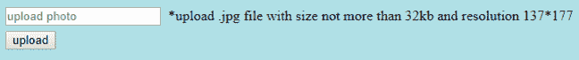

# 决策表测试：学习示例

> 原文： [https://www.guru99.com/decision-table-testing.html](https://www.guru99.com/decision-table-testing.html)

## 什么是决策表测试？

决策表测试是一种软件测试技术，用于测试不同输入组合的系统行为。 这是一种系统方法，其中以表格形式捕获了不同的输入组合及其对应的系统行为（输出）。 因此，它也被称为**原因-结果**表，其中捕获了因果关系以更好地覆盖测试。

决策表是输入相对于规则/案例/测试条件的表格表示。 让我们学习一个例子。

## 示例 1：如何为登录屏幕制作决策基础表

让我们为登录屏幕创建决策表。

如果用户提供正确的用户名和密码，则条件很简单，用户将被重定向到主页。 如果任何输入错误，将显示一条错误消息。

| **条件** | **规则 1** | **规则 2** | **规则 3** | **规则 4** |
| **用户名（T / F）** | F | Ť | F | T |
| **密码（T / F）** | F | F | T | T |
| **输出（E / H）** | 是 | E | E | H |

传说：

*   T –正确的用户名/密码
*   F –用户名/密码错误
*   E –显示错误信息
*   H –显示主屏幕

解释：

*   情况 1 –用户名和密码均错误。 向用户显示一条错误消息。
*   情况 2 –用户名正确，但密码错误。 向用户显示一条错误消息。
*   情况 3 –用户名错误，但密码正确。 向用户显示一条错误消息。
*   情况 4 –用户名和密码均正确，并且用户导航到主页

将其转换为测试用例时，我们可以创建 2 个场景，

*   输入正确的用户名和正确的密码，然后单击登录，预期结果将是用户应导航到主页

还有一个来自以下场景

*   输入错误的用户名和错误的密码，然后单击登录，预期结果将是用户应收到一条错误消息
*   输入正确的用户名和错误的密码，然后单击登录，预期结果将是用户应收到一条错误消息
*   输入错误的用户名和正确的密码，然后单击登录，预期结果将是用户应收到一条错误消息

因为他们基本上测试相同的规则。

## 示例 2：如何为上传屏幕制作决策表

现在考虑一个对话框，该对话框将要求用户在某些条件下上传照片，例如–

1.  您只能上传“ .jpg”格式的图片
2.  文件大小小于 32kb
3.  137 * 177 号决议。

如果任何条件失败，系统将抛出相应的错误消息，说明问题，如果满足所有条件，则照片将成功更新

让我们为这种情况创建决策表。

| **Conditions** | **案例 1** | **案例 2** | **案例 3** | **案例 4** | **案例 5** | **案例 6** | **案例 7** | **案例 8** |
| **格式** | .jpg | .jpg | .jpg | .jpg | 不是.jpg | Not .jpg | Not .jpg | Not .jpg |
| **尺寸** | 小于 32kb | Less than 32kb | > = 32kb | >= 32kb | Less than 32kb | Less than 32kb | >= 32kb | >= 32kb |
| **分辨率** | 137*177 | 不是 137 * 177 | 137*177 | Not 137*177 | 137*177 | Not 137*177 | 137*177 | Not 137*177 |
| **输出** | 照片已上传 | 错误消息解析不匹配 | 错误消息大小不匹配 | 错误消息的大小和分辨率不匹配 | 格式不匹配的错误消息 | 错误消息格式和分辨率不匹配 | 格式和大小不匹配的错误消息 | 格式，大小和分辨率不匹配的错误消息 |

对于这种情况，我们可以创建 8 个不同的测试用例，并根据上表确保完整的覆盖范围。

1.  上传格式为“ .jpg”，尺寸小于 32kb，分辨率为 137 * 177 的照片，然后单击“上传”。 预期结果是照片应成功上传
2.  上载格式为“ .jpg”，尺寸小于 32kb，分辨率不为 137 * 177 的照片，然后单击“上载”。 预期结果是应该显示错误消息分辨率不匹配
3.  上传一张格式为“ .jpg”，尺寸大于 32kb，分辨率为 137 * 177 的照片，然后单击“上传”。 预期结果是应该显示错误消息大小不匹配
4.  上载格式为“ .jpg”，大小大于等于 32kb，分辨率不为 137 * 177 的照片，然后单击“上载”。 预期结果是错误消息大小和分辨率不匹配应显示
5.  上载格式不是“ .jpg”，尺寸小于 32kb，分辨率为 137 * 177 的照片，然后单击“上载”。 预期结果是应显示格式不匹配的错误消息
6.  上载格式不是“ .jpg”，尺寸小于 32kb，分辨率不为 137 * 177 的照片，然后单击“上载”。 预期结果是错误消息格式和分辨率不匹配应显示
7.  上载格式不是'.jpg'，尺寸大于 32kb，分辨率为 137 * 177 的照片，然后单击“上载”。 预期结果是应显示格式和大小不匹配的错误消息
8.  上载具有'.jpg'以外的格式，大小超过 32kb 且分辨率不是 137 * 177 的照片，然后单击上载。 预期结果是应显示格式，大小和分辨率不匹配的错误消息

## 为什么决策表测试很重要？

当需要测试不同的组合时，此测试技术就变得很重要。 它还有助于更好地覆盖复杂业务逻辑的测试范围。

在软件工程中，边界值和等效分区是用于确保更好的覆盖范围的其他类似技术。 如果系统对大量输入显示**相同的**行为，则使用它们。 但是，在每个输入值集的系统行为为**不同**的系统中，边界值和等效分区技术对确保良好的测试覆盖率均无效。

在这种情况下，决策表测试是一个不错的选择。 该技术可以确保良好的覆盖范围，并且表示很简单，因此易于解释和使用。

该表可以轻松理解并涵盖所有组合，因此可以用作需求和功能开发的参考。

随着输入数量的增加，该技术的重要性立即变得清晰。 可能的组合数由 2 ^ n 给出，其中 n 是输入数。 对于 n = 10（这是基于 Web 的测试中非常常见的输入形式），组合的数量将为 1024。显然，您无法测试所有组合，但会使用基于决策的方法来选择可能组合的丰富子集 测试技术。

## 决策表测试的优势

*   当不同输入的系统行为不同而输入范围的系统行为不同时，等效分区和边界值分析均无济于事，但可以使用决策表。
*   该表示很简单，因此可以轻松解释，也可用于开发和业务。
*   该表将有助于进行有效的组合，并可以确保更好的测试覆盖范围
*   任何复杂的业务条件都可以轻松地转化为决策表
*   在输入组合很低的情况下，通常情况下我们要 100％覆盖，这种技术可以确保覆盖。

## 决策表测试的缺点

主要缺点是，当输入数量增加时，表格将变得更加复杂