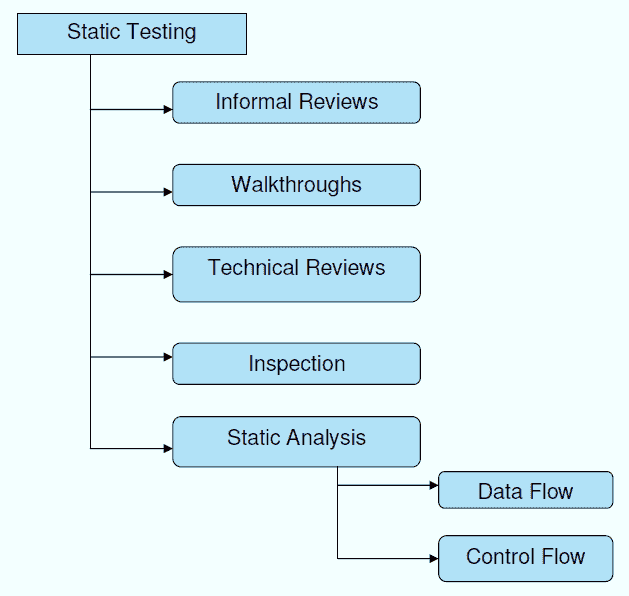

# 什么是静态测试？ 什么是测试审查？

> 原文： [https://www.guru99.com/testing-review.html](https://www.guru99.com/testing-review.html)

## 什么是静态测试？

**静态测试**是一种软件测试技术，通过它我们可以检查软件中的缺陷而无需实际执行。 它的对应部分是动态测试，它在代码运行时检查应用程序。 有关[静态测试和动态测试](/static-dynamic-testing.html)之间的详细区别，请参阅本教程。

进行静态测试是为了在开发的早期阶段避免错误，因为与失败本身相比，更容易找到失败的根源。

静态测试有助于发现动态测试可能找不到的错误。

静态测试技术的两种主要类型是

*   **手动检查**：手动检查包括对手动完成的代码的分析，也称为 **REVIEWS。**
*   **使用工具进行自动分析：**自动分析基本上是使用工具完成的静态分析。

在本教程中，您将学习-

*   [什么是静态测试？](#1)
*   [什么是测试评论？](#2)
*   [为什么要进行静态测试？](#3)
*   [在静态测试中测试的内容](#4)
*   [如何执行静态测试](#5)
*   [静态测试技术](#6)
*   [用于静态测试的工具](#7)
*   [成功进行静态测试的技巧](#8)

## 什么是测试评论？

静态测试中的审查是为了发现任何程序设计中的潜在缺陷而进行的过程或会议。 审查的另一个意义是，所有团队成员都了解项目的进度，有时想法的多样性可能会产生出色的建议。 文件直接由人员检查，并找出差异。

评论可以进一步分为四个部分：

*   非正式评论
*   演练
*   技术评论
*   视察

在审阅过程中，参加测试的四种类型的参与者是：

*   **主持人**：执行条目检查，跟进返工，指导团队成员，安排会议。
*   **作者**：负责修复发现的缺陷并提高文档质量
*   **抄写员**：在审核期间记录缺陷并参加审核会议
*   **审阅者**：检查材料是否有缺陷并检查
*   **经理**：决定执行审核并确保满足审核过程目标。

在静态测试中更容易发现的缺陷类型有：

*   偏离标准
*   不可维护的代码
*   设计缺陷
*   缺少要求
*   接口规格不一致

通常，在静态测试期间发现的缺陷是由于安全漏洞，未声明的变量，违反边界，违反语法，接口不一致等引起的。

## 为什么要进行静态测试？

由于以下原因执行静态测试

*   早期缺陷检测和纠正
*   缩短开发时间
*   降低测试成本和时间
*   为了提高开发效率
*   在以后的测试阶段减少缺陷

## 在静态测试中进行过测试

在静态测试中，对以下内容进行了测试

*   单元测试用例
*   业务需求文档（BRD）
*   用例
*   系统/功能要求
*   原型
*   原型规格文件
*   数据库字段字典电子表格
*   测试数据
*   追溯矩阵文件
*   用户手册/培训指南/文档
*   测试计划策略文档/测试案例
*   自动化/性能测试脚本

## 如何执行静态测试

要执行静态测试，可以通过以下方式完成，

*   进行检查过程以完全检查应用程序的设计
*   对要审核的每个文档使用清单，以确保所有审核均被完全覆盖

执行静态测试的各种活动是：

1.  **用例需求验证：**它验证是否标识了所有最终用户操作以及与之关联的任何输入和输出。 用例越详细和透彻，测试用例就越准确和全面。
2.  **功能需求验证**：它确保功能需求标识所有必要的元素。 它还查看数据库功能，接口列表以及硬件，软件和网络要求。
3.  **体系结构回顾**：所有业务级别的流程，例如服务器位置，网络图，协议定义，负载平衡，数据库可访问性，测试设备等。
4.  **原型/屏幕模型验证**：此阶段包括需求和用例的验证。
5.  **字段字典验证**：UI 中的每个字段都定义得足够好，可以创建字段级验证测试用例。 字段用于检查最小/最大长度，列表值，错误消息等。

## 静态测试技术

*   非正式评论
*   演练
*   技术评论
*   视察
*   静态分析
    *   数据流
    *   控制流

## 用于静态测试的工具

用于静态测试的各种工具如下，

*   [Checkstyle](https://checkstyle.sourceforge.io/)
*   [烟灰](https://sable.github.io/soot/)
*   [SourceMeter](https://www.sourcemeter.com/)

## 成功进行静态测试的技巧

在软件工程中执行静态测试过程的一些有用技巧。

*   只专注于真正重要的事情
*   明确计划和跟踪审核活动。 通常将软件演练和检查纳入同行的评论中
*   用示例培训参与者
*   解决人员问题
*   使流程保持正式的项目文化
*   持续改进–流程和工具
*   通过消除测试执行的主要延迟，可以减少测试成本和时间

**摘要：**

*   静态测试是为了尽早发现缺陷。
*   静态测试不能替代动态测试，两者都会发现不同类型的缺陷
*   评论是进行静态测试的有效技术
*   评审不仅有助于发现缺陷，而且还可以了解缺失的要求，设计缺陷和不可维护的代码。