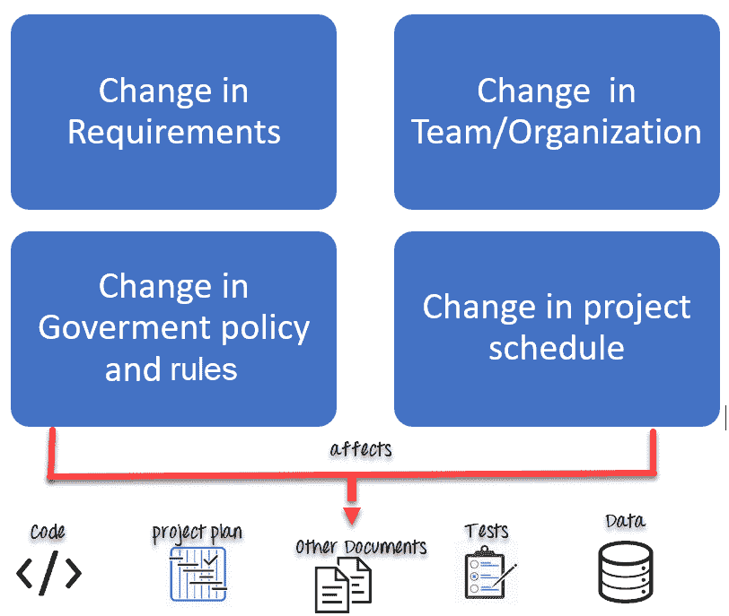
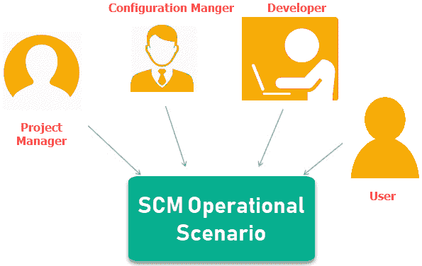

# 软件工程中的软件配置管理

> 原文： [https://www.guru99.com/software-configuration-management-tutorial.html](https://www.guru99.com/software-configuration-management-tutorial.html)

## 什么是软件配置管理？

在软件工程中，**软件配置管理（SCM）**是在软件开发生命周期中系统地管理，组织和控制文档，代码和其他实体中的更改的过程。 主要目标是以最少的错误来提高生产率。 SCM 是配置管理跨学科领域的一部分，它可以准确确定谁进行了哪个修订。

在本软件工程教程中，您将学习-

*   [为什么需要配置管理？](#2)
*   [SCM 流程中的任务](#3)
*   [配置标识：](#4)
*   [基准](#5)
*   [变更控制](#6)
*   [配置状态计费](#7)
*   [配置审核和审查](#8)
*   [SCM 过程的参与者](#9)
*   [软件配置管理计划](#10)
*   [软件配置管理工具](#11)

## 为什么需要配置管理？

实施技术软件配置管理系统的主要原因是：

*   有许多人在开发不断更新的软件
*   在软件配置项目中可能涉及多个版本，分支，作者的情况，并且团队在地理上分布并且可以同时工作
*   需要适应用户需求，策略，预算，时间表的变化。
*   软件应该能够在各种机器和操作系统上运行
*   帮助发展利益相关者之间的协调
*   SCM 流程也有利于控制对系统进行更改所涉及的成本

软件配置项目中的任何更改都会影响最终产品。 因此，需要控制和管理对配置项的更改。

## SCM 流程中的任务

*   [配置标识](#_Configuration_Identification:)
*   [基准](#_What_is_Baseline:)
*   [变更控制](#_Change_Control:)
*   [配置状态计费](#_Configuration_status_Accounting:)
*   [配置审核和审查](#_Configuration_Audits_and)

## 配置标识：

配置标识是确定软件系统范围的一种方法。 在此步骤的帮助下，即使您不知道它是什么，也可以对其进行管理或控制。 它是包含 CSCI 类型（计算机软件配置项），项目标识符和版本信息的描述。

**在此过程中的活动：**

*   标识配置项，例如源代码模块，测试用例和需求规范。
*   通过使用面向对象的方法识别 SCM 存储库中的每个 CSCI
*   该过程从基本对象开始，这些基本对象被分组为聚合对象。 测试内容，原因，时间以及由谁进行更改的详细信息
*   每个对象都有其自己的功能，这些功能可以标识其名称，该名称对于所有其他对象都是显式的
*   所需资源列表，例如文档，文件，工具等。

例：

而不是命名文件 login.php，它应命名为 login_v1.2.php，其中 v1.2 代表文件的版本号

代替命名文件夹“ Code”，它应命名为“ Code_D”，其中 D 代表应每天备份代码。

## 基准：

基准是软件配置项目的正式接受版本。 在执行 SCM 流程时，它是在特定时间指定和固定的。 只能通过正式的变更控制程序进行变更。

**Activities during this process:**

*   促进构建应用程序的各种版本
*   定义和确定用于管理这些工作产品的各种版本的机制
*   功能基线对应于已审查的系统要求
*   广泛使用的基准包括功能，开发和产品基准

简而言之，基线意味着可以发布了。

## 更改控制：

更改控制是一种过程方法，可确保在配置对象中进行更改时确保质量和一致性。 在此步骤中，更改请求将提交给软件配置管理器。

在此过程中的活动：

*   控制临时更改以构建稳定的软件开发环境。 更改已提交到存储库
*   将根据技术优点，可能的副作用以及对其他配置对象的总体影响来检查该请求。
*   它管理更改并在软件生命周期中使配置项可用

## 配置状态统计：

配置状态记帐跟踪 SCM 过程中的每个发行版。 此阶段涉及跟踪每个版本的内容以及导致该版本的更改。

**Activities during this process:**

*   记录对先前基准所做的所有更改以达到新基准
*   识别所有项目以定义软件配置
*   监视变更请求的状态
*   完整列出上一个基准以来的所有更改
*   允许跟踪到下一个基准的进度
*   允许检查要提取的先前发行版/版本以进行测试

## 配置审核和审查：

软件配置审核将验证所有软件产品均满足基线需求。 它确保构建的是交付的。

**Activities during this process:**

*   审核员通过检查已遵循定义的流程并确保满足 SCM 目标来进行配置审核。
*   验证是否符合配置控制标准。 审核和报告所做的更改
*   SCM 审核还确保在此过程中保持可追溯性。
*   确保对基准所做的更改符合配置状态报告
*   完整性和一致性验证

## SCM 流程的参与者：

以下是 SCM 的主要参与者

 

**1.配置管理器**

*   Configuration Manager 是负责识别配置项的负责人。
*   CM 确保团队遵循 SCM 流程
*   他/她需要批准或拒绝更改请求

**2.开发人员**

*   开发人员需要根据标准开发活动来更改代码或更改请求。 他负责维护代码配置。
*   开发人员应检查更改并解决冲突

**3.审核员**

*   审核员负责 SCM 审核和审查。
*   需要确保发布的一致性和完整性。

**4.项目经理：**

*   确保在一定时间内开发产品
*   监视开发进度并识别 SCM 流程中的问题
*   生成有关软件系统状态的报告
*   确保遵循用于创建，更改和测试的流程和策略

**5.用户**

最终用户应了解 SCM 的关键术语，以确保他拥有最新版本的软件

## 软件配置管理计划

SCMP（软件配置管理计划）过程计划始于项目的早期编码阶段。 计划阶段的结果是 SCM 计划，该计划可能会在项目期间进行扩展或修订。

*   SCMP 可以遵循公共标准，例如 IEEE 828 或组织特定的标准
*   它定义了要管理的文档类型和文档命名。 示例 Test_v1
*   SCMP 定义了负责整个 SCM 流程和基准创建的人员。
*   修复版本管理策略&更改控制
*   定义可以在 SCM 过程中使用的工具
*   配置管理数据库，用于记录配置信息。

## 软件配置管理工具

任何变更管理软件都应具有以下 3 个主要功能：

**并发管理：**

当同时执行两个或多个任务时，称为并发操作。 SCM 上下文中的并发意味着同一文件被多个人同时编辑。

如果使用 SCM 工具无法正确管理并发，那么可能会产生许多紧迫的问题。

**版本控制：**

SCM 使用归档方法或保存对文件所做的所有更改。 借助存档或保存功能，可以在出现问题时回滚到以前的版本。

**同步：**

用户可以检出多个文件或存储库的整个副本。 然后，用户处理所需的文件，然后将更改签回到存储库中。他们可以同步其本地副本以与其他团队成员所做的更改保持更新。

以下是流行的工具

**1\. Git：** Git 是一个免费的开源工具，可帮助进行版本控制。 它旨在快速高效地处理所有类型的项目。

**下载链接：** [https://git-scm.com/](https://git-scm.com/)

**2\. Team Foundation Server：** Team Foundation 是一组工具和技术，使团队可以协作和协调以构建产品。

**下载链接：** [https://www.visualstudio.com/tfs/](https://www.visualstudio.com/tfs/)

**3\. Ansible** ：这是一个开源软件配置管理工具。 除配置管理外，它还提供应用程序部署&任务自动化。

**下载链接：** [https://www.ansible.com/](https://www.ansible.com/)

在此处检查更多工具： [https://www.guru99.com/software-configuration-management-tools.html](/software-configuration-management-tools.html)

## 结论：

*   配置管理最佳实践可帮助组织在软件开发生命周期中系统地管理，组织和控制文档，代码和其他实体中的更改。
*   SCM 流程的主要目标是在减少错误的情况下提高生产率
*   配置管理过程背后的主要原因是，有多个人在不断更新软件。 SCM 帮助建立并发，同步和版本控制。
*   基准是软件配置项的正式接受版本
*   更改控制是一种过程方法，可确保在配置对象中进行更改时确保质量和一致性。
*   配置状态记帐跟踪 SCM 过程中的每个版本
*   软件配置审核可验证所有软件产品均满足基线需求
*   项目经理，配置经理，开发人员，审核员和用户是 SCM 流程的参与者
*   SCM 流程计划始于项目的早期阶段。
*   Git，团队基础 Sever 和 Ansible 是少数流行的 SCM 工具列表