# Microsoft VISIO 教程：历史记录，文件类型，如何使用示例

> 原文： [https://www.guru99.com/microsoft-visio-tutorial.html](https://www.guru99.com/microsoft-visio-tutorial.html)

## 什么是 Microsoft Visio？

Microsoft Visio 是一种图表绘制工具，可让您根据业务需要创建简单和复杂的图表。 Visio 还使您能够创建详细的组织结构图，平面图，透视图等。它带有许多内置模板，可让您创建几乎任何复杂性的图表。 它可以是基于形状的图稿，也可以是更复杂的图形。

在此 Microsoft Visio 培训中，您将学习：

*   [什么是 Microsoft Visio？](#1)
*   [Microsoft Visio](#2) 的历史记录
*   [Visio 文件类型](#3)
*   [下载并安装 Visio](#4)
*   [Visio 的重要组件](#5)
*   [如何使用 Microsoft Visio](#6)
*   [Microsoft Visio 的应用程序](#7)
*   [使用 Microsoft Visio 的最佳做法](#8)
*   [Microsoft Visio 的好处](#9)
*   [Visio 的缺点](#10)

## Microsoft Visio 的历史记录

*   Visio 起源于 1990 年，是 Shareware Corp 的产品，1992 年发布了 1.0 版。
*   在 1995 年，该公司更名为 VisioCorp。
*   Microsoft Corporation 在 2000 年购买了它。
*   在 2002 年发布了 10.0 版（跳过 7.0 版至 9.0 版）以与 Office 发行版号保持一致。
*   Microsoft 在 2006 年 11 月 30 日发布了 Visio 2007。
*   Visio 2010 Visio 14.0 发行了标准版，专业版和高级版。
*   Visio 2016，Visio 发布了 Standard，Professional 和 Office 365 版本的 v 16.0。
*   当前版本的 Visio 是 2019 专业版和标准版。

## Visio 文件类型

以下是 Visio 可用的重要文件类型：

*   **VSD（Visio 绘图）**：此文件扩展名与 Visio 二进制文件格式关联。 它用于存储流程图和图表文档文件。

*   **VSS（Visio 模具）**：此文件扩展名与 Microsoft Visio 关联。 该文件包含智能形状（模板）。 该文件为 Visio 二进制文档格式。

*   **VST（Visio 模板）**： VST 文件扩展名与 Microsoft Visio 模板关联。

*   **VDW（Visio Web 绘图）**： VDW 扩展与 Microsoft Office Visio 关联。 它包含在 Microsoft Office Visio 中创建的 Web 绘图。

## 下载并安装 Visio

**注意**：您需要具有有效的 Visio 许可证才能下载 Visio。 在安装 Visio 之前，您需要运行 Microsoft Office 的“即点即用”版本。 即点即用版本是从 [https://www.office.com](https://www.office.com) 安装的。

#### 如何启动 Visio

步骤 1）点击“开始”按钮。

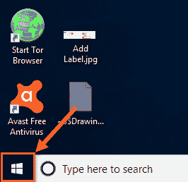

1.  在“搜索”框中键入 Visio。

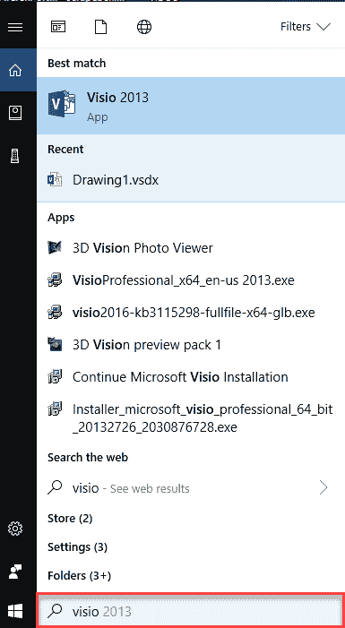

2.  单击“ Visio 2013”​​菜单。

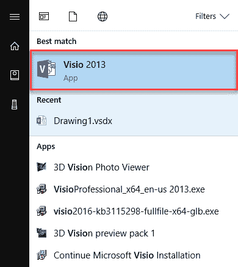

**您也可以向 Office 365 注册并在线访问 Visio 软件**

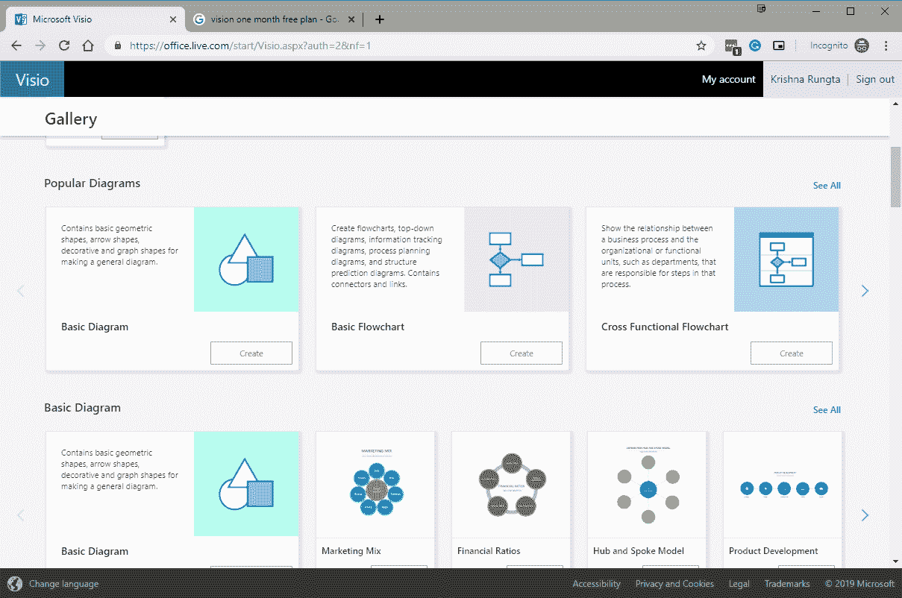

并创建图表

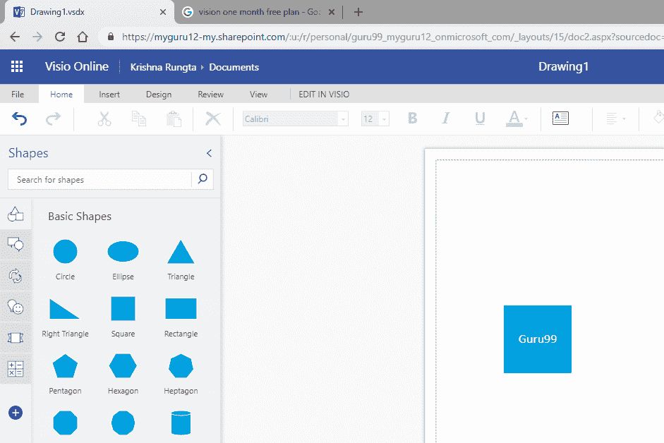

## Visio 的重要组件

以下是 Visio 工具的基本组件：

### 模具：

模具包含相关形状的集合。 例如，在工作流程模板中，存在一个包含所有工作流程对象形状的模具。

您将在工程图页面的左侧看到模具。

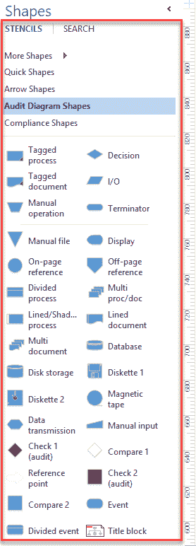

### 快速访问工具栏

快速访问工具栏允许您添加常用命令，以便您可以在需要时轻松访问它。

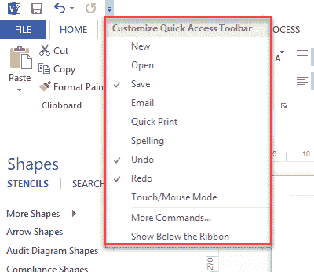

### 功能区：

功能区是一个面板，其中包含按选项卡组织的按钮和下拉列表的功能分组。 group 这些选项卡组会影响 Visio 的不同功能。 ‬‬‬‬‬‬‬‬‬‬‬‬‬‬‬‬‬‬‬‬‬‬‬‬‬‬‬‬‬‬‬‬‬

功能区旨在查找完成任务所需的命令。 它包括设计页面，将对象插入页面或将数据与形状链接。

### 文件选项卡（后台视图）

“文件”选项卡提供了一个集中的位置，称为“后台视图”。 它使您可以执行各种 Visio 文件管理任务，例如创建，关闭，共享，保存，打印，转换为 PDF 和通过电子邮件发送。

在 Visio 中，Backstage 视图非常重要。 它允许您查看文档属性，删除个人信息并通过消除未使用的项目来减小文件大小。

*   **返回** –返回工作图区域。
*   **信息**-允许您删除个人信息，限制权限，减小文件大小。 它还可以帮助您检查与早期版本的 Visio 的兼容性。
*   **新增**-允许您从空白图形区域或使用预先格式化的模板创建原始图形。
*   **打开**-打开工程图。
*   **保存**-保存图形。
*   **另存为**-允许您将另存为另存为其他文件名或文件类型的图形。
*   **打印**-允许您查看和打印最终图表。
*   **共享**-与他人共享图表。
*   **导出**-将图表导出为 PDF，XPS 等。
*   **帐户**-允许您管理个人资料。
*   **选项** –允许您进行校样和与语言有关的更改。

### 主页选项卡

这是 Visio 中的默认选项卡。 它允许您更改字体大小，颜色，设置文本的对齐方式，查找任何文本，在形状中填充颜色，剪切，复制和粘贴形状以及文本。

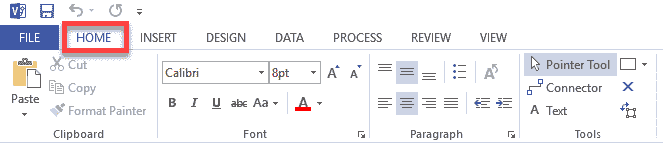

### 插入标签

插入选项卡允许您插入插图，图表零件，链接和文本。

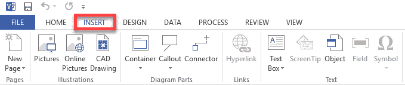

### 设计标签

“设计”选项卡允许您更改背景，页面设置，边框，配色方案和图形的基本布局。

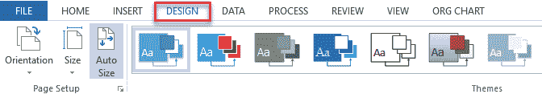

### 数据标签

使用数据选项卡，可以将数据库数据链接到形状，创建数据图形以及插入水平和垂直图例。

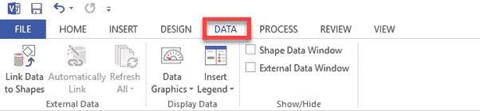

### 进程选项卡

### 您可以使用“流程”选项卡导入和导出工作流程，并在较大的流程中将现有子流程与形状链接。

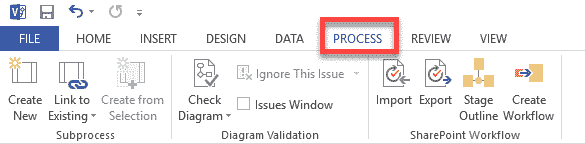

### 审阅标签

此选项卡可让您添加注释并检查拼写。

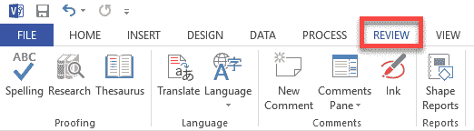

### 查看标签

它允许您个性化绘图屏幕的视图。 为此，提供了各种工具来添加标尺，网格线，参考线和分页符。

Visio 还为放大的绘图区域提供了一个缩放按钮。

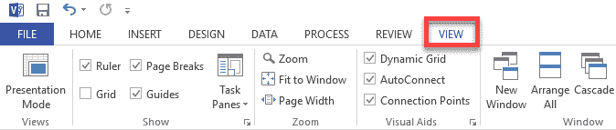

## 如何使用 Microsoft Visio

下面是规划和绘制基本 Visio 图表的步骤：

**步骤 1）**确定您要完成的工作，并收集合适的详细信息要求以绘制图表。

**步骤 2）**确定最适合说明您要传达的信息的图表类型。 在本例中，我们将创建一个登录流程图。

**步骤 3）**在 Visio 中，根据您的图表类型选择并打开模板。

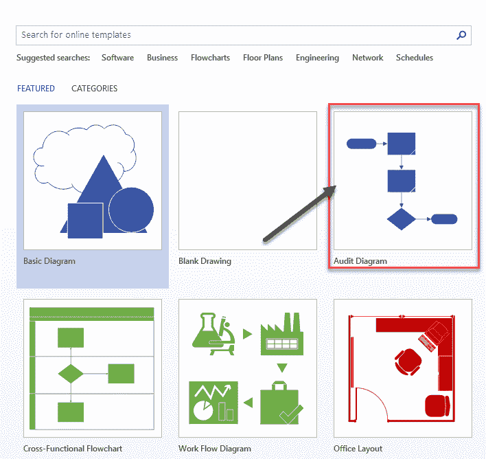

每种形状代表不同的事物，范围从简单的矩形，正方形，椭圆形和箭头到数百种高度专业化的形状和符号。

**步骤 4）**拖动并连接形状或符号以说明项目及其流程。

1.  将终结器形状拖到绘图区域。
2.  拖动 Compare2 形状。
3.  将动态连接器拖到绘图区域并连接这两个形状。

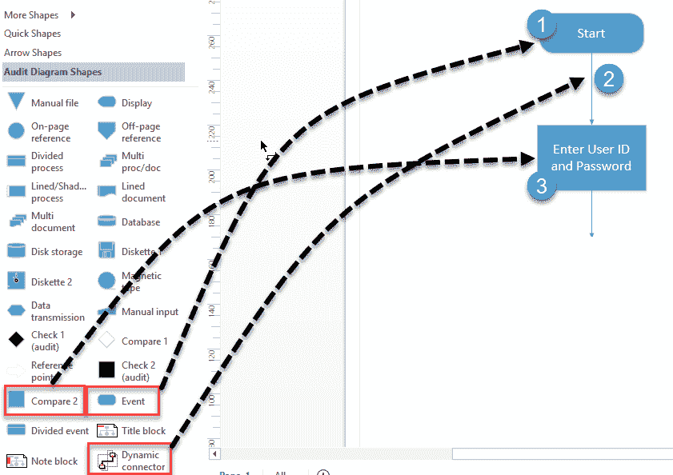

**步骤 5）**要添加标签，请转到：

1.  插入标签
2.  点击“文本框”
3.  选择水平文本框

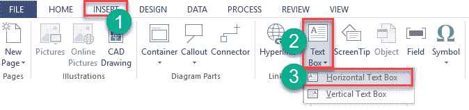

单击绘图区域以添加标签。

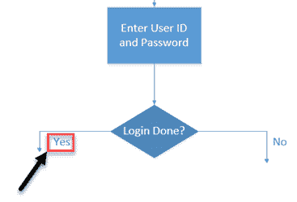

**步骤 6）**最后，检查您的图表并与您的粗略设计进行比较。

以下是显示登录过程的流程图示例。

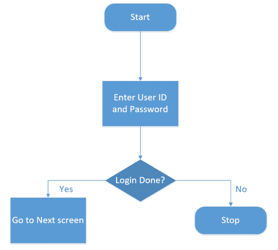

## Microsoft Visio 的应用程序

这里是 Microsoft Visio 的重要应用程序：

| **用法** | **说明** |
| 业务流程图 | 它是最流行的 Visio 使用之一。 它可以帮助您说明业务流程。 |
| 组织结构图 | 在组织结构图中，经常使用组织结构图。 |
| 头脑风暴图 | 头脑风暴图使您可以记录和开发任何相关的想法或信息，例如新的业务战略，书籍大纲，旅行记录，会议记录等。 |
| 建筑平面图 | 您还可以在 Visio 中构建最准确的构建计划。 该图还提供了墙壁，门，窗户和家具的俯视图。 |
| 流程图 | 流程图可用于记录和分析过程。 标准化流程以提高效率和质量。 它还可用于组织其他部门的培训或理解。 |
| 分析 | Visio 提供了针对所有类型的项目创建专业数据流程图（DFD）的重点方法。 |
| 在业务 | 您可以绘制业务流程建模和表示法（BPMN）。 它针对业务流程中的参与者和其他利益相关者。 |
| 在化学工程 | Visio 允许您绘制过程流程图（PFD），这是一种流程图，解释了工厂中各个组件之间的关系。 |

## 使用 Microsoft Visio 的最佳做法

以下是使用 Microsoft Visio 的最佳实践：

*   从 Visio 模板开始，该模板最适合您要创建以获取业务解决方案的图表类型。 如果确切的模板不在库中，请选择最接近的模板。
*   使用时应使用 Visio 模具拉入一组形状，例如基本的“流程图形状”模具。
*   通过在“形状数据”窗口中键入将数据添加到形状中。

## Microsoft Visio 的优点

这是使用 Microsoft Visio 的好处/缺点。

*   VISIO 提供图表功能，可轻松准备各种业务工程软件和数据库体系结构。
*   准备 BPMN 模型，地图和图。 准备流程图，捕获头脑风暴的讨论等。
*   Visio Standard Online 和 Visio Professional 都是可下载的产品。 您可以使用这些产品，只要它们与您的设备兼容即可。
*   该工具允许您以对您和您的业务有价值的方式捕获信息。
*   为创建各种形状的图形提供支持。
*   Visio Pro 提供自动更新和多次安装等功能。

## Visio 的缺点

这是使用 MS Visio 的缺点/缺点：

*   功能区界面不是本能的，并且隐藏了某些功能。
*   Microsoft Visio 不具有诸如对数据库模型进行逆向工程的功能。
*   在 Visio 中，很难使用键盘快捷键，添加连接，复制和粘贴等。
*   下载和安装过程不是很顺利。
*   与同类工具较低的价格相比，MS Visio 是一种昂贵的绘图工具。

### 摘要

*   Visio 可用的重要文件类型是 VSD（Visio 绘图），VSS（Visio 模具）和 VST（Visio 模板）。
*   您必须具有有效的 Visio 许可证才能下载 Visio。
*   模具包含相关形状的集合。
*   快速访问工具栏允许您添加常用命令，以便您可以在需要时轻松访问它。
*   功能区是一个面板，其中包含按选项卡组织的按钮和下拉列表的功能分组。
*   “文件”选项卡提供了一个集中的位置，称为“后台视图”。
*   主页选项卡是 Visio 中的默认选项卡。
*   “插入”选项卡允许您插入插图，图表零件，链接和文本。
*   “插入”选项卡允许您更改背景，页面设置，边框，颜色方案和图形的基本布局。
*   使用数据选项卡，可以将数据库数据链接到形状，创建数据图形以及插入水平和垂直图例。
*   您可以使用此选项卡导入和导出工作流，并在较大的流程中将现有子流程与形状链接。
*   “查看”选项卡使您可以添加评论并检查拼写。
*   “视图”选项卡允许您个性化绘图屏幕的视图。 为此，提供了各种工具来添加标尺，网格线，参考线和分页符。
*   ### Microsoft Visio 的应用程序是业务流程图，组织图，集思广益图和构建计划。

*   VISIO 提供图表功能，可轻松准备各种业务工程软件和数据库体系结构。
*   准备 BPMN 模型，地图和图。 准备流程图，捕获头脑风暴的讨论等。
*   功能区界面不是本能的，并且隐藏了某些功能。
*   Microsoft Visio 不具有诸如对数据库模型进行逆向工程的功能。