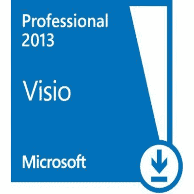

# 十大 Microsoft Visio 面试问题&答案

> 原文： [https://www.guru99.com/microsoft-visio-interview-questions.html](https://www.guru99.com/microsoft-visio-interview-questions.html)

[下载 PDF](https://www.guru99.com/pdf/microsoft-visio-interview-questions.pdf)

**1）说明什么是 Microsoft visio？**

Microsoft 视觉是 Microsoft 设计的一种图表绘制工具，旨在帮助从复杂信息中创建图片。 借助 Micro-soft Visio，可以轻松形成业务流程图，网络图，组织结构图等。

**2）说明如何在 Microsoft Visio 中编辑母版形状？**

*   将主形状复制到自定义模具，例如**文档模具**或**新模具**
*   在自定义模具中，右键单击母版形状，然后单击**编辑母版->编辑母版形状。** 将打开一个新窗口，其中的形状可供编辑
*   使用各种数据工具，例如“主页”选项卡上的**形状样式**或“开发人员”选项卡上的**形状设计**，编辑自定义模具
*   完成后，关闭窗口。 单击**是**保存更改

**3）说明如何在 Visio 2013 中将数据导入图形中的形状？**

要将数据导入“外部”窗口，请使用数据选择器向导

*   在数据选项卡上的外部数据组中，选择选项将数据链接到形状
*   在“数据选择器”向导的第一页上，选择要使用的数据源类型
*   在数据选择器向导中，按照说明进行操作
*   单击“数据选择器”向导的“完成”选项卡后，外部数据窗口将显示导入的数据

**4）提到 Visio 2013 中提供了哪些新功能？**

*   它提供了比早期版本更多的形状
*   支持 Windows 8 的 Metro 风格格式
*   新引入的模板，包括家庭预算，库存跟踪器，个人资金跟踪器，
*   新版本允许您链接许多数据源并从这些数据源导入数据。 其中一些数据源包括 SQL Server，Excel，Sharepoint，
*   几个人可以同时处理同一张图，并且可以将多个版本合并在一起。 此外，您还可以看到其他形状的可视指示器，并在保存时轻松同步图表
*   它允许其他人使用 Visio Services 通过浏览器将注释添加到图表中
*   通过将图表链接到数据源，您还可以拥有最新的数据视图
*   它允许您注释和共享通过网络浏览器链接的静态图和数据图
*   快速访问浮动条可快速替换图中的任何形状

**5）说明在 Visio 2013 中缩放图像的快捷方式是什么？**

在 Visio 2013 中，缩放图像的快捷方式是按住 Cntrl + Shift 键，然后在绘图页上的两个形状周围拖动矩形。

**6）说明如何在 Visio 2013 中创建 ERD？**

要在 Visio 2013 中创建 ERD，

*   您必须从模板类别列表中选择软件和数据库
*   之后，选择**数据库模型图**，然后从模板列表中选择**软件和数据库**
*   现在，将实体从**形状**面板拖放到图形网格中。 更改物理名称和概念名称的通用名称
*   在“数据库属性”面板中，切换到列类别。 现在，键入列的名称（属性）。 键入 **FNAME** ，然后单击“编辑”按钮以更改 10 个字符的默认大小。
*   现在选择**数据类型**选项卡，将字段长度更改为 12，然后从“固定长度”切换为“可变长度”。 之后输入列名
*   准备好一个实体后，同样可以创建另一列
*   现在要在不同实体之间创建关系，请单击**形状**面板中的关系图标，然后将 **Relationship** 拖放到要与其建立关系的表中。 您也可以对其他实体执行相同的操作

**7）说明连接器在 Visio 中的作用是什么？**

Visio 中的连接器是指连接形状的那些线。 它们是一维形状，最常用于连接二维形状。 一维形状将显示端点，而二维形状将显示带有旋转手柄和绿色大小的选择框。

**8）解释如何从 Visio 绘图创建 PowerPoint 幻灯片？**

要从 Visio 绘图创建 PowerPoint 幻灯片，您必须在 Visio 中访问宏，因为它是根据活动的 Visio 绘图创建幻灯片的。 要从 Visio 绘图中打开一组幻灯片，您必须

*   打开包含宏的 Visio 绘图
*   打开您要另存为 PowerPoint 的 Visio 绘图
*   选择工具>宏>从 Visio 创建 PPT > ThisDocument >从 PowerPoint 创建 Visio
*   现在，您的绘图页将带有 PowerPoint 幻灯片
*   宏形成标题幻灯片，并插入制作幻灯片的 Visio 文档的名称

**9）解释什么是容器，列表和标注？**

*   **容器**：它提供​​了一组对象周围的可视边界，但它还在对象和其中的容器之间建立了逻辑关系。 容器知道它们组成的形状，形状知道它们何时成为容器的成员
*   **列表**：这是一种容器，在其成员之间保持有序关系。 列表中的每个对象都知道其顺序位置，新对象只是不添加到列表中，而是添加到列表中的特定位置
*   **标注**：标注只是一种相互粘合以添加注释的形状。 visio 2013 提供了将注释添加到形状的规定，但是标注知道其附加到的形状，并且该形状可以识别任何附加的标注。

**10）说明如何使用 Cloud 共享图表？**

为了使用 Cloud 共享文件，您必须

*   转到文件选项，然后转到共享选项
*   当选择共享选项时，您会进一步注意到两个选项：邀请他人和第二个选项是发送链接
*   如果选择第一个选项，它将把您的文件保存在 SkyDrive 上
*   之后，您将可以共享文档，如果您选择电子邮件作为发送选项，则可以共享图表的副本。
*   另一个选择是发送到该文件的链接，然后您将使每个人都在同一个文件上工作