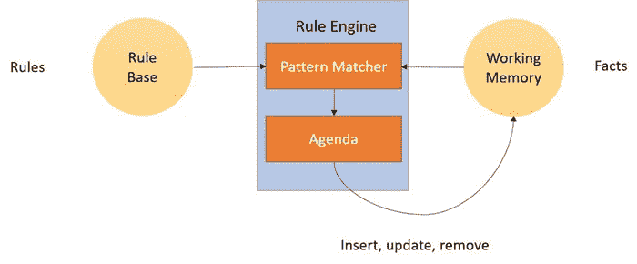
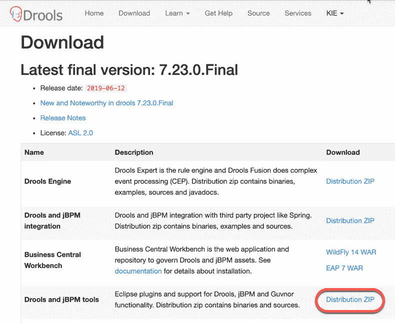
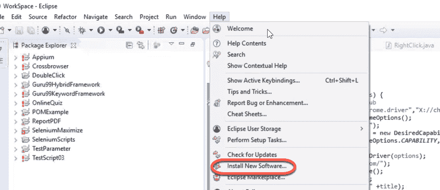
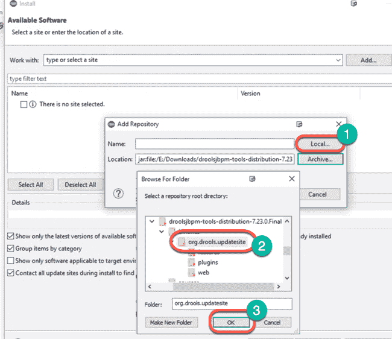
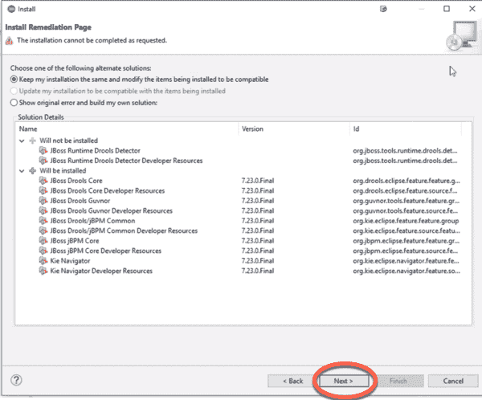
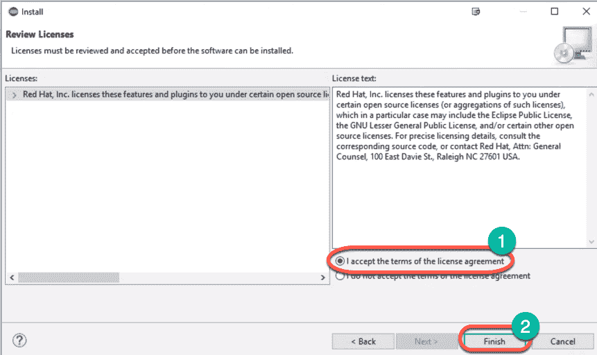
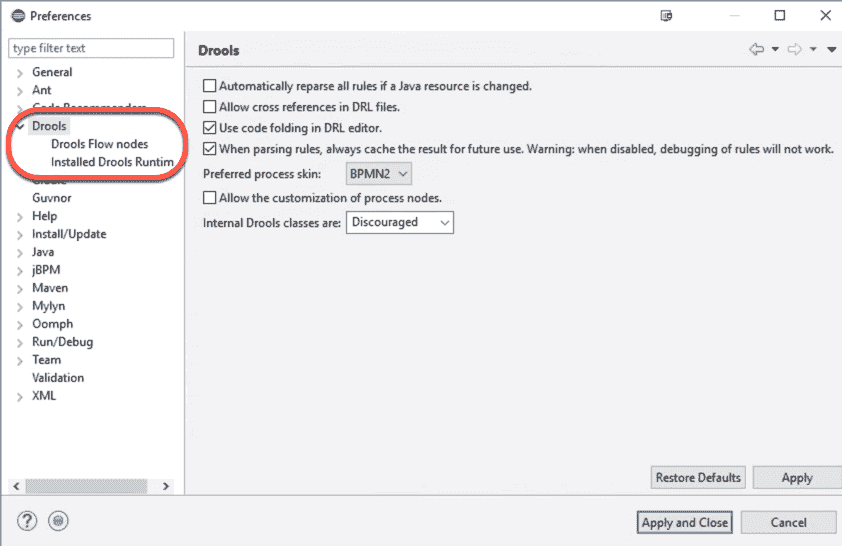
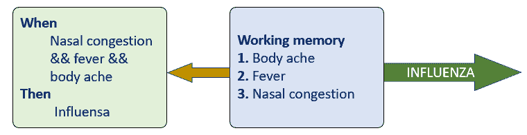
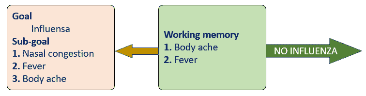

# Drools 教程：体系结构，规则引擎示例

> 原文： [https://www.guru99.com/drools-tutorial.html](https://www.guru99.com/drools-tutorial.html)

## 什么是 Drool？

JBoss Drools 是一个业务逻辑集成平台（BLiP）。 这是一个用 Java 编写的开源项目，它使用 Rete 模式匹配算法的高级实现系统。

Drools 工具可帮助您根据业务流程中发现的逻辑和数据进行分离和推理。 它支持基于推理的向前和向后链接的 Drools 规则引擎。

流口水分为两个部分：创作和运行时。

*   **创作**-它涉及规则文件的开发。

*   **运行时**-它涉及工作内存的创建和激活的处理。

在这次针对初学者的 Drool 培训中，您将学习：

*   [什么是流口水？](#1)
*   [什么是规则？](#2)
*   [什么是规则引擎？](#3)
*   [Drools 工具套件](#4)
*   [Drools](#5) 中的重要组件
*   [Drools 的体系结构](#6)
*   [Drool](#7) 的功能
*   [如何在 Eclipse 中添加 Drools 插件](#8)
*   [创建 Drools 程序](#9)
*   [为什么使用 Drools Rule Engine？](#10)
*   [规则引擎](#11)的缺点

## 什么是规则？

规则是知识的一部分，通常表示为“当出现特定条件时，请执行一些任务”。

规则中最关键的部分是部分。 一旦**满足**部分，**然后**该部分就会被触发。

句法：

```
When
<Condition is true>
Then
<Take desired Action>

```

### 模式匹配方法：

模式匹配方法可帮助您将新事实或旧事实与生产规则进行比较。 它由推理引擎完成。

用于模式匹配的算法为：

*   算法网络
*   跳跃算法
*   线性算法
*   对待算法

但是，Drools 最常用的算法是 Rete 算法。

### 算法网络

Rete 算法是一种有用的模式匹配算法，可用于实现生产规则系统。 它可以帮助您牺牲内存以提高速度。 它还借助节点共享来减少或消除特定类型的冗余。 在不同事实类型之间执行联接时，它存储部分匹配项。

## 什么是规则引擎？

规则引擎使用基于规则的方法来实施专家系统。 专家系统是基于知识的系统，可以帮助您做出决策。 它将知识收集到可用于推理的知识库中

## Drools 工具套件

这是 Drools 套件中的五种工具：

*   **Drools Guvnor** ：它是 Drools 知识库的集中存储库。
*   **Drools Flow** ：它提供工作流程和业务流程。
*   **Drools Fusion** ：用于复杂事件处理的工具
*   **Drools Expert 或 Rule Engine** ：执行推理的有用工具。
*   **Drools Planner**：提供自动化计划，其中包括 NP 硬计划问题。

## Drools 中的重要组件

在这里，是 Drools 中使用的基本术语。

*   **事实**-事实表示用作规则输入的数据
*   **工作内存**-事实存储，用于模式匹配。 可以对其进行修改，插入和删除。
*   **知识会议**-此组件包含激发规则所需的所有资源。 在这里，所有事实都插入到单个会话中，然后触发匹配的规则。
*   **知识库**-代表 Drools 生态系统中的知识。 它存储发现规则的资源的形成。
*   **模块**-这是一个模块，用于存储可以容纳不同会话的多个知识库

## Drools 的体系结构



这是规则引擎的工作系统：

**步骤 1）**规则被加载到 Rule Base 中，并且始终可用。

**步骤 2）**事实被断言到工作存储器中，然后可以在其中对其进行修改或收回。

**步骤 3）**将新事实或现有事实与生产规则进行匹配的过程称为模式匹配，该过程由规则引擎执行。

**步骤 4）**通过议程，您可以借助冲突解决策略来管理冲突规则的执行顺序。

## Drool 的功能

这是 Drool 的重要功能：

*   帮助您将应用程序与动态逻辑分开
*   声明式编程
*   知识集中
*   速度和可扩展性
*   将逻辑与应用程序分开
*   可以理解的规则

## 如何在 Eclipse 中添加 Drools 插件

**步骤 1）**转到[链接](https://www.drools.org/download/download.html)，然后单击“ Distribution ZIP”进行 jBPM 集成。 下载后，将其解压缩到硬盘中



**步骤 2）**在 Eclipse 中，选择“安装新软件”



**步骤 3）**点击添加


**步骤 4）**在下一个屏幕中，

1.  点击本地
2.  选择文件夹“ org.drools.updatesite /”
3.  点击确定



**步骤 5）**单击下一步



**步骤 6）**接受许可协议，然后单击下一步



**步骤 7）**软件将下载，并且将要求您重新启动 Eclipse

**步骤 8）**在 Windows >首选项菜单中，您将看到 Drools 选项，表明已安装。



## 创建 Drools 程序

```
package com.sample
inport com.sample.DroolsTest.Message;
rule "Hello World"
 when
	m : Message( status ** Message.Hello, myMessage : message )
  then
System.out.println( myMessage );
m.setMessage( "Goodbye cruel world" );
m.setStatus( Message.GOODBYE ); 
update( m );
end
 rule "GoodBye"

when
	Message( status ** Message.GOODBYE, myMessage : message )
then
System.out.println( myMessage );
end

```

### 什么是后向与前向链接？

前向链接引擎检查事实并得出特定结论。

让我们考虑一下医疗诊断系统的场景。 如果将患者的症状作为事实记入工作记忆中，则很容易诊断出他是否患有疾病。



向后链接引擎具有设定的目标，并且引擎试图满足该目标。

考虑相同的医学诊断方案。 假设某种疾病的流行。 该 AI 可以假定给定的个体患有该疾病，并尝试根据可用信息确定其诊断是否正确。



## 为什么使用 Drools Rule Engine？

这里是使用 Drools 规则引擎的主要原因：

*   规则对于开发人员和业务分析师而言很容易理解。
*   规则易于维护。
*   规则引擎使用 Rete 算法，该算法指出引擎的性能永远不取决于规则的数量。
*   可以在不关闭应用程序的情况下修改和部署规则。
*   从相对静态的代码库外部化业务逻辑。
*   规则以不太复杂的格式开发，因此业务分析师可以轻松地阅读和验证一组规则。
*   规则允许您创建知识仓库，该仓库可以形式执行。
*   Eclipse 之类的工具可帮助您管理规则，获得即时响应，身份验证和内容支持。

## 规则引擎的缺点

这里是使用规则引擎的缺点/缺点：

*   开发人员需要进行大量的学习工作，才能了解这种编程方法
*   规则引擎不是解决问题的安全方法。
*   需要了解规则引擎的工作以消耗更多内存
*   对于复杂的分支，有很多规则。

规则可能会随着时间而变化，并且随着代码的更改而生效

#### 摘要

*   JBoss Drools 是一个业务逻辑集成平台（BLiP）
*   Drool 工具的类型为：1）Drools Guvnor 2）Drools Flow 3）Drools Fusion 4）Drools Expert 5）Drools，计划程序。
*   Drool 帮助您将应用程序与动态逻辑分开。
*   事实代表了用作规则输入的数据。
*   工作存储器是具有事实的存储，用于事实模式匹配。 可以对其进行修改，插入和删除。
*   知识库是包含激发规则所需的所有资源的组件。
*   知识会议代表了 Drools 生态系统中的知识。
*   知识库表示 Drools 生态系统中的知识。
*   模块存储多个知识库，这些知识库可以举行不同的会话。
*   规则是知识的一部分，通常表示为“当出现特定条件时，请执行一些任务”。
*   Drools 是一个规则引擎，它使用基于规则的方法来实施 Expert 系统。
*   前向链接引擎检查事实并得出特定结论。
*   向后链接引擎具有设定的目标，并且引擎试图满足该目标。
*   Rete 算法是一种有用的模式匹配算法，可用于实现生产规则系统。
*   规则对于开发人员和业务分析师而言很容易理解。
*   使用像 Drool 这样的规则引擎的主要缺点是，开发人员需要大量学习才能知道这种编程方法。