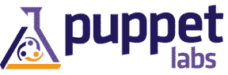
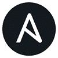
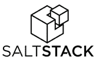
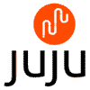
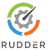
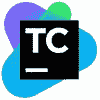
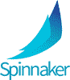
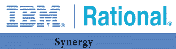

# 16 个最佳软件配置管理工具（2020 年将成为 SCM 工具）

> 原文： [https://www.guru99.com/software-configuration-management-tools.html](https://www.guru99.com/software-configuration-management-tools.html)

配置管理（CM）是一种系统工程方法，用于在产品的整个生命周期内建立和维持产品的性能，功能和物理属性与其设计，要求和操作信息的一致性。 它们为您的组织带来了成本效益和更好的时间管理。

当今市场充斥着各种配置管理工具。 以下是精选的 16 种精选配置管理软件的列表，这些软件具有流行的功能和最新的下载链接。 该比较列表包含开源和商业工具。

### 1）CFEngine 配置工具

 

CFEngine 是一个配置管理框架。 它使您可以安全地管理关键任务。 该系统配置管理工具可作为开源软件和商业软件使用。

**功能：**

*   帮助您定义所需的 IT 基础架构状态和配置
*   使您可以自动对基础结构中的每个节点进行更新和更改
*   它使用在基础结构的每个节点上运行的自治代理。

下载链接： [https://cfengine.com/](https://cfengine.com/)

### 2）人偶配置工具

 

Puppet 是一个开源配置管理工具，用于集中和自动化配置管理过程。 它用于配置，管理，部署各种应用程序和服务。

**Features:**

*   在整个 IT 基础架构中自动配置
*   使您可以完全控制和查看软件交付过程。
*   与模型驱动的自动化管理一起，使您可以进行快速更改或修复紧急问题。
*   帮助您使用自己喜欢的版本控制系统以代码形式管理基础架构

下载链接： [https://puppet.com](https://puppet.com)

### 3）CHEF 配置工具

 

Chef 是一个自动化平台，提供了一种配置和管理基础结构的方法。 在此工具中，基础结构即代码意味着通过执行编码而不是执行手动执行。 Chef 工具可在 Ruby 和 DSL 上使用，以编写配置。

**Features:**

*   Chef 遵循 Push 模式，并提供了简单的云采用方式。
*   它可以帮助您提高服务弹性，开发更多无缺陷的软件。
*   Chef 提供自动化功能，可帮助您降低风险并提高开发各个阶段的合规性。
*   配置各种基于云的 SaaS 服务，并集成云供应 API 和第三方软件。

下载链接： [https://www.chef.io/](https://www.chef.io/)

### 4）Ansible 配置工具

 

Ansible 工具提供了简单的 IT 自动化解决方案。 它可以帮助您避免执行重复的任务，并释放开发人员团队进行更多战略性工作。

**Features:**

*   Ansible 使您可以轻松地对复杂流程建模
*   您会通过集成的通知了解自动化状态。
*   Ansible Tower 允许您管理整个基础架构。
*   在 Inventor 中的任何主机或主机组上运行简单任务

**下载链接：** [https://www.ansible.com/](https://www.ansible.com/)

### 5）SALTSTACK 配置工具

SaltStack 是另一个有效的配置工具。 它适用于主客户端设置模型或非集中式模型。 该工具基于 Python 编程语言。 SaltStack 提供了推和 SSH 方法来与客户端进行通信。

**Features:**

*   Salt Cloud 与各种云提供商集成，例如 Google Cloud，Amazon Web 服务等。
*   它很简单，而且易于使用，因为您可以在设置过程中进行操作。
*   Saltstack 具有 DSL 功能，因此不需要任何逻辑和状态。
*   Salt 提供的自省功能可以使您轻松查看 Salt 内部的情况。

下载链接： [https://www.saltstack.com/](https://www.saltstack.com/)

### 6）JUJU 配置工具

Juju 是一个开源工具，主要强调减少新一代软件的运营开销。 Juju 提供配置，扩展，快速部署，集成等功能。

**Features:**

*   提供软件置备功能。
*   允许即时集成和扩展。
*   通过使用超级按钮帮助您解决有关服务扩展的大多数复杂问题。
*   您可以使用此工具在一个平台上使用多个 PaaS。
*   Kubernetes 集群部署的功能。

下载链接： [https://jujucharms.com/](https://jujucharms.com/)

### 7）舵

 

Rudder 是一个开源的持续配置解决方案。 该工具用于满足生产基础架构的需求。 该多平台工具使您可以自动化和维护生产基础架构。

**Features:**

*   Web 界面功能可帮助您管理节点并定义环境策略。
*   使您可以自动化简单的管理任务，例如安装或配置。
*   Rudder 提供了 FULL REST API 与 Rudder Server 通信。
*   允许您动态生成主机策略。
*   它提供硬件和软件的自动清单。

下载链接： [http://www.rudder-project.org/site/](http://www.rudder-project.org/site/)

### 8）TeamCity 配置工具

 

TeamCity 是由 Jet Brain 开发的开源持续集成服务器。 TeamCity 提供多达 100 种构建配置（作业），并运行无限制的构建。

**Features:**

*   可扩展性和定制
*   为任何项目提供更好的代码质量
*   即使没有构建运行，也可以帮助您保持 CI 服务器的健康和稳定
*   项目级云配置文件
*   全面的 VCS 集成
*   动态生成进度报告

**下载链接：** [https://www.jetbrains.com/teamcity/](https://www.jetbrains.com/teamcity/)

### 9）章鱼部署

 

章鱼部署工具可实现复杂应用程序部署的自动化。 应用程序是本地还是云中。

**Features:**

*   提供可重复的&可靠部署
*   复杂的部署变得容易。
*   章鱼可以促进环境之间的释放。
*   提供世界一流的平台支持，例如 ASP.NET，Node.js，Java 和许多其他脚本语言以及平台

**下载链接：** [https://octopus.com](https://octopus.com)

### 10）配置中心

 

ConfigHub 帮助团队在整个堆栈中管理，保护和交付配置。 该工具使您可以存储，管理和分发单个应用程序或分布式系统的软件配置。

**Features:**

*   消除配置重复和错误
*   任何系统拓扑的动态建模
*   帮助您从一个地方控制所有配置

**下载链接：** [https://www.confighub.com/](https://www.confighub.com/)

### 11）阿里巴巴应用配置管理

 

应用程序配置管理，也称为 ACM。 它使您可以集中管理应用程序配置。 该工具增强了 DevOps，大数据和微服务的服务功能。

**功能：**

*   将敏感数据与应用程序代码和运行环境分开。
*   为您的环境提供实时配置。
*   提供多级缓存服务并确保 99.99％的服务器可用性
*   支持在整个生命周期内进行配置的推送日志。
*   支持版本管理

**下载链接：** [https://www.alibabacloud.com/product/acm](https://www.alibabacloud.com/product/acm)

### 12）大三角帆

 

Netflix 提供了 Spinnaker 配置管理工具。 这是一个开放源代码的多云平台，用于以较高的速度和更高的准确性发布软件更改。

**Features:**

*   帮助您创建通过集成和系统测试运行的部署管道。
*   它可以帮助您上下旋转服务器组，并监视您的部署。
*   帮助您利用云中不变的基础架构

**下载链接：** [https://www.spinnaker.io/](https://www.spinnaker.io/)

### 13）AWS OpsWorks

 

AWS OpsWorks 是一项配置管理服务，它提供 Chef 和 Puppet 的托管实例。 OpsWorks Stacks 可以灵活地定义您的应用程序体系结构和资源配置。

**Features:**

*   该界面直观易用，可让您快速找到要执行的操作以及 OpsWorks 中包含的其他功能。
*   它允许您处理 AWS 资源的配置和管理。
*   提供一种灵活而直接的方法来创建和管理堆栈和应用程序。
*   允许您在堆栈中包括多个应用程序，这些应用程序配置为作为系统一起工作。

下载链接： [https://aws.amazon.com/opsworks/](https://aws.amazon.com/opsworks/)

### 14）IBM Rational Synergy

 

IBM Rational Synergy 是易于使用的软件配置管理工具。 它提供的功能使您的团队可以更快，更轻松地工作和协作。 该工具可帮助您自动化流程和任务。

**Features:**

*   提高生产率
*   帮助您在单个存储库上管理工件
*   提供高级的基准和发布管理功能。
*   支持软件重用和基于组件的开发
*   提供高度可扩展的平台

下载链接： [https://www.ibm.com/in-zh/marketplace/rational-synergy](https://www.ibm.com/in-en/marketplace/rational-synergy)

### 15）ZENworks Configuration Management

 

ZENworks Configuration Management 工具可帮助您的组织在物理，虚拟和云环境中的所有设备的整个生命周期中自动化和执行 IT 管理流程。

**Features:**

*   自动化并加速 Windows 10 迁移
*   帮助您提高用户生产力
*   通过基于身份的用户和设备管理自动实施资源和策略。
*   允许您管理所有当前和将来资产的生命周期

下载链接： [https://www.microfocus.com/zh-cn/products/zenworks-configuration-management/overview](https://www.microfocus.com/en-us/products/zenworks-configuration-management/overview)

### 16）HyScale

 

HyScale 可以标准化基于容器的应用程序交付。 它使您的团队可以在平台处理将应用程序交付给 Kubernetes 的复杂性时专注于应用程序。

**Features:**

*   与现有 CI 管道轻松集成或导入现有 Shell
*   在开发人员和 DevOps / IT 之间实现无缝接口
*   导出生成的 YAML 文件而无需锁定。
*   您只需单击即可部署 Kubernetes。

下载链接： [https://www.hyscale.io/](https://www.hyscale.io/)