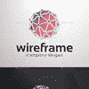
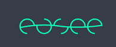
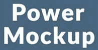
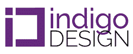
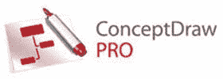

# 38 个用于 UI 和 UX 设计器的最佳原型开发工具[2020 更新]

> 原文： [https://www.guru99.com/prototyping-tools.html](https://www.guru99.com/prototyping-tools.html)

原型设计是任何数字设计过程的重要组成部分。 它允许您模拟 Web 设计，探索不同的用户体验以及测试项目中的流出。 市场上有许多原型制作工具。

以下是精选的 38 种精选原型工具，这些工具具有流行功能和最新下载链接。 该比较列表包含开源和商业工具。

### 1） [Moqups](https://bit.ly/2kWh3Ya)

[Moqups](https://bit.ly/2kWh3Ya) 是易于使用的原型制作工具，可帮助您在相同的创作环境中实时在线框，模型，图表等上进行协作。

**功能：**

*   从全面的小部件库中拖放元素，并易于配置智能形状。
*   通过添加交互或热点，将线框或最终设计转变为实时原型。
*   专业的图表功能，可用于创建流程图，决策树，站点地图，用例等。
*   它提供了一个内置库，其中包含来自最受欢迎图标集的数千个图标。
*   提供对本机支持的拖放或复制/粘贴功能，以从桌面或其他应用程序导入图像

### 2）奇迹应用

 

Marvel 是基于浏览器的原型制作工具，可简化原型制作过程。 它允许您上载图像文件，并帮助您添加手势和过渡。

**Features:**

*   帮助您无需代码即可创建逼真的原型
*   允许您通过用户测试来验证想法
*   提供快速的 URL 共享并为您的模型嵌入代码
*   Marvel App 支持直接上载 JPG，GIF 和 PSD 等特定图像类型。

下载链接： [https://marvelapp.com](https://marvelapp.com)

### 3）视觉

Invision 是世界上另一种流行的原型制作工具。 项目管理页面可帮助您将设计组件组织到状态工作流程中。

**Features:**

*   它允许您上传多种文件类型，包括 JPG，PNG，GIF，PSD 文件
*   提供灵活的图层样式和完美的像素布局
*   提供与 Slack，Dropbox，Trello 和 JIRA 等应用程序的推拉集成。

**下载链接：** [https://www.invisionapp.com/studio](https://www.invisionapp.com/studio)

### 4）贾斯汀·明

 

JustInMind 是用于创建高质量作品的原型工具，尽管成本很高。 此工具的另一个优点是，您可以在计算机上下载以在任何地方进行脱机工作。

**Features:**

*   允许您将原型导出为功能齐全的 HTML 文档，并使其易于在任何 Web 浏览器中查看。
*   为网站和 Web 应用程序创建线框，以适应台式机和移动设备的多种屏幕分辨率
*   它提供对 UI 库中使用项的访问，并可以下载大量插件。

**下载链接：** [https://www.justinmind.com/](https://www.justinmind.com/)

### 5）弗林托

 

Flinto 原型制作工具有两个版本-iOS 应用程序和 Web 应用程序。 这些原型工具的最好之处在于，它使设计人员无需了解编码就可以构建简单的单击和复杂的交互式原型。

**Features:**

*   它使您可以控制所有层和各种复杂性。
*   应用程序使用拖放系统进行原型制作。
*   允许您使用点击，滑动，滚动甚至 3D 触摸来浏览原型。
*   帮助您将可自定义的滚动添加到应用程序设计中的任何组。

**下载链接：** [https://www.flinto.com/](https://www.flinto.com/)

### 6) Proto.io

 

Proto.io 是另一个有用的原型制作工具，用于创建逼真的原型，使您可以从粗略的想法一直发展到成熟的设计。 该工具还为您的项目提供了大量可能性，用于创建详细的动画和自定义矢量动画。

**Features:**

*   允许您记录用户的测试
*   提供可共享的原型
*   提供对 VR 原型的支持
*   提供可用的附加组件

**下载链接：** [https://proto.io/](https://proto.io/)

### 7）折纸：

 

折纸工具是 Facebook 开发的，旨在帮助团队构建和设计产品。 它允许您将 Sketch 和 Photoshop 导入到折纸中

**Features:**

*   您只需单击一下即可导出原型组件，因此工程师可以将其复制并粘贴到项目中。
*   折纸可让您向设计中添加自定义背景，全屏查看以及使用各种设备进行模拟。
*   它不允许您的客户或设计团队直接在项目或版本历史记录中发表评论。

**下载链接：** [https://origami.design/](https://origami.design/)

### 8）Axure

 

Axure 无需编码即可提供强大的原型制作。 提供动态内容以提供悬停功能（如果存在）。

**Features:**

*   用于检查条件的条件流语句
*   提供数学功能，例如添加或从购物车中删除以反映金额
*   用于根据屏幕大小调整屏幕大小的自适应视图
*   原型上的动画。

**下载链接：** [https://www.axure.com/](https://www.axure.com/)

### 9）流畅的用户界面

 

流畅的用户界面，出色的原型制作工具。 它允许您构建高和低保真度的组件库，实时团队协作，视频演示等。

**Features:**

*   它提供快速原型制作
*   内置库可容纳 2000 多个组件
*   允许您通过点击创建交互式的 Web 和移动原型
*   允许您上传现有资产

**下载链接**： [https://www.fluidui.com/](https://www.fluidui.com/)

### 10）普罗特

Prott 是一个直观的原型制作平台，可在整个设计过程中为每个人提供发言权。 它可以立即帮助您实现理想。

**Features:**

*   几乎没有时间设计屏幕
*   帮助您从各种集成的 UI 套件中进行选择
*   允许您构建自己的 UI 库

**下载链接：** [https://prottapp.com/](https://prottapp.com/)

### 11）草稿

 

Draftium 是用于网站构想和协作的免费在线原型制作工具。 它有助于简化 Web 设计人员，工作室，营销人员和客户经理的日常工作。

**Features:**

*   它使您可以在 15–30 分钟内形象化网站构想
*   提供 350 多个现成的模块和 300 多个原型模板
*   Draftium 中的原型基于块。
*   您执行的所有编辑将在线显示。

**下载链接：** [https://draftium.com/](https://draftium.com/)

### 12）Wireframe.ccc

 

Wireframe.cc 提供免费的环境，可为您的业务构建理想的原型。 它使您可以专注于我们的想法并在它们消失之前勾勒出它们的轮廓。

**Features:**

*   通过提供非常有限的调色板，可以帮助您使线框保持简单
*   提供上下文相关的 UI
*   移动设备采用垂直和横向方向。
*   允许注释您的线框

下载链接： [https://wireframe.cc/](https://wireframe.cc/)

### 13）Pidoco：

 

Pidoco 原型制作工具，使您可以创建点击式线框并快速使用交互式 UX 原型。 它可以帮助您在 iOS 和 Android 设备上实时测试原型。

**Features:**

*   此线框工具可让您实时与他人共享原型，收集评论并编辑屏幕
*   只需单击一下按钮，即可提供规范文档，从而为您的 Web 开发团队提供蓝图
*   允许您自定义构建基块，这有助于您提高项目中的设计一致性

**下载链接：** [https://pidoco.com/cn](https://pidoco.com/en)

### 14）Uxpin

 

UXPin 提供了设计原型所需要的一切，这些原型就像成品一样工作。 它提供了具有从生产代码生成的功能和交互元素的原型。

**功能**

*   互动有状态元素
*   允许您使用交互式文本字段，复选框和单选按钮绘制其静态模仿。
*   通过将现有网页或网页的一部分导入到 UXPin，帮助您导入原型。

**下载链接：** [https://www.uxpin.com/](https://www.uxpin.com/)

### 15）农民：

Farmer 是另一个有用的原型，在 macOS 上运行的屏幕设计工具需要进行编码，并且最适合用于允许您创建动画或交互式原型。

**Features:**

*   它可以轻松地将每个帧和形状导出为位图或矢量。
*   您可以使用注释进行协作，并将原型上传到 Framer Cloud。
*   Framer 提供计划和多个团队计划，以满足不同数量的用户。

**下载链接：** [https://www.framer.com/](https://www.framer.com/)

### 16）素描

Sketch 是现代 Web 设计人员的有用工具。 现在，它包括用于 Sketch 原型制作的插件，可以满足设计人员的需求。

**Features:**

*   功能上非常灵活
*   易于构建原型
*   建立符号和可重复使用的资产
*   帮助您轻松共享原型。

**下载链接：** [https://www.sketch.com/](https://www.sketch.com/)

### 17）原则

Principle 工具是为 OS X 构建的，并带有一个 iOS 应用程序以镜像实时原型。 它允许您设计多屏幕应用程序的流程或新的交互和动画。

**Features:**

*   Principle 为团队合作提供了协作。
*   提供离线工作的灵活性
*   它允许您将设计镜像到 IOS 设备上。

**下载链接：** [https://principleformac.com/](https://principleformac.com/)

### 18） [Adob​​e XD](https://bit.ly/2VT7IAp)

[Adob​​e XD](https://bit.ly/2VT7IAp) 原型制作工具使您可以绘制，重用和重新混合矢量，以使用单个应用程序构建线框，原型，屏幕布局和就绪资产。

**Features:**

*   设计师只需从其 Adobe 工具中导入文件即可轻松完成工作
*   它允许与 Photoshop 和 After Effects 的几种产品进行集成，这是一个很大的优势。
*   当您直接共享时，它使您可以对原型发表评论，并在实际设备上实时查看设计。

**下载链接：** [https://www.adobe.com/in/products/xd.html](https://bit.ly/2VT7IAp)

### 19） [Webflow](https://bit.ly/35ABIEb)

[Webflow](https://bit.ly/35ABIEb) 提供快速无缝的原型设计是一种快速无缝的方法。 通过单击按钮，您可以将其原型化为可用于生产的站点。

**Features:**

*   该工具专注于 Web 动画，交互和自适应 Web 设计
*   Webflow 的干净的语义代码可以节省很多时间的代码清理。
*   它带有站点模板和 Web 组件，可以将它们拖放到原型中。
*   它允许您使用 webflow 托管原型或以干净的 HTML，CSS 和 JavaScript 导出代码。

**下载链接：** [https://webflow.com/](https://bit.ly/35ABIEb)

### 20）巴尔萨米克

Balsamiq 线框是一种小型但有用的图形工具，用于勾画网站和 Web /桌面/移动应用程序的用户界面。

**Features:**

*   它允许您构建原型的粗略草图，以供客户查看
*   可以轻松进行协作并获得有关线框的快速反馈。
*   它复制了在纸上以及在数字媒体上开发模型的速度和便利性。
*   它可以帮助您创建简单和静态的线框。

**下载链接：** [https://balsamiq.com/](https://balsamiq.com/)

### 21）Kiteapp

 

Kite 是一个功能强大的动画和原型制作应用程序，适用于 Mac 和 iOS 设备。 它使您可以在播放模式下全屏查看我们的设计。

**Features:**

*   自定义播放窗口的背景颜色和透明度，以实现自定义外观。
*   它提供简单易用的用户界面，可扩展并适应您的需求和手头的任务。
*   将您的设计分解成多个内容页面，每个页面都有自己独立的时间表。

**下载链接：** [https://kiteapp.co/](https://kiteapp.co/)

### 22）蚂蚁类型：

 

使用支持的浏览器在每台设备上设计和测试原型。 它还支持适用于 iPhone 和 iPad 的本地 iOS 应用。

**Features:**

*   帮助您创建真正的响应式设计
*   使用 Apple 最新的 Mac-OS Mojave 的黑暗模式，您可以专注于设计。
*   使您可以在每个设备和受支持的浏览器上预览设计预览并测试原型。

**下载链接：** [http://www.antetype.com/](http://www.antetype.com/)

### 23）原子的

Atomic 是基于网络的工具，需要 Google Chrome。 它为您提供了微调交互所需的灵活性和控制力。

**Features:**

*   通过提供轻松共享的原型制作系统，它使所有开发人员都可以轻松访问。
*   它可以帮助您倒带查看以前的迭代，并帮助您创建新版本。

**下载链接：** [https://atomic.io/](https://atomic.io/)

### 24）Vectr

 

Vectr 是一个免费的图形软件，主要用于轻松直观地进行矢量图形处理。 这是一个简单易用的桌面和 Web 原型制作工具，可将您的设计变为现实。

**功能：**

*   它可以帮助您立即入门，而无需太多学习过程。
*   矢量图形可让您创建无模糊徽标，演示文稿，卡片，小册子，网站模型或任何 2D 图形。
*   无需等待即可发送 Vectr 文档进行实时协作。

**下载链接：** [https://vectr.com/](https://vectr.com/)

### 25）iRise：

**Features:**

*   允许您在几分钟内组装任何保真度的网络和移动原型
*   使用所见即所得的图标和断点来设置响应行为。
*   捕获每个屏幕和 UI 元素的要求和规格

**下载链接：** [https://www.irise.com/](https://www.irise.com/)

### 26）爱视（Easee）：

 

Easee 是用于网页设计目的的网络动画工具。 它允许您简单地从 Sketch 或 Photoshop 中拖放图层

**Features:**

*   通过将鼠标悬停在库缩略图上来提供预览动画。
*   为 CSS 变换和不透明度属性设置动画，为您提供最佳效果。
*   将鼠标悬停在库缩略图上，即可预览应用内动画。

**下载链接：** [http://easee.design/](http://easee.design/)

### 27）HotGloo：

 

HotGloo 是一种 UX 原型制作工具，可帮助您设计用于 Web，移动和可穿戴设备的线框。 它允许可视化计划流程，构建和测试驱动器交互。

**Features:**

*   允许您创建和共享完全交互式的原型
*   该工具在设计时考虑到了较低的学习曲线。
*   它提供了用于在任何移动设备上编辑，查看和测试您的工作的功能。

**下载链接：** [https://www.hotgloo.com/](https://www.hotgloo.com/)

### 28）Ux-app

 

Ux-app 可让您加快软件原型的速度。 它使您可以使用此视觉动作设计器来处理桌面应用程序，移动应用程序和网站。

**Features:**

*   组件样式
*   允许您邀请团队成员对您的设计发表评论，
*   分享您的原型链接以获得客户的即时反馈
*   提供功能和可嵌套的组件

**下载链接：** [https://www.ux-app.com/](https://www.ux-app.com/)

### 29）铅笔项目

 

Pencil 项目旨在提供免费和开源的原型制作工具，使您可以在许多著名的桌面平台上安装和使用它们来创建模型。

**Features:**

*   Pencil 提供了内置的形状收集功能，可以绘制从桌面到移动平台的各种类型的用户界面
*   它支持可用于在图中将形状“连接”在一起的连接器。
*   允许您将工程图文档输出为不同类型的格式

**下载链接：** [http://pencil.evolus.vn/](http://pencil.evolus.vn/)

### 30）PowerMockup

 

PowerMockup 提供了大量的用户界面元素和图标，完全由 PowerPoint 形状制成。 它允许您创建移动，Web 和桌面应用程序的屏幕原型。

**Features:**

*   PowerMockup 的即时搜索功能可轻松查找正确的形状。
*   允许简单地从库窗格拖放到 PowerPoint 幻灯片上的所需位置。
*   PowerPoint 确保所有利益相关者都可以参与开发过程。
*   PowerPoint 包含协作和共享功能，可促进团队合作。
*   PowerMockup 形状提供的功能超出了 PowerPoint 提供的功能。

**下载链接：** [https://www.powermockup.com/](https://www.powermockup.com/)

### 31）MockingBot

 

MockingBot 可帮助您降低通信成本以及反复试验，提高设计效率！ 看不见的问题更快地暴露出来。

**Features:**

*   允许您为 Android，iPhone / iPad，平板电脑，手表等构建可点击的原型。
*   它为设计师提供了方便，免费的设计环境。
*   您可以使用简单的步骤创建看起来像真实应用程序的演示。
*   MockingBot 提供页面过渡，手势和动画。

**下载链接：** [https://mockingbot.in/](https://mockingbot.in/)

### 32）露西图

清醒图表是另一个重要的原型制作工具。 它使您可以随时随地与团队沟通。 它使您可以增强安全性并轻松管理用户帐户，同时可以完全访问高级 Lucidchart 功能。

**Features:**

*   绘图变得简单
*   与 G Suite 无缝集成
*   帮助您随时随地进行协作
*   将实时数据连接到图表或导入数据以自动构建组织结构图

**下载链接：** [https://www.lucidchart.com/pages/](https://www.lucidchart.com/pages/)

### 33）预览比例

 

Skala 预览版提供从 Mac 到 iOS 以及适用于 Android 设备的像素完美，色彩完美的设计预览。 它提供了在某些缩放级别下预览设计的功能。

**Features:**

*   提供色彩准确的图像预览到任何 iOS 或 Android 设备。
*   允许您使用沉浸式模式或在 Android 上显示状态栏来预览设计。

**下载链接**： [https://bjango.com/mac/skalapreview/](https://bjango.com/mac/skalapreview/)

### 34）靛蓝设计

 

Indigo design 是用于 Visual Design 的统一原型工具。 它允许您进行原型设计，代码生成和应用程序开发。

**Features:**

*   允许您使用我们的组件创建一流的 UI 设计
*   帮助您从设计中生成高质量的 HTML，CSS 和 Angular 代码
*   帮助您与用户共享，协作和测试体验

**下载链接：** [https://www.infragistics.com/products/indigo-design](https://www.infragistics.com/products/indigo-design)

### 35）框架 7

 

Framework 7 是用于开发 iOS，Android &桌面应用程序的全功能框架。 这个免费和开源的工具也可以作为必不可少的原型工具。

**Features:**

*   它提供了可立即使用的 UI 元素和小部件，例如模型，弹出窗口等。
*   这是一个非常快速和广泛的工具
*   材质主题非常经典，因为它以 Google 材质设计规范为基础，可带来像素完美的设计。
*   使用 Framework7 时，您可以使用自己喜欢的任何工具

**下载链接：** [https://framework7.io/](https://framework7.io/)

### 36）概念图

 

ConceptDraw Pro 为业务和技术制图市场提供了出色的分辨率。 它还提供了广泛的商业图形文档解决方案，其中包含数千个模板和数百个模板，可用于快速绘制图表。

**Features:**

*   强大的绘图和制图解决方案
*   ConceptDraw 为我们（网页设计师）提供了网页设计插件。
*   您可以从 ConceptDraw 中获取最终的模型页面，并为原型生成 CSS 和页面。

**下载链接：** [https://www.conceptdraw.com/](https://www.conceptdraw.com/)

### 37）关键性

 

Keynotopia 提供了最大的 UI 设计套件集合，可用于使用 Apple Keynote 或 Microsoft PowerPoint 创建模型，线框和交互式应用程序原型。

**Features:**

*   允许您为每个应用程序屏幕开发一张新幻灯片，并添加 Keynotopia 的可视组件
*   在移动设备上的 Keynote 或 PowerPoint 中打开原型
*   通过在组件和屏幕之间添加超链接来帮助您使原型具有交互性

**下载链接：** [https://keynotopia.com/](https://keynotopia.com/)