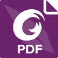
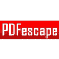
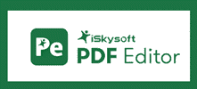
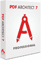
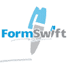
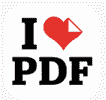
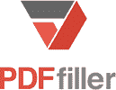

# 2020 年 30 种最佳 Adobe Acrobat 替代品

> 原文： [https://www.guru99.com/adobe-acrobat-alternatives.html](https://www.guru99.com/adobe-acrobat-alternatives.html)

Adobe Acrobat DC 是一款可帮助您创建，保护和分发 PDF 文件的软件。 它还允许您更改 PDF 文件中的内容或图像。 但是，adobe 杂技演员的最大缺点是成本。

以下是 30 种 Adobe Acrobat Pro 替代产品的精选列表，其中包括受欢迎的功能和最新的下载链接。 该列表包括商业（付费）软件和开源（免费）软件。

### 1） [Nitro Pro 12](https://bit.ly/38Opc3O)

[Nitro Pro 12](https://bit.ly/38Opc3O) 替代了 Adobe PDF Editor。 该软件使业务团队可以更好地处理各种文档以及彼此之间的工作。 该软件带有 OCR 引擎，用于扫描纸质文档。 它使处理数字文档变得轻松自如。

**功能**：

*   帮助您更快地将 PDF 转换为 Excel 和 PowerPoint。
*   通过云安全地快速共享文档。
*   与同事更快地访问和共享文件。
*   它是打印文档的绝佳替代品。
*   多任务处理功能使您可以轻松修改 PDF 文件
*   提供一种简单的方法来验证数字签名。

* * *

### 2）ABBYY FineReader / FineReader Pro

 

ABBYY FineReader 是 OCR 和 PDF 软件。 使用 PDF 工具很容易提高文档的业务效率。 您可以访问 pdf 文件和纸质文档中锁定的内容并进行更改。

**Features:**

*   创建，编辑，注释和注释 PDF 文件。
*   使用最新的 OCR 技术将纸质文档扫描并将其转换为 Word，Excel 或 PDF。
*   这是识别文档各个版本之间的更改的更快方法。
*   热文件夹可帮助您简化文档转换。

**下载链接**： [https://www.abbyy.com/zh-cn/finereader/features](https://secure.2checkout.com/affiliate.php?ACCOUNT=ABBYY3A&AFFILIATE=120043&PATH=https%3A%2F%2Fwww.abbyy.com%2Fen-eu%2Ffinereader%2Ffeatures%2F%3FAFFILIATE%3D120043)

* * *

### 3） [Wondershare](https://bit.ly/2xXymyw)

[Wondershare](https://bit.ly/2xXymyw) 是一款易于创建，编辑，转换和签名 PDF 文件的软件工具。 它可以在 Windows 和 Mac 操作系统上运行。 有三个计划：1）个人 2）团队和 3）教育。

**Features:**

*   您可以轻松控制 PDF 文件。
*   该软件提供了一种简单的方式来分发表格并将其合并以进行分析。
*   保护您的文件免遭意外访问。
*   使用评论功能有效地与您的团队协作。
*   用语言和视觉方式表达自己的文字处理器，以便您轻松编辑 PDF。

**下载链接**： [https://pdf.wondershare.com/](https://bit.ly/2xXymyw)

* * *

### 4）福昕 PhantomPDF

 

Foxit PhantomPDF 是用于生成和管理 PDF 文档的 PDF 编辑器。 发布文档后，它提供了一种有效的方法来创建和管理文档。 该编辑器的三个可用版本是 1）Standard 9、2）Business 9 和 3）Mac。

**Features:**

*   易于创建和编辑可填写的表格和文档。
*   它允许添加页眉，页脚和导出 PDF 文档。
*   易于与团队合作。
*   它可以帮助您更好地保护内容。
*   它提供 ECM 和云存储功能来共享您的文档。

**下载链接**： [https://www.foxitsoftware.com/pdf-editor/](https://www.foxitsoftware.com/pdf-editor/)

* * *

### 5）Sejda PDF 编辑器

Sejda PDF Editor 是一个免费的在线 PDF 工具。 它还提供了使用编辑器打开 PDF 文档的直接链接。 您也可以使用此编辑器来填充和签名 PDF。 该编辑器可以替代其他 PDF 创建和编辑软件（例如 Adobe acrobat）。 使用此软件压缩 PDF 文件。

**Features:**

*   2 小时后，文件将自动删除。
*   文件将不公开。
*   这是一个在线工具，因此您不需要任何安装。
*   易于在线更改文件。

**链接**： [https://www.sejda.com/pdf-editor](https://www.sejda.com/pdf-editor)

* * *

### 6）Kofax Power PDF

Kofax Power PDF 是为个人用户设计的工具，用于创建，编辑和共享 PDF 文档。 使用此解决方案，您可以在任何设备和操作系统上高效，无缝且安全地工作。 它使您可以使用出色的评论和标记工具与团队成员进行协作。

**Features:**

*   从任何文件类型创建和编译 PDF。
*   它有助于准确地交付您的文档。
*   您可以跨许多平台和设备工作。
*   您可以使用高级功能轻松地采取安全预防措施。
*   简化的部署和许可流程

**下载链接**： [https://www.kofax.com/Products/power-pdf/standard-free-trial](https://www.kofax.com/Products/power-pdf/standard-free-trial)

* * *

### 7）[苏打水 PDF](https://bit.ly/3bVGnCG)

[苏打 PDF](https://bit.ly/3bVGnCG) 是 Adobe 的强大竞争对手。 您可以在家中和旅途中使用此软件。 它支持 PDF 版本 2.0。 它是一个功能齐全的在线 PDF 编辑器。 使用此类编辑器来注释您的文档。 有两个可用的版本：1）家庭版和 2）高级版。 您可以选择每月或每年的编辑计划。

**Features:**

*   通过多种文件格式创建专业的 PDF。
*   有效地对文档进行更改。
*   它使文档修订过程变得容易。
*   发送和跟踪各种电子签约合同。

**下载链接**： [https://www.sodapdf.com/](https://bit.ly/3bVGnCG)

* * *

### 8）PDFescape

PDFescape 是一个在线 PDF 编辑器工具。 它也可用于 Windows。 该软件是 Adobe Acrobat 的绝佳替代品。 使用在线编辑器，您可以随时随地创建和编辑 PDF 文件。 此工具的两个版本是 1）在线和 2）高级。 提供更多选项来处理 PDF。

**PDFescape 的功能**：

*   轻松编辑 PDF 文件。
*   注释 PDF 文档非常容易。
*   创建 PDF 表单的绝佳方法。
*   在线共享和查看 PDF 文件。

**下载链接**： [https://www.pdfescape.com/windows/](https://www.pdfescape.com/windows/)

* * *

### 9）Able2Extract 专业版 14

它是用于转换，创建和编辑 PDF 文件的软件工具。 该软件将 PDF 文件转换为 Word，PowerPoint，Excel，AutoCAD，图像和 Publisher。 该 PDF 编辑器工具是适用于 Windows，Mac 和 Linux 的跨平台编辑器。

**Features:**

*   该软件允许您通过选择所需的页面，段落或行来自定义对话。
*   使用此软件可以轻松地自动化大量 PDF 文档。
*   允许您将 PDF 文件转换为许多开源格式，例如 Writer（ODT），Impress（ODP）和 Calc（ODS）。

**下载链接**： [https://www.investintech.com/prod_a2e.htm](https://www.investintech.com/prod_a2e.htm)

* * *

### 10）Gaaiho PDF Suite 5

Gaaiho PDF Suite 5 允许您加速文档工作流程。 Doc 不是 PDF 编辑器，而是文字处理器。 使用此软件，您还可以将 PFT 文件批量转换为其他格式。 PDF 套件包括两个有用的应用程序 1）Doc 和 2）转换器。

**Features:**

*   将任何 Word，Excel 或 PowerPoint 文件转换为 PDF。
*   它提供了手写签名以保护 PDF 文档。
*   它允许用户管理 PDF 文件并将其分发给其他人。
*   将文件合并为一个 PDF 文件。
*   在 PDF 中创建基本表单。

**下载链接**： [https://www.gaaiho.com/index.php/en/products/edit-conversion/pdf-suite/overview](https://www.gaaiho.com/index.php/en/products/edit-conversion/pdf-suite/overview)

* * *

### 11）ISkySoft PDF Editor 6 专业版

Iskysoft PDF Editor 6 Professional 是用于创建，编辑，转换 PDF 文件的工具。 使用此软件，您可以与办公室同事进行签名和 PDF。 该编辑器提供了处理 PDF 文档的最佳简便方法。

**Features:**

*   允许您像 Word 文件一样编辑 PDF 文件。
*   添加注释和注释 PDF
*   该软件使用高级 OCR，以便您编辑扫描的文件。
*   您可以从扫描的 PDF 和表格中提取数据。
*   使用编辑工具，密码等保护文件。
*   只需单击几下即可创建表单。

**下载链接**： [https://pdf.iskysoft.com/](https://pdf.iskysoft.com/)

* * *

### 12）PDF Architect 7

PDF Architect 7 使 PDF 文档的编辑非常容易。 此版本使复杂的任务变得更快，更轻松。 它为可编辑字段和文本字段提供了更高的可用性。 组合框和文本字段具有许多用于货币符号，邮政编码，日期和时间的格式设置选项。

**Features:**

*   使用此工具，您可以轻松地从包含重要信息的文档中创建 PDF 文件。
*   使用“使用 PDF 文档”功能，可以确保文件外观相同并与任何 PDF 程序兼容。
*   该工具允许您直接在 PDF 文件中修改内容。
*   您可以合并多个文件并制作一个 PDF 文件。
*   通过插入页面元素来组织 PDF 文件。

**下载链接**： [https://www.pdfforge.org/pdfarchitect](https://www.pdfforge.org/pdfarchitect)

* * *

### 13） [PDFexpert](https://bit.ly/2USySXB)

[PDFexpert](https://bit.ly/2USySXB) 是一款功能强大的 PDF 编辑器。 您可以使用此软件阅读，注释，编辑 PDF 文件，更改图像和文本。 该软件免费提供，可以在 Mac，iPhone 和 iPad 上使用。 PDF 编辑器允许用户查看，注释，编辑 PDF 和更改图像。

**Features:**

*   它提供了平滑的滚动和更快的搜索任何布局的方式。
*   借助高级设置功能，您将获得惊人的阅读体验。
*   使用 Apple 铅笔添加注释或便笺。
*   它使用搜索索引来快速查找所需的内容。
*   自动检测字体大小和书面文本的不透明度，以便您可以轻松地编辑文档。
*   它具有用于裁剪页面的裁剪工具。

**下载链接**： [https://pdfexpert.com/](https://bit.ly/2USySXB)

* * *

### 14） [Smilesoftware](https://bit.ly/2wqC8zP)

[Smilesoftware 的 PDFpen](https://bit.ly/2wqC8zP) 是在 PDF 中添加文本，签名和图像的强大方法。 它可以在 Mac 操作系统，iPad 和 iPhone 上运行。 该工具提供了一种有效的方式来进行更改和纠正错别字错误。 您可以随时编辑 PDF 文件。 该编辑器的试用版是免费的。

**Features:**

*   绘制，涂抹，突出显示和纠正内容。
*   将 OCR 文本图像转换为可编辑格式
*   易于擦除 OCR 文本。
*   打印评论和注释。
*   验证数字签名。
*   保存库中经常使用的文字和图像。

**下载链接**： [https://smilesoftware.com/pdfpen](https://bit.ly/2wqC8zP)

* * *

### 15）多丘

Dochub 是一个在线免费工具，可以编辑，发送和签名 PDF 文件。 您可以使用此在线工具简化文档工作流程。 该编辑器还可以用于对 PDF 文档进行数字注释和签名。 该工具可以与 Gmail，Dropbox 和 Google 云端硬盘集成。

**Features:**

*   您将获得带有 Sign Requests，DocHub 和 eSignatures 签名的 PDF 文件。
*   插入图像，发表评论并创建字段。
*   这是创建各种模板和表格的一种快速简便的方法。
*   您可以直接从 Gmail，驱动器或保管箱打开文件。
*   它允许 OAuth 2.0 身份验证和 256 位 SSL 加密以确保安全。

**下载链接**： [https://dochub.com/](https://dochub.com/)

* * *

### 16）Formswift

Formswift 是创建和编辑 PDF 文档的简单在线工具。 此免费工具可让您按类别浏览文档。 云基础服务使企业和个人可以自定义，签名和下载知名的企业个人和企业表格。

**Features:**

*   帮助您个性化法律表格。
*   使用房地产表格管理契约合同，房地产购买协议，抵押转让，租赁选择。
*   它为一系列企业提供了一套完整的税表。
*   一键即可上传和编辑 PDF 文档。

**下载链接**： [https://formswift.com/](https://formswift.com/)

* * *

### 17）小 PDF

SmallPDF 是一个在线 PDF 工具。 它是一种在线压缩，编辑，转换，拆分和合并 PDF 的多合一软件工具。 用户可以使用它将 Gmail 附件转换为 PDF 格式的各种文件。 此工具的试用版可使用 7 天。

**Features:**

*   毫无问题地压缩 PDF。
*   将 Excel，Word 和 PowerPoint 文件转换为 PDF。
*   它具有删除多个页面的简单方法。
*   将一个 PDF 文件拆分为多个文件。
*   从 PDF 文档中删除加密，权限和密码。
*   使用密码和加密保护 PDF 文档。

**下载链接**： [https://smallpdf.com/](https://smallpdf.com/)

* * *

### 18）Xodo

使用 Xodo，您可以在计算机，网络和移动设备上进行更改，注释，签名和共享 PDF 文件。 该软件使处理 PDF 文件变得容易。 该软件的直观设计使您可以专注于内容。 它设计用于突出显示文档中编写的文本。

**Features:**

*   您可以快速签署文件。
*   该软件使您可以通过平板电脑或智能手机随时随地填写表格。
*   易于注释 PDF。
*   与他人实时协作。
*   您可以在 Google 云端硬盘，Dropbox 和 Xodo 上使用 PDF。

**下载链接**： [https://www.xodo.com/](https://www.xodo.com/)

* * *

### 19）Ilovepdf

IlovePDF 是一种免费且易于使用的工具，可用于处理 PDF。 它使您可以轻松地拆分，合并，转换，加水印和压缩 PDF 文件。 App 可让您通过网络批量或单独管理 PDF 文档。

**Features:**

*   以您想要的方式合并和合并 PDF。
*   减小 PDF 文件大小以提高 PDF 质量。
*   数秒即可将 PDF 转换为 JPG，反之亦然。
*   在您的 PDF 中添加页码。
*   在任何 PDF 文件中添加水印。
*   方便时删除页面并将其添加到 PDF。

**下载链接**： [https://www.ilovepdf.com/](https://www.ilovepdf.com/)

* * *

### 20）PDF 专业版

PDF Pro 软件允许您每月创建，编辑和转换 3 个 PDF 文件。 它不需要注册。 该编辑器是针对 macOS 和 OS X 操作系统开发的，这使得 PDF 定制非常容易。

**Features:**

*   易于查看和编辑 PDF 文件。
*   创建 PDF 并将其转换为 Word，Excel 和 PowerPoint。
*   允许您从任何地方访问文件。
*   它使用 HTTPS 安全地上传您的文档。

**下载链接**： [https://www.pdfpro.co](https://www.pdfpro.co)

* * *

### 21）Novapdf

NovaPDF 使您可以轻松创建行业标准的 PDF 文件。 只需打开文件，然后单击“打印”，然后选择 novaPDF 即可生成 PDF。 这是生成 PDF 的简单快捷方式。 它包括面向初学者和高级用户的功能。

**Features:**

*   将所有文档转换为 PDF。
*   易于使用的 Microsoft Office 加载项。
*   256 位 AES 加密可保护您的 PDF。
*   有效地管理打印机驱动程序的许可证。
*   将 PDF 文件的文本或段落插入另一个 PDF 文件中，以创建一个 PDF 文档。

**下载链接**： [https://www.novapdf.com/](https://www.novapdf.com/)

* * *

### 22）PDFfiller

PDFfiller 在线保存您编辑的 PDF 文件。 它是由软件即服务（SaaS）公司开发的软件。 您可以从任何设备编辑 PDF 文件。 这是免费的。 该软件有两个单独的版本：

1）企业和 2）开发人员。

**Features:**

*   您可以在 iPhone，iPad Touch 和 iPad 中使用此 PDF 编辑器。
*   简化文档签名。
*   与您的队友和签名工作流轻松协作。
*   它与 Gmail，Dropbox，Google 云端硬盘和 Salesforce 一起使用。
*   使用美国联邦和欧盟合规标准提供数据保护。

**下载链接**： [https://www.pdffiller.com/](https://www.pdffiller.com/)

* * *

### 23） [FileStar PDF](https://bit.ly/2Vj1IPz)

[FileStar PDF](https://bit.ly/2Vj1IPz) 是允许您通过处理 PDf 文件来提高桌面生产率的应用程序。 这是一个安全的文档管理应用程序，用于提高您的业务效率。 免费提供个人版。 专业版是付费版。

**Features:**

*   它支持 20,000 多种不同的文件转换。
*   快速拆分，合并或删除 PDF 文件中的页面。
*   调整大小，压缩和旋转图像很容易。
*   帮助您自动执行常见任务。

**下载链接**： [https://filestar.com/](https://bit.ly/2Vj1IPz)

* * *

### 24）PDF 文件

PDFDocs 是面向企业的文档管理软件。 此类软件与您现有的应用程序或系统集成。 对于喜欢在更短的时间内创建复杂 PDF 的人们来说，编辑器是一个完美的选择。 该软件提供三个版本：1）标准版，2）专业版和 3）企业版。

**Features:**

*   合并其他位置的多个文档。
*   使用集成的 PDF 工具提高您的业务效率。
*   快速有效地编辑任何 PDF 文档。
*   简化您的文档工作流程。

下载链接： [https://www.docscorp.com/products/pdfdocs/pdf-management/](https://www.docscorp.com/products/pdfdocs/pdf-management/)

* * *

### 25）ByteScout PDF SDK

Bytescout PDF SDK 提供 PDF API，用于创建，修改带有文本和图像的 pdf 文件。 该 SDK 用于创建或编辑 VB.NET 和 C＃等语言的 PDF 文档。 它将 HTML，DocX 和 SVG 文件转换为 PDF。

**Features:**

*   支持水印，多媒体和电子签名。
*   提供 PDF API 以创建和编辑 PDF。
*   易于使用书签和注释。
*   广泛使用文件附件。
*   它可以创建 SVG 文件并将其转换为 PDF。
*   该工具提供视频和媒体支持。

**下载链接**： [https://bytescout.com/products/developer/pdfsdk/index.html](https://bytescout.com/products/developer/pdfsdk/index.html)

* * *

### 26）PDF 表格

PDFTables 将 PDF 表转换为 excel 文件。 它将 PDF 在线转换为 CSV，Excel，HTML 或 XML。 云平台使您无需使用任何其他软件即可转换任何文档。 它使用一种算法来检查 PDF 结构，并将表有效地转换为各种文件。

**Features:**

*   将 PDF 转换为 XLSX 的快速有效的方法。
*   使用银行使用的最新技术对交易进行加密。
*   随时随地使用它。

**下载链接**： [https://pdftables.com/](https://pdftables.com/)

* * *

### 27）翻转 PDF

您可以使用 Flip PDF 将 PDF 手册，杂志或目录转换为可以在 Web 和移动设备上查看和共享的最多互动式电子书。 该软件可将 PDF 文件批量转换为 Flash 和 HTML。 该软件可在 iPad，iPhone 和 Android 手机上使用。

**Features:**

*   快速创建翻转电子书。
*   发布包含链接，视频和音频的电子书。
*   许多预设计模板和背景。
*   它使您可以在线上传电子书，并且可以嵌入到任何网站中。
*   它提供了一种吸引读者的令人印象深刻的方法。

**下载链接**： [https://www.flipbuilder.com](https://www.flipbuilder.com)

* * *

### 28）PDF 好友

PDF Budy 是一种在线编辑和签署 PDF 文档的工具。 您不需要下载任何软件。 其他工具也可用于合并和拆分 PDF 文档。 您可以存储文件，图像和签名以供重复使用。

**Features:**

*   易于添加签名和填写表格。
*   此工具可在台式机，Chromebook 或 Mac 上使用。
*   它使用 SSL 来确保 PDF 文件的保护。
*   免费版本允许您每月编辑多达 3 个 PDF 文件。
*   高级版本也可用。

**下载链接**： [https://www.pdfbuddy.com/](https://www.pdfbuddy.com/)

* * *

### 29）追踪器软件

Tracker 软件提供的 PDF-Xchange 编辑器是功能丰富的 PDF 编辑器或查看器。 使用此工具可以创建，查看，更改和对 PDF 文档进行数字签名。 其他三个软件是 1）PDF-XChange Lite，2）PDF-XChange Editor 和 3）PDF-XChange Editor Plus。

**Features:**

*   快速启动功能可在 PDF-Xchange 中启动命令。
*   将复制的文本粘贴为痛苦文本。
*   它具有改写功能，可以快速编辑文本。
*   允许您更新 OCR 语言和拼写检查。
*   易于将 CSV 转换为 PDF 表。
*   它使用“排列”选项卡提供所选文本的转换。

**下载链接**： [https://www.tracker-software.com/product/pdf-xchange-editor](https://www.tracker-software.com/product/pdf-xchange-editor)