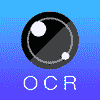
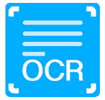
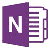
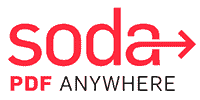

# 2020 年 22 种最佳 OCR 软件[免费/付费]

> 原文： [https://www.guru99.com/free-ocr-software-tools.html](https://www.guru99.com/free-ocr-software-tools.html)

OCR（光学字符读取器/识别）是图像到打印文本的电子转换。 有许多 OCR 软件可以帮助您将图像中的文本提取到可搜索的文件中。 这些工具接受多种图像类型，并转换为众所周知的文件格式，如 word，excel 或纯文本。

以下是 OCR 软件的精选列表，包括其受欢迎的功能和网站链接。 该列表同时包含开源（免费）和商业（付费）软件。

### 1）OnlineOCR

OnlineOCR 可以识别 PDF 文档和图像中的字符和文本。 它使您每小时可以将 15 张以上的图像转换为可编辑的文本格式。

**功能**：

*   它支持超过 46 种语言，包括英语，中文，法语等。
*   OnlineOCR 可以处理 BMP（位图），PNG（便携式网络图形），zip 文件等。
*   您可以将文本转换为 Word，Excel，RTF 和纯文本格式。
*   此服务使您可以将转换后的文件集成到您的网站中。

**链接**： [https://www.onlineocr.net/](https://www.onlineocr.net/)

* * *

### 2）纳米网

NanoNets 是一项网络服务，可帮助您使用 OCR 将文档和 PDF 数字化。 您可以使用它同时将 100 多个扫描的文档转换为 XML，PDF 等格式。

**Features:**

*   您可以指定文本类别以进行准确检测。
*   它使您最多可以上传每个文本类别的 50 张图像。
*   NanoNets 会自动从捕获的图像中键入字符。
*   您可以在几个小时内获得转换后的文件。
*   它可以使用 OCR 将人类可读的文本转换为结构化数据。
*   这个应用程序使您可以从图像中提取信息。

**链接**： [https://nanonets.com/ocr-api/](https://nanonets.com/ocr-api/)

* * *

### 3）LightPDF

LightPDF 是一项在线服务，可帮助您将扫描的 PDF 文件转换和管理为可编辑的文本格式。 它使您可以通过单击鼠标添加文件。

**Features:**

*   它使您可以选择一种以上的语言来识别文本。
*   该工具会加密您的个人信息。
*   您可以将图像和 PDF 转换为 PPT，TXT，RTF 等格式。
*   LightPDF 在电话上提供支持。
*   您可以扫描大小超过 30 MB 的文件。

**链接**： [https://lightpdf.com/](https://lightpdf.com/)

* * *

### 4) Ocr.space

Ocr.space 是一项使用 OCR 将包含文本的图像转换为可编辑文件格式的服务。 该网站还可以帮助您从 PDF 文件中获取文本。

**Features:**

*   它允许您为文档选择特定的语言。
*   该服务还可以转换文本文档的屏幕快照。
*   您无需注册即可使用 Ocr.space。
*   Ocr.space 使您能够将可编辑文件转换为多列文本格式。
*   它不会在服务器上存储您的机密数据。

**链接**： [https://ocr.space/](https://ocr.space/)

* * *

### 5）简易屏幕 OCR

Easy Screen OCR 使您可以将图像转换为可编辑的文本文件格式。 它可以帮助您捕获屏幕快照，以高效地提取文本。

**Features:**

*   它支持拖放功能以上传文件。
*   Easy Screen OCR 会在 30 分钟内删除上传的文件。
*   您可以从图像中提取文本而无需注册。
*   此服务使用 Google 学习服务来确保您的云数据安全。
*   您最多可以添加五张图片进行转换。
*   它可以识别 100 多种语言。
*   简易屏幕 OCR 使您可以设置快捷方式以方便访问。

**链接**： [https://easyscreenocr.com/](https://easyscreenocr.com/)

* * *

### 6）交响乐

Symphony 是一种后端 OCR 引擎，可确保可搜索已扫描文件的文本。 此服务使您可以从 PDF，TIFF（带标记的图像文件格式），电子传真，电子邮件等中提取文本。

**Features:**

*   Symphony OCR 可帮助您从包含扫描图像的 PDF 文件中检测文本。
*   您可以从文档中复制和粘贴文本。
*   它使您可以搜索文档中的文本。
*   该工具可以与 SharePoint，ShareFile 等集成。

**链接**： [https://trumpetinc.com/products/symphony-ocr/](https://trumpetinc.com/products/symphony-ocr/)

* * *

### 7）FineScanner

FineScanner 是一款智能扫描仪，可捕获文档和书籍并将其转换为易于搜索的文本格式。 扫描完成后，您可以在输出文件中进行更改。

**Features:**

*   它可以读取您的手机屏幕，包括图标，链接，按钮等。
*   FineScanner 接受虚拟助手命令来获取 PDF，扫描文档和打开书籍。
*   输出可以与其他人共享。
*   您可以在 iPad 或 iPhone 上使用它。

**链接**： [https://apps.apple.com/us/app/finescanner-cam-scan-to-pdf/id534203582](https://apps.apple.com/us/app/finescanner-cam-scan-to-pdf/id534203582)

* * *

### 8）文字童话

Text Fairy 是 Android OCR 应用程序。 此应用程序可以扫描从相机拍摄的图像或照片中的文本。 它可以识别 50 多种语言的打印内容。

**Features:**

*   它可以从扫描的图像中提取文本。
*   该应用程序会自动准确地调整图像以获得更好的效果。
*   您可以编辑结果文件。
*   它可以将图像转换为 PDF 文件。
*   文字仙子在使用时不显示任何广告。

**链接**： [https://play.google.com/store/apps/details?id=com.renard.ocr & hl = zh_CN](https://play.google.com/store/apps/details?id=com.renard.ocr&hl=en_IN)

* * *

### 9）软件 OCR

Softworks 是一个 OCR 程序，可以帮助您从图像中提取数据。 它使您可以最大程度地减少手动输入，并为您的业务提供自动化的解决方案。

**Features:**

*   它可以帮助您提高扫描文档的质量。
*   Softworks OCR 接受大量输入源。
*   它使用计算机视觉算法来分析处理后的页面。
*   该工具可以检测图像或文档中现有的文本层。

**链接**： [https://www.softworksai.com/our-solutions/optical-character-recognition](https://www.softworksai.com/our-solutions/optical-character-recognition)

* * *

### 10）文字扫描器[OCR]

文本扫描仪[OCR]是一款可扫描文本的 Android 应用。 它可以帮助您将图像转换为文本。 此工具可以自动识别照片中的字符。

**Features:**

*   它支持 50 多种语言。
*   您可以扫描手写纸并将其转换为数字格式。
*   文本扫描仪[OCR]可帮助您通过电子邮件与他人共享文件。
*   您可以将文件保存到 Google 驱动器。
*   它支持通讯软件，例如 Google Hangouts 和 Google+社交媒体网站。

**链接**： [https://play.google.com/store/apps/details?id=com.peace.TextScanner & hl = zh_CN](https://play.google.com/store/apps/details?id=com.peace.TextScanner&hl=en_IN)

* * *

### 11）Scanbot SDK

Scanbot SDK 可帮助您从手机扫描和创建文档。 它提供了可以轻松集成到 Android 和 iOS 项目中的 SDK（系统开发套件）。

**Features:**

*   它会自动识别扫描图像中的文本。
*   您可以从文档中提取文本并将其转换为可搜索和可编辑的文件。
*   这个程序支持所有主要的操作系统。
*   您可以离线使用它。
*   Scanbot SDK 可以识别拉丁，阿拉伯，亚洲等字符。
*   您可以扫描多页的 PDF 文件。

**链接**： [https://scanbot.io/en/sdk/scanner-sdk/ocr.html](https://scanbot.io/en/sdk/scanner-sdk/ocr.html)

* * *

### 12）ABBYY Cloud Reader

ABBYY Cloud Reader 是识别完整打印或手写页面的工具。 它可以检测 200 多种语言。 此工具可帮助您将 PDF /图像转换为可搜索的 MS Word，Excel，PDF 等格式。

**Features:**

*   它支持移动设备和台式机。
*   该工具可以识别收据和名片。
*   ABBYY Cloud Reader 提供 REST（代表性状态转移）。
*   它将识别的数据转换为 XML（可扩展标记语言）。
*   该工具提供了 Java，.NET，iOS 和 Python 库。

**链接**： [https://www.ocrsdk.com/](https://www.ocrsdk.com/)

* * *

### 13） [Adob​​e Acrobat](https://bit.ly/35hwn4o)

[Adob​​e Acrobat](https://bit.ly/35hwn4o) 是一个 OCR 系统，可帮助您将扫描的 PDF 文件，图像转换为可搜索/可编辑的文档。 它提供了看起来与打印输出相似的自定义字体。

**Features:**

*   您可以立即编辑任何打印的文档。
*   它使您可以轻松地将文本剪切并粘贴到其他应用程序中。
*   Acrobat 使您可以将文件导出到 Microsoft Office。
*   您可以将扫描的文档转换为 PDF 文件，并将数据从一个位置移动到另一位置。
*   此工具可帮助您保持文档的外观和原始外观一样。

**链接**： [https://acrobat.adobe.com/in/en/acrobat/how-to/ocr-software-convert-pdf-to-text.html](https://bit.ly/35hwn4o)

* * *

### 14）OCR 文字扫描器

OCR 文本扫描仪使您能够识别扫描文档中的文本。 这是一个用户友好的应用程序，可帮助您将手写或键入的格式转换为可编辑文件。

**Features:**

*   它可以检测 30 多种语言的文本。
*   您可以从剪贴板复制文本。
*   OCR 文本扫描仪可帮助您通过电子邮件共享文档。
*   它会自动识别扫描文档中写入的文本。
*   此工具可帮助您保存写在杂志或书籍中的报价单。
*   您可以在线和离线使用 OCR 文本扫描仪。
*   OCR 文本扫描仪可帮助您通过电子邮件将提取的文件发送给其他人。
*   它可以识别键入的文本格式。

**链接**： [https://play.google.com/store/apps/details?id=com.fourtechsolutions.ocr_reader_ocr_scanner_ocr_text_scanner & hl = zh_CN](https://play.google.com/store/apps/details?id=com.fourtechsolutions.ocr_reader_ocr_scanner_ocr_text_scanner&hl=en_IN)

* * *

### 15）Google 云

Google Cloud Vision 是可以检测图像中文本的 API。 它允许您将 PDF，PNG，JPEG 等文件格式转换为机器可读的文本。

**Features:**

*   您可以在计算机，Android 手机，iPhone，iPad 等上使用此应用程序。
*   它可以检测图像中的笔迹。
*   该工具可以从上传的图像中提取并保存文本。
*   它触发云功能以将文本保存到在线存储。
*   Google 云端会自动检测云中的图片文件。

**链接**： [https://cloud.google.com/vision/](https://cloud.google.com/vision/)

* * *

### 16）OneNote

 

OneNote 是一种光学字符识别产品，使您能够从打印输出或图片中复制文本。 该软件可帮助您在文件中进行更改。

**Features:**

*   只需单击一下即可将图像中写入的信息转换为文本。
*   它使您能够从打印输出中提取文本。
*   OneNote 可帮助您从名片中提取文本。
*   您可以使用关键字快捷键粘贴复制的文本。

**链接**： [https://www.onenote.com/](https://products.office.com/en-in/onenote/digital-note-taking-app?rtc=1)

* * *

### 17）苏打水 PDF

苏打 PDF 将纸质文档和图像转换为可编辑的 PDF 文件。 它可以同时识别多个文档中的文本。

**Features:**

*   Soda PDF 可帮助您更改字体类型，样式和大小。
*   它将文件存储在服务器上 24 小时。
*   您可以在线和离线使用此应用程序。
*   具有图像的 PDF 文件可以轻松转换为纯文本。
*   它加密服务器和浏览器之间的 URL。

**链接**： [https://www.sodapdf.com/products/soda-overview/#ocr](https://www.sodapdf.com/products/soda-overview/)

* * *

### 18）计时扫描

Chronoscan 是文档处理和数据提取应用程序。 它灵活且易于使用。 该工具可以在更短的时间内扫描文档。

**Features:**

*   它使您可以扫描大量文档。
*   您可以轻松地从 PDF 文件中过滤出文本。
*   使用 Chronoscan，您可以将文档上传到云中。
*   您可以将文档导出到 ERP（企业资源计划）软件。
*   它可以帮助您减少数据输入工作。
*   该软件可帮助您快速组织文档。

**链接**： [https://www.chronoscan.org/](https://www.chronoscan.org/)

* * *

### 19） [Readiris](https://bit.ly/3eZS5i1)

[Readiris](https://bit.ly/3eZS5i1) 是一个简单的软件包，可以自动转换纸质文档或图像中的文本。 它可以帮助您在文件中进行更改而无需重新键入。

**Features:**

*   它支持多种输出格式。
*   Readiris 可以使用您指定的格式来听书。
*   与 Windows 和 Mac 操作系统兼容。
*   Chronoscan 帮助您编辑图像中的嵌入文本。
*   您可以将文件导出到 Microsoft Word，Excel，PowerPoint 等。

**链接**： [https://www.irislink.com/zh-CN/c1729/Readiris-17--the-PDF-and-OCR-solution-for-Windows-.aspx](https://bit.ly/3eZS5i1)

* * *

### 20）亚马逊 Textract

Amazon Textract 是一项服务，可帮助您从扫描的文档中提取文本。 您可以使用它来自动执行文档工作流程，快速处理大量文档。

**Features:**

*   它标识以表格或表格形式编写的内容。
*   该工具使用 API​​从文档中获取数据。
*   它会自动从表单中提取数据。
*   Textract 几乎可以读取任何文档。
*   自动识别关键信息。
*   您可以按百分比调整文档质量。
*   它与 Amazon Augmented AI 服务集成在一起，用于文档处理。

**链接**： [https://aws.amazon.com/textract/](https://aws.amazon.com/textract/)

* * *

### 21）Evernote 可扫描

 

Evernote Scannable 是一款移动应用程序，可帮助您捕获纸张并将其转换为可保存文件的格式。 它使您可以与其他人共享文件。

**Features:**

*   您可以扫描收据，名片，合同等。
*   它会自动旋转，裁剪和调整图像。
*   Evernote 使您可以将文档导出为 JPG 和 PDF 文件。
*   您可以毫不费力地从名片中提取联系方式。
*   该应用程序可以在 iPad，iPhone 和 iPod touch 上使用。
*   批准之前预览图像。
*   它使您能够通过电子邮件或短信发送转换后的文件。

**链接**： [https://evernote.com/products/scannable/](https://evernote.com/products/scannable/)

* * *

### 22）侵权

Infrrd 是一种 OCR 解决方案。 它使您可以将文档转换为易于阅读的文件。 这个应用程式可以筛选合约，财务和医疗文件中的文字。

**Features:**

*   侵权应用程序可以快速识别标题和文本。
*   它使您可以使用机器学习从 Infrrd 过滤文本。
*   您可以与现有的 CRM（客户关系管理）集成。
*   该工具使用 AI（人工智能）技术从发票中提取数据。
*   您可以根据类别对文档进行分类。
*   它为所有文档格式提供 OCR 解决方案。

**链接**： [https://infrrd.ai/products/machine-learning-ocr](https://infrrd.ai/products/machine-learning-ocr)