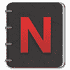
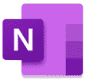
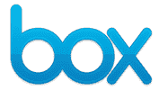
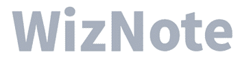
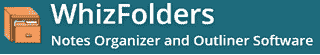

# 2020 年 20 种最佳 Evernote 替代品

> 原文： [https://www.guru99.com/best-alternatives-to-evernote.html](https://www.guru99.com/best-alternatives-to-evernote.html)

Evernote 是一款用于笔记，管理任务和归档的应用程序。 它可以帮助您跨一个以上的计算设备捕获想法，待办事项列表和项目并确定其优先级。

但是，Evernote 并非没有缺陷，因为它不处理加密的笔记。 此外，如果要将注释导出为 HTML 或文本文件，则应具有一些脚本知识。

以下是精选工具可以代替 Evernote 的精选清单。 此列表包含开源（免费）和商业（付费）软件。

### 1）[概念](https://bit.ly/2SlSqBQ)

[概念](https://bit.ly/2SlSqBQ)是可以与数据库和任务集成的笔记，协作和项目管理软件。 该工具提供电子表格，以记录您的工作。

**功能：**

*   它支持 30 多种媒体类型。
*   使用日历和列表视图可以轻松管理任务和项目。
*   您可以集成 50 多个应用程序。
*   它可以帮助您概述您的想法并按升序或降序重新排列它们。
*   您可以实时协作。

**链接：** [https://www.notion.so/](https://bit.ly/2SlSqBQ)

* * *

### 2）Dropbox 纸

Dropbox Paper 是一项协作式文档编辑服务。 您可以使用它与您的团队实时协作，分配任务并制定任务清单。

**功能**：

*   您可以将团队的背景文档，任务分配和议程保留在同一位置。
*   使用此工具可以注释图像的特定部分。
*   您可以简短地写下想法，抓取图像或在旅途中提供有关工作的反馈。
*   使用此工具，您可以将文档转换为专业外观的演示文稿。
*   需要跟进才能完成任务。

**链接**： [https://www.dropbox.com/paper](https://www.dropbox.com/paper)

* * *

### 3）Notejoy

Notejoy 是协作式注释请求。 它可以帮助您和您的团队分享想法，获得反馈，多层次的讨论以及反应。

**Features**:

*   它使您能够使用复制和粘贴或拖放功能快速捕获图像。
*   您可以将 Microsoft 文档，Google 文档，视频，PDF 和音频嵌入到笔记中。
*   它提供语法突出显示。
*   您可以使用键盘快捷键来撰写笔记。
*   该工具支持 Mozilla Firefox 和 Google Chrome。
*   您可以自定义主题，字体，边栏等。
*   Notejoy 使您可以通过 OCR（光学字符识别）在 PDF，图像，Microsoft Office 和 google 文档中搜索文本。

**链接**： [https://notejoy.com/](https://notejoy.com/)

* * *

### 4）OneNote

Microsoft OneNote 是一个记笔记应用程序，使您可以随时随地捕获创意。 您可以通过网络或 Internet 与其他 OneNote 用户共享笔记。

**Features**:

*   它可以帮助您跨笔记本，页面和部分对内容进行排序。
*   您可以使用标签突出显示注释。
*   该工具允许您使用手写笔或手指对笔记进行注释。
*   您可以插入在线视频，录制音频注释并添加文件。
*   您可以使用此应用程序单击保存内容。
*   您知道，它使您可以与其他人共享笔记。

**链接**： [https://products.office.com/en-in/onenote/digital-note-taking-app?rtc=1](https://products.office.com/en-in/onenote/digital-note-taking-app?rtc=1)

* * *

### 5）Google Keep

Google Keep 是一个记笔记软件应用程序，可在网络上使用，并具有许多适用于 iOS 和 Android 操作系统的移动应用程序。

**Features**:

*   您可以创建笔记，设置提醒并检查已完成的任务。
*   它使您可以将协作者添加到列表和注释中。
*   您可以在任何照片上绘画。
*   使用此工具，您可以按自动创建的主题搜索注释。
*   Google Keep 可让您对笔记进行分组。
*   您可以为便笺上色以方便扫描。
*   它自动将数据同步到平板电脑，手机，笔记本电脑和手表。

**链接**： [https://keep.google.com/u/0/](https://keep.google.com/u/0/)

* * *

### 6）温馨提示

GoodNotes 是 Evernote 的强大竞争对手。 它使您可以导入 W​​ord，PowerPoint 和 PDF 文件以对其进行注释。 您可以找到手写笔记，文件夹标题，文档大纲以及具有强大 OCR 支持的键入文本。

**Features**:

*   您可以用手指或手写笔在数码纸上的导入文档上书写和素描。
*   它使您可以使用模板对笔记本进行个性化设置。
*   您只需双击即可创建空白便笺。
*   它支持拖放功能。
*   使用此工具可以在垂直滚动和水平滚动之间切换。
*   Goodnotes 提供的选项卡可帮助您在多个文档之间来回切换。

**链接**： [https://www.goodnotes.com/](https://www.goodnotes.com/)

* * *

### 7）框​​注

Box Notes 是用于团队合作的笔记记录工具。 创建便笺并与其他人共享后，便笺将可在 Web，移动设备和台式机上使用。

**Features**:

*   它可以与 1,000 多家软件提供商集成。
*   该工具可帮助您的团队交付智能数字业务流程。
*   它使您能够控制加密密钥，以确保业务和数据的私密性。
*   Box 支持 GxP（良好实践）验证。
*   您可以监视团队的活动。

**链接**： [https://www.box.com/en-gb/resources/downloads/notes](https://www.box.com/en-gb/resources/downloads/notes)

* * *

### 8）图尔特

Turtl 是确保您的笔记，密码，想法，文档和照片安全的地方。 它不会在任何地方存储您的密钥或密码。 这意味着只有您和您想与之共享的人才能读取数据。

**Features**:

*   它使用高端加密技术来保护您的数据。
*   该工具使您可以使用标签或文本进行搜索。
*   它支持 TeXmath 插件渲染。
*   Turtl 允许您使用导入或导出来备份个人资料。
*   支持多笔交易，包括德语，法语和西班牙语。
*   开源服务器使您可以托管用 Turtl 编写的数据。

**链接**： [https://turtlapp.com/](https://turtlapp.com/)

* * *

### 9）米兰诺

Milanote 是将您的项目和想法管理到可视面板中的工具。 它支持所有常见文件，包括 PDF，JPG，Excel，Word 等。

**Features**:

*   它使您能够保存来自网络的文本，链接和图像。
*   您可以从手机添加便笺和照片。
*   该工具可以帮助您以可视化的方式以合理的方式组织项目。
*   您可以一起实时编辑。
*   它允许您邀请任何人查看和编辑您的仪表板以及下载可打印的 PDF 文件。

**链接**： [https://milanote.com/](https://milanote.com/)

* * *

### 10）SimpleNote

Simplenote 是 Evernote 的替代应用程序，它支持 markdown 应用程序。 您可以将此应用程序用于 iOS，macOS，Windows，Android 和 Linux。

**Features**:

*   您可以通过即时搜索和标签轻松找到笔记。
*   它使您可以在线共享列表，发布说明或发布注释。
*   您可以在更改笔记时备份它们。
*   该工具使您无需按下任何按钮即可在所有设备上保持最新状态。

**链接**： [https://simplenote.com/](https://simplenote.com/)

* * *

### 11）鱿鱼

Squidnotes 是一款软件，可帮助您记录上班或上课的数字手写笔记。 您可以导入任何图像或 PDF 以开始或扩充笔记。

**Features**:

*   它使您可以在任何缩放级别创建注释。
*   此工具有一个笔划擦除器，可帮助您快速擦除整个字母和单词。
*   您可以更改文本笔触的粗细和颜色。
*   它使您可以从多种纸张类型和尺寸中进行选择。
*   Squidnotes 可以帮助您自然而有压力感地书写。
*   您可以合并 PDF 并在两者之间插入页面。

**链接**： [https://www.squidnotes.com/](https://www.squidnotes.com/)

* * *

### 12）佐泰罗

Zotero 是使您能够收集组织以及共享研究的工具。 您可以从 Mac，Linux 和 Windows 平台访问它。

**Features**:

*   它会自动感应网络上的研究。
*   使用此工具，您可以将项目分类到集合中并用关键字标记它们。
*   您可以直接在 Word，LibreOffice 和 Google Docs 中为任何文本编辑器创建书目和参考。
*   它使您可以与所需的任何人共享 Zotero 库。
*   您始终可以控制重要数据。

**链接**： [https://www.zotero.org/](https://www.zotero.org/)

* * *

### 13）乔普林

Joplinapp 是一个开源的待办应用程序。 它提供了可搜索的便笺，可以轻松地对其进行复制，标记和修改。 该工具支持 markdown 工具渲染。

**功能**：

*   它提供笔记历史记录。
*   该工具与 WebDAV，NextCloud，Dropbox 等各种服务进行同步。
*   您的数据可在没有 Internet 连接的情况下在台式机和移动应用程序上使用。
*   Joplinapp 支持多种语言。
*   它支持 Markdown 和 Enex 工具文件。
*   您可以将文件附加到便笺。

**链接**： [https://joplinapp.org/](https://joplinapp.org/)

* * *

### 14）DEVONthink

DEVONthink 可存储文档并帮助您使其井井有条。 它可以安全地同步您的数据。 该工具将所有文档保留在备份数据库中，并以多种方式向您显示。

**Features**:

*   它可以扫描纸质文档并使它们可搜索。
*   使用此工具，您可以将智能规则添加到文件文档中并重命名它们。
*   它使您可以按标记，日期或标签过滤数据库。
*   您可以将注释添加到任何文档。
*   Devonthink 可帮助您将文档存储在数据库中。
*   您可以在所有 Mac，iPad 和 iPhone 上同步数据。

**链接**： [https://www.devontechnologies.com/apps/devonthink](https://www.devontechnologies.com/apps/devonthink)

* * *

### 15）第一天

Day One 是一款应用程序，可以自动备份到专用服务器并确保数据安全。 通过端到端加密保护隐私。

**Features**:

*   它使您可以将 Instagram 帖子保存到第一天。
*   您可以使用手指，手写笔或苹果铅笔添加手写的图形或条目。
*   该应用程序可帮助您通过音频记录故事和印象。
*   使用 Chrome 浏览器和 Safari 扩展程序单击即可保存任何网站。
*   您可以使用搜索标签，收藏夹和过滤器轻松找到照片。
*   第一天有一个活动提要，使您可以查看所做的更改。

**链接**： [https://dayoneapp.com/](https://dayoneapp.com/)

* * *

### 16）熊笔记

Bear Notes 是一款适用于 iPad，Apple Watch 和 Mac 的灵活写作应用程序。 您可以将所有笔记存储为可移植的纯文本格式。 该工具允许您将注释彼此链接。

**Features**:

*   该工具支持 20 多种编程语言。
*   它提供了快捷方式，可为您的文本快速添加样式。
*   Bear Notes 提供了一系列导出选项，包括 PDF，HTML，DOCX，JPEG 等。
*   您可以毫不费力地使用＃标签查找和整理笔记。
*   它使您可以在编写时进行查看。
*   该工具会自动识别链接，地址，电子邮件等元素。

**链接**： [https://bear.app/](https://bear.app/)

* * *

### 17）Boostnote

 

Boostnote 是一个工具，可让您快速为 Markdown 应用编写注释并编写代码片段。 您可以将数据同步到 Windows，Linux，Mac，Android 和 iOS 等设备。

**Features**:

*   您可以突出显示 100 多种语言的代码语法，包括 Python，JavaScript 和 Swift。
*   它提供了可定制的主题。
*   即使离线也可以编写或编辑笔记。
*   您还可以设置快捷键，以便于书写笔记。

**链接**： [https://boostnote.io/](https://boostnote.io/)

* * *

### 18）WizNote

WizNote 是团队协作和知识管理应用程序。 它可以帮助您使用多级目录来组织笔记。

**Features**:

*   它支持手写，语音，附件和照片。
*   该工具将文件夹和标签分组，以更好地组织数据。
*   您可以搜索注释的快捷方式。
*   通过评论和编辑联系人们。
*   它支持称为 Markdown 的文本编辑工具。

**链接**： [https://www.wiz.cn/](https://www.wiz.cn/)

* * *

### 19） [Zoho 笔记本电脑](https://bit.ly/35b9csz)

[Zoho Notebook](https://bit.ly/35b9csz) 软件使您能够制作，合并，保存和与他人共享重要的笔记和想法。 它使您可以共享页面中的单个图像或文本选择，而不是整个文档。

**Features**:

*   您可以添加草图，录制的音频以及使用文本卡捕捉。
*   刷卡以了解其详细信息。
*   您可以捏一下以将便条卡排列到堆栈中。
*   它使您能够选择笔记本的封面。
*   您可以使用语音命令设置提醒。
*   这个应用程式可让您标记笔记。
*   您可以使用密码和 Touch ID 保护笔记。

**链接**： [https://www.zoho.com/notebook/](https://bit.ly/35b9csz)

* * *

### 20）WhizFolders

WhizFolders 是用于管理笔记的组织者和大纲器。 它具有拖放功能，可轻松创建，管理和链接笔记。

**Features**:

*   它提供了树列表以按其标题管理注释。
*   您可以恢复意外更改或删除的笔记。
*   该工具支持使用 OR 和 AND 进行逻辑搜索。
*   它允许您在笔记中插入表格，OLE 对象和图片。
*   来自任何网站及其位置的粘贴信息将自动显示以供参考。
*   您可以插入指向外部文件夹和文件的链接。
*   Whizfolders 帮助您以 RTF 格式导出注释。

**链接**： [https://whizfolders.com/](https://whizfolders.com/)