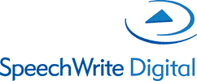

# 13 最佳听写和语音合成软件[2020 更新]

> 原文： [https://www.guru99.com/best-dictation-and-text-to-speech.html](https://www.guru99.com/best-dictation-and-text-to-speech.html)

语音识别是一种解码人类语音的计算机程序。 它以口语单词为输入并转换为文本。 文字转语音主要用于执行命令，操作小工具或在不使用任何输入设备的情况下进行书写。

以下是精选的最佳听写列表| 语音转文字| 语音识别工具，具有流行的功能和最新的网站链接。 该列表包含开源（免费）和商业（付费）软件。

### 1）龙自然说话

Dragon Naturally Speaking 允许您表达自己的声音来创建电子邮件，报告，表格等。 它是下一代语音引擎，可以在更短的时间内更快，更准确地转录语音。 该软件产品可用于 Windows 和 Mac 平台。

**功能**：

*   您可以随时随地完成文档。
*   强大的自定义功能可更有效地工作。
*   它使您能够在任何地方进行命令，然后将笔录转录到您的计算机。
*   只要您想完成任何长度的文件，请讲话。
*   易于创建基于表单的模板。

**链接**： [https://www.nuance.com/dragon/business-solutions/dragon-professional-individual.html](https://www.nuance.com/dragon/business-solutions/dragon-professional-individual.html)

* * *

### 2）融合语音

 

融合语音是将语音与 EMR（电子病历）集成在一起的语音识别软件。 它使您无需集成任何第三方应用程序即可识别文本。

**功能**：

*   该工具提供了灵活且功能强大的基于云的语音识别。
*   快速说明患者故事并编辑叙述。
*   无需任何界面即可将文档写入 EMR。
*   发送叙事进行编辑，无需任何培训。
*   它提供自动转录。
*   提供多语言支持。
*   融合语音使您能够分析语音。

**链接**： [https://www.dolbey.com/solutions/speech-recognition/](https://www.dolbey.com/solutions/speech-recognition/)

* * *

### 3）动词语音识别

 

Verbio 语音识别是专门开发的一种工具，可使用 DNN 模型将语音实时转换为文本，从而以自然的方式理解语音。 它是一种灵活的工具，可以在各种平台上进行部署。

**Features:**

*   该软件提供定制的语言模型，以及您的组织特定的语法和词汇。
*   它支持每个软件和硬件平台以及音频源以提取语音。
*   该工具使用 MRCP，Web 传统 C / C ++ API 或套接字提供集成支持。
*   您可以从对话数据中提取见解。
*   通过语音搜索，语音拨号，数字听写等为用户提供无摩擦的体验。
*   Verbio 语音识别可帮助您识别对话中的讲话者。

**下载链接**： [https://www.verbio.com/products/speech-recognition/](https://www.verbio.com/products/speech-recognition/)

* * *

### 4）Sonix

 

Sonix 软件应用程序可以转录，时间戳记和管理您的视频和音频文件，因此它们变得易于查找，编辑和共享。 它使您能够完善和审查成绩单。

**Features:**

*   您可以轻松地将视频和音频转换为文本。
*   视频和音频将同步到文本。 因此，您可以毫不费力地整理成绩单并与团队共享。
*   语音转文字工具可创建与传统​​服务相同的笔录。
*   安全上传媒体文件。
*   轻松快速查看和完善转录。
*   该工具可让您以多种文件格式下载最终成绩单。

**链接**： [https://sonix.ai/](https://sonix.ai/)

* * *

### 5）Google 文件

 

Google 文档的语音键入功能可以接受来自计算机麦克风的语音和文本命令。 使用此工具，您甚至可以暂停，发出命令并再次恢复。

**Features:**

*   您无需关闭麦克风即可纠正错误。
*   它允许使用诸如句点，逗号，感叹号，新段落，新行和问号之类的短语向文本添加标点符号。
*   语音输入时进行更改并格式化文档文件。

**链接**： [http://docs.google.com/](http://docs.google.com/)

* * *

### 6) Siri

 

Siri 是一种语音识别软件，可以随时随地为您拨打电话或发送短信。 它提供了主动建议，例如向您发消息通知您您开会迟到的人，这样您就可以轻松保持联系。

**Features:**

*   Siri 提供了一种更轻松的方式来执行所有任务，例如预览日历，设置闹钟，计时器以及提醒和指示。
*   该软件产品可以找到您想听的喜欢的歌曲。
*   您可以毫不费力地控制您的智能设备，检查其状态，甚至可以使用语音执行许多操作。
*   它可以快速检查事实，将短语翻译成另一种语言或进行计算。
*   帮助您查找照片和文件。
*   显示在锁定屏幕上的快捷方式，以便您可以快速访问它。
*   Siri 可以识别 21 种不同的语言。
*   它使您的信息保持私密性和安全性。

**链接**： [https://www.apple.com/siri/](https://www.apple.com/siri/)

* * *

### 7）Cortana

它允许您通过打开 Cortana 与 MSA 一起唱歌。 使用 Cortana，您可以同步一系列帐户，包括 LinkedIn，Office 365，Outlook.com 和 Wunderlist。

**Features:**

*   在笔记本上添加喜欢的美食和主题等内容，Cortana 将为您提供个性化的帮助和更新。
*   在需要时提供更快的帮助。
*   发送短信
*   根据您的位置获取提醒。

**链接**： [https://www.microsoft.com/zh-cn/cortana/gettingstarted?activetab=pivot1%3aprimaryr2](https://www.microsoft.com/en-us/cortana/gettingstarted?activetab=pivot1%3aprimaryr2)

* * *

### 8）M * Modal Fluency 手机

 

M * Modal Fluency Mobile 是转录的独特混合物，用于命令，编辑。 它会自动将患者的人口统计信息和时间表与 EMR（电子健康记录）同步。 该工具可帮助您上载时间表以简化患者选择。

**Features:**

*   该工具可确保获得最高质量的临床文档。
*   它提供了最高质量的临床文档。
*   它提供了简化的转录管理。

**链接**： [https://mmodal.com/products-services/fluency-for-transcription/](https://mmodal.com/products-services/fluency-for-transcription/)

* * *

### 9）渐强语音处理

 

Crescendo Speech 解决方案使您能够通过语音捕获详细信息。 它允许浏览表单和文档的各个部分。

**Features:**

*   您可以使用语音导航和控制自己喜欢的桌面应用程序。
*   创建您自己的文档，表格和电子邮件。
*   它使您可以查看和编辑文档。
*   控制和导航流行的客户关系系统。
*   将记录作为笔记发送给团队，而不是语音记录
*   所有数据都存储在您的服务器上，以便您可以保护所有机密信息的安全。
*   它可以过滤嘈杂的声音并产生准确的文本。

**链接**： [https://www.crescendosystems.co.uk/speech-recognition/](https://www.crescendosystems.co.uk/speech-recognition/)

* * *

### 10）SpeechWrite 360

 

SpeechWrite 360​​是一种在线语音识别解决方案，旨在满足敏捷和灵活的工作需求。 它提供了一个灵活而安全的云计算环境。

**Features:**

*   听写，审阅，对文档进行更改并随时进行批准。
*   它使您能够从任何设备进行命令，实时发送，对文档进行电子签名，跟踪和进行更改。
*   使用此软件，您可以访问实时数据以改善项目工作流程。
*   直接集成到您现有的应用程序中。

**链接**： [https://www.speechwrite.com/speechwrite-360/](https://www.speechwrite.com/speechwrite-360/)

* * *

### 11）快乐记

 

Happyscribe 是一款接受各种音频和视频格式的软件，可将口语单词转录为文本。 该工具支持 200 多种语言。

**功能**：

*   它确定说话者。
*   突出显示&对重要句子的评论。
*   在文本中添加要转录的时间戳记。
*   您可以导出 Word，SRT，TXT，STL，VTT AVID 和 HTML 中的成绩单。
*   与他人共享最终成绩单的仅查看页面。

**链接**： [https://www.happyscribe.co/](https://www.happyscribe.co/)

* * *

### 12）云语音到文本

 

语音到文本由机器学习提供支持，可用于短格式或长格式音频。 它使程序员可以通过易于使用的 API 应用强大的网络模型，将音频转换为文本。

**Features:**

*   识别 120 种语言和变体。
*   它为长格式音频或短格式音频实时提供文本转录。
*   该工具会自动转录特定于上下文的格式和专有名词。
*   自动识别口语。
*   您可以通过指定 5,000 个以上的字词或词组为您的业务自定义语音识别。
*   它支持实时流或预录音频
*   您可以过滤特定语言的文本结果中不适当的内容。
*   它允许您选择语音命令，电话和视频转录。

**链接**： [https://cloud.google.com/speech-to-text/](https://cloud.google.com/speech-to-text/)

* * *

### 13）Zubtitle

 

Zubtitle 是一个视频字幕应用程序，可通过向视频添加字幕来帮助您增加视频的覆盖范围。 使用此应用程序，您可以轻松地将字幕添加到视频中。

**Features:**

*   该工具会在视频中转录您的声音并将其转换为字幕。
*   您不需要编辑任何视频。
*   您可以下载.txt & .srt 转录文件。
*   它使您可以从多种字体和标题样式中进行选择。

**链接**： [https://zubtitle.com/](https://zubtitle.com/)