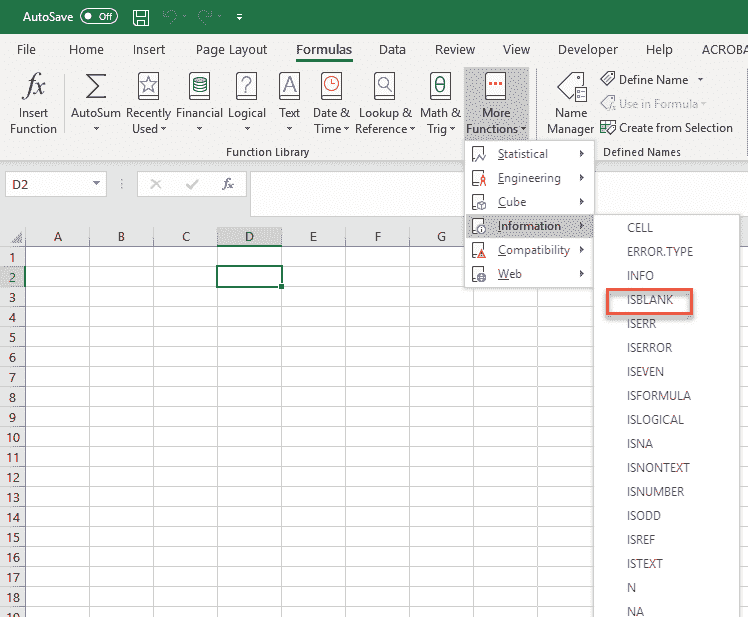
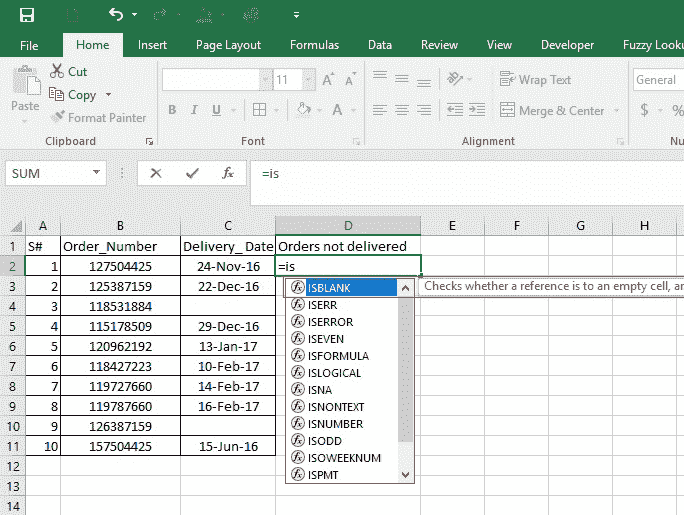
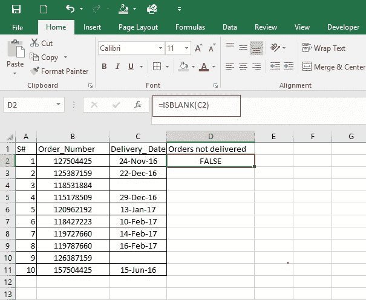
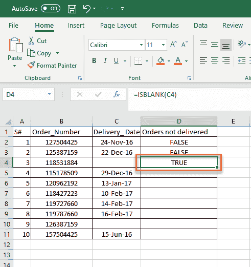
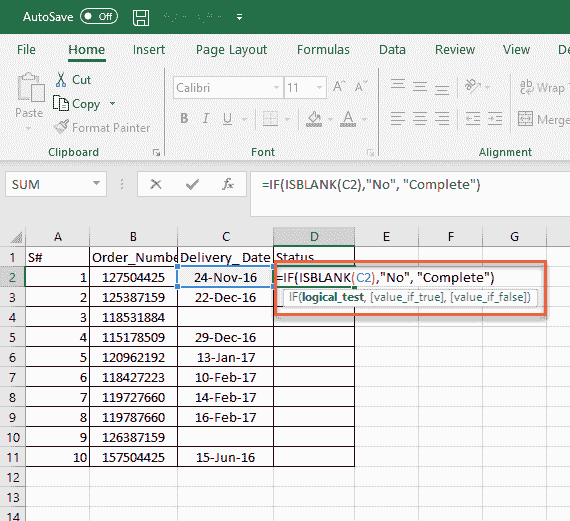
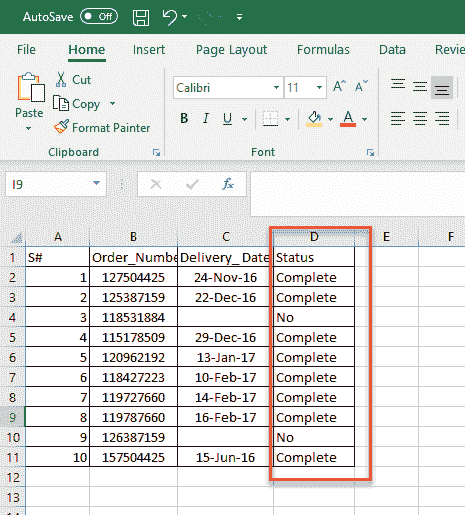
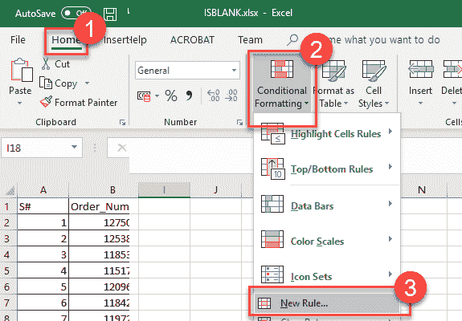
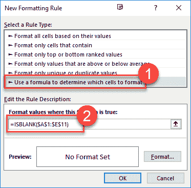
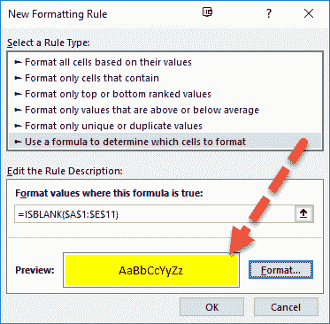
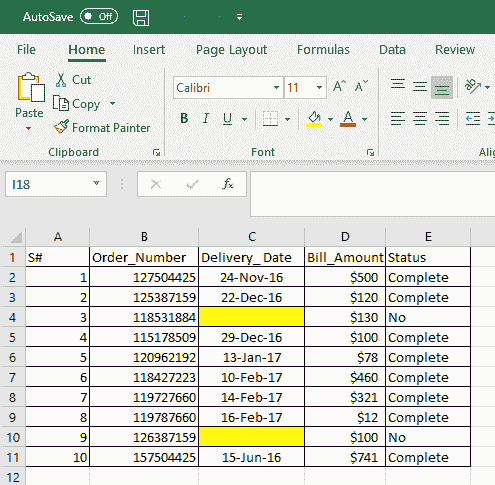

# Excel ISBLANK 功能：通过示例学习

> 原文： [https://www.guru99.com/excel-isblank-function.html](https://www.guru99.com/excel-isblank-function.html)

#### 什么是 ISBLANK 功能？

ISBLANK 函数用于检查单元格是否为空。 由于这是一个信息函数，因此始终返回布尔值 true 或 false。 如果单元格包含一个值，它将返回 false，如果它不为空，则返回 true。

Excel 中的 ISBLANK 功能归类为信息功能。 信息功能有助于根据其结果做出决定。 您可能会遇到想要在 Excel 单元格中找到空白单元格的情况。



在本教程中，您将学习：

*   [如何使用 ISBLANK 功能？](#1)
*   [示例 1 如何使用 ISBLANK？](#2)
*   [示例 2：如何将 ISBLANK 与不同的 excel 函数一起使用？](#3)
*   [示例 3：如何在条件格式中使用 ISBLANK 函数？](#4)

## 如何使用 ISBLANK 功能？

在大范围的单元格中，当您要查找空白单元格时，ISBLANK 函数是更好的选择。

它还与 Excel 中的其他功能和某些格式化方法一起使用。

**ISBLANK 函数**的公式

这是 excel 中的一个简单函数，格式为。

```
=ISBLANK(Value)

```

其中 Value 可以是单元格引用

## 示例 1 如何使用 ISBLANK？

在以下 excel 中，给出了某些订单的状态。 给出了订单号及其交货日期。 让我们找到尚未交付的订单。

| S＃ | 订单号 | 邮寄日期 |
| --- | --- | --- |
| 1 | 127504425 | 2016 年 11 月 24 日 |
| 2 | 125387159 | 2016 年 12 月 22 日 |
| 3 | 118531884 | 
 |
| 4 | 115178509 | 2016 年 12 月 29 日 |
| 5 | 120962192 | 2017 年 1 月 13 日 |
| 6 | 118427223 | 2017 年 2 月 10 日 |
| 7 | 119727660 | 17 年 2 月 14 日 |
| 8 | 119787660 | 17 年 2 月 16 日 |
| 9 | 126387159 | 
 |
| 10 | 157504425 | 15-Jun-16 |

在这里，您可以考虑未标记交货日期的订单可以视为尚未交货。 因此可以应用公式 ISBLANK 在 delivery_date 列中查找空白单元格。



值的格式为'= ISBLANK（value）'，您可以选择与每个订单号相对应的列交货日期。

因此，公式将如公式栏中给出的公式为[ **ISBLANK（C2）**'，其中 C2 表示第一笔订单的交货日期。



自给出交货日期以来返回为“ FALSE”的值，这是一个非空单元格。 您对其余单元格应用相同的公式。 对于订单'118531884'，没有给出交货日期，并且公式将结果返回为'TRUE'。



为了找到未交付的订单，将公式应用于每个单元格。 对于订单'118531884，126387159'，交货日期未指定，为空单元格。 因此，ISBLANK 函数返回 true。 正确的交货日期是尚未交货的订单。


## 示例 2：如何将 ISBLANK 与不同的 excel 函数一起使用？

在上面的示例中，ISBLANK 函数的结果为 TRUE 或 FALSE。 下面的数据提供了订单号和交货日期。 在状态列中，您要获得已交付订单的结果为“完成”，而未交付结果为“否”。

| S# | Order_Number | Delivery_ Date | 状态 |
| --- | --- | --- | --- |
| 1 | 127504425 | 24-Nov-16 | 
 |
| 2 | 125387159 | 22-Dec-16 | 
 |
| 3 | 118531884 | 
 | 
 |
| 4 | 115178509 | 29-Dec-16 | 
 |
| 5 | 120962192 | 13-Jan-17 | 
 |
| 6 | 118427223 | 10-Feb-17 | 
 |
| 7 | 119727660 | 14-Feb-17 | 
 |
| 8 | 119787660 | 16-Feb-17 | 
 |
| 9 | 126387159 | 
 | 
 |
| 10 | 157504425 | 15-Jun-16 | 
 |

为了以您想要的方式获得结果，必须与 ISBLANK 一起使用其他功能。 IF 函数与 ISBLANK 一起使用，可以根据两个不同的条件得出结果。 如果该单元格为空，则将返回“否”，否则返回“完成”。



应用的公式是

```
=IF(ISBLANK(C2), "No", "Complete")

```

这里，

*   ISBLANK 函数将检查交货日期的单元格，并根据该值得出 true 或 false。
*   此 True / False 馈送到 IF 函数，如果该单元格为空，则返回“否”，如果存在值，则返回“ Complete”。

这是完整的输出



将公式应用于每个订单的状态后，将获得已交付但尚未交付的订单。 此处两个订单未完成，其余交货已交付。

## 示例 3：如何在条件格式中使用 ISBLANK 函数？

ISBLANK 函数可以与条件格式相关联，以查找空白单元格并相应地格式化单元格。

**步骤 1）**考虑以下数据集，该数据集由数据订单号，票据金额，交货状态组成。 并且您要突出显示尚未完成交货的账单金额。

| S# | Order_Number | Delivery_ Date | 帐单金额 | Status |
| --- | --- | --- | --- | --- |
| 1 | 127504425 | 24-Nov-16 | $500 | 完成 |
| 2 | 125387159 | 22-Dec-16 | $120 | Complete |
| 3 | 118531884 | 
 | $130 | 没有 |
| 4 | 115178509 | 29-Dec-16 | $100 | Complete |
| 5 | 120962192 | 13-Jan-17 | $78 | Complete |
| 6 | 118427223 | 10-Feb-17 | $460 | Complete |
| 7 | 119727660 | 14-Feb-17 | $321 | Complete |
| 8 | 119787660 | 16-Feb-17 | $12 | Complete |
| 9 | 126387159 | 
 | $100 | No |
| 10 | 157504425 | 15-Jun-16 | $741 | Complete |

**步骤 2）S** 选择整个数据，并从主菜单应用条件格式。 主页->条件格式->新规则



**步骤 3）**

选择选项“使用公式来确定要格式化的单元格”。 这将允许您为一系列单元格插入公式。

在空格内输入公式'= ISBLANK（$ A $ 1：$ E $ 11）'。



**步骤 4）**从格式按钮中选择要应用于单元格的格式。

1.  通过单击格式按钮，您将获得一个对话框，以选择应用公式的单元格的格式。
2.  在这里，选择填充选项以突出显示条件匹配的公式应用的单元格。
3.  选择要显示的颜色
4.  点击“确定”按钮。


**步骤 5）**格式将出现在预览中，单击“确定”按钮以应用。



**步骤 6）**应用带有条件格式的 ISBLANK 公式后，它将高亮显示空白单元格。 由于范围值在这里不起作用，因此您必须对整个列应用相同的规则才能获得如下结果。



[下载本教程中使用的 Excel](https://drive.google.com/uc?export=download&id=1NvFPR0bfH1Dt4rvzGTBel-qbu98g5IPx)

### 摘要

*   ISBLANK 函数将返回 true 或 false 值。 True 表示该单元格为空白。
*   ISBLANK 函数可用于条件格式以及其他 Excel 函数。
*   一种在大型数据集中查找空白单元格的简便方法。
*   单元格范围不适用于 ISBLANK。