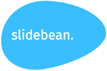
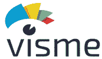
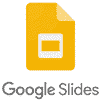
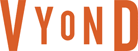
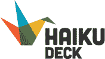
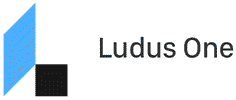
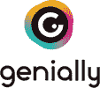
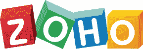

# 2020 年 18 种最佳 PowerPoint 替代品

> 原文： [https://www.guru99.com/powerpoint-alternative.html](https://www.guru99.com/powerpoint-alternative.html)

PowerPoint is a presentation software managed by Microsoft. This software helps you to creates a slide show of important information. However, PowerPoint has some limitations, like the inability to represent the complexity of some topics and limited built-in infographs.

Here, is a curated list of top tools that are capable of replacing PowerPoint. This list includes commercial as well as open-source presentation tools with popular features.

### 1） [Slidebean](https://slidebean.com/kge2yja7?ref=krishnarungta3)

[Slidebean](https://slidebean.com/kge2yja7?ref=krishnarungta3) 是一款可帮助您创建外观专业的幻灯片的软件。 该软件允许您使用人工智能在几秒钟内设计演示文稿。

**功能：**

*   模板设计的排列方式可以提高美观性和可读性。
*   它会自动识别图像中的重要元素并正确对齐
*   该工具会自动评估大量幻灯片，以找到理想的幻灯片。

* * *

### 2） [Visme](http://bit.ly/2U7LoAN)

[Visme](http://bit.ly/2U7LoAN) 是一个工具，可以帮助您以图表，演示文稿和其他视觉内容的形式共享强大的视觉故事。

**功能：**

*   向任何对象添加图表，地图，视频，音频链接和交互性，以创建引人入胜的报告，演示文稿和信息图表。
*   它提供了 100 多种资产，例如字体，质量图标和图像。
*   该工具允许您录制语音。
*   它具有隐私控制功能，可帮助您将内容设为私有，公开或受密码保护。
*   您可以在线发布演示文稿，也可以下载以供离线使用。

* * *

### 3）Prezi

Prezi 是一个具有设计器模板，数百万个可重复使用的演示文稿以及 PowerPoint 到 Prezi 转换器的工具。

**Features:**

*   它包含大量自定义的图形，图表和布局，可让您快速创建自己的演示文稿。
*   快速产生影响
*   您可以在进行演示时与团队合作。

**链接：** [https://prezi.com/](https://prezi.com/)

* * *

### 4） [DesignCap](https://bit.ly/2YeqXWn)

[DesignCap](https://bit.ly/2YeqXWn) 是基于网络的工具，用于创建在线演示。 它允许任何人以相当简单的方式创建具有专业外观的演示文稿，而无需技术技能。

**Features:**

*   它提供了数千个针对不同主题的专业设计模板。
*   超过一百万个图片和图标。
*   许多资产，例如字体，图表，预设文本字体，模块和背景图像。
*   您可以在演示文稿中嵌入图表样式，例如柱形图，折线图，表格，条形图，动态地图等。
*   可以自由调整对象的颜色，大小，位置，并使用其他方便的功能，例如分组/取消分组，图像编辑工具等。
*   多种保存和共享选项，可在线和离线共享设计。

* * *

### 5）Google 幻灯片

 

Google 幻灯片是 Google 开发的演示文稿应用程序。 它启用了编辑之间的实时协作，并提供了许多共享演示文稿的选项。

**Features:**

*   Google 幻灯片提供了数百种字体，嵌入式视频，演示主题，动画等。
*   您可以从各种各样的作品集，音高和其他预制的演示文稿中进行选择。
*   它使团队可以在同一演示文稿中工作。
*   您可以随时随地获取演示文稿并进行编辑。

**链接：** [https://www.google.co.uk/slides/about/](https://www.google.co.uk/slides/about/)

* * *

### 6）苹果主题演讲

Apple Keynote 易于创建令人难忘的演示文稿。 您可以在任何 iPad 上使用 Apple Pencil 来创建图表或插图。

**Features:**

*   它提供了实时协作，因此您可以与团队合作，无论他们在 iPhone 或 iPad，Mac 上还是在 PC 上。
*   您可以从 30 多个醒目的主题中进行选择。
*   您可以使用 iPhone 扫描文档或照片，然后可以在 Mac 上的 Keynote 中立即看到它。
*   您可以将幻灯片与画廊，照片，图表，数学方程式和 700 多种可自定义的形状一起使用。
*   在 iPad 或 iPhone 上使用手指或 Apple Pencil 使用路径对对象进行动画处理。

**链接：** [https://www.apple.com/in/keynote/](https://www.apple.com/in/keynote/)

* * *

### 7） [Canva](https://bit.ly/39UhOW8)

[Canva](https://bit.ly/39UhOW8) 是一款免费的演示应用程序，可让您吸引观众。 它包含的设计可以帮助您有效地表达自己的想法； 因此，您可以提高自己成为沟通者的能力。

**Features:**

*   您可以在感兴趣的任何主题上访问数百种经过专业设计的布局。
*   它使您可以针对学校或工作自定义演示文稿。
*   它具有语音气泡制作器，您可以在任何照片上添加。
*   使用 Canva 的透明度工具淡化任何照片。

* * *

### 8）Enaze

Emaze 是一个免费的在线应用程序，可通过社交媒体或电子邮件创建和共享演示文稿。 它使您可以将演示文稿变成故事。

**Features:**

*   您可以与您的团队合作，将演示文稿下载为 HTML，MP4 和 PDF，然后在世界任何地方进行远程演示。
*   它使您可以从数百个 2D 和 3D 演示模板中进行选择。
*   编写和编辑文本，添加视频，照片，实时网页，gif 图像，自定义效果，企业品牌等等。

**链接：** [https://www.emaze.com/](https://www.emaze.com/)

* * *

### 9）wt

Powtoon 是一个动画演示文稿应用程序，它允许用户创建解释器视频或演示文稿的故事。

**Features:**

*   Powtoon 与配音效果很好，可以帮助您将出色的脚本与出色的动画角色集成在一起。
*   您可以在线访问此工具，并在几分钟内创建动态演示文稿。
*   该工具的模板易于浏览，并为演示文稿添加了视觉元素。

**链接：** [https://www.powtoon.com/index/](https://www.powtoon.com/index/)

* * *

### 10）超越：

Vyond 是一个在线程序，可以通过将视频添加到 PowerPoint 中来帮助市场营销专业人员进行引人入胜的演示。

**Features:**

*   您可以下载视频文件，以便即使在互联网连接较弱的情况下也可以在演示过程中快速播放它。
*   您可以在演示文稿中导入 GIF，视觉效果，运动和声音。
*   借助 Vyond，您可以创建角色驱动的故事或引人注目的数据可视化来吸引观众。

**链接：** [https://www.vyond.com/](https://www.vyond.com/)

* * *

### 11）FlowVella

 

FlowVella 是一款用于移动设备的应用程序，可让您的演示文稿具有交互性。 您可以组合文字，图像，视频，画廊，链接和 PDF 文件，以将故事转换为交互式对话。

**Features:**

*   使用 FlowVella，您可以随时随地工作。 iPad，iPhone 或 Mac。
*   您可以在没有互联网连接的情况下创建演示文稿。
*   它允许您包括 PDF 文档，视频和图像。
*   该工具允许您创建可共享的自定义 URL。
*   查看谁查看了您的演示文稿。

**链接：** [https://flowvella.com/](https://flowvella.com/)

* * *

### 12）幻灯片：

Glisser 可以将演示文稿中的幻灯片即时分享到您的设备，然后利用受众互动来获得代表体验，并提供强大的事件分析功能。

**Features:**

*   它使您能够吸引您的听众来创建最难忘的对话。
*   您可以实时向观众共享幻灯片。
*   它使用 ISO 27001 级安全性作为标准。
*   Glisser 允许您创建测验问题

**链接：** [https://www.glisser.com/](https://www.glisser.com/)

* * *

### 13）Haikudeck

Haiku Deck 提供了一种在 iPad，Web 或 iPhone 上进行演示的简单方法。 它通过帮助学生简化其信息并清楚地呈现数据来鼓励最佳的呈现方式。

**Features:**

*   您可以选择时尚的布局，字体和图像过滤器，而无需向图形设计师支付任何费用。
*   您可以访问超过 4000 万张免费的创用 CC 图片。
*   您的演示文稿位于云中，因此您可以与与其连接的任何设备共享。

**链接：** [https://www.haikudeck.com/](https://www.haikudeck.com/)

* * *

### 14) Beautiful.ai

Beautiful.ai 是用于在几分钟内建立更好的演示文稿的工具。 您只需要考虑一个主意，选择一个模板，然后高效而精美地工作即可。

**Features:**

*   它可以帮助您创建漂亮的建议和建议
*   添加内容和幻灯片会自动调整它们。
*   它提供了数百万个免费的图标和照片。

**链接：** [https://www.beautiful.ai/](https://www.beautiful.ai/)

* * *

### 15）吕德斯

Ludus 是面向创意专业人士的演示文稿应用程序。 它允许您以一种真正的协作方式来构建演示文稿。 它还允许您导出 PDF / HTML 文件。

*   它提供了颜色选择器来选择颜色。
*   Ludus 提供了一个准则，以便您可以将对象放置在正确的位置。
*   与他人建立并分享想法。
*   它支持 SVG，JPG，GIF 和 PNG 图像。
*   您可以将字体上传到 Ludus。
*   您可以从剪贴板粘贴 URL，以嵌入第三方内容。
*   它使您能够集成第三方内容，例如 YouTube 或 Vimeo 视频。

**链接：** [https://ludus.one/](https://ludus.one/)

* * *

### 16）亲切地

 

Genially 是一个用于创建演示文稿，信息图表，CVS，视频演示文稿，测验，电子海报，卷宗等的工具。使用此工具，任何人都可以创建令人难以置信的视觉故事，以产生更好的交流体验。

**Features:**

*   该工具可创建交互式视觉体验，从而提高交流技巧。
*   您可以在演示文稿中添加动画和交互式创作。
*   它可以帮助您分析如何实时使用您的作品。

**链接：** [https://www.genial.ly/en](https://www.genial.ly/en)

* * *

### 17）Libre Office 印象深刻：

 

LibreOffice Impress 允许您创建专业的幻灯片显示，其中包括图形对象，图表，多媒体，文本和各种其他项目。

**Features:**

*   LibreOffice 提供了使用多种模式创建和编辑幻灯片的多功能性：正常，大纲和注释。
*   您可以从文本中添加精美的 2D 和 3D 图像。
*   它使您可以管理幻灯片的显示顺序。
*   您可以从 LibreOffice 模板存储库下载各种 ng 模板。

**链接：** [https://www.libreoffice.org/discover/impress/](https://www.libreoffice.org/discover/impress/)

* * *

### 18）Renderforest：

Renderforest 是免费使用在线工具来创建视频演示文稿的。 它具有各种各样的演示模板，包括从解释器动画到白板演示的各种样式。

**Features:**

*   它有超过 50.000+个独特的视频场景可供选择。
*   您可以轻松地解释您的业务或教育理念。
*   无需任何技术即可在浏览器中创建演示文稿。
*   使用首选徽标，图像，文本和调色板在线编辑视频。
*   通过选择喜欢的音乐曲目并立即下载视频，帮助您完成视频的定稿。

**链接：** [https://www.renderforest.com/](https://www.renderforest.com/)

* * *

### 19）Zoho 表演

该工具使您可以创建，协作，广播和发布演示文稿。 您可以为表演提供稳定的 URL，并通过保持质量来与世界分享您的幻灯片。

**Features:**

*   该工具具有简洁的设计，可帮助您突出故事。
*   它具有 20 多个主题和 100 种字体。
*   您可以使用形状，格式化的文本框，图表和表格之类的工具直观地管理和增强数据。
*   您可以将笔触添加到文本，用任何颜色填充标题或关键点，甚至添加反射。
*   选择预定义的布局以从模板中插入图表。

**链接：** [https://www.zoho.com/show/](https://www.zoho.com/show/)

### 常问问题

**💻 1) Is there a free alternative to PowerPoint?**

以下是 PowerPoint 的 5 大免费替代品：

*   滑豆
*   维斯美
*   普雷齐
*   Google 幻灯片
*   苹果主题演讲

**⚡2）我怎样才能使我的演示文稿更好？**

以下是可帮助您改善演示文稿的几点：

*   您的演示文稿不应包含超过 10 张幻灯片。
*   演示最多应持续 20 分钟
*   请勿使用小于 30 的字体。
*   表现出您的热情并关注观众的需求。

**💻 1) Is there a free alternative to PowerPoint?**

Following are top 5 free alternatives to PowerPoint:

*   滑豆
*   维斯美
*   普雷齐
*   Google 幻灯片
*   苹果主题演讲

Following are top 5 free alternatives to PowerPoint:

*   滑豆
*   维斯美
*   普雷齐
*   Google 幻灯片
*   苹果主题演讲

Following are top 5 free alternatives to PowerPoint:

*   滑豆
*   维斯美
*   普雷齐
*   Google 幻灯片
*   苹果主题演讲

**⚡ 2) How can I make my presentation better?**

Following are points which helps you to make your presentation better:

*   您的演示文稿不应包含超过 10 张幻灯片。
*   演示最多应持续 20 分钟
*   请勿使用小于 30 的字体。
*   表现出您的热情并关注观众的需求。

Following are points which helps you to make your presentation better:

*   您的演示文稿不应包含超过 10 张幻灯片。
*   演示最多应持续 20 分钟
*   请勿使用小于 30 的字体。
*   表现出您的热情并关注观众的需求。

Following are points which helps you to make your presentation better:

*   您的演示文稿不应包含超过 10 张幻灯片。
*   演示最多应持续 20 分钟
*   请勿使用小于 30 的字体。
*   表现出您的热情并关注观众的需求。