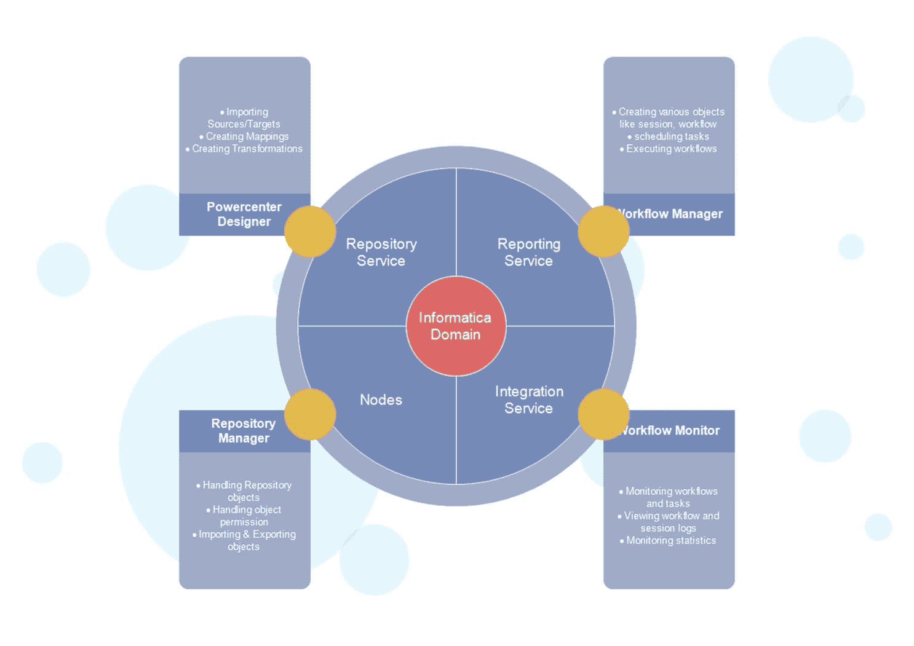
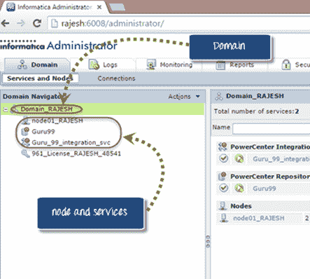
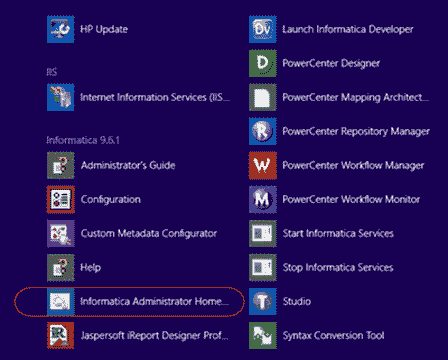
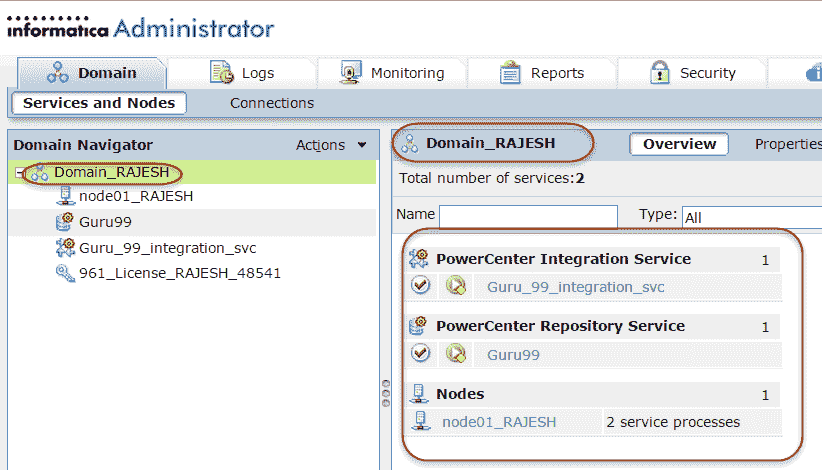
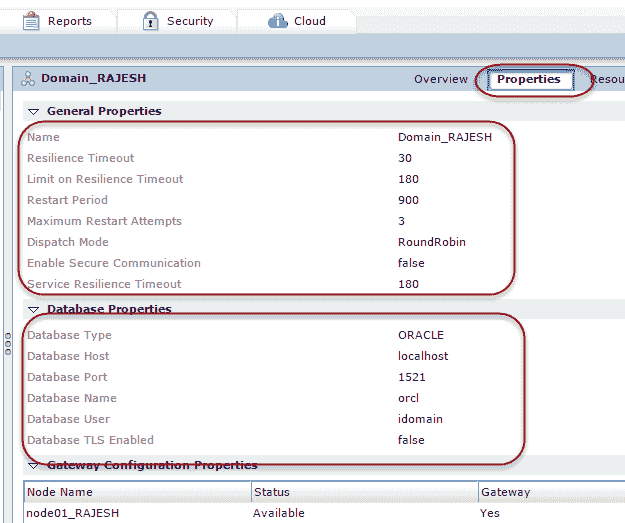
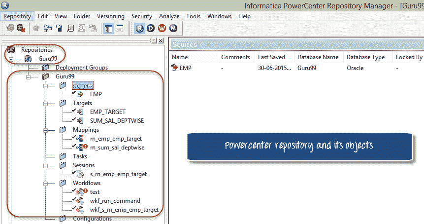

# Informatica 体系结构教程

> 原文： [https://www.guru99.com/informatica-architecture-tutorial.html](https://www.guru99.com/informatica-architecture-tutorial.html)

Informatica ETL 工具包含以下服务&组件

1.  存储库服务–负责维护 Informatica 元数据&，以提供对其他服务的访问权限。
2.  集成服务–负责将数据从源移动到目标
3.  报告服务-启用报告生成
4.  节点–执行上述服务的计算平台

5.  Informatica Designer-用于创建源和目标之间的映射
6.  工作流管理器–用于创建工作流和其他执行任务&
7.  工作流监视器–用于监视工作流的执行
8.  资源库管理器–用于管理资源库中的对象

在本教程中，您将学习

*   [Informatica 域](#1)
*   [PowerCenter 存储库](#2)
*   [域配置](#3)
*   [域](#4)的属性
*   [Powercenter 客户端&服务器连接](#5)
*   [储存库服务](#6)
*   [集成服务](#7)
*   [来源&目标](#8)

## Informatica 域

Informatica 的总体体系结构是面向服务的体系结构（SOA）。

*   Informatica 域是 Informatica 工具中的基本管理单位。
*   它是节点和服务的集合。 此外，可以根据管理要求将此节点和服务分类为文件夹和子文件夹。

例如，在下面的屏幕快照中，您可以在域窗口下看到文件夹“ Domain_Rajesh”已创建，在该文件夹下我们创建了节点名称“ node01_rajesh”，并将服务称为“ guru99 集成服务”。

节点是域内机器的逻辑表示。 **需要节点才能运行 Informatica 的服务和进程。**

一个域中可以有多个节点。 在域中，您还将找到一个网关节点。

网关节点负责接收来自不同客户端工具的请求，并将这些请求路由到不同的节点和服务。

域中有两种服务

*   **服务管理器**：服务管理器管理域操作，例如身份验证，授权和日志记录。 它还在节点上运行应用程序服务，并管理用户和组。

*   **应用程序服务**：应用程序服务代表特定于服务器的服务，例如集成服务，存储库服务和报告服务。 这些服务根据配置在不同的节点上运行。

## PowerCenter 存储库

PowerCenter 存储库是一个关系数据库，例如 Oracle，Sybase， [SQL](/sql.html) 服务器，并且由存储库服务管理。 它由存储元数据的数据库表组成。

Informatica Powercenter 中提供了三种 Informatica Client 工具。 他们是 Informatica

*   设计器
*   工作流程监控器
*   工作流程管理器

这些客户端只能使用存储库服务访问存储库。

为了管理存储库，存在一个名为 Repository Service 的 Informatica 服务。 单个存储库服务仅处理一个存储库。 此外，存储库服务可以在多个节点上执行以提高性能。

存储库服务使用对象上的锁，因此多个用户无法同时修改同一对象。

您可以在存储库中启用版本控制。 使用版本控制功能，您可以维护同一对象的不同版本。

在存储库中创建的对象可以具有以下三种状态

*   **有效**：有效对象是根据 Informatica 语法正确的那些对象。 这些对象可用于工作流程的执行中。
*   **无效**：无效的对象是那些不遵守指定标准或规则的对象。 将任何对象保存在 Informatica 中时，将检查其语法和属性是否有效，并相应地用状态标记该对象。
*   **受影响的**：受影响的对象是那些子对象无效的对象。 例如，在映射中，如果您正在使用可重用的转换，并且此转换对象变得无效，则该映射将被标记为受影响。

## 域配置

如前所述，域是 Informatica 中的基本管理控制。 它是父实体，由其他服务（例如集成服务，存储库服务和各种节点）组成。

可以使用 Informatica 管理控制台完成域配置。 可以使用 Web 浏览器启动控制台。

在网络浏览器中打开后，它会提示管理员登录。 在 Informatica 安装期间设置密码。

登录到 Informatica 域后，主页看起来像这样。

在左窗格中，它显示了域下的现有节点，存储库服务，集成服务。

在主窗口上，它显示那些服务的状态，无论它们是启动还是关闭。

## 域的属性

单击管理页面中的属性菜单，以查看域的属性。

域的关键属性是

弹性超时–如果任何集成服务或存储库服务出现故障，则弹性超时是应用程序服务尝试连接到那些服务的秒数。

重新启动时间–这是域重新启动服务所花费的最大秒数。

分派模式–这是负载均衡器用来将任务分派到各个节点的策略。

数据库类型–在其上配置域的数据库的类型。

数据库主机–在其上配置域的计算机的主机名。

数据库端口&名称–这是域的数据库端口和数据库实例名称。

这些属性可以根据需要进行修改。

## Powercenter 客户端&服务器连接

PowerCenter 客户端工具是安装在客户端计算机上的开发工具。 Powercenter Designer，工作流管理器，存储库管理器和工作流监视器是主要的客户端工具。

我们在这些客户端工具中创建的映射和对象保存在 Informatica 服务器上的 Informatica 存储库中。 因此，客户端工具必须与服务器具有网络连接。

另一方面，PowerCenter 客户端连接到源和目标，以导入元数据和源/目标结构定义。 因此，它还必须具有与源/目标系统的连接性。

*   要连接到集成服务和存储库服务，PowerCenter 客户端使用 TCP / IP 协议和
*   要连接到源/目标，PowerCenter 客户端使用 ODBC 驱动程序。

## 储存库服务

存储库服务维护从 Powercenter 客户端到 PowerCenter 存储库的连接。 这是一个单独的多线程过程，它在存储库内部获取，插入和更新元数据。 它还负责维护存储库元数据内部的一致性。

## 集成服务

集成服务是 Informatica 的执行引擎，换句话说，这是执行我们在 Informatica 中创建的任务的实体。 这是这样的

*   用户执行工作流程
*   Informatica 指示集成服务执行工作流程
*   集成服务从存储库中读取工作流详细信息
*   集成服务开始执行工作流内部的任务
*   执行完成后，任务状态将更新，即失败，成功或中止。
*   执行完成后，将生成会话日志和工作流日志。
*   该服务负责将数据加载到目标系统中
*   集成服务还合并了来自不同来源的数据

例如，它可以合并来自 oracle 表和平面文件源的数据。

因此，总而言之，Informatica 集成服务是驻留在 Informatica 服务器上的一个过程，等待分配要执行的任务。 当我们执行工作流程时，集成服务会收到执行该工作流程的通知。 然后，集成服务读取工作流以了解详细信息，例如必须在什么时间执行诸如映射&之类的任务。 然后，该服务从存储库中读取任务详细信息并继续执行。

## 来源&目标

Informatica 是 ETL 和数据集成工具，您将始终在处理和转换某种形式的数据。 Informatica 中映射的输入称为源系统。 我们从源导入源定义，然后连接到源定义以在映射中获取源数据。 可以有不同类型的源，并且可以位于多个位置。 根据您的要求，目标系统可以是关系或平面文件系统。 平面文件目标是在 Informatica 服务器计算机上生成的，以后可以使用 ftp 进行传输。

**关系式** –这些类型的源是数据库系统表。 这些数据库系统通常由创建和维护此数据的其他应用程序拥有。 它可以是客户关系管理数据库，人力资源数据库等。在 Informatica 中使用此类资源，我们可以获取这些数据集的副本，也可以在这些系统上获得选择特权。

**平面文件-**平面文件是 Informatica 中关系数据库之后最常见的数据源。 平面文件可以是逗号分隔的文件，制表符分隔的文件或固定宽度的文件。 Informatica 支持任何代码页，例如 ascii 或 Unicode。 要在 Informatica 中使用平面文件，必须像导入关系表一样导入其定义。