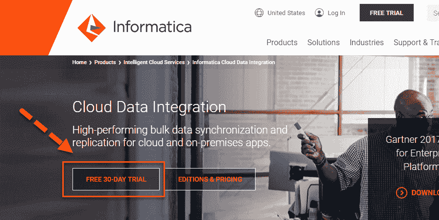
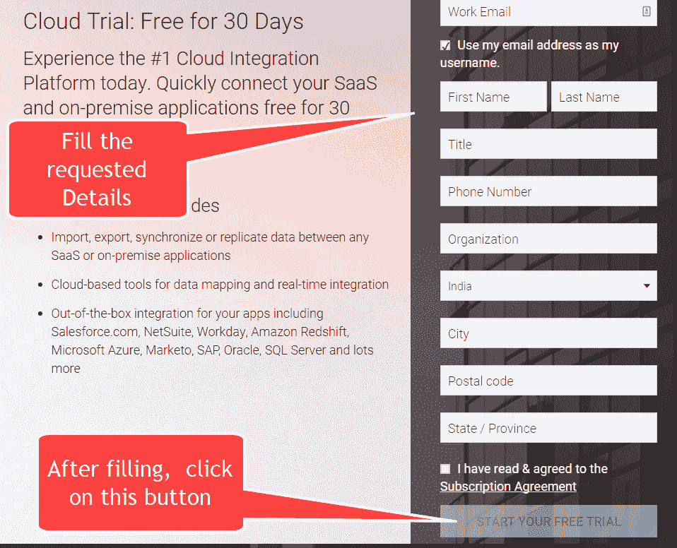
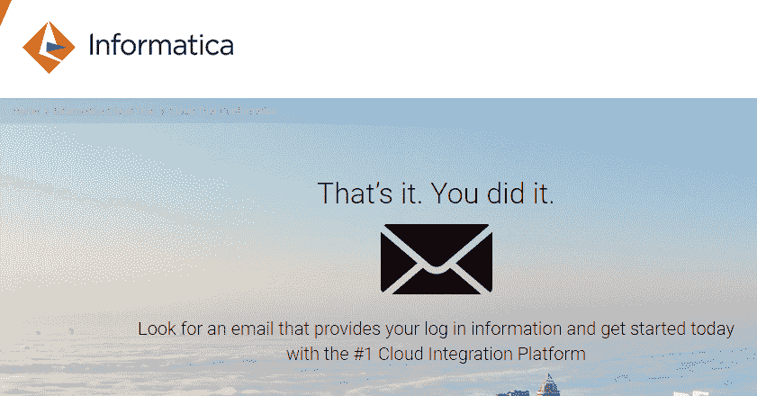
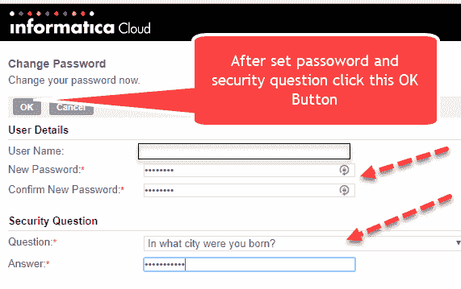
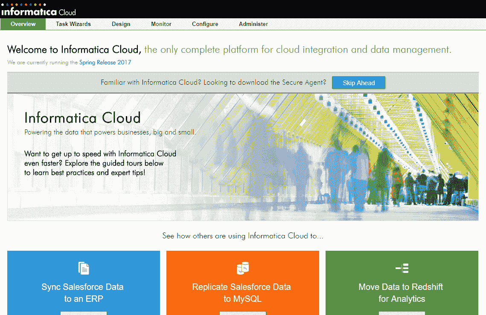

# 如何下载&安装 Informatica PowerCenter

> 原文： [https://www.guru99.com/install-informatica-powercenter.html](https://www.guru99.com/install-informatica-powercenter.html)

信息是用于大型和大型市场业务的强大数据集成 ETL 工具。

要下载并安装 Informatica，必须在处访问给定[的链接。](https://marketplace.informatica.com/solutions/pcexpress)

**注意**： Informatica 最近已停止分发 PowerCenter。 您可以在此处注册 Informatica Cloud [的 30 天试用版。](https://www.informatica.com/products/cloud-integration/cloud-data-integration.html)

**PowerCenter Express ETL**

PowerCenter Express 是 Informatica 的市场领先的数据集成（ETL 工具）和适合较小项目的适当大小的在线数据配置文件。

## 如何注册 Informatica Cloud PowerExpress

**步骤 1）**打开[链接](https://www.informatica.com/products/cloud-integration/cloud-data-integration.html#fbid=Nc5iwMLwZRI)，然后点击 30 天免费试用版

**步骤 2）**填写所需的详细信息，然后单击“启动 30 天免费试用”

**步骤 3）**您将获得如下确认页面。 打开您的电子邮件帐户，然后单击确认链接。

**步骤 4）**单击确认 URL 时，要求您设置**密码**和**一个安全问题。** 输入数据后，单击“确定”。

**步骤 5）**您现在位于 **Informatica Cloud** 中，可用于进一步练习。

**Informatica 版本历史记录**

*   Informatica Powercenter 4.1
*   Informatica Powercenter 5.1
*   Powercenter Informatica 6.1.2
*   Informatica Powercenter 7.1.2
*   Informatica Powercenter 8.1
*   Informatica Powercenter 8.5
*   计算中心 8.6
*   Informatica Powercenter 9.1
*   计算中心 10

随着新的 Powercenter 云版本，以上所有版本都已过时。 如果您需要安装 Informatica 桌面版本的步骤，请联系。