# 如何在 Informatica 中配置客户端和存储库

> 原文： [https://www.guru99.com/configure-clients-and-repositories-informatica.html](https://www.guru99.com/configure-clients-and-repositories-informatica.html)

安装 Informatica 服务器和客户端后，需要配置 Informatica 服务器。

Informatica 体系结构是面向服务的体系结构（SOA）。 因此，在使用 Informatica 工具之前，需要先安装和配置服务器和客户端组件。

配置客户端，集成服务和存储库服务的先决条件。

*   应安装 Informatica 服务器和客户端。
*   Informatica 服务应已启动并正在运行。
*   必须安装 Oracle 或其他兼容数据库，并且数据库服务必须已启动。

*   必须为存储库服务创建数据库用户。
*   域管理员控制台凭据必须可用（在服务器安装过程中进行配置）

您必须先设置以下组件，然后才能开始在 Informatica PowerCenter 中工作。

1.  **Informatica 域**
2.  **创建存储库服务**
3.  **创建集成服务**
4.  **创建用户**

在本教程中-您将学习

*   [什么是 Informatica 域？](#1)
*   [如何打开管理员主页](#2)
*   [如何创建存储库服务](#3)
*   [如何创建存储库内容](#4)
*   [如何创建集成服务](#5)
*   [如何配置客户端和域](#6)
*   [如何创建用户](#7)

## 什么是 Informatica 域？

Informatica 域是各种服务和主机的基本管理单元。

使用域控制台，您可以执行各种管理任务，例如添加节点，创建存储库服务，创建集成服务，创建报告服务，管理&创建用户，监视服务等。

在安装 Informatica 服务器期间，系统会提示您设置域凭据和数据库连接。

访问域控制台时，需要使用相同的凭据。

## 如何打开管理员主页

**步骤 1）**从程序菜单中打开 Informatica 管理员主页

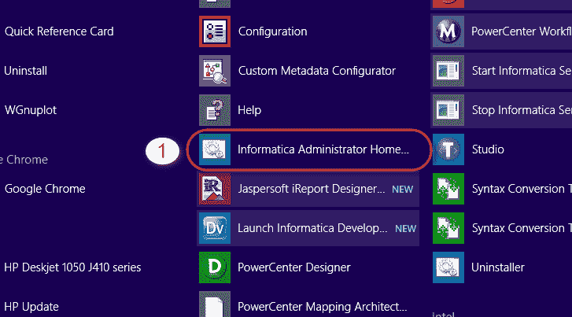

这将在网络浏览器中打开域主页。

**故障排除**-如果未打开主页，请检查 Informatica 服务器进程和数据库服务是否已启动并正在运行。 如果没有，请重新开始。

**步骤 2）**输入域凭据（这些凭据是在服务器安装期间生成的）。

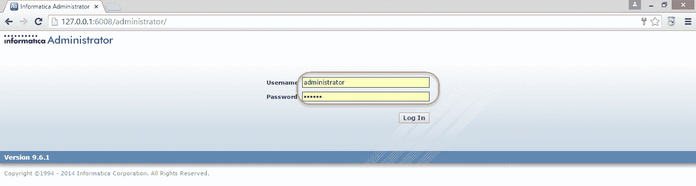

**步骤 3）**成功登录后，将显示 Informatica 管理员主页。

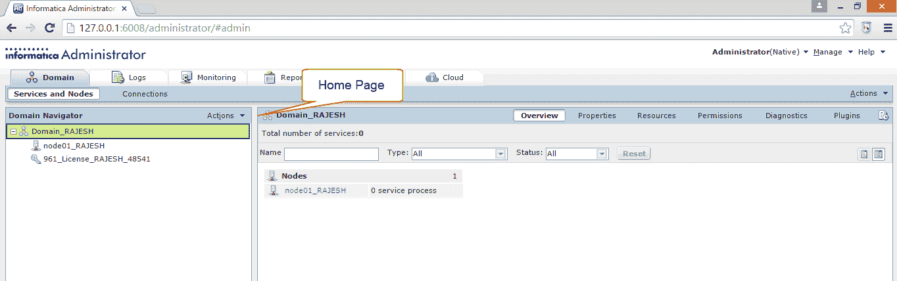

## 如何创建存储库服务

它是第一个需要在域控制台中创建的服务。 前提条件是要在数据库中创建数据库用户以及基本权限（连接，资源），因为此服务将维护数据库中的存储库数据。 您可以使用启用版本控制选项在存储库中创建版本控制对象。

您可以选择 oracle，DB2，Sybase 或 [SQL](/sql.html) 服务器数据库来创建存储库

**步骤 1）**

1.  右键单击域名

2.  选择新选项

3.  选择 PowerCenter 存储库服务。

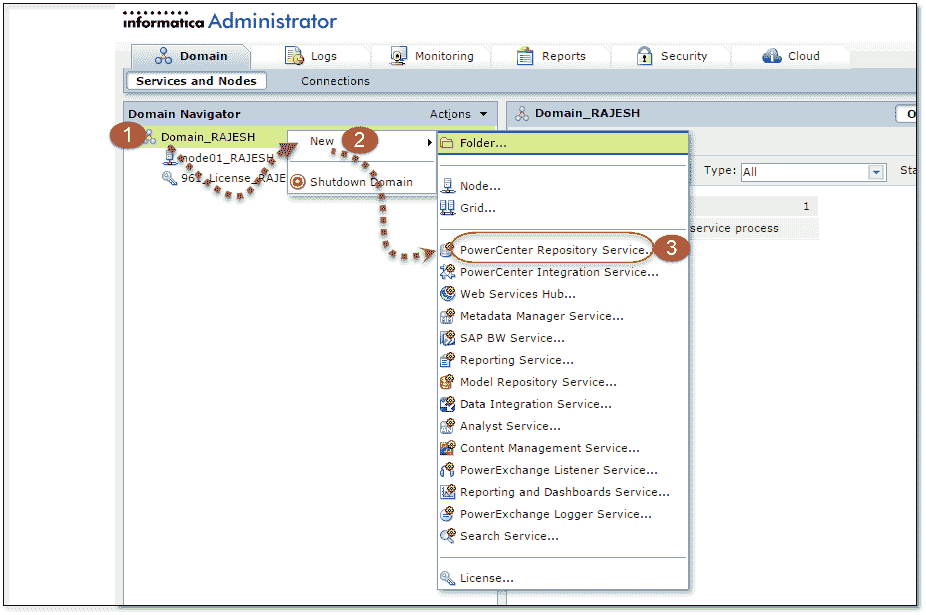

**步骤 2）**在下一个屏幕中

1.  输入存储库名称
2.  选择许可证
3.  选择节点
4.  点击下一步按钮

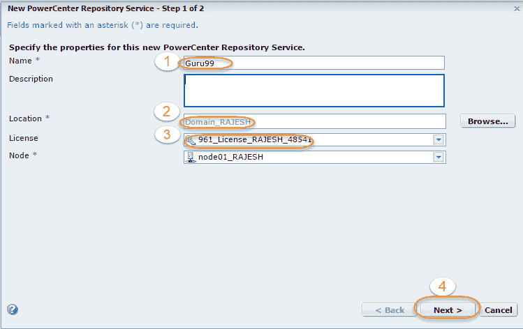

**步骤 3）**在下一个屏幕中，

1.  输入数据库属性。
2.  如果 Informatica 开发需要版本控制功能，请选择选项–启用版本控制。
3.  选择完成按钮。

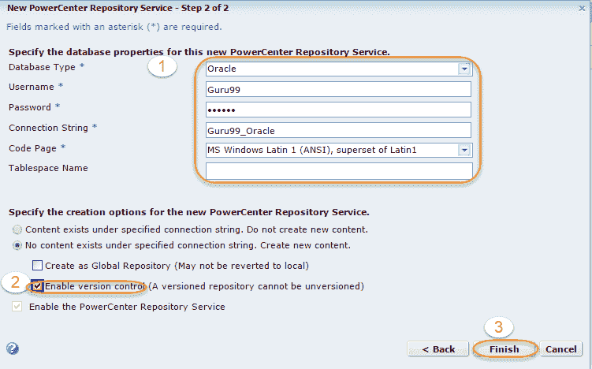

**注意** –连接字符串名称是数据库实例服务名称的名称。

**步骤 4）**将创建存储库服务，并将其列在域树下。

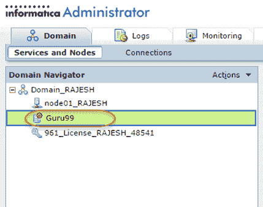

**故障排除** –如果在创建服务期间出错，请检查是否提供了正确的数据库凭据，并且连接字符串正确。 对存储库属性进行任何更改之后，请回收存储库服务以使更改生效。

## 如何创建存储库内容

创建存储库服务后，需要创建**存储库内容**（这是存储库的一次活动）。 没有存储库内容，您将无法启动存储库服务。 存储库内容基本上是数据库表，其中包含在 Informatica 中创建的对象的详细信息。

**步骤 1）**在域树下选择存储库服务。

**步骤 2）**选择存储库服务后。

1.  选择页面右侧的操作菜单
2.  选择存储库内容选项
3.  选择创建选项

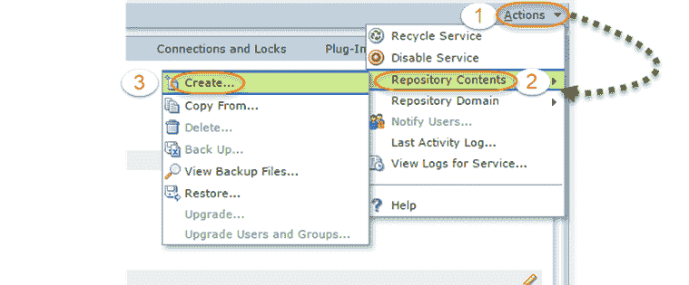

**步骤 3）**在下一个屏幕中

1.  选择本地/全局存储库的选项（我们不选中它来创建本地存储库）
2.  选择版本控制（如果需要，我们将其保留为未选中状态以跳过版本控制功能）
3.  单击确定。

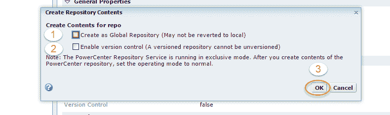

**步骤 4）**创建存储库内容后，将存储库服务从独占模式更改为普通模式

**注意** –如果存储库服务处于独占模式，则用户将无法连接到存储库

选择存储库的编辑属性选项

**步骤 5）**

1.  从独占模式选择到普通模式
2.  选择确定按钮。

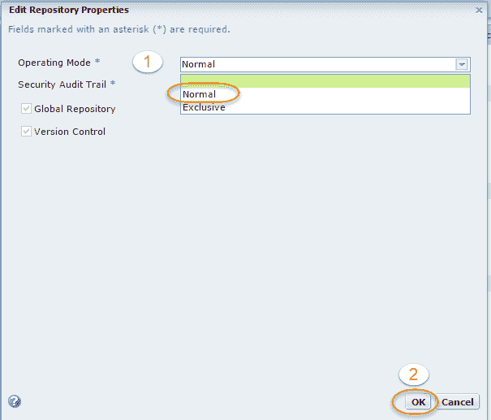

完成后，存储库服务将以正常模式运行。

## 如何创建集成服务

集成服务负责执行工作流。 每当从工作流管理器，调度程序或命令提示符执行任何工作流时，集成服务都会收到请求。 该服务锁定相应的工作流程，获取有关工作流程的详细信息，从 Informatica 存储库映射&会话并执行工作流程。 该服务还负责创建工作流日志，读取参数文件，创建过程线程以执行工作流，执行在工作流管理器中创建的任何其他任务等。

创建集成服务

**步骤 1** ）

1.  右键单击**域**导航器树
2.  选择新选项
3.  选择 PowerCenter 集成服务

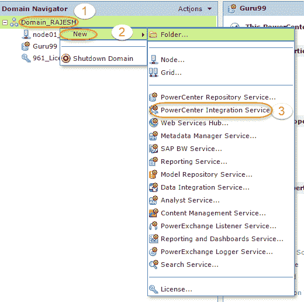

**步骤 2）**在这一步中，我们将

1.  输入集成服务名称
2.  选择许可证
3.  选择一个节点，然后单击下一步。

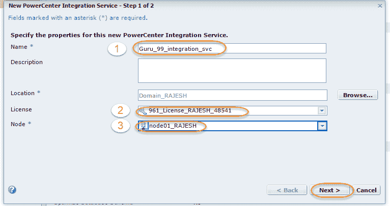

**步骤 3）**在下一页

1.  选择存储库服务
2.  输入 Informatica Administrator 用户名和密码。
3.  选择完成。

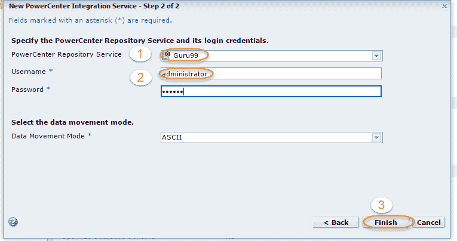

**步骤 4）**启用集成服务。

1.  单击域树中的 Integration Service，然后选择“操作”选项。
2.  选择启用服务选项

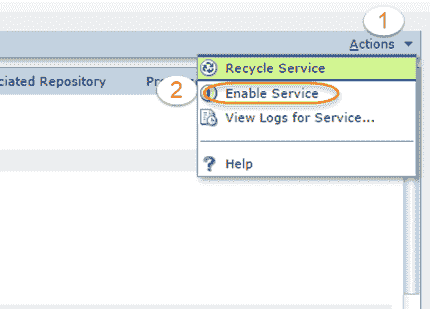

创建并启用集成服务和存储库服务后，它们应处于运行状态。

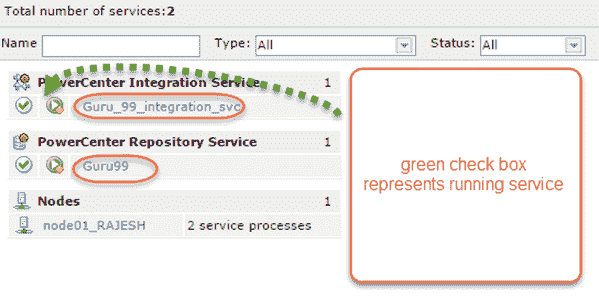

## 如何配置客户端和域

在开始使用 Informatica 服务器的 Informatica 集成和存储库服务之前，必须在客户端上配置 Informatica 域。 要在客户端添加域，需要执行以下步骤。

**步骤 1** ）打开 Informatica 存储库设计器

1.  选择存储库菜单
2.  选择配置域

**步骤 2）**选择添加新域选项

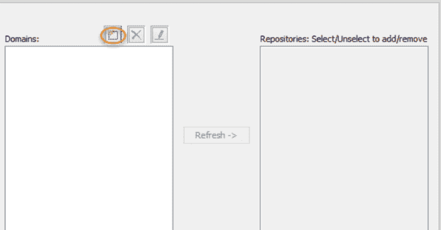

**步骤 3）**在添加域窗口中

1.  输入域名
2.  输入网关主机
3.  输入网关端口（在 Informatica 服务器安装过程中分配的端口号）
4.  选择确定

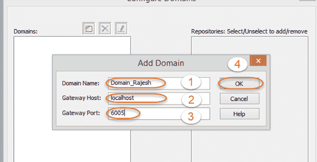

**步骤 4）**存储库将列在窗口的右侧。 选择复选框，然后选择确定。

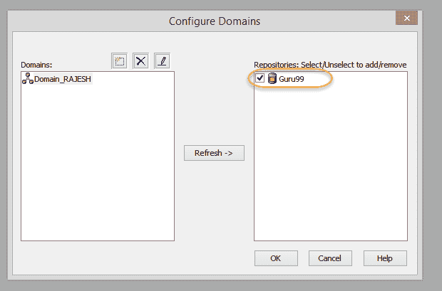

存储库将在存储库管理器导航树中列出。

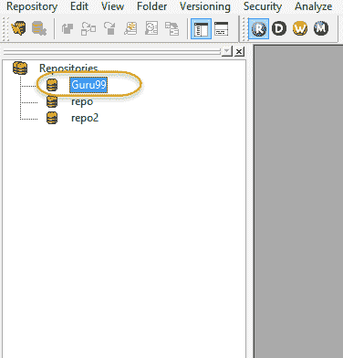

## 如何创建用户

要在 Informatica Designer 中创建映射并执行各种任务，例如执行工作流程，管理存储库文件夹，监视工作流程等，需要有效的 Informatica 用户，并且该用户必须具有特权。 根据分配给用户的角色，用户可以是管理员用户或开发人员用户。 您可以创建任何号码。 用户的需求。

创建 Informatica 用户

**步骤 1）**在 Informatica Administrator 主页中选择“安全性”选项卡

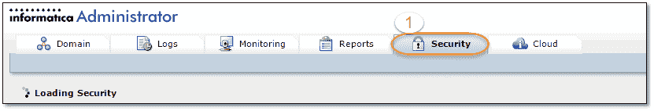

**步骤 2）**在这一步中，我们将

1.  选择用户标签
2.  选择动作菜单
3.  选择创建用户选项

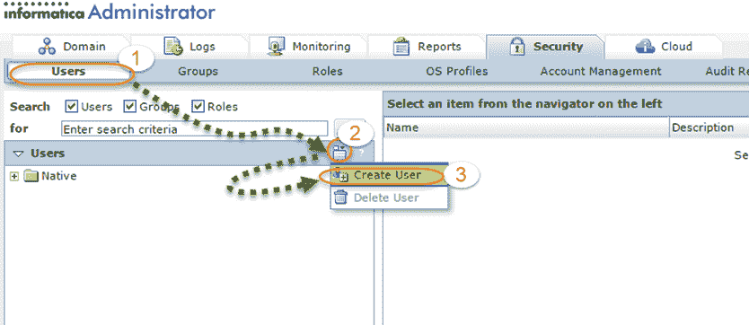

**步骤 3）**在创建用户页面上

1.  输入所需的登录名
2.  输入所需的密码
3.  确认密码
4.  选择确定

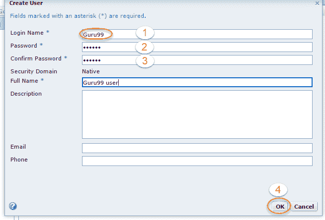

**步骤 4）**用户必须具有对域和存储库的特权才能分配该特权

1.  点击用户名
2.  选择权限选项卡
3.  选择域。

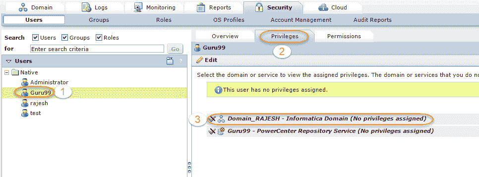

**步骤 5** ）在编辑角色窗口中

1.  选择域复选框
2.  选择存储库服务复选框
3.  选择确定。

这将为用户分配存储库和域特权。

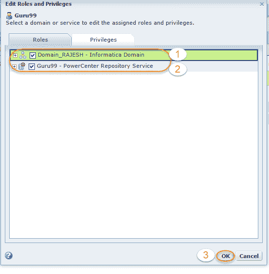

现在，您将能够使用客户端工具连接到存储库。

这样就完成了存储库服务创建，集成服务创建，域配置，用户创建以及在客户端中添加存储库的工作。