# Informatica 中的源分析器和目标设计器

> 原文： [https://www.guru99.com/source-analyzer-and-target-designer-informatica.html](https://www.guru99.com/source-analyzer-and-target-designer-informatica.html)

在 ETL /数据仓库中，您将遇到不同的源和目标。

ETL 中的源是从中提取记录的实体，然后将这些记录存储在临时表（登台表）或 Informatica 转换缓存中。 根据映射设计文档/业务需求，您需要对这些数据记录进行更改（转换数据），然后将转换后的数据加载到另一个称为目标表的表结构中。

在每个 Informatica 映射中，总会有一个源和一个目标。 要在 Informatica 中管理不同的源和目标，您必须使用源分析器和目标设计器。 这些工具已集成到 Powercenter Designer 工具中，并且可以从那里本身启动。

借助源分析器，您可以在 Informatica 中创建或导入不同类型的源。 同样，通过使用目标设计器，您可以创建或导入不同类型的目标。 Informatica 提供了一种功能，可以通过设计其结构从头开始创建源/目标，也可以通过导入定义来创建源/目标。 从数据库导入源时，将导入以下元数据。

*   来源（表）名称
*   数据库位置
*   列名
*   列数据类型
*   约束条件

您还可以在表中定义键关系，这些键关系仅适用于 Informatica 级别并存储在存储库中。

在 Informatica 中创建/导入的源或目标可以在不同映射中任意时间重复使用。 每个映射都必须至少具有可加载目标。 否则，映射将无效。

**注意**-在源分析器/目标设计器中创建源/目标时，仅在 Informatica 中创建结构。 在数据库级别，没有创建对象。 因此，您必须创建具有与 Informatica 中创建的结构相同的结构的 Database 对象。

您可以使用源代码分析器导入以下类型的源代码

*   关系表（数据库表），视图和同义词
*   平面文件
*   Cobol 文件
*   XML 文件

**性能提示** –要提高关系源表的性能，请使用源数据库表上的索引。 在目标上，表禁用或删除性能约束和索引。

在本教程中-您将学习

*   [如何打开源代码分析器](#1)
*   [如何在源代码分析器](#2)中导入源表
*   [如何在目标设计器](#3)中打开目标设计器&导入目标
*   [如何在 Informatica](#4) 中创建文件夹

## 如何打开源代码分析器

**步骤 1** -打开 Informatica PowerCenter 设计器工具

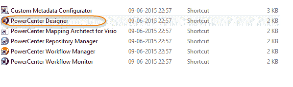

**步骤 2** –在下一个屏幕中

1.  双击要连接的存储库
2.  输入用户名
3.  输入密码
4.  Click on Connect button

    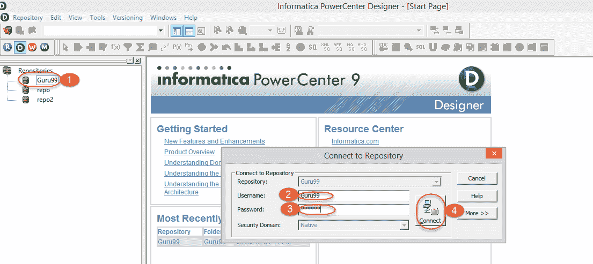

成功登录后，该用户的文件夹将在存储库名称下列出

**注–**

1.  如果登录失败，请检查用户是否具有连接到存储库的特权
2.  如果在存储库名称下看不到文件夹，请检查是否已创建文件夹。
3.  如果最近创建了一个文件夹，则从存储库断开连接并重新连接。

**步骤 3 –** 在下一步

1.  右键点击文件夹
2.  选择打开选项

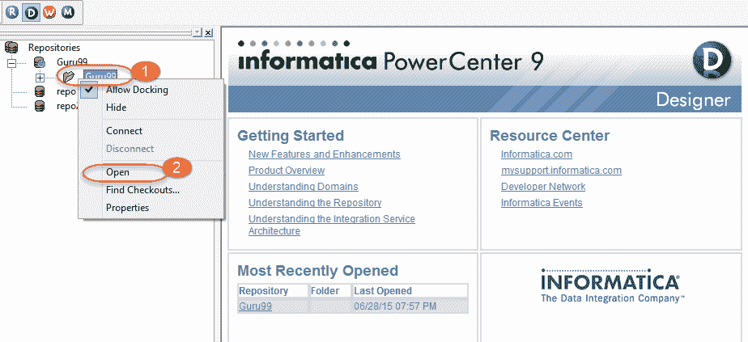

打开文件夹后，将列出该文件夹的子文件夹。

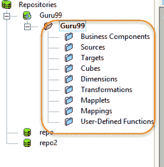

**步骤 4 –** 单击 Source Analyzer 菜单，如图所示。

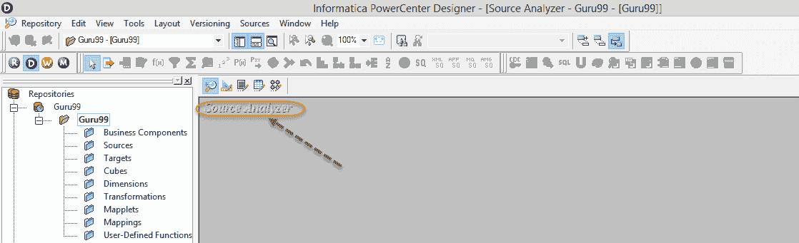

## 如何在源代码分析器中导入源表

**步骤 1** -源分析仪中

1.  单击主菜单中的“来源”标签
2.  Select import from database option, after this ODBC Connection box will open.

    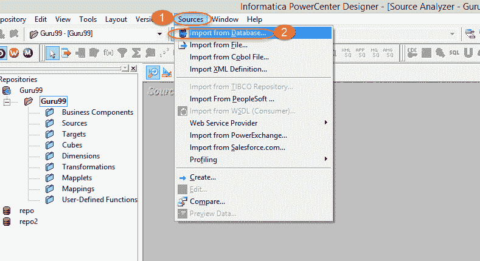

**步骤 2** –我们现在将创建 ODBC 连接（如果您已经具有 ODBC 连接，请转到步骤 3）

1.  单击 ODBC 数据源旁边的按钮。

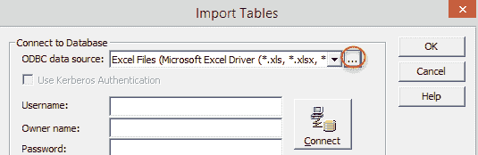

2.  在下一页上，选择“用户 DSN”选项卡，然后单击“添加”按钮。

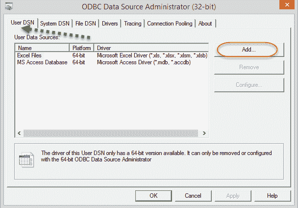

DSN（数据源名称）基本上是一种数据结构，它包含有关特定详细信息（数据库类型，位置，用户详细信息等）的信息。 ODBC 驱动程序需要此信息，以便它可以连接到该数据库。

3.  When you click on the add button, you will see a list of drivers for various databases (Oracle, SQL Server, Sybase, Microsoft Access, Excel, etc.) The driver which you select depends on what database you want to connect. Select the driver for the data source. Here in guru99 you will be using oracle database tables. Select Oracle wire protocol driver.

    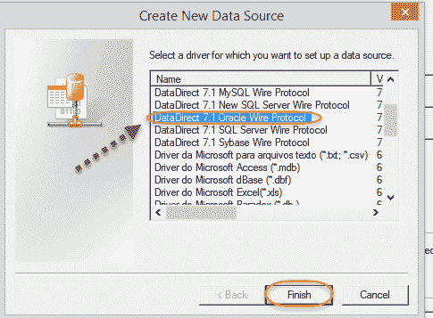

4.  On the next page, select the general tab and enter database details. Then Click on test connect.

    **注意** –数据库详细信息特定于您的安装，具体取决于在数据库安装期间选择的主机名，端口和 SID。 您可以通过打开位于 oracle 安装文件夹中的 **tnsnames.ora 文件**来获取此详细信息。

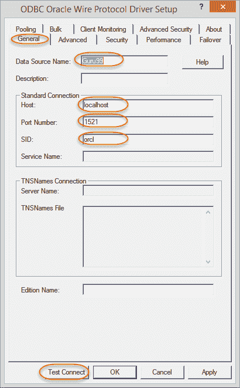

5.  Once you made a Test Connect, enter database username, password and then select "OK" button

    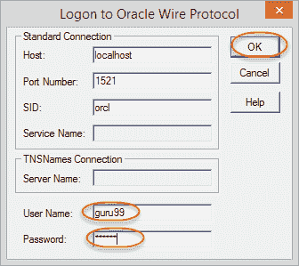

6.  If the connection is successful, it will show a message box.

    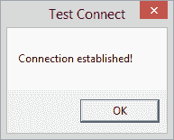

7.  为测试连接窗口和 ODBC 驱动程序设置窗口选择确定。 创建的 ODBC 数据源将被添加到用户数据源。 现在我们已经设置了 ODBC 数据源。

**步骤 3** -在 guru99 中，您将使用 oracle 的 Scott / Tiger 模式表。 如果数据库中没有这些表，请使用此脚本创建这些表。

[下载上面的 Scott.sql 文件](https://drive.google.com/uc?export=download&id=0ByI5-ZLwpo25TDBzTExTdEQzSzQ)

**步骤 4** –在导入表窗口中。

1.  为 oracle 数据库选择 ODBC 数据源。
2.  输入数据库用户名
3.  输入数据库密码
4.  单击连接/重新连接按钮。 这将显示数据库用户的表。
5.  展开表格文件夹下的树，然后选择 EMP 表
6.  Select OK button.

    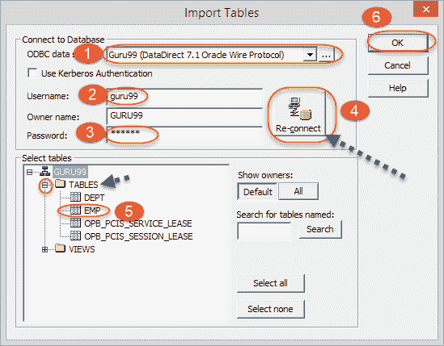

**步骤 5** -该表将被导入 Informatica Source Analyzer。 使用“ ctrl + s”键将更改保存到存储库。

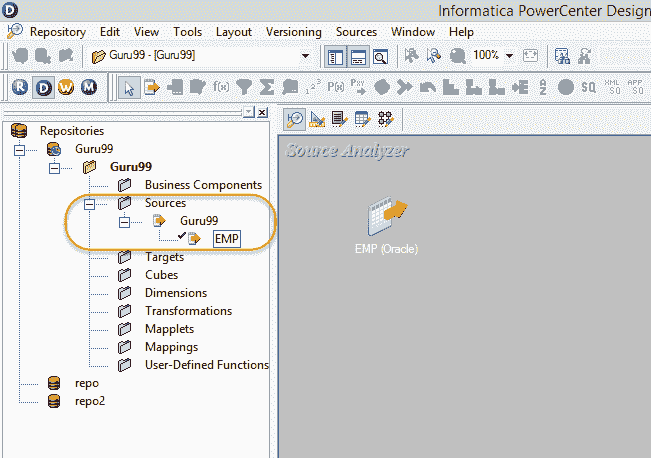

同样，您可以在源分析器中导入任何其他数据库表。

## 如何在目标设计器中导入目标

在本教程中，您将创建目标表 emp_target，该表将具有与源 EMP 表相同的结构。 要导入目标表，目标表必须存在于数据库中。 要创建目标表，请使用以下脚本。 Informatica 中可用的目标类型是关系文件，XML 文件和平面文件。

[下载上面的 emp_target.sql 文件](https://drive.google.com/uc?export=download&id=0ByI5-ZLwpo25RFZFaVpsUGM1M1U)

**注意** –在本教程的此处，源表和目标表都存在于同一数据库模式（guru99）中。 但是，您也可以在其他架构中创建目标。

**步骤 1** -在 Informatica Designer 中，单击目标设计器图标以启动目标设计器。

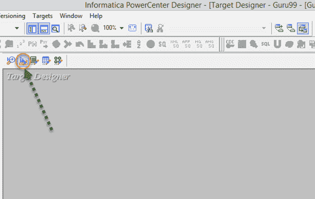

**步骤 2-**在下一步

1.  从主菜单中选择选项“目标”
2.  从数据库选项中选择“导入”

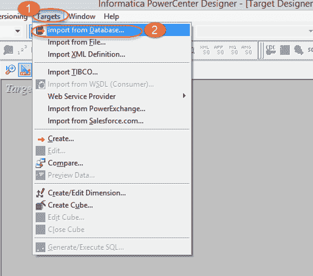

**步骤 3** -在导入表窗口中。

1.  为 oracle 数据库选择 ODBC 数据源。
2.  输入数据库用户名
3.  输入数据库密码
4.  单击连接/重新连接按钮。 这将显示数据库用户的表。
5.  展开表格文件夹下的树，然后选择 EMP_TARGET 表
6.  选择确定按钮

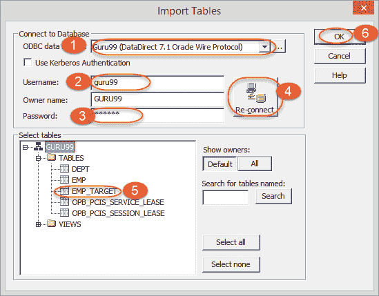

这将在 Informatica Powercenter 的 Target Designer 中导入目标。 使用“ ctrl + s”键保存更改。

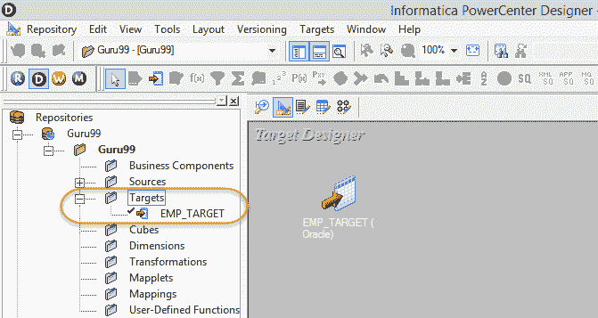

在本教程中，您已导入源和目标。 现在，您已经准备创建第一个映射。

## 如何在 Informatica 中创建文件夹

Informatica 文件夹是逻辑容器，用于保留您在 Informatica Designer /工作流管理器中创建的对象（映射，mapplet，源，目标等）。

创建文件夹

**步骤 1** –打开存储库管理器

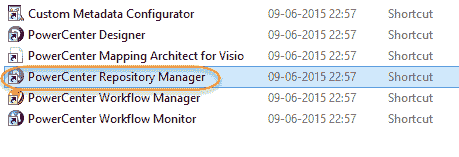

**注意**-如果已经打开 Informatica Designer，则可以使用工具箱中的快捷方式打开存储库管理器。

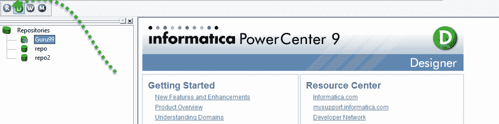

这将在单独的窗口中打开 Informatica 存储库管理器。

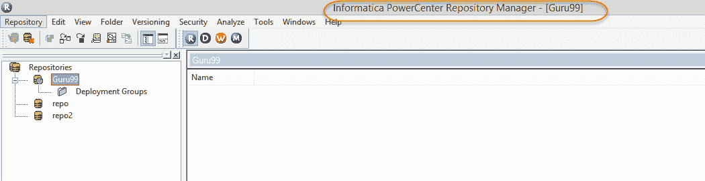

**步骤 2** -遵循以下步骤

1.  点击文件夹菜单
2.  选择创建选项

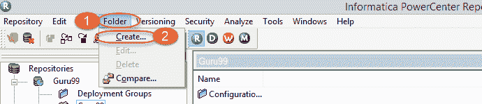

**步骤 3** –下一步

1.  输入所需的文件夹名称
2.  选择确定

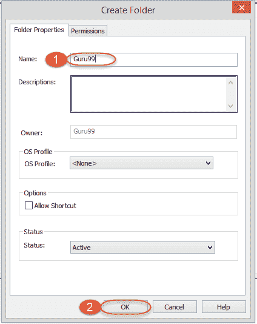

这将创建一个新文件夹，并显示一条消息，提示“该文件夹已成功创建”。

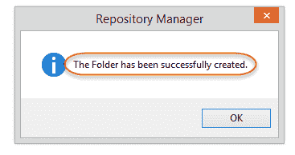

新创建的文件夹将在相应的存储库下列出。

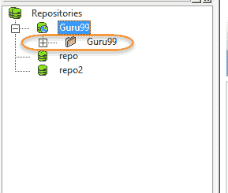

这样就完成了本教程。 下一个见！