# Excel 中的迷你图和示例

> 原文： [https://www.guru99.com/excel-sparkline-example.html](https://www.guru99.com/excel-sparkline-example.html)

## Excel 中的迷你图是什么？

**SPARKLINE** 是一个小图，用于表示一系列数据。 除了成熟的图表外，它还适合单个单元格。 Sparkline 提供了三种不同的数据可视化效果：

1.  线
2.  柱
3.  赢/输

它是为一系列值做准备的即时图表。 迷你图用于显示一段时间的数据趋势。

在这个 Sparkline 教程中，您将学习

*   [为什么使用迷你图？](#2)
*   [迷你图](#3)的类型
*   [如何将 Sparkline 插入 Excel？](#4)
*   [使用表格创建报告](#5)
*   [如何格式化迷你图？](#6)
*   [为什么使用迷你图？](#7)

## 为什么使用迷你图？

迷你图可以帮助您避免创建大图表的繁琐工作，而这在分析过程中可能会造成混淆。 当您要显示大型数据集中的部分数据时，这是仪表板中常用的可视化技术。

迷你图不是 Excel 图形之类的对象。 它作为普通数据驻留在单元中。 当您增加 Excel 的大小时，Sparkline 将根据其大小自动适合单元格。

## 迷你图的类型

从“插入”菜单中，选择所需的迷你图类型。 它提供了三种类型的迷你图。

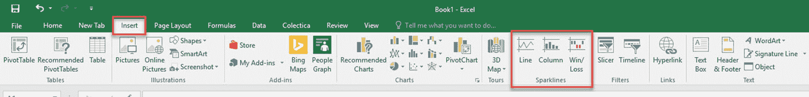

1.  **线**：迷你图将以线的形式出现，较高的值将指示高度差的波动。
2.  **列**：柱形图或条形图的形式。 每个栏显示每个值。
3.  **获利/亏损**：主要用于显示浮动成本的负值，例如涨跌。

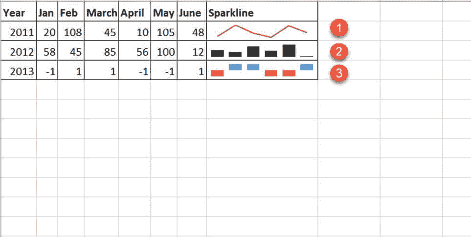

根据类型，它为所选数据提供不同的可视化。 如果折线是类似于折线图的微小图表，则该列是条形图的缩影，赢/输类似于瀑布图。

## 如何将 Sparkline 插入 Excel？

您需要选择特定的列数据以插入迷你图。

请考虑以下演示数据：以下是不同年份的一些待处理库存的状态。 为了进行快速分析，让我们每年创建一个迷你图。

| **年** | **1 月** | **2 月** | **三月** | **四月** | **五月** | **6 月** |
| --- | --- | --- | --- | --- | --- | --- |
| 2011 | 20 | 108 | 45 | 10 | 105 | 48 |
| 2012 | 48 | 10 | 0 | 0 | 78 | 74 |
| 2013 | 12 | 102 | 10 | 0 | 0 | 100 |
| 2014 | 1 | 20 | 3 | 40 | 5 | 60 |

[下载本教程使用的 Excel](https://drive.google.com/uc?export=download&id=1qZbnUgRxV66aR1WtMVu8XYSouEB-YRzq)

**步骤 1** ）选择“ June”的下一列，然后从插入菜单插入迷你图。 从三种迷你图中选择任何一个。

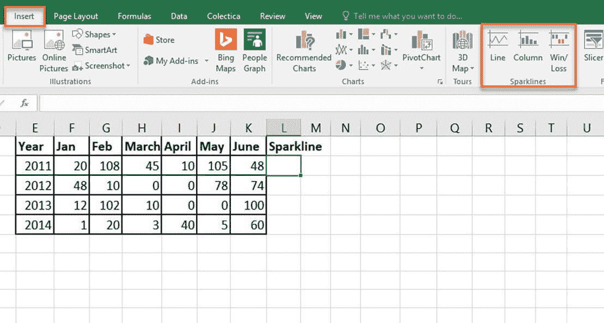

**步骤 2）**将出现一个选择窗口，以选择迷你图应插入的单元格范围。

通过单击数据范围框附近的箭头，可以选择一个单元格范围。

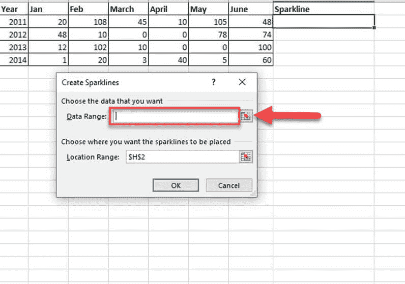

**步骤 3）**在“数据范围”文本框中选择 2011 年数据的第一行。 范围将显示为 B2：G2。

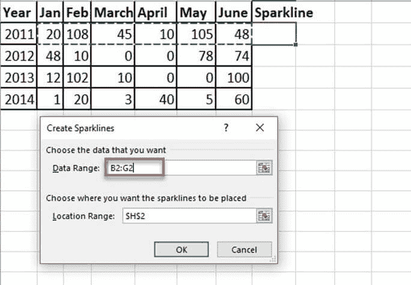

**步骤 4）**另一个范围选择指示您要插入迷你图的位置。 提供您需要迷你图的单元格地址。

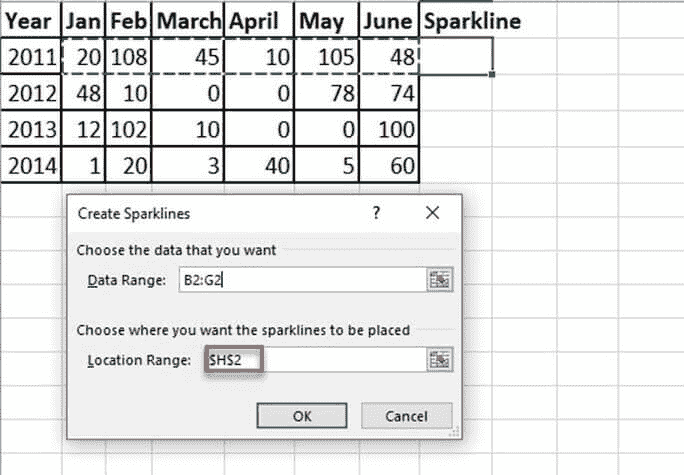

**步骤 5）**设置“数据范围”和“位置范围”后，按“确定”按钮。

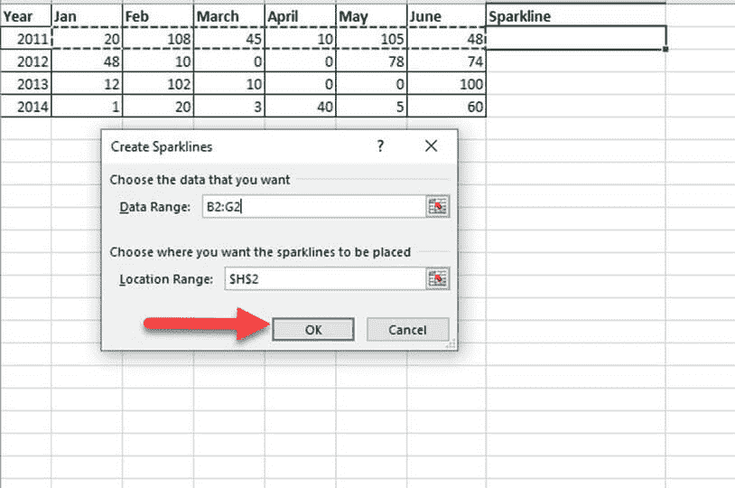

**步骤 6）**现在，为所选数据创建了迷你图，并将其插入到所选单元格 H3 中。

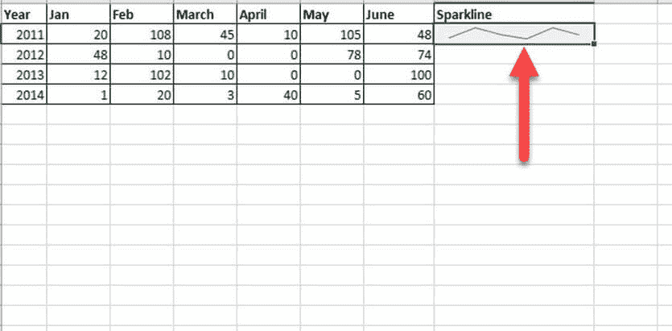

## 使用表格创建报告

您有一份四年的销售报告：分别为 2015 年，2016 年和 2017 年。 该表中包含的详细信息是国家，产品和销售总额。

让我们找出该产品在不同年份的销售趋势。

**步骤 1** ）在 2018 年销售总额旁边创建一个列分析。在下一步中，您将插入迷你图。

| S＃ | **国家/地区** | **产品** | **2015 年销售总额** | **2016 年销售总额** | **2017 年销售总额** | **2018 年销售总额** |
| --- | --- | --- | --- | --- | --- | --- |
| 1 | 加拿大 | 高速公路 | $ 32,370.00

 | $ 30,216.00

 | $ 352,625.00

 | $ 34,440.00

 |
| 2 | 德国 | Carretera | $ 26,420.00

 | $ 352,100.00

 | $ 43,125.00

 | $ 7,210.00

 |
| 3 | 法国 | Carretera | $ 32,670.00

 | $ 4,404.00

 | $ 600,300.00

 | $ 4,473.00

 |
| 4 | 新加坡 | Carretera | $ 13,320.00

 | $ 6,181.00

 | $ 34,056.00

 | $ 9,282.00

 |
| 5 | 美国 | Carretera | $ 37,050.00

 | $ 8,235.00

 | $ 32,670.00

 | $ 22,296.00

 |
| 6 | 墨西哥 | Carretera | $ 529,550.00

 | $ 236,400.00

 | $ 13,320.00

 | $ 423,500.00

 |
| 7 | 中国 | Carretera | $ 13,815.00

 | $ 37,080.00

 | $ 534,450.00

 | $ 17,703.00

 |
| 8 | 西班牙 | Carretera | $ 30,216.00

 | $ 8,001.00

 | $ 645300.00

 | $ 17,340.00

 |
| 9 | 日本 | Carretera | $ 37,980.00

 | $ 603,750.00

 | $ 36,340.00

 | $ 41,250.00

 |
| 10 | 韩国（共和国） | Carretera | $ 18,540.00

 | $ 10,944.00

 | $ 962,500.00

 | $ 32,052.00

 |
| 11 | 意大利 | Carretera | $ 37,050.00

 | $ 32,280.00

 | $ 23,436.00

 | $ 9,192.00

 |
| 12 | 哥斯达黎加 | Carretera | $ 333,187.50

 | $ 36,340.00

 | $ 527,437.50

 | $ 148,200.00

 |
| 13 | Taiwan | Carretera | $ 287,400.00

 | $ 529,550.00

 | $ 37,980.00

 | $ 488,950.00

 |
| 14 | 阿根廷 | Carretera | $ 15,022.00

 | $ 10,451.00

 | $ 11,802.00

 | $ 754,250.00

 |
| 15 | 丹麦 | Carretera | $ 43,125.00

 | $ 225,500.00

 | $ 25,692.00

 | $ 33,210.00

 |
| 16 | 比利时 | Carretera | $ 9,225.00

 | $ 25,932.00

 | $ 8,001.00

 | $ 690,300.00

 |

**步骤 2）**选择要在其中插入迷你图的单元格。 从菜单栏中转到“插入”菜单。 从迷你图列表中选择任何迷你图。

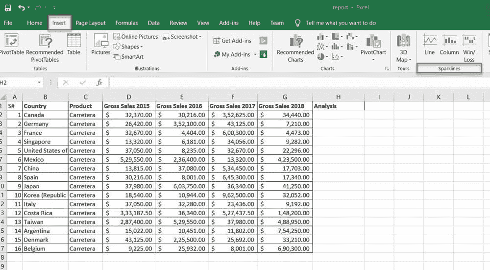

**步骤 3）**选择要插入的任何迷你图类型。 它将询问单元格的范围。 从可用的迷你图类型中选择线类型。

数据范围指示迷你图需要插入哪些数据。 位置范围是您要在其中添加迷你图的单元格地址。

**步骤 4）**此处，数据范围来自包含“ 2015 年至 2018 年销售总额”的单元格数据，位置范围来自 H3。 之后按“确定”按钮。

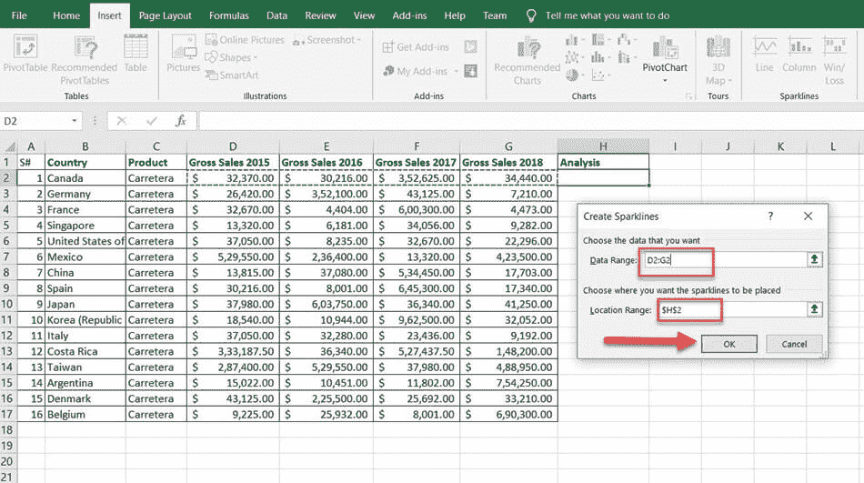

**步骤 5）**迷你图将插入到 H3 单元中。 您可以通过向下拖动将迷你图应用于整个数据。

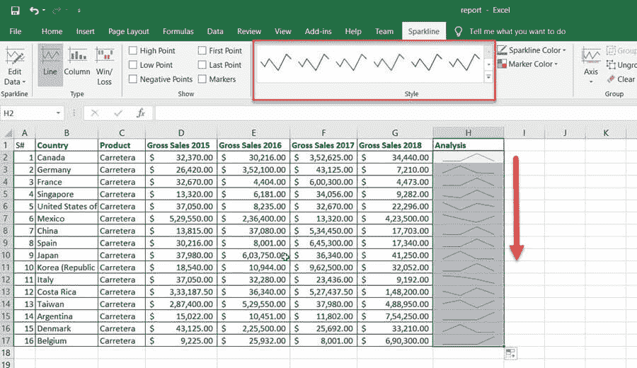

现在创建了迷你图。

## 如何格式化迷你图？

要格式化迷你图，首先单击创建的迷你图。 包含迷你图工具的菜单栏上将出现一个名为 design 的新选项卡，它将帮助您更改其颜色和样式。 逐一查看可用选项。

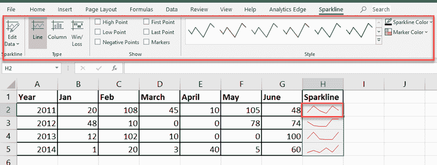

Sparkline 的不同属性可以根据您的需要进行自定义。 样式，颜色，厚度，类型，轴都在其中。

### 如何更改迷你图的样式？

**步骤 1）**从设计菜单中的“样式”选项中选择一种样式。 下拉列表中包含的样式。

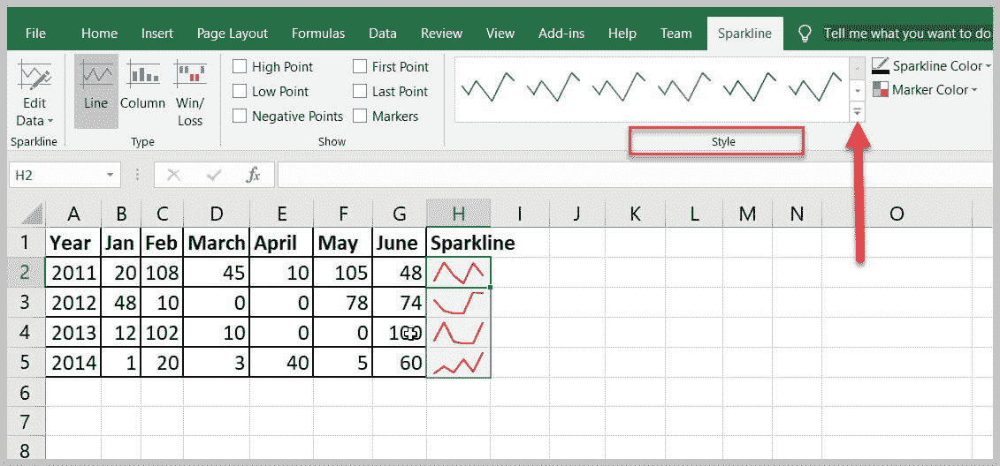

**步骤 2）**单击样式选项附近的向下箭头，从广泛的设计目录中选择您喜欢的样式。

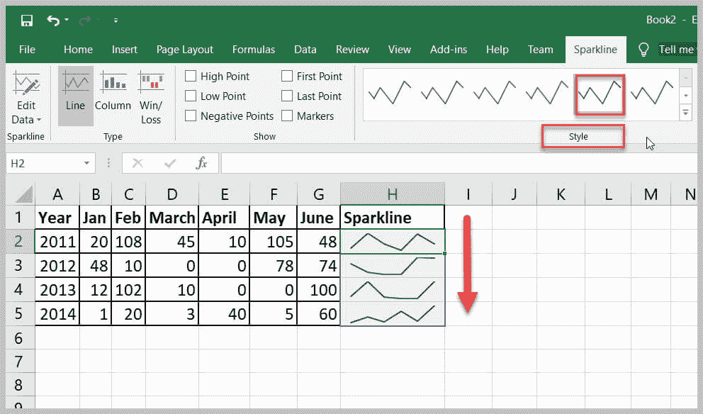

### 如何改变迷你图的颜色？

可以使用“迷你图颜色”选项更改迷你图的颜色和粗细。 它提供多种颜色。

**步骤 1）**选择迷你图，然后从设计菜单中选择迷你图颜色选项。

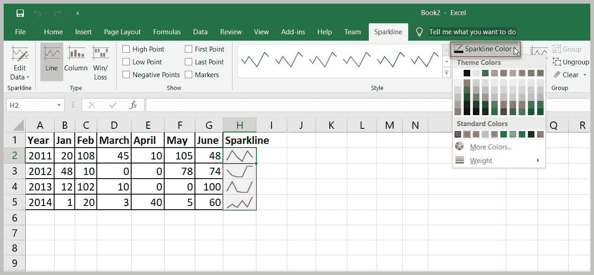

**步骤 2）**单击要更改的颜色。 迷你图将更新为所选颜色。

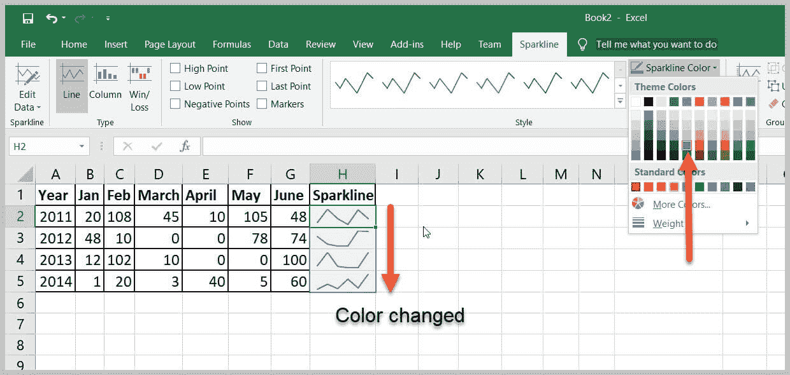

### 更改线条的宽度。

可以使用“闪烁颜色”窗口中的可用选项来调整线条的宽度。

**步骤 1）**选择迷你图，然后转到菜单栏中的设计菜单。

**步骤 2）**单击“迷你图颜色”选项。

**步骤 3）**选择“权重”选项以更改插入的迷你图的厚度。

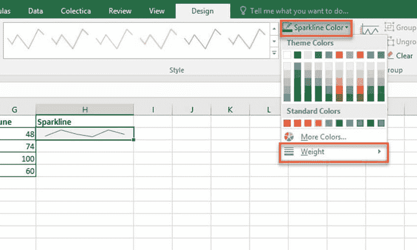

**步骤 4）**移至“重量”选项。 这将给出预定义厚度的列表。 还可以定制重量。

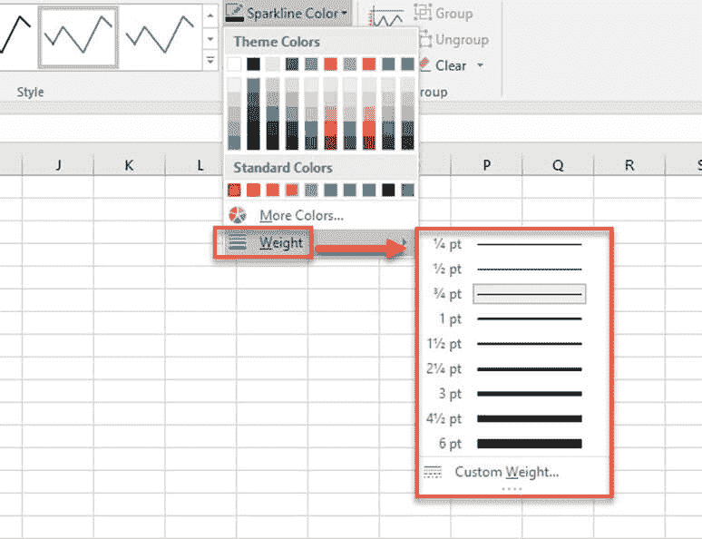

### 突出显示数据点

您可以突出显示迷你图上的最高，最低点和整个数据点。 这样您可以更好地了解数据趋势。

**步骤 1）**在任何单元格中选择创建的迷你图，然后移至设计菜单。 您可以看到不同的复选框以突出显示数据点。

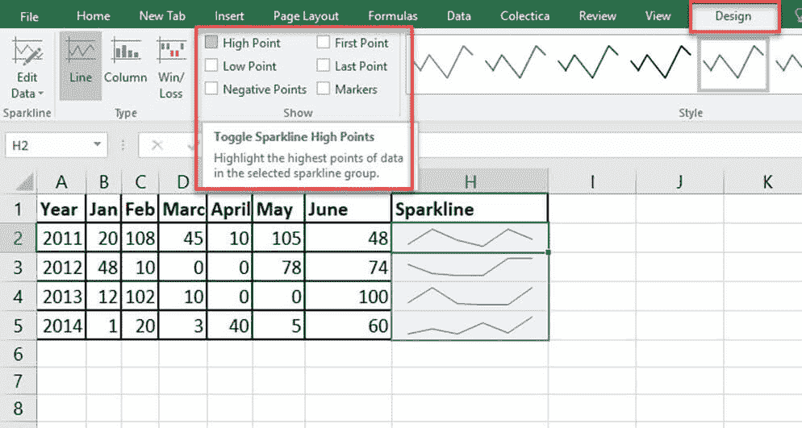

**步骤 2）**根据要突出显示的数据点打勾。 可用的选项有：

*   最高点/最低点：高亮显示迷你图上的最高点和最低点。
*   第一个/最后一个点：这将有助于突出显示迷你图上的第一个和最后一个数据点。
*   负点：使用此点突出显示负值。
*   标记：此选项仅适用于线条迷你图。 它将用标记突出显示所有数据点。 可提供不同的颜色和样式，以及更多的标记颜色和线条。

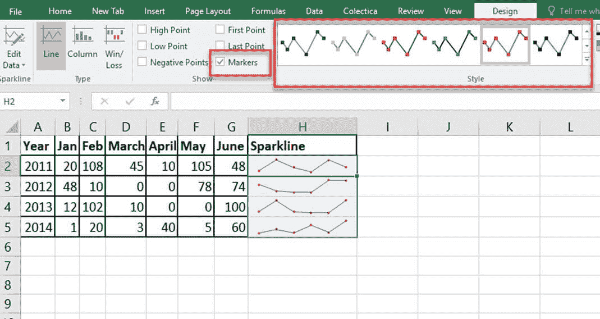

### 删除迷你图

您无法通过敲击键盘上的“删除”键来删除迷你图。 要删除迷你图，您应该转到“清除”选项。

**步骤 1）**选择包含迷你图的单元格。

**步骤 2）**转到迷你图工具设计菜单。

**步骤 3）**单击清除选项，这将从单元格中删除选定的迷你图。

## 为什么使用迷你图？

以下是使用迷你图的重要原因：

*   可视化数据，如温度或股票市场价格。
*   将数据转换为紧凑形式。
*   短时间内生成数据报告。
*   分析特定时间的数据趋势。
*   易于理解数据的波动。
*   对高和低数据点有更好的了解。
*   负值可以通过迷你图有效地浮动。
*   更改单元格宽度后，Sparkline 会自动调整其大小。

#### 摘要

*   迷你图是一个小图表，不建议使用轴或坐标
*   迷你图可以应用于数据系列的单列或单行。
*   迷你图可使用不同的格式设置属性。
*   迷你图是适合单个单元格的显微照片。
*   一次单击删除键将不会删除创建的迷你图。
*   不同的数据点可以在迷你图中突出显示。