# Informatica 中的映射：创建，组件，参数，变量

> 原文： [https://www.guru99.com/mappings-informatica.html](https://www.guru99.com/mappings-informatica.html)

**What is a Mapping?**

映射是通过一组转换链接在一起的源对象和目标对象的集合。 这些转换由一组规则组成，这些规则定义了数据流以及如何将数据加载到目标中。

映射包含以下对象集

*   **源定义**-源定义定义源的结构和特征，其基础数据类型，数据源的类型等。
*   **转换**-转换对象定义如何转换源数据，并且在此过程中可以应用各种功能

*   **目标定义**-目标定义定义了将数据加载到的最终目标。
*   **链接**-链接将源定义连接到不同的转换和目标表。 它定义了数据如何从源流向目标以及如何进行转换。

在本教程中，您将学习

*   [为什么需要映射？](#1)
*   [映射的组成部分](#2)
*   [什么是阶段映射？](#3)
*   [如何创建映射](#4)
*   [映射参数和变量](#5)
*   [如何创建映射参数](#6)
*   [如何创建映射变量](#7)

## 为什么需要映射？

映射是 Informatica 中的一个对象，您可以借助它来定义如何在源数据到达目标对象或目标对象之前对其进行修改。 就像如果您的源系统中的员工名称为“比尔·克林顿”，而在目标系统中，要求员工名称的格式为“克林顿·比尔”，则可以在映射级别设计此类操作。 用基本的术语来说，对源数据的处理是在映射级别定义的。

映射是基本的 Informatica 对象，借助它我们可以定义数据转换详细信息和源/目标对象特征。 映射帮助我们在每一行的各个列级别定义数据转换。 即使在单个映射中，您也可以处理多个源和目标。

## 映射组件

映射的基本组成部分是

*   **源表**
*   **映射参数和变量**
*   **目标对象**
*   **映射转换**

有各种对象构成一个映射。 映射可以由源，目标，映射参数和变量，mapplet，各种转换和用户定义的函数组成**。**

*   **映射源**：映射源是从中获取源数据的对象。 它可以是数据库表，平面文件，XML 源或 COBOL 文件源
*   **映射目标：**映射目标是我们的目标对象，在其中加载了最终处理的数据。 映射目标可以是数据库的关系表，平面文件或 XML 文件。 在任何映射中，源和目标都是必需的，它们的类型可以不同
*   **映射参数和变量**：映射参数和变量可帮助您创建临时变量对象，这将有助于您在映射数据处理时定义和存储临时值。 映射参数和变量是用户定义的可选数据类型，可以为映射创建它们，也可以针对特定需求进行引用和更新。 我们将在本节中了解有关映射参数和变量的更多信息
*   **Mapplet** ：它们是由一组转换，源或目标组成的对象。 通常创建 Mapplet 来重用一组转换的现有功能。 可以在任何映射中使用它。

## 什么是阶段映射？

阶段映射是我们在其中创建源表副本的映射。 例如，在生产系统中，如果您有“员工”表，则可以在 ETL 模式中创建相同的表“ employee_stage”。

拥有本地舞台表具有各种优势，例如生产停机，不会影响您的 ETL 系统，因为您拥有自己的“ employee_stage”表，而不是引用生产“ employee”表。 在生产系统中，可能会有其他影响性能的操作和过程。 但是，当您具有副本登台表时，只有 ETL 进程才能访问它。 这提供了性能优势。

在舞台对应中，

*   源表和目标表具有相同的结构
*   目标表中的数据是源表数据的副本，或者
*   阶段（目标）表中的数据是源数据的子集。

例如，如果您的源表包含 deptno 10、20、30 和 40 的员工详细信息。临时表可以是仅具有 deptno 10 & 30 员工记录的表。

在数据仓库中创建阶段表的目的是通过仅获取与我们相关的数据来使数据转换过程高效，并最大程度地减少 ETL /数据仓库对实时操作系统的依赖性。

## 如何创建映射

在本练习中，我们将创建一个阶段映射，其中源将是“ emp table”，目标将是“ emptgt”。

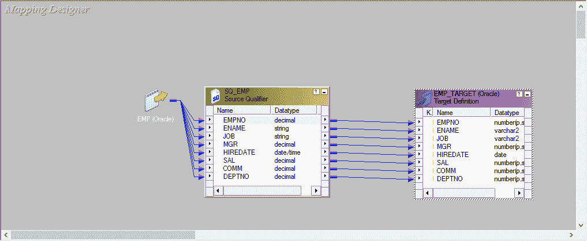

**命名约定** –映射名称以'm_'为前缀，后跟源和目标表名称，并用下划线符号分隔。

示例–如果要从 emp 表加载 emp_target 表，则映射名称可以是'm_emp_emp_target'。

**步骤 1** –启动映射设计器

1.  打开 Informatica Designer 工具
2.  单击 Mapping Designer 图标以启动 Mapping Designer

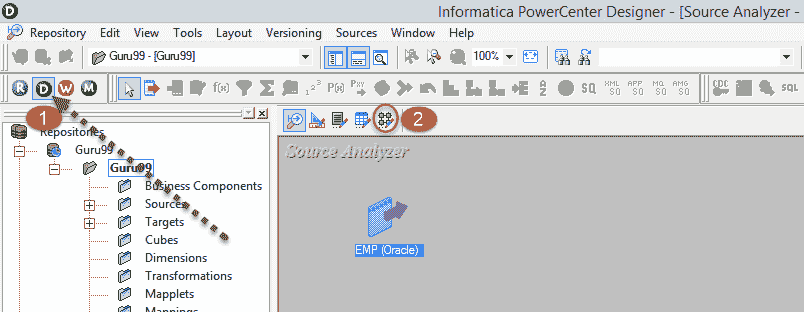

**步骤 2** –在 Mapping Designer 中

1.  单击映射菜单
2.  选择创建选项

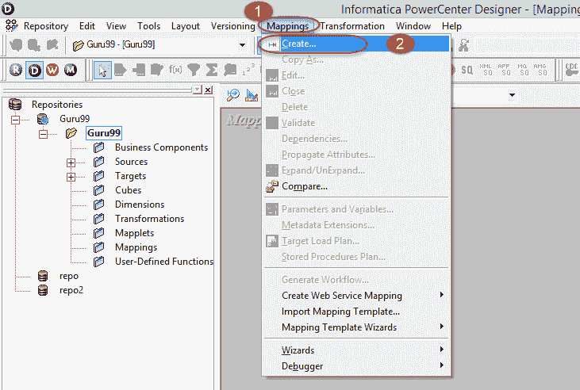

**步骤 3** –输入“ m_emp_emp_target”作为映射名称，然后选择“确定”按钮。

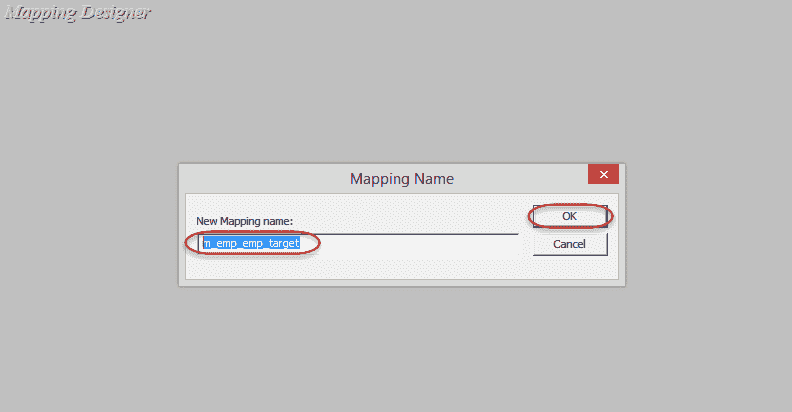

映射将被创建并列在 maps 文件夹下。

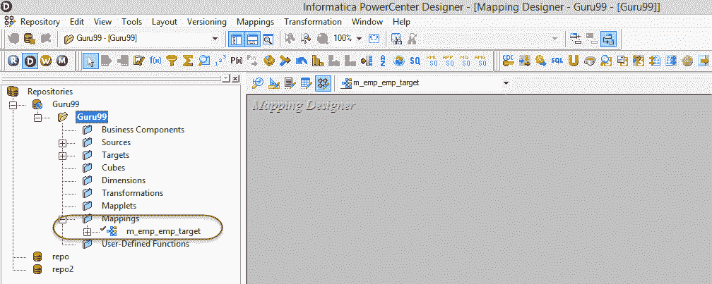

映射必须至少具有**源和目标**，您将向映射添加源和目标。

**步骤 4** –在这一步中，我们将

1.  在源文件夹下选择“ emp”源表。
2.  将“ emp”表拖放到映射设计器中。

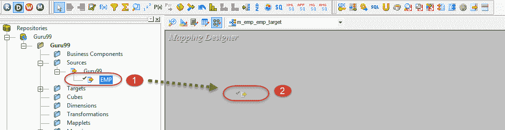

在映射设计器中，将显示导入的源表。

**注意** –在映射中导入任何关系（数据库）表时，还将创建源限定符类型的其他对象。 此源限定符转换是必需的，并且可以帮助 Informatica 集成服务识别源数据库表及其属性。 每当导入源表时，也会创建源限定符转换。 您永远不应删除映射中的源限定符对象。

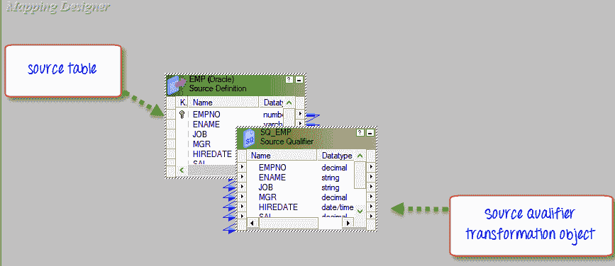

**步骤 5** –在这一步中，我们将

1.  在“目标”文件夹下选择“ emp_target”源表。
2.  将“ emp_target”表拖放到映射设计器中

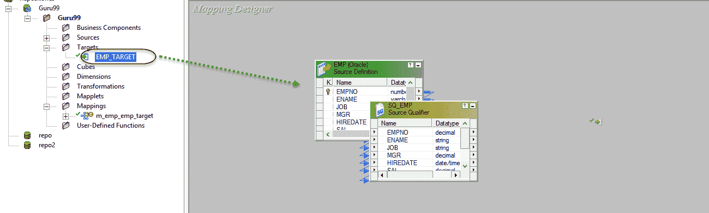

在映射设计器中，将导入并显示“目标表”。

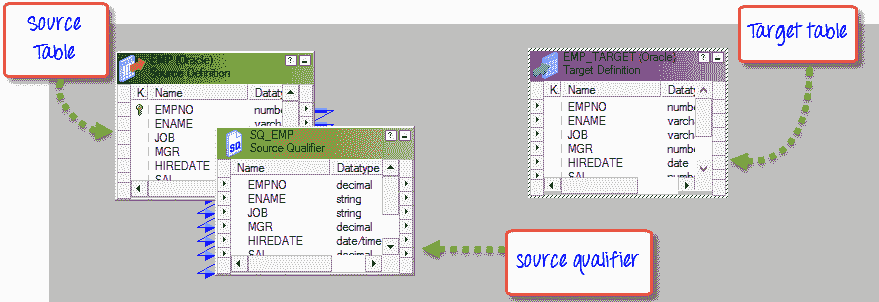

要管理视图空间，可以图标化映射中的这些对象。

**步骤 6 –** 右键单击映射设计器空白工作区中的任意位置，然后选择选项–排列所有图标。

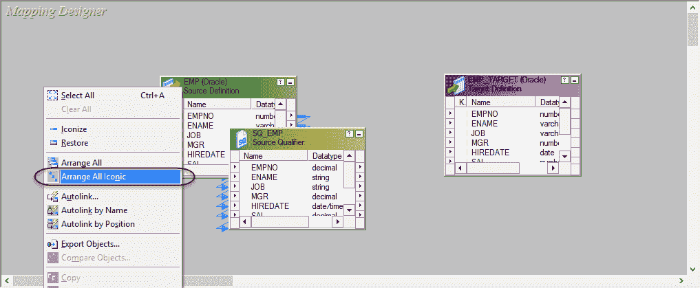

选择选项“排列所有图标”后，工作区将如下所示。

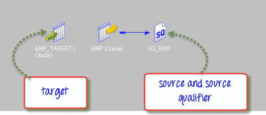

**步骤 7** -在 Informatica 中，我们使用从左到右的流程进行设计。 因此，源表应位于左侧，目标表应位于右侧。 要在工作区中排列表，请选择“ emp_target”表，然后将其拖放到 emp 表的右侧。

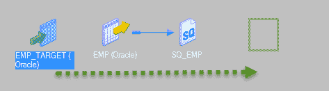

重新布置后，工作空间将如下所示。

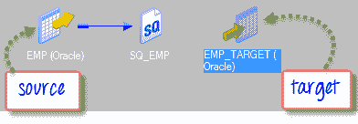

**注意** –定期使用“ ctrl + s”快捷方式将更改保存到存储库。

**步骤 8-**现在，映射中已有源表和目标表，但映射尚未完成。 源表和目标表应链接在一起以完成映射。

链接源和目标

双击 SQ_EMP 表和 EMP_TARGET 表以将它们的视图从图标更改为图形。

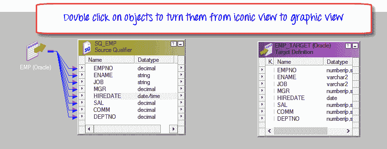

**步骤 9 –** 右键单击 Mapping Designer 工作区，然后选择“按名称自动链接”选项。

**步骤 10 –** 链接源和目标表

1.  选择源表列。
2.  将列拖放到目标表。

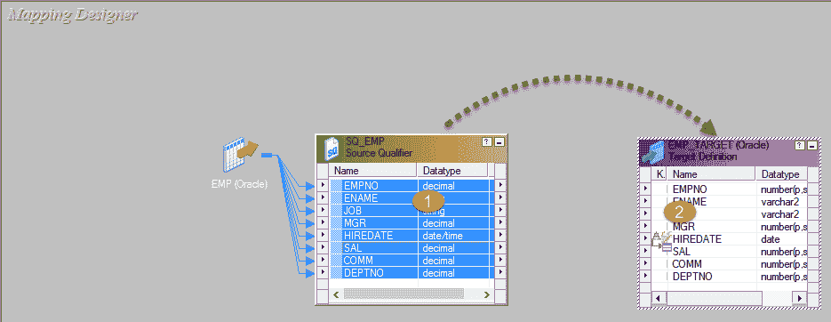

源表和目标表将被链接，并且连接箭头将从源表显示到目标表。

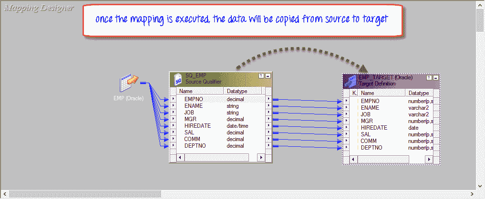

**注意** –在这里，您已将所有源列链接到相应的目标表列。 这意味着，对于获取的每个源记录，将加载目标的所有列。 如果要从加载中排除任何特定的列，请单击该列链接，然后按键盘上的 Delete 键。 链接将被删除，并且目标列将不会被加载。

**步骤 11** -使用快捷键“ ctrl + s”将更改保存到映射。 在输出窗口上，您可以看到映射验证/解析的消息。 它确认您的映射有效。 另外，映射文件夹树中的映射名称旁边将出现一个临时的绿色勾号，指示映射已成功完成。

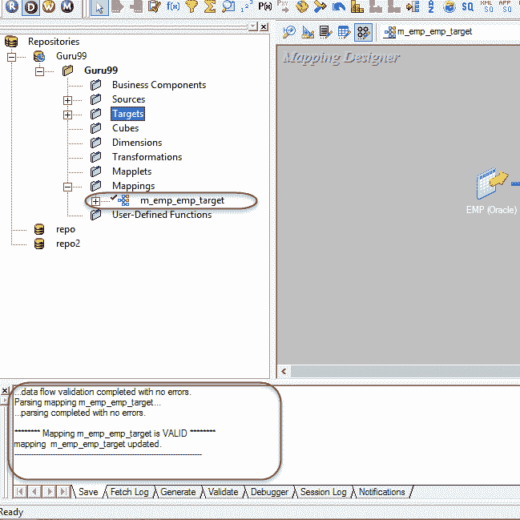

在映射中，可能需要将变量传递给映射，或者可能需要计算临时变量并进一步需要存储它们以供映射的下一次会话使用。 为此，我们创建映射参数和变量。

## 映射参数和变量

像每种编程语言一样，Informatica 也有其定义参数和变量的方式。 但是与其他编程语言不同，Informatica 不是基于代码的语言。 要在 Informatica 中创建参数和变量，必须遵循预定义的语法和导航。

参数和变量之间的差异–

| 

**映射参数**

 | 

**映射变量**

 |
| 映射参数是那些数据类型，其值一旦分配就在整个映射过程中保持不变。 就像您创建了映射参数 deptno = 20 一样，对于整个映射运行，值 20 将保持不变。 对于该映射运行实例，无论将在何处引用该参数，都将始终返回值 20。 对于新的映射实例，可以重新定义参数值。 | 映射变量是可以在整个映射过程中引用的对象（以访问其值），并且可以重新分配其值。 例如，可以在映射中使用 total_salary 的映射变量，并且可以根据薪金来更新其值。 |

映射参数和变量仅特定于映射。 它们不能在另一个映射中引用。

## 如何创建映射参数

创建映射参数时，在执行映射期间，Integration Service 会查找其分配的值。 可以将该值分配给以下位置。

*   内部参数文件
*   会前变量分配
*   存储库中的初始值
*   变量创建期间分配的默认值

**步骤 1 –** 创建映射参数**-**在映射设计器中，

1.  选择映射菜单
2.  选择参数和变量菜单

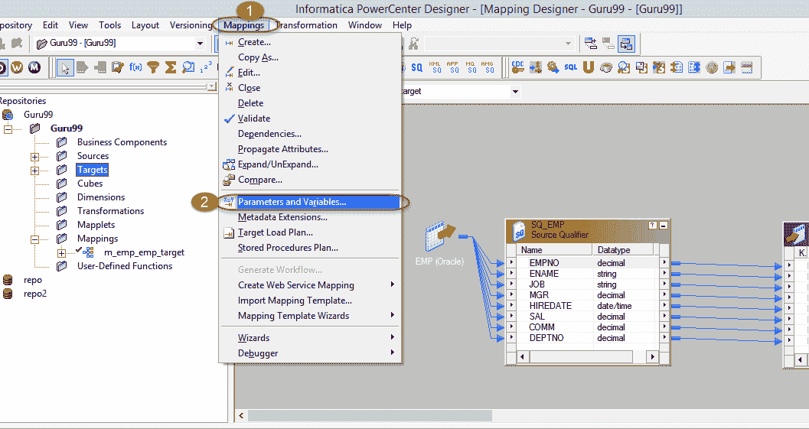

**步骤 2** -在下一个屏幕中，

1.  单击添加新变量菜单
2.  从下拉列表中，选择类型作为参数
3.  输入参数名称为$$ Deptno
4.  输入初始值 10
5.  选择确定按钮

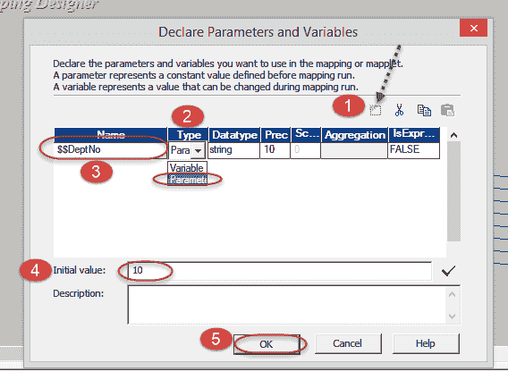

现在，您已经创建了一个映射参数 deptno，其初始分配值为 10，并且可以在映射内部引用该参数。

## 如何创建映射变量

**步骤 1 –** 在映射设计器中

1.  选择映射菜单
2.  选择参数和变量菜单

**步骤 2** -在下一个屏幕上

1.  单击添加新变量菜单
2.  从下拉列表中，选择类型作为变量
3.  输入变量名称为$$ TotalSalary
4.  选择数据类型作为十进制
5.  输入初始值 0
6.  选择确定按钮

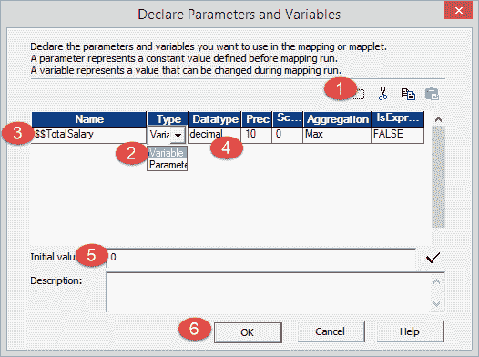

这将创建一个映射变量。

**注意** –映射参数和变量名称始终以$$开头。

**摘要**

映射在 Informatica 中很重要，可以根据项目要求将源数据与目标进行匹配。 我们已经讨论了阶段映射以及映射变量和参数的概念。