# Informatica 中的工作流程：创建，任务，参数，可重用，管理器

> 原文： [https://www.guru99.com/workflows-informatica.html](https://www.guru99.com/workflows-informatica.html)

**What is Workflow?**

工作流是 Informatica 中集成服务的一组指令/命令。 集成服务是一个实体，它从存储库中读取工作流信息，从源中获取数据，并在执行转换后将其加载到目标中。

工作流程-它定义如何运行诸如**会话任务，命令任务，电子邮件任务**等任务。

创建工作流程

1.  您首先需要创建任务
2.  然后将这些任务添加到工作流中。

工作流就像一个空容器，它具有存储要执行的对象的能力。 您将任务添加到要执行的工作流。 在本教程中，我们将在工作流中进行以下操作。

工作流执行可以通过两种方式完成

*   **序列**：任务按照定义的顺序执行
*   **基于事件：**根据事件条件执行任务。

**What You Will Learn:** []

*   [如何打开工作流管理器](#1)
*   [如何为工作流管理器](#2)创建连接
*   [创建关系连接](#3)
*   [工作流程管理器](#4)的组件
*   [如何创建命令任务](#5)
*   [如何创建工作流程以执行命令任务](#6)
*   [如何执行工作流程](#7)
*   [会话任务](#8)
*   [如何创建会话任务。](#9)
*   [如何将多个任务添加到启动任务](#10)
*   [如何并行添加任务](#11)
*   [如何以串行模式添加任务](#12)
*   [工作流程变量](#13)
*   [实施方案](#14)
*   [工作流程参数](#15)
*   [参数文件](#16)的结构
*   [如何创建参数文件](#17)

## 如何打开工作流管理器

**步骤 1** –在 Informatica Designer 中，单击“工作流管理器”图标

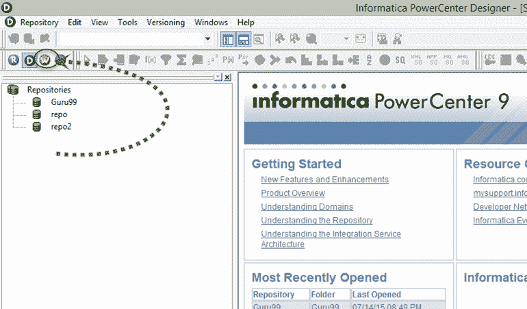

**步骤 2** –这将打开“工作流管理器”窗口。 然后，在工作流管理器中。

1.  我们将连接到存储库“ guru99”，因此双击该文件夹以进行连接。
2.  输入用户名和密码，然后选择“连接按钮”。

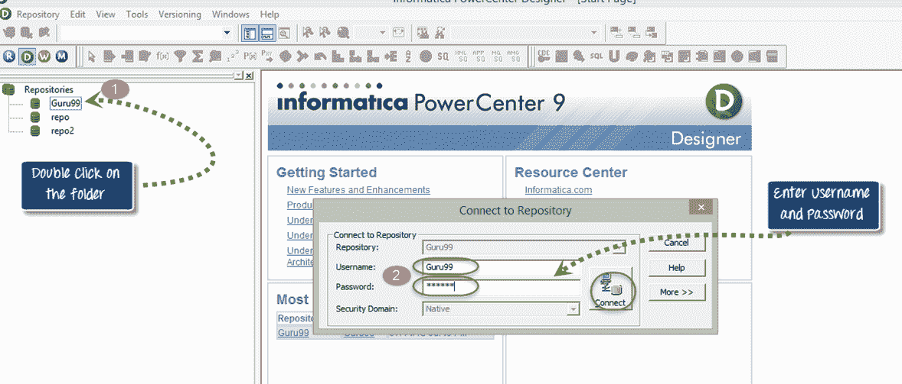

**步骤 3** -在工作流管理器中。

1.  右键点击文件夹
2.  在弹出菜单中，选择打开选项

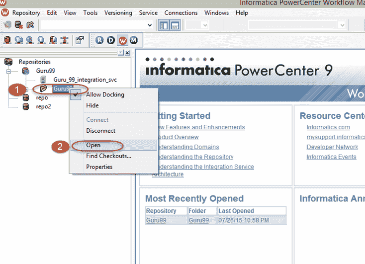

这将打开工作流管理器的工作区。

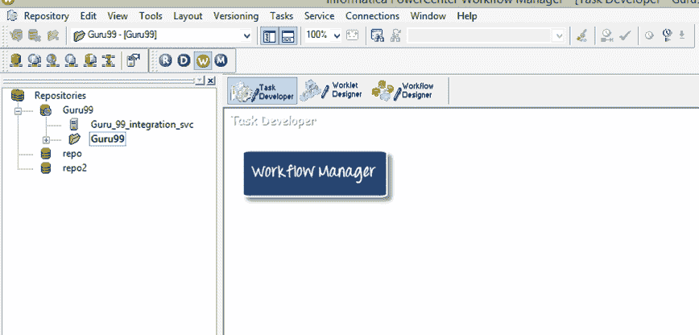

## 如何为工作流管理器创建连接

要在工作流管理器中执行任何任务，您需要创建**连接**。 通过使用这些连接，Integration Service 连接到不同的对象。

例如，在映射中，如果 oracle 数据库中有源表，则将需要 oracle 连接，以便集成服务可以连接到 oracle 数据库以获取源数据。

可以在工作流管理器中创建以下类型的连接。

*   关系联系
*   ftp 连接
*   队列
*   应用

您将创建的连接选择取决于您要连接的源系统和目标系统的类型。 通常，您将使用**关系连接。**

## 创建关系连接

**步骤 1** –在工作流管理器中

1.  单击连接菜单
2.  选择关系选项

**步骤 2** –在弹出窗口中

1.  选择 Oracle 类型
2.  点击新按钮

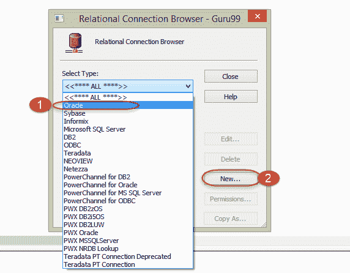

**步骤 3** –在新的连接对象定义窗口中

1.  输入连接名称（新名称-guru99）
2.  输入用户名
3.  输入密码
4.  输入连接字符串
5.  将其他设置保留为默认设置，然后选择确定按钮

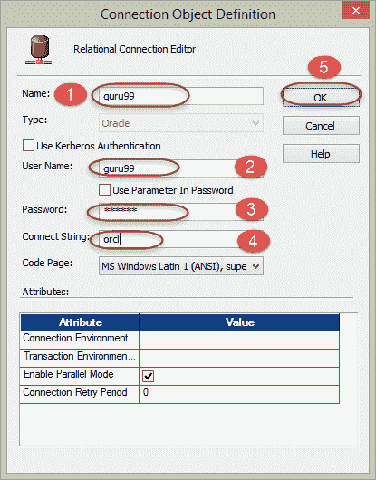

**步骤 4** –您将返回上一个窗口。 单击关闭按钮。

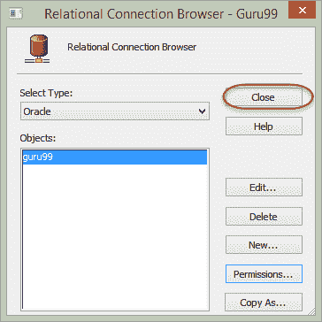

现在，您已经在工作流管理器中设置了关系连接。

## 工作流管理器的组件

工作流管理器有三个组件工具，可帮助在工作流管理器中创建各种对象。 这些工具是

*   任务开发者
*   工作器设计师
*   工作流程设计师

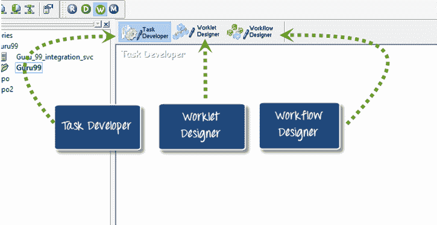

**任务开发人员** –任务开发人员是一个工具，您可以借助它创建可重复使用的对象。 工作流管理器中的可重用对象是可以在多个工作流中重用的对象。 例如，如果您在任务开发人员中创建了命令任务，那么您可以在任意数量的工作流中重用此任务。

工作流设计器的作用是执行添加到其中的任务。 您可以在工作流中添加任何任务。

您可以在任务开发器中创建三种类型的可重用任务。

*   命令任务
*   会话任务
*   电子邮件任务

**命令任务–** 命令任务用于在工作流程执行期间执行不同的 Windows / unix 命令。 您可以创建命令任务来执行各种基于命令的任务。 借助此任务，您可以执行命令**创建文件/文件夹，删除文件/文件夹，对文件进行 ftp** 等。

**会话任务-**运行映射需要 Informatica 中的会话任务。

*   没有会话任务，您将无法执行或运行映射
*   会话任务只能执行一个映射。 因此，映射和会话之间存在一对一的关系
*   会话任务是一个对象，借助该对象，informatica 可以知道如何以及在何处执行映射以及何时执行映射
*   会话无法独立执行，必须将会话添加到工作流中
*   在会话中，可以配置对象缓存属性，还可以配置高级性能优化配置。

**电子邮件任务-**在 Integration Service 运行工作流程时，可以借助电子邮件任务将电子邮件发送给已定义的收件人。 例如，如果要监视会话完成的时间，可以将会话配置为发送包含会话开始和结束时间详细信息的电子邮件。 或者，如果您希望 Integration Service 在工作流完成/失败时通知您，则可以为其配置电子邮件任务。

## 如何创建命令任务

**步骤 1** -要创建命令任务，我们将使用任务开发器。 在工作流管理器中，通过从菜单中单击“任务开发者”选项卡来打开任务开发者。

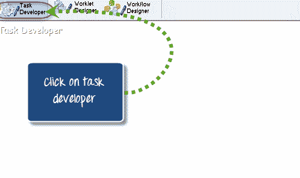

**步骤 2** –任务开发人员打开后，请按照以下步骤操作

1.  选择任务菜单
2.  选择创建选项

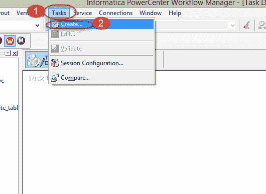

**步骤 3** –在创建任务窗口中

1.  选择命令作为要创建的任务类型
2.  输入任务名称
3.  选择创建按钮

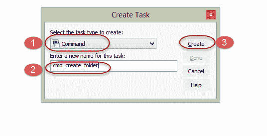

这将创建命令任务文件夹。 现在，您必须配置任务以在其中添加命令，我们将在下一步中看到。

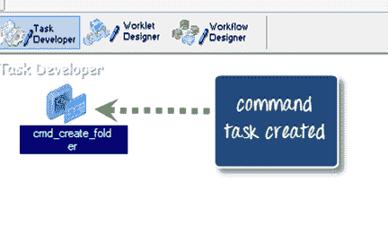

**步骤 4** –要配置任务，请双击命令任务图标，它将打开“编辑任务窗口”。 在新的编辑任务窗口上

1.  选择命令菜单
2.  单击添加新命令图标
3.  输入命令名称
4.  单击命令图标以添加命令文本

这将打开一个命令编辑器框。

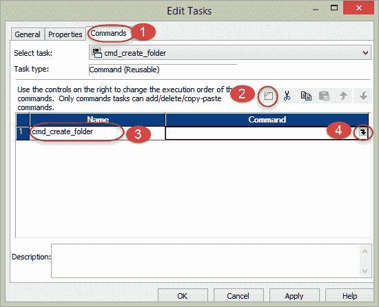

**步骤 5** –在命令编辑器框中，输入命令“ mkdir C：\ guru99”（这是 Windows 命令，用于创建名为“ guru99”的文件夹），然后选择“确定”。

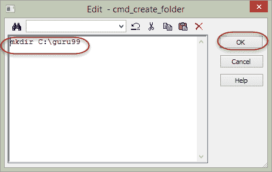

完成此步骤后，您将返回到编辑任务窗口，您将能够看到添加到命令文本框中的命令。

**步骤 6** –在编辑任务窗口中单击确定，

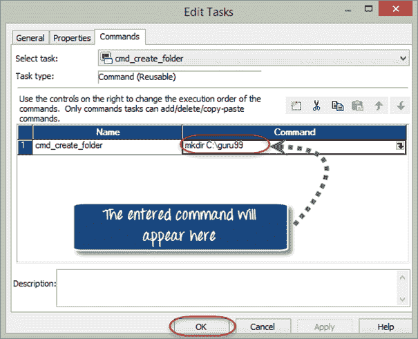

命令任务将在任务开发人员的“ Guru99”存储库下创建。

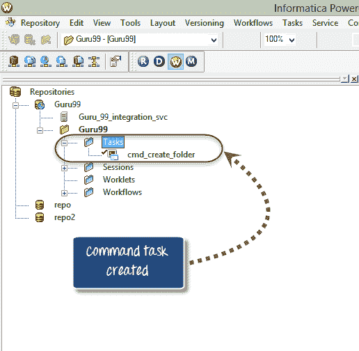

**注意** –使用 ctrl + s 快捷方式将更改保存在存储库中

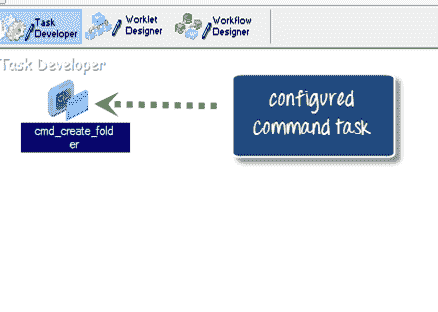

## 如何创建工作流程以执行命令任务

要执行命令任务，您必须打开工作流程设计器。 工作流设计器是父对象或容器对象，您可以在其中添加多个任务，并且在执行工作流时，将执行所有添加的任务。 创建工作流程

**步骤 1** –通过单击工作流程设计器菜单打开工作流程设计器

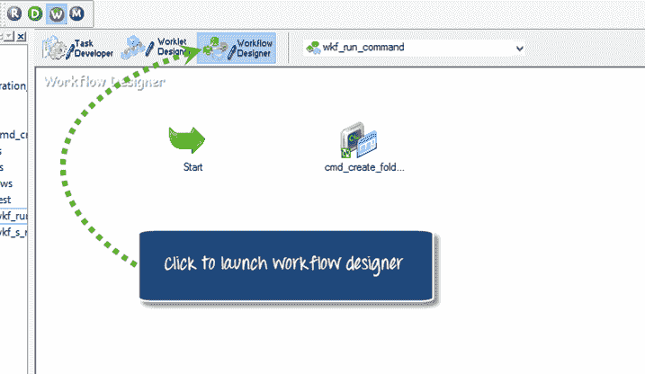

**步骤 2** –在工作流程设计器中

1.  选择工作流程菜单
2.  选择创建选项

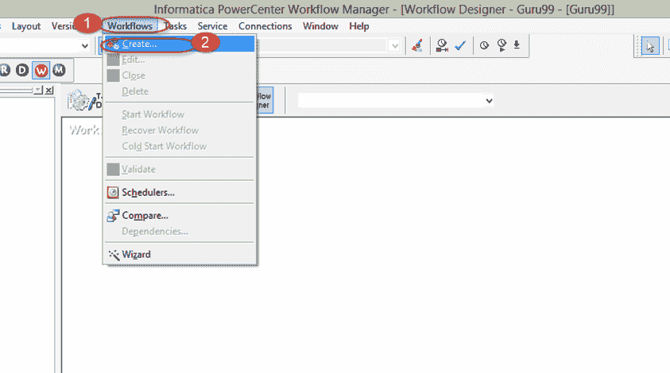

**步骤 3** –在“创建工作流程”窗口中

1.  输入工作流程名称
2.  选择确定按钮（将其他选项保留为默认值）

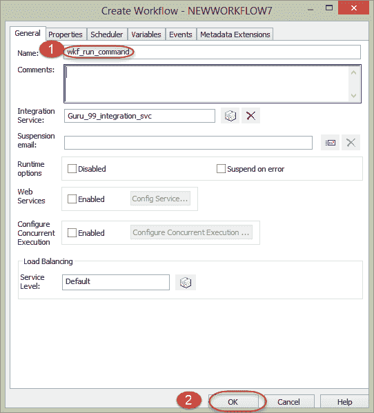

这将创建工作流程。

**命名约定-**工作流名称使用' **wkf_'**作为前缀，如果您拥有名为“ **s_m_employee_detail** ”的会话，则该工作流的名称可以命名为' **wkf_s_m_employee_detail'**。

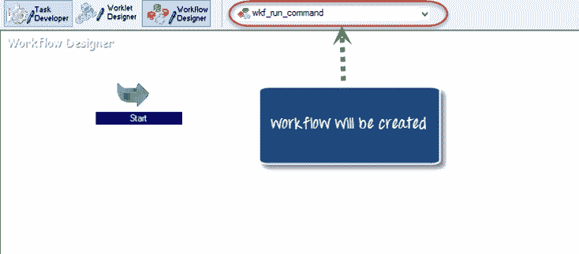

创建工作流时，它不包含任何任务。 因此，要执行工作流中的任何任务，您必须在其中添加任务。

**步骤 4** -将在 Task Developer 中创建的命令任务添加到工作流设计器中

1.  在导航器树中，展开任务文件夹
2.  将命令任务拖放到工作流设计器

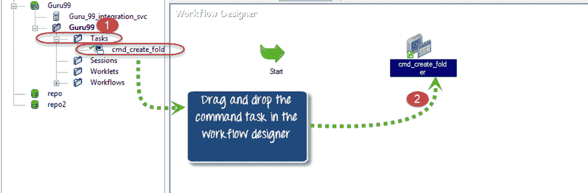

**步骤 5** -从顶部菜单的工具箱中选择“链接任务选项”。 （链接任务选项将工作流中的各种任务链接到启动任务，以便可以定义任务的执行顺序）。

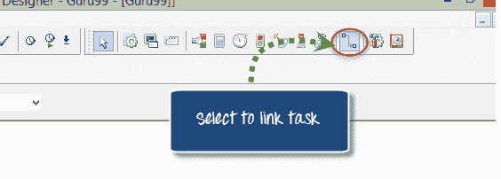

**步骤 6** –选择链接任务图标后，将允许您拖动启动任务和命令任务之间的链接。 现在选择启动任务，并将链接拖到命令任务。

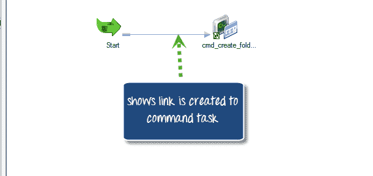

现在，您已经准备好要执行命令任务的工作流程。

## 如何执行工作流程

**步骤 1** –执行工作流程

1.  从菜单中选择工作流程选项
2.  选择启动工作流程选项

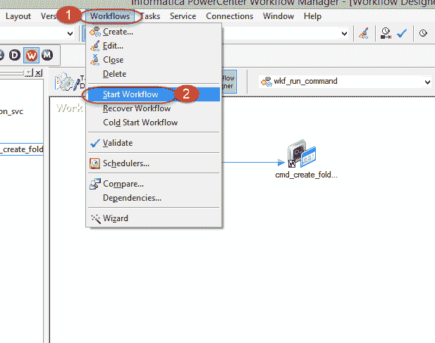

这将打开工作流程监控器窗口并执行工作流程

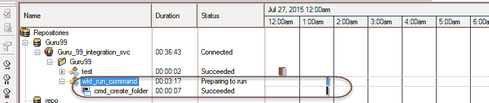

一旦工作流程执行完毕，它将执行命令任务以在定义的目录中创建一个文件夹（guru99 文件夹）。

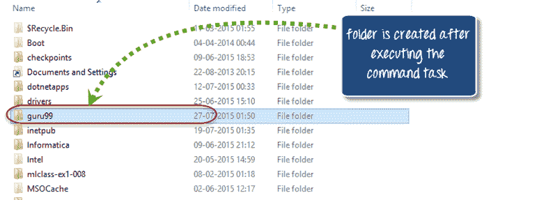

## 会话任务

运行映射需要 Informatica 中的会话任务。

没有会话任务，您将无法执行或运行映射，并且会话任务只能执行单个映射。 因此，映射和会话之间存在一对一的关系。 会话任务是一个对象，借助该对象，Informatica 可以知道如何以及在哪里执行映射以及何时执行映射。 会话无法独立执行，必须将会话添加到工作流中。 在会话中，可以配置对象缓存属性，还可以配置高级性能优化配置。

## 如何创建会话任务。

在本练习中，您将为上一篇文章中创建的映射“ m_emp_emp_target”创建一个会话任务。

**步骤 1** –打开工作流程管理器并打开任务开发者

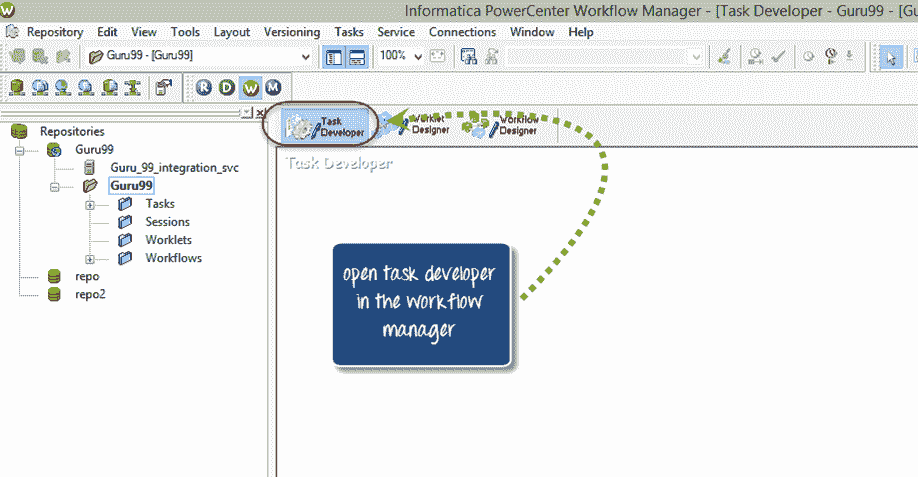

**步骤 2** –现在，一旦任务开发者打开，在工作流管理器中转到主菜单

1.  点击任务菜单
2.  选择创建选项

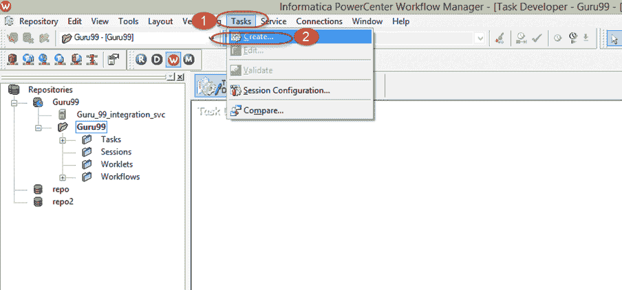

这将打开一个新窗口“创建任务”

**Step 3** – In the create task window

1.  选择会话任务作为任务类型。
2.  输入任务名称。
3.  点击创建按钮

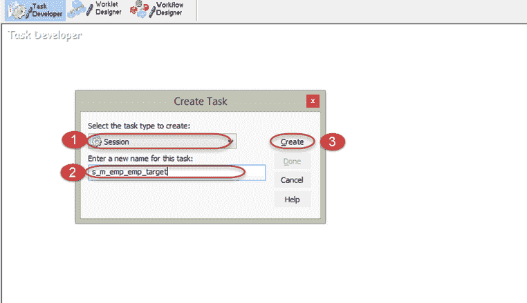

**步骤 4** –将出现一个用于选择映射的窗口。 选择要与此会话关联的映射，在本示例中，选择“ m_emp_emp_target”映射，然后单击“确定”按钮。

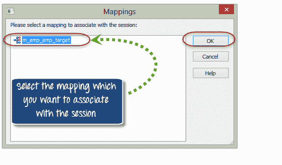

**步骤 5** –之后，单击“完成”按钮

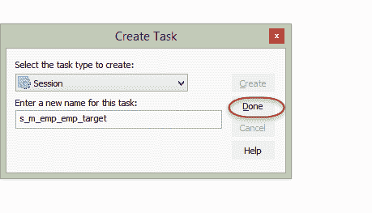

会话对象将出现在任务开发人员中

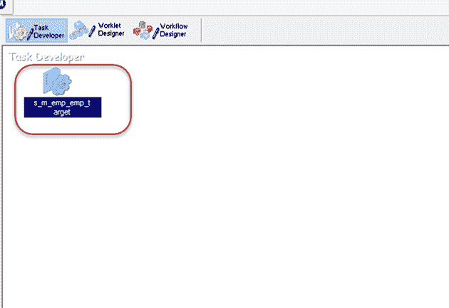

**步骤 6** –在此步骤中，您将为会话任务创建工作流程。 单击工作流程设计器图标。

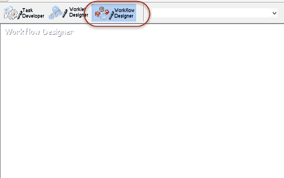

**步骤 7** –在工作流设计器工具中

1.  点击工作流程菜单
2.  选择创建选项

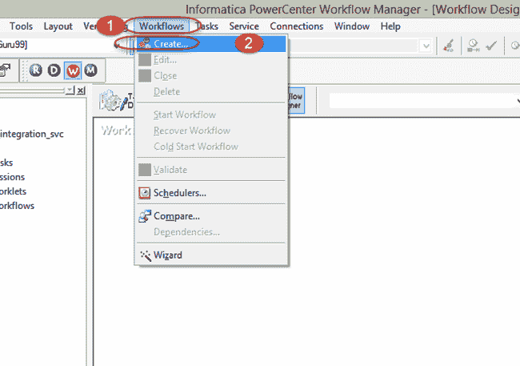

**步骤 8** –在“创建工作流程”窗口中

1.  输入工作流程名称
2.  选择确定。 （将其他属性保留为默认值，无需更改任何属性）

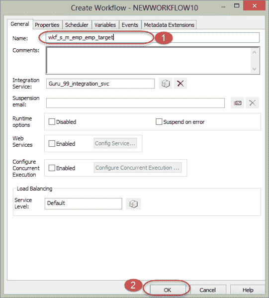

在工作流管理器中，将出现一个开始任务，这是执行工作流的起点。

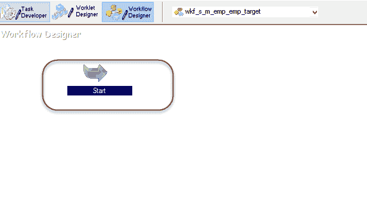

**步骤 9** –在工作流程管理器中

1.  展开导航树下的会话文件夹。
2.  拖放您在工作流管理器工作空间中创建的会话。

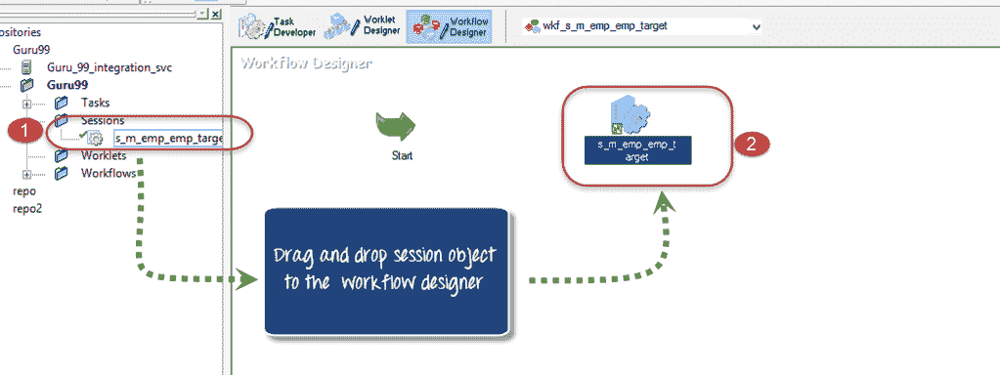

**步骤 10** -单击工具框中的链接任务选项。

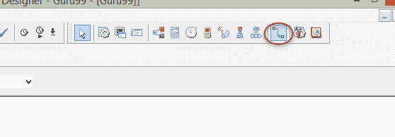

**步骤 11** -使用链接链接启动任务和会话任务。

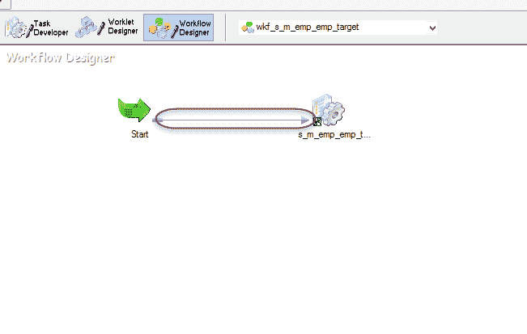

**步骤 12** –在 wokflow 管理器中双击会话对象。 它将打开一个任务窗口以修改任务属性。

**步骤 13** –在编辑任务窗口中

1.  选择映射选项卡
2.  选择连接属性
3.  将连接分配给源和目标，即我们在早期步骤中创建的连接。
4.  选择确定按钮

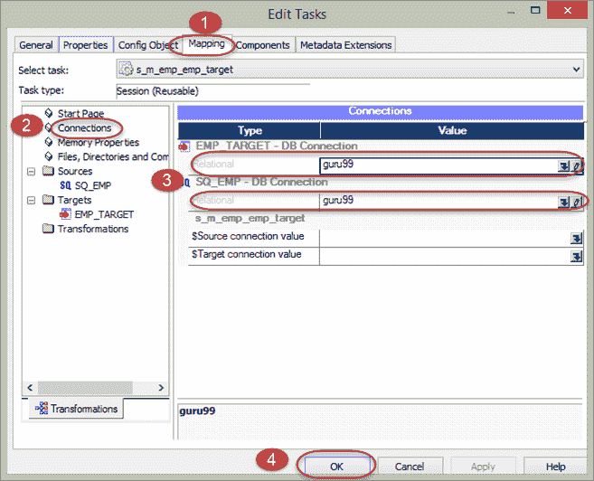

现在，您的工作流程配置已完成，您可以执行工作流程。

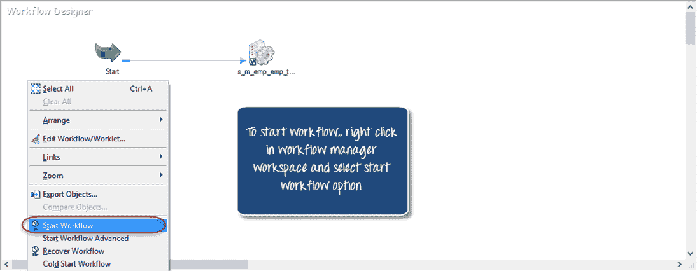

## 如何将多个任务添加到启动任务

启动任务是执行工作流的起点。 有两种方法可以将多个任务链接到一个启动任务。

1.  平行
2.  序列号

在并行链接中，任务直接链接到启动任务，并且所有任务同时开始并行执行。

## 如何并行添加任务

**步骤 1 –** 在工作流程管理器中，打开工作流程“ wkf_run_command”

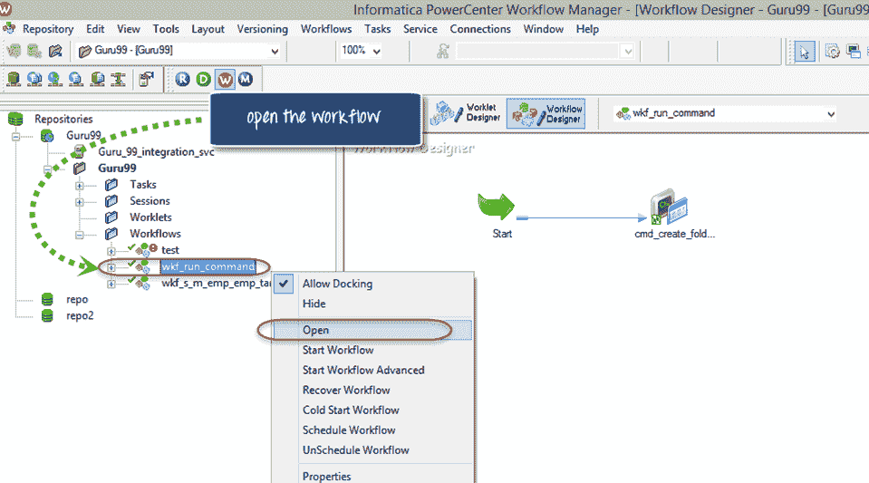

**步骤 2 –** 在工作流程中，添加会话任务“ s_m_emp_emp_target”。 （通过选择会话，然后拖放）

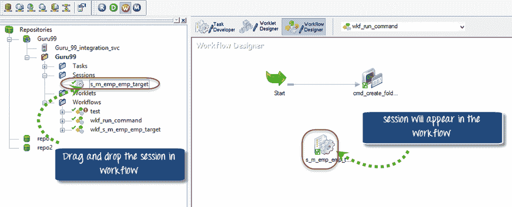

**步骤 3 –** 从工具箱中选择链接任务选项

**步骤 4-**将会话任务链接到启动任务（通过单击启动任务，按住单击并连接到会话任务）

链接会话任务后，工作流程将如下所示。

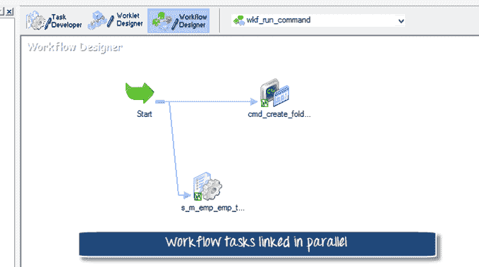

**步骤 5 –** 启动工作流程并在工作流程监视器中进行监视。

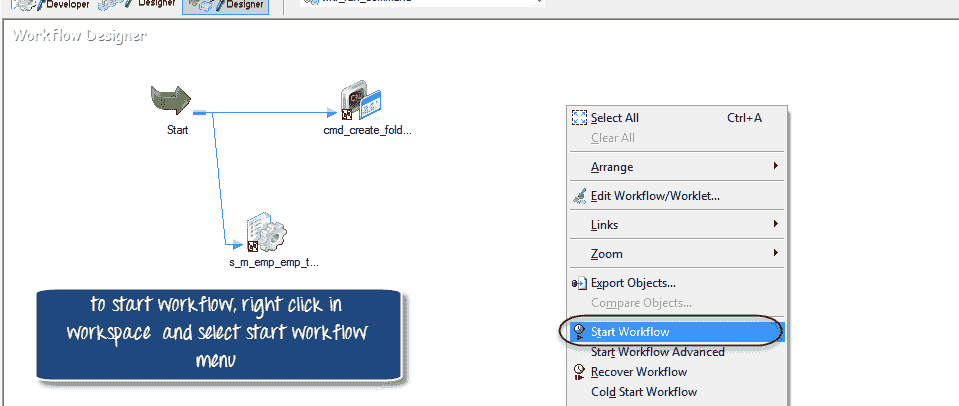

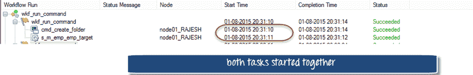

## 如何以串行模式添加任务

但是在以串行方式添加任务之前，我们必须删除为演示并行执行任务而添加的任务。 为了那个原因

**步骤 1 –** 打开工作流程“ w.kf_run_command”

1.  选择会话任务的链接。
2.  在菜单中选择编辑选项
3.  选择删除选项

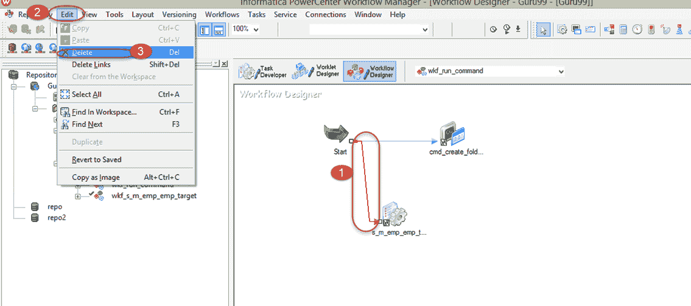

**步骤 2 –** 确认对话框将出现在窗口中，选择是选项

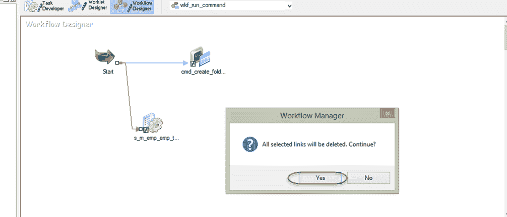

启动任务和会话任务之间的链接将被删除。

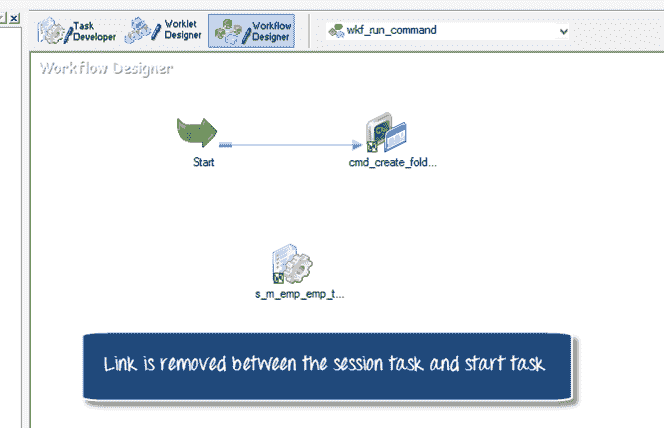

**步骤 3 –** 现在再次转到顶部菜单，然后从工具箱中选择链接任务选项

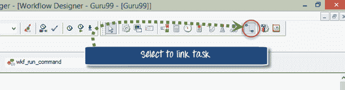

**步骤 4 –** 将会话任务链接到命令任务

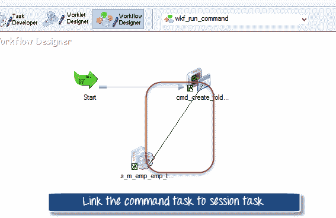

链接后，工作流程将如下所示

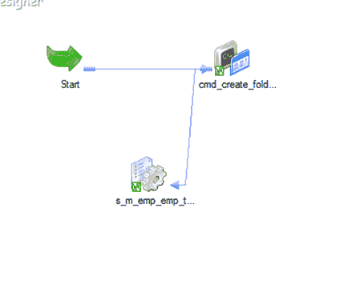

**步骤 5-**使工作流程的视觉外观更清晰

1.  右键单击工作流的工作区
2.  选择安排菜单
3.  选择水平选项

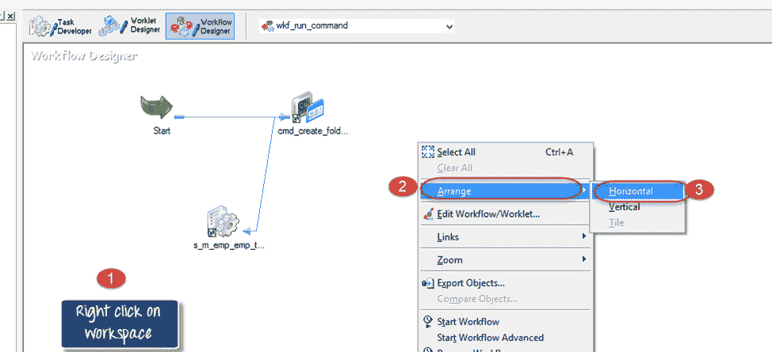

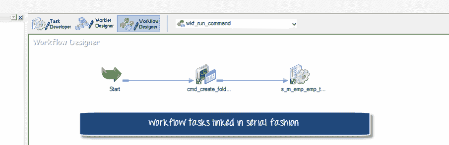

如果启动工作流程，则将先执行命令任务，然后在执行任务后，启动会话任务。

## 工作流程变量

工作流变量允许工作流中的不同任务相互交换信息，还允许任务访问工作流中其他任务的某些属性。 例如，要获取当前日期，可以使用内置变量“ sysdate”。

最常见的情况是，当您在工作流程中有多个任务，而在一个任务中您访问另一个任务的变量时。 例如，如果工作流程中有两个任务，并且要求仅在成功执行第一个任务时才执行第二个任务。 您可以使用工作流中的预定义变量来实现这种方案。

## 实施方案

我们有一个工作流“ wkf_run_command”，其中包含以串行方式添加的任务。 现在，我们将一个条件添加到会话任务和命令任务之间的链接，以便仅在命令任务成功之后才执行会话任务。

**步骤 1-**打开工作流程“ wkf_run_command”

**步骤 2-**双击会话和命令任务之间的链接

出现一个表达窗口

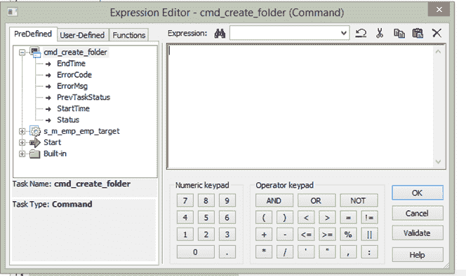

**步骤 3 –** 双击“ cmd_create_folder”菜单下的状态变量。 变量“ $ cmd_create_folder.status”将出现在右侧的编辑器窗口中。

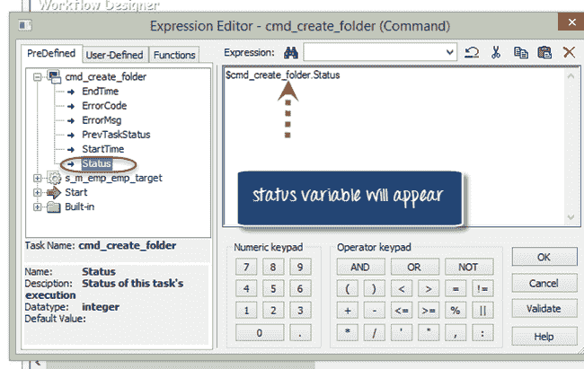

**步骤 4-**现在，我们将变量“ $ cmd_create_folder.status”条件设置为成功状态。 这意味着当先前的任务被执行并且执行成功时，则仅执行下一个会话任务。

1.  将变量更改为“ $ cmd_create_folder.status = SUCCEEDED”值。
2.  单击确定按钮

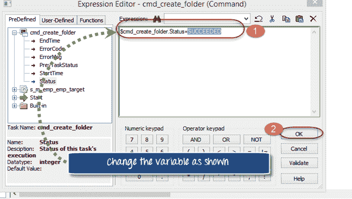

工作流程如下所示

当您执行此工作流程时，命令任务将首先执行，只有成功执行后，才会执行会话任务。

## 工作流程参数

工作流参数是在整个运行过程中保持不变的那些值。 一旦分配了它们的值，它就保持不变。 可以在工作流属性中使用参数，并且可以在参数文件中定义其值。 例如，代替使用硬编码的连接值，可以在连接名称中使用参数/变量，并且可以在参数文件中定义值。

参数文件是我们在其中定义映射/工作流变量或参数的值的文件。 这些文件的扩展名为“ .par”。 作为通用标准，为工作流程创建参数文件。

参数文件的优点

*   帮助将代码从一种环境迁移到另一种环境
*   轻松调试和测试
*   无需修改代码即可轻松修改值

## 参数文件的结构

参数文件的结构

*   [folder_name.WF:Workflow_name]
*   $ Parameter_name =参数值

Folder_name 是存储库文件夹的名称，工作流名称是您要为其创建参数文件的工作流的名称。

我们将为数据库连接“ guru99”创建一个参数文件，该文件在我们早期的会议中分配给源和目标。

## 如何创建参数文件

**步骤 1 –** 创建一个新的空文件（记事本文件）

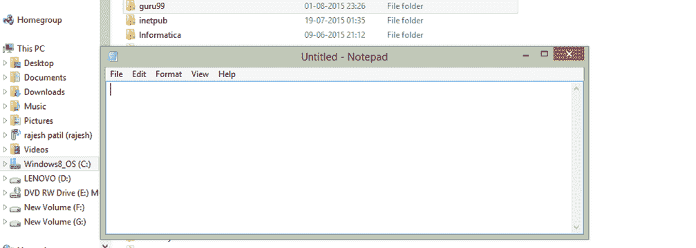

**步骤 2 –** 在文件中输入文本，如图所示

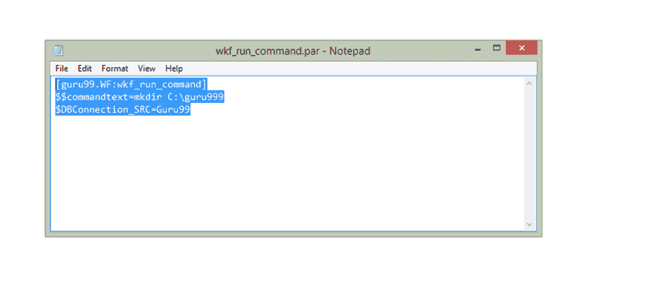

**步骤 3 –** 将文件保存在文件夹 guru99 下的“ C：\ guru99”位置，作为“ wkf_run_command.par”

在文件中，我们创建了参数“ $ DBConnection_SRC”，我们将在工作流中将其分配给连接。

**步骤 4-** 打开工作流程“ wkf_run_command”

1.  选择工作流程菜单
2.  选择编辑选项

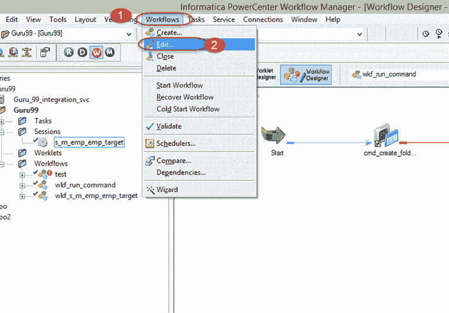

**步骤 5 –** 这将打开编辑工作流程窗口，在此窗口中

1.  转到属性选项卡菜单
2.  输入参数文件名称为“ c：\ guru99 \ wkf_run_command.par”
3.  选择确定按钮

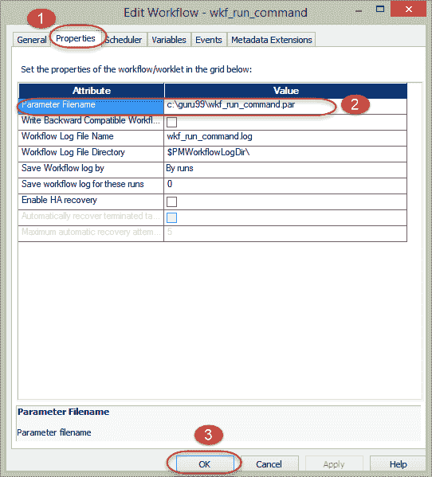

现在，我们完成了定义参数文件的内容并将其指向工作流程的工作。

下一步是在会话中使用参数。

**步骤 6-**在工作流程中，双击会话“ s_m_emp_emp_target”，然后

1.  选择映射选项卡菜单
2.  在左侧面板中选择连接属性
3.  单击目标连接，该目标连接现在已硬编码为“ guru99”

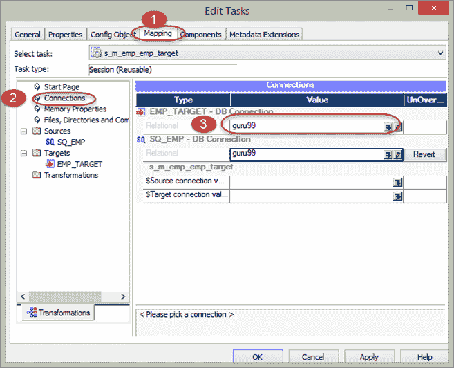

**步骤 7-**连接浏览器窗口将出现，在该窗口中

1.  选择使用连接变量的选项
2.  输入连接变量名称为“ $ DBConnection_SRC”
3.  选择确定按钮

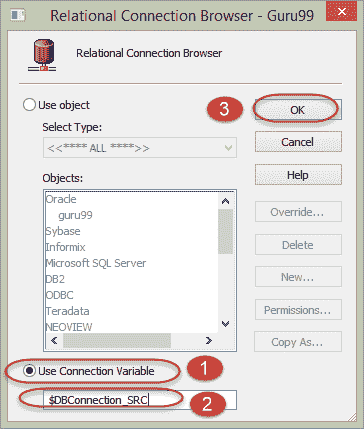

**步骤 8** –在编辑任务窗口中，将为目标显示连接变量，在编辑任务窗口中选择 OK 按钮。

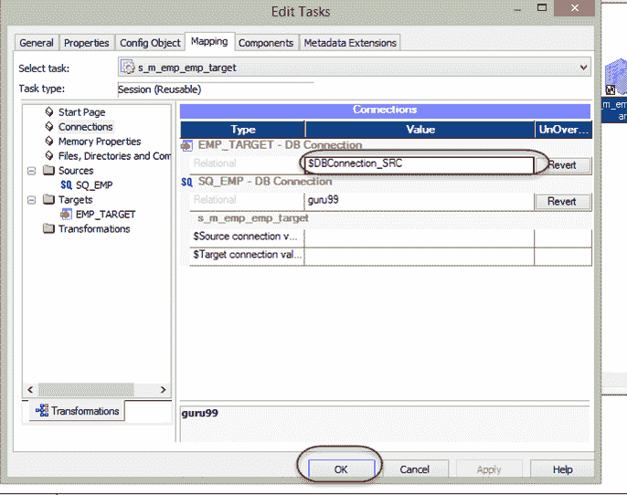

现在，我们完成了为连接创建参数并将其值分配给参数文件的操作。

当我们执行工作流时，工作流会选择参数文件，以在参数文件中查找其参数/变量的值，并获取这些值。