# Informatica 中的调试器：会话，断点，详细数据&映射

> 原文： [https://www.guru99.com/debug-mappings-informatica.html](https://www.guru99.com/debug-mappings-informatica.html)

正如我们在前面的主题中讨论的那样，映射是通过一组转换链接在一起的源对象和目标对象的集合。 这些转换由一组规则组成，这些规则定义了数据流以及如何将数据加载到目标中。

### 什么是调试器？

调试器是 Informatica 中非常方便的实用程序。 当我们执行映射时，Informatica 将根据定义的转换逻辑执行映射。

它的执行类似于批处理模式执行，在批处理模式下，我们看不到中间结果，也看不到数据如何在转换之间进行修改。

很多时候，我们在目标中获得的数据与我们预期的不同。 借助调试器，我们**可以分析数据在映射内的移动方式。 我们可以在调试器中逐行分析数据。**

在本教程中-您将学习

*   [在映射](#1)中使用调试器的步骤
*   [在调试器](#2)中使用断点
*   [Informatica](#3) 中的跟踪
*   [如何在转换中设置跟踪级别](#4)

使用调试器需要一个会话实例，我们可以重用先前创建的现有会话来运行映射，也可以创建一个新的调试会话实例。 由于在调试过程中将从源中获取数据，因此我们可以选择如何处理该数据。

*   我们可以丢弃数据或
*   数据可以加载到目标中

这些选项可以在调试器的配置期间设置。

为了监视调试器，Informatica Designer 中有两个窗口

*   目标窗口
*   实例窗口

在目标窗口中，将显示要插入目标表中的目标记录。 在实例窗口中，您可以选择任何映射转换实例。 之后，该转换的所有端口都将在此窗口中可见，您可以分析数据以及如何转换数据。

## 在映射中使用调试器的步骤

Informatica Designer 提供了使用调试器调试映射的功能。 这意味着我们可以调试和分析任何现有的映射。 调试器的要求是该映射应该是有效的映射。

在练习中，我们将调试我们先前创建的现有映射“ m_emp_emp_target”。 在源数据中，我们将检查 employee_name ='SCOTT'的特定记录。 对于 Scott，我们将验证是否已在 Informatica 中获取值以及记录是否正确推送到目标。

我们的“ emp”表的源数据如下所示。

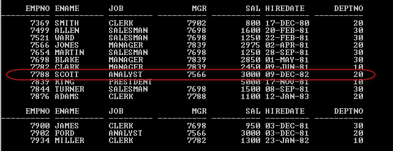

对于 ename“ SCOTT”，使用调试器，我们将检查是否在 Informatica 中获取了“ sal”（工资）列的值。

**步骤 1 –** 打开 Informatica 设计器，然后在设计器中双击映射“ m_emp_emp_target”。 它将打开源限定符和目标定义表，其中显示了 Mapping Designer 中的映射。

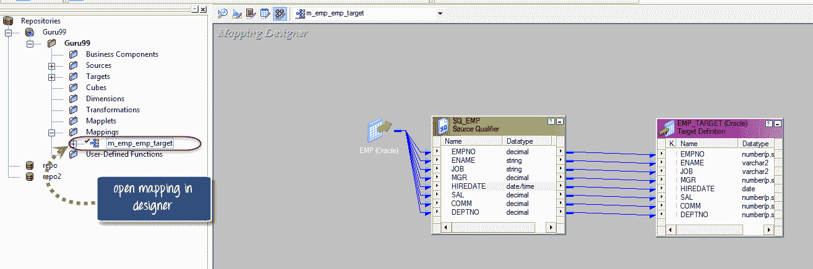

**步骤 2 –** 现在启动调试器

1.  单击映射菜单选项
2.  从选项中选择调试器
3.  选择“启动调试器”选项

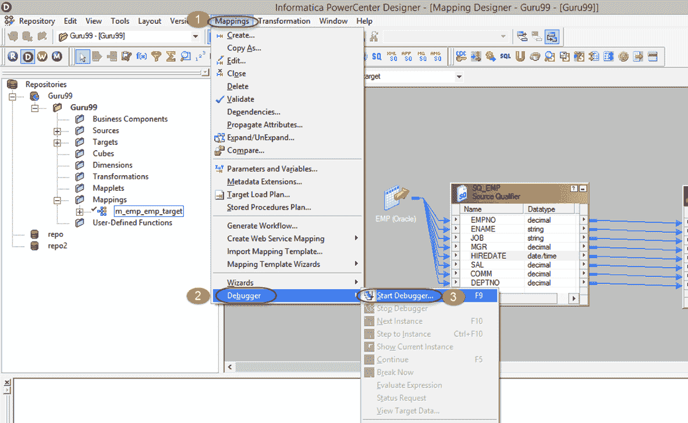

**步骤 3 –** 在调试映射窗口中选择下一步

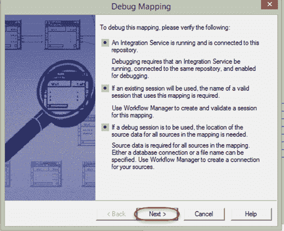

**步骤 4 –** 在下一个窗口中，您将获得一个选择会话类型的选项。 您可以使用现有会话，现有可重用会话，也可以创建调试会话实例。

使用现有会话时，Informatica 将使用您为此映射创建的早期会话。 当您选择创建调试会话实例时，将创建一个新的会话实例进行调试。

在此示例中，我们将选择现有的可重用会话实例。 集成服务将是默认服务。

1.  选择“使用现有会话实例”选项
2.  点击下一步

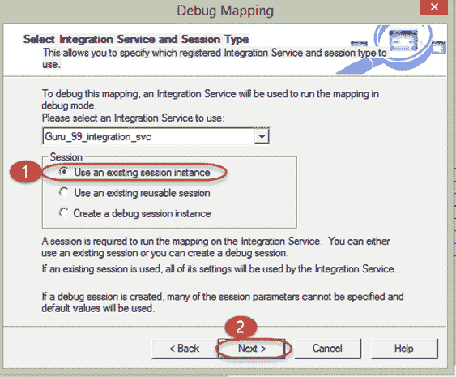

**步骤 5 –** 在新窗口中，Informatica 将提示您选择现有会话进行调试。

选择会话“ s_m_emp_emp_target”，然后单击下一步按钮

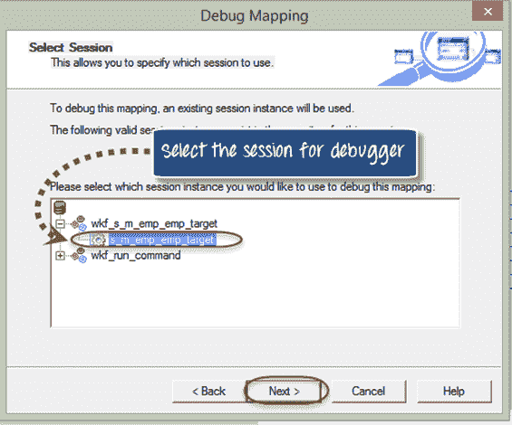

**步骤 6-**在下一个窗口中，将有一个选项“放弃目标数据”，我们选择此选项是因为在调试过程中我们不想在目标表中加载任何数据。

1.  选择选项“放弃目标数据”。
2.  选择目标表“ emp_target”
3.  单击完成按钮。

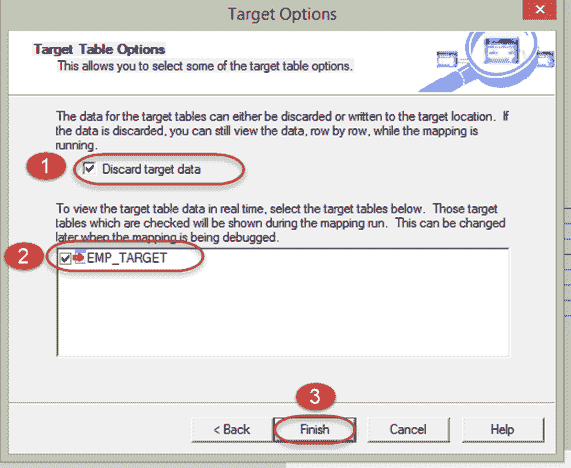

通过以上步骤，我们已经配置并启动了调试器。 现在我们可以调试映射了。

**步骤 7-**调试器已启动，但尚未从源中获取任何行。 在调试期间，它逐行从源中获取数据。 从源开始获取第一行

1.  从菜单中选择映射选项
2.  选择调试器选项
3.  选择下一个实例选项

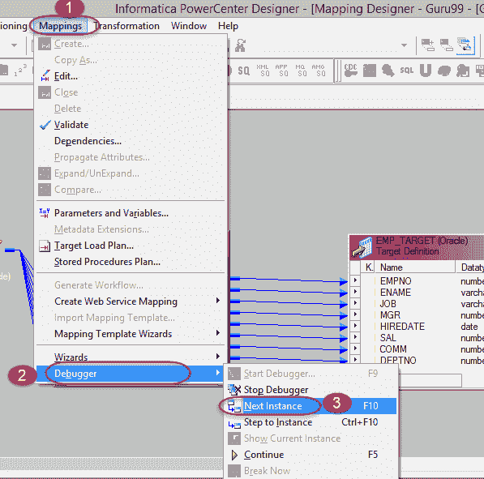

**步骤 8-**在实例窗口中，您将看到从源限定符中提取的第一条记录。

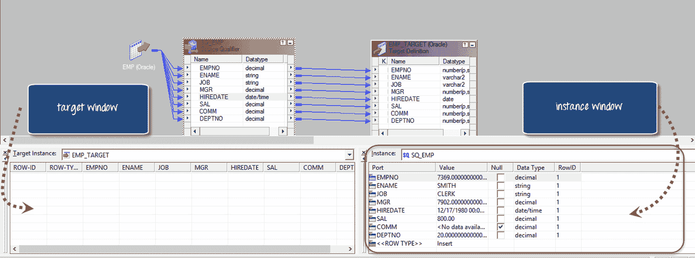

如果您分析实例窗口，它将显示第一条记录-ename“ SMITH”行。 这不是我们想要的记录。 因此，我们可以移至下一个实例。

**步骤 9-**转到下一个实例（移至下一行）

*   按 F10 键（转到下一个实例的快捷方式，而不是转到映射选项然后是调试器选项）

移至下一个实例后，实例窗口中的数据将更改为下一个记录。

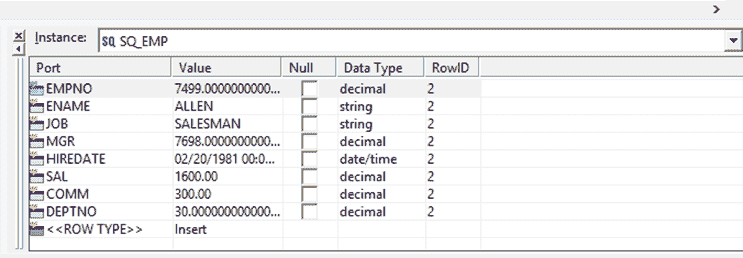

**步骤 10-**持续按 F10 按钮，直到到达“ SCOTT”员工的所需记录。 一旦达到这一点，实例窗口将如下所示

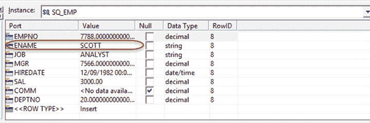

这是我们一直在寻找的实例。 因此，在实例窗口中，我们可以分析数据。 无论是正确发送还是缺少任何值。

在源数据中，“ SCOTT”员工的详细信息类似于 job =“ ANALYST”，经理 id =“ 7566”，sal“ 3000”。

在调试器中，我们为员工“ SCOTT”分析了所有这些详细信息，并且这些详细信息与源数据匹配，因此可以确保由源限定符正确提取了记录。

## 在调试器中使用断点

当我们像前面的示例一样在寻找特定的数据行时，可以定义断点，而不是转到源数据的每个实例。

断点是在调试配置期间定义的一个条件或一组条件，以便当该条件变为 true 时，调试器将停止到该特定实例。

例如，如果我们在断点上定义 deptno = 20，那么只要该条件为 true 的每条记录，调试器就会停止到该数据实例。

**步骤 1-** 配置断点

1.  转到映射菜单
2.  选择调试器选项
3.  选择“编辑断点”选项

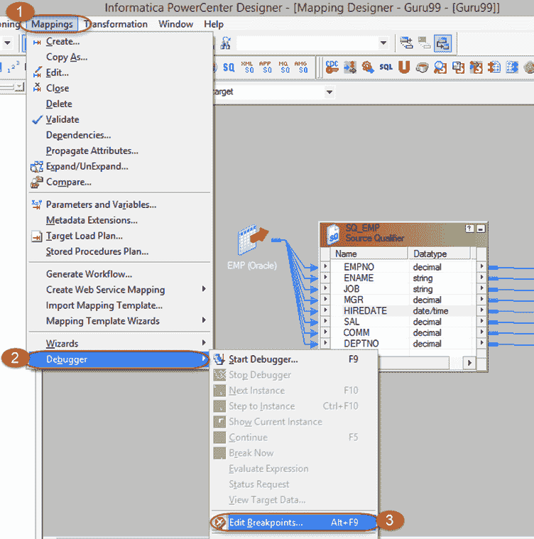

**步骤 2** –您将看到一个“编辑断点”窗口，如下所示

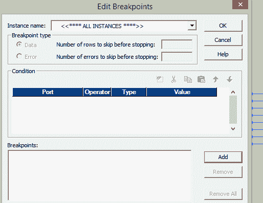

**步骤 3** –在断点窗口中，单击添加按钮

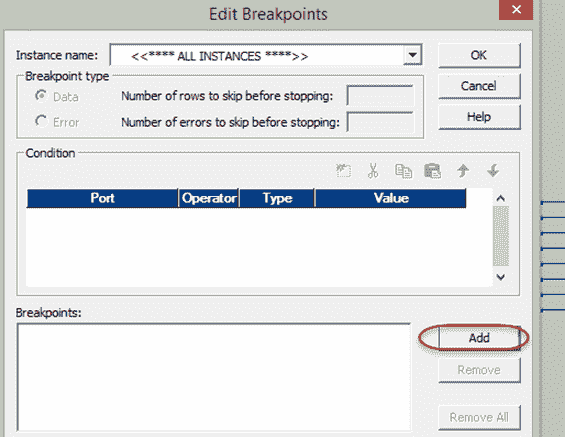

**步骤 4** –在新窗口中

1.  选择 SQ_EMP 作为实例
2.  选择确定按钮

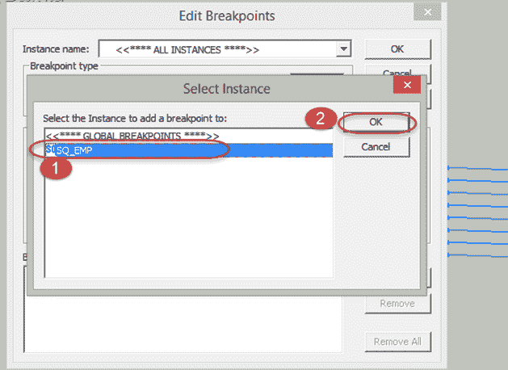

**步骤 5** –前一个窗口如下所示

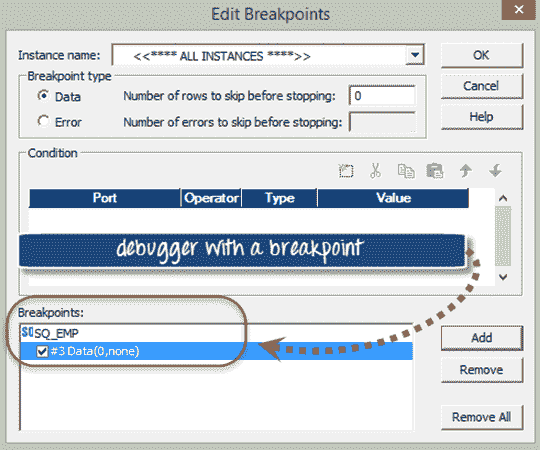

**步骤 6** –您有一个断点，现在您必须定义断点条件。 定义断点条件

1.  点击“添加新条件”图标

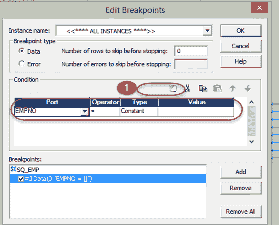

条件选项卡下将出现新行。 在这里我们可以配置条件。

**步骤 7** -在条件表中

1.  在端口下拉列表中，选择“ ENAME”选项（因为我们正在调试记录 ename ='SCOTT'）
2.  在值框中，输入值“ SCOTT”。
3.  选择确定按钮

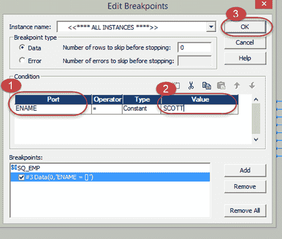

**步骤 8** –现在按照上一主题中所述启动调试器

转到映射菜单**->** 选择调试器选项**->** 选择启动调试器**->** 选择会话实例

**步骤 9** –调试器启动后

1.  选择映射菜单
2.  选择调试器选项
3.  选择继续选项

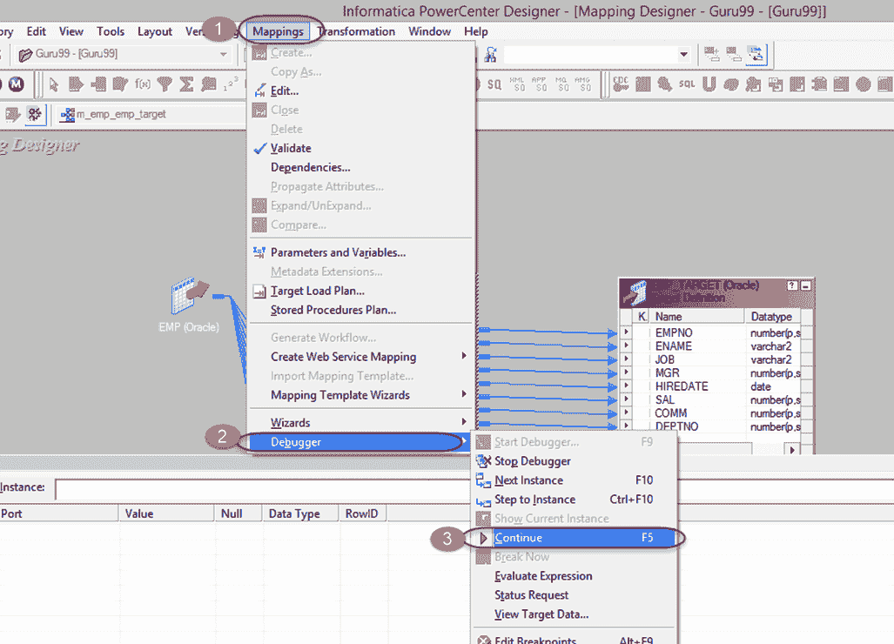

调试器将转到该行本身的每个实例，并将检查条件“ ename = SCOTT”。 对于该条件为真的记录，调试器将在该实例上停止。 因此，当数据量很大时，您可以配置一个断点，而不必转到源记录的每个实例，而可以直接跳转到该记录。

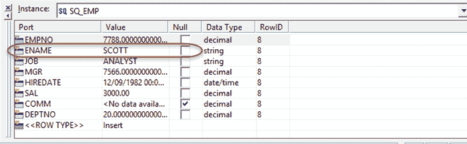

一旦完成所有实例的 Informatica 操作，调试器就会自动停止。 如果要再次分析数据，则必须再次重新启动调试器。

## Informatica 中的跟踪

每当您执行映射会话时，都会生成会话日志。 它由执行的细节组成，例如

*   活动时间
*   错误详情
*   个体转化统计等

在映射的转换中，您可以配置和设置 Informatica 在会话日志中写入多少详细信息。

可以设置四个级别以在转换内部进行跟踪。

| 

**不同的日志模式**

 | 

**在不同日志模式下的活动**

 |
| 

*   正常

 | 

*   在正常模式下，Informatica 会编写有关转换初始化和状态信息，遇到的错误并总结会话结果的信息。

 |
| 

*   简洁的

 | 

*   在简短模式下，Informatica 仅写有关初始化信息和错误详细信息。 简洁模式将最少的详细信息写入会话日志。

 |
| 

*   详细初始化

 | 

*   在详细初始化模式下，Informatica 类似于正常模式写入日志详细信息，此外还写入有关使用的数据和索引文件以及转换统计信息。

 |
| 

*   详细数据

 | 

*   在 Verbose 数据中，Informatica 写入类似于详细初始化的日志，但是此外，它还会写入通过转换的每个数据。

 |

**注意**：默认情况下，跟踪级别设置为正常，建议仅在调试映射时才使用详细数据模式。 简洁模式可用于提高性能，因为它会写入最少的详细信息。 因此，写入日志的开销将最小。

## 如何在转换中设置跟踪级别

**步骤 1** –在 Informatica Designer 中打开您要为其设置跟踪级别的映射

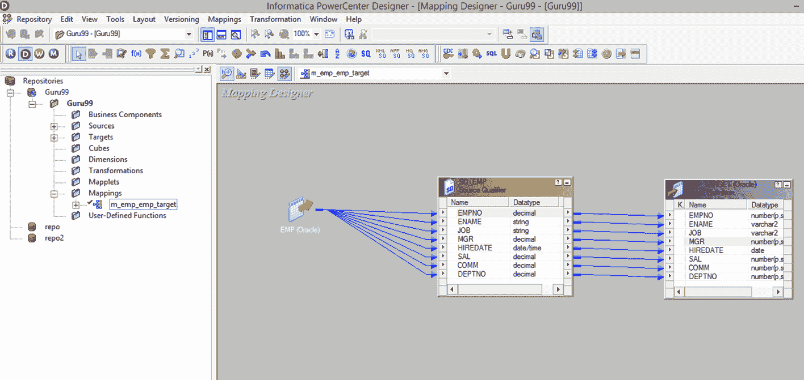

**步骤 2** –双击转换（源限定符转换“ SQ_EMP”）

它将打开编辑转换窗口。

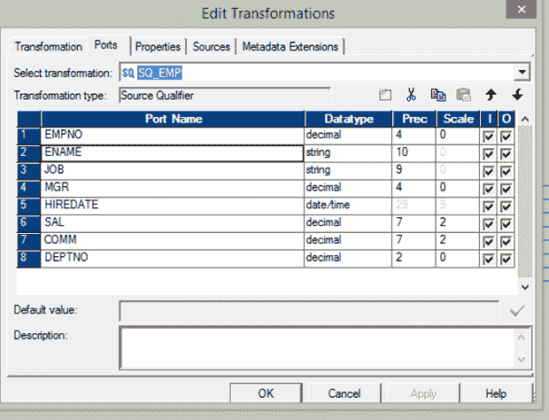

**步骤 3** –在编辑转换窗口中

1.  单击属性选项卡
2.  选择跟踪级别选项
3.  从下拉列表中选择详细数据
4.  选择确定按钮

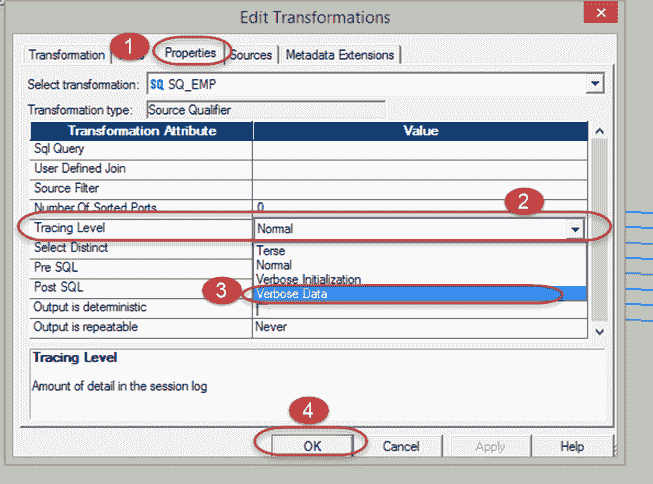

**步骤 4** -保存映射并执行映射（使用 ctrl + s 键盘快捷键保存映射）

**步骤 5** -查看日志

1.  打开工作流监视器，然后选择在上一步中执行的会话
2.  单击“会话日志”选项以打开映射的会话日志

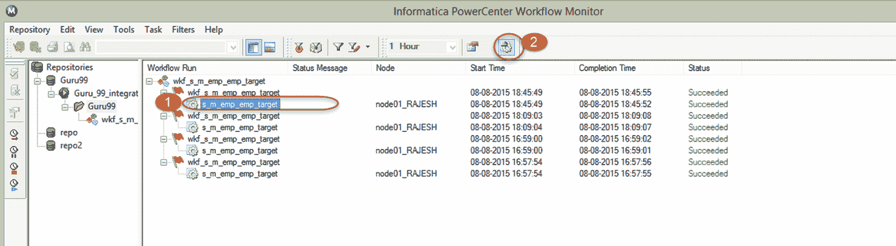

这将打开用于映射的会话日志窗口

会话日志提供有关如何执行会话的详细信息。 它提供了开始和停止执行时的时序详细信息。 它提供了有关性能的基本概念。 它提到您正在使用哪个数据库连接，正在使用什么参数文件。 它还通过提及获取了多少源记录，将多少记录加载到目标中等等来概述源和目标。

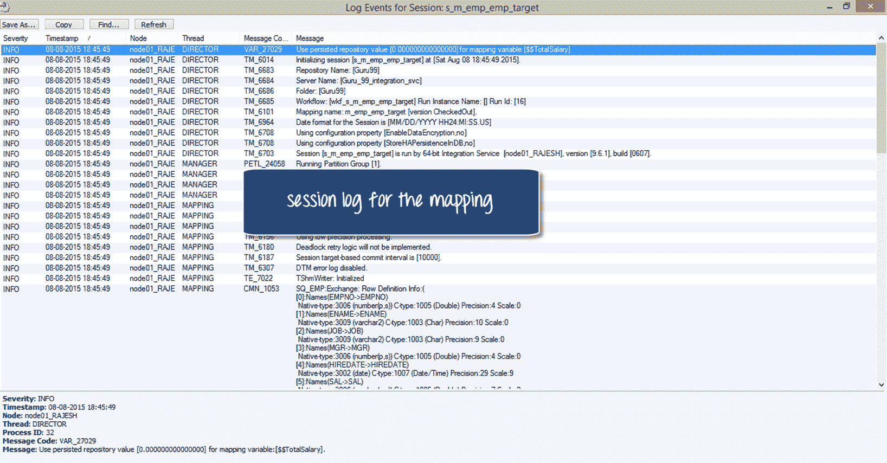

**步骤 6** –向下滚动日志，您可以看到捕获的其他日志详细信息，包括数据记录。

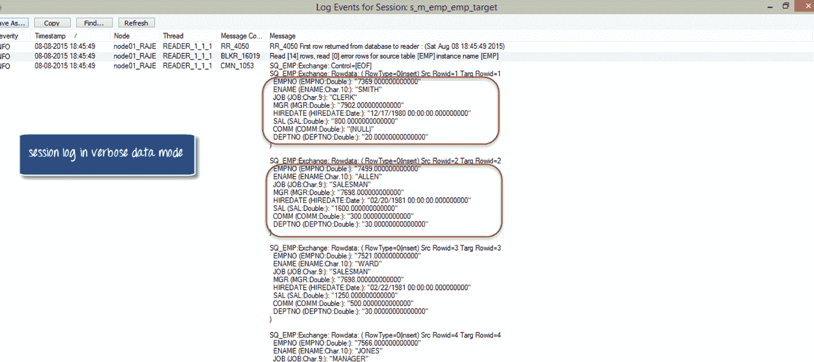

这样，您可以在映射中设置跟踪级别，以捕获其他详细信息以进行调试。

在本教程中，您学习了如何设置，配置和执行调试器，以及如何在映射中设置跟踪级别。 这些选项使您能够调试映射。