# Informatica 中的会话属性：完整教程

> 原文： [https://www.guru99.com/session-objects-informatica.html](https://www.guru99.com/session-objects-informatica.html)

会话属性是一组指令，可指示 Informatica 如何以及何时将数据从源移动到目标。

会话属性是一项任务，就像我们在工作流管理器中创建的其他任务一样。 您创建的任何会话都必须具有与其关联的映射。

会话一次只能有一个映射，并且一旦分配就无法更改。 要执行会话任务，必须将其添加到工作流中。

会话可以是可重用的对象，也可以是不可重用的对象。 在 Task Developer 中创建会话时，可以重用它，但是在工作流设计器中创建会话时，它是不可重用的。

可以将可重用的会话添加到多个工作流程中。

在本教程中，您将学习

*   [会话的属性](#1)
*   [将源行视为属性](#2)
*   [如何将源行视为–删除](#3)
*   [提交间隔-属性](#4)
*   [会话日志文件名&会话日志文件目录](#5)
*   [启用测试负载](#6)
*   [内存属性](#7)
*   [日志选项](#8)
*   [错误处理](#9)
*   [映射和源/目标属性](#10)
*   映射中的[连接属性](#11)
*   [源属性](#12)
*   [目标属性](#13)
*   [会话任务](#14)的成功或失败

## 会话的属性

使用会话的属性，您可以配置会话的各种特征，例如 [SQL](/sql.html) 之前和之后的脚本，日志文件名和路径，内存属性等。

您还可以在会话属性中覆盖映射属性。 在本节中，我们将讨论该会话的以下重要属性。

*   将源行视为
*   提交间隔
*   会话日志文件属性
*   测试负载属性
*   日志选项
*   错误处理
*   源/目标属性
*   连接数

**步骤 1）**在任务开发器中打开会话“ s_m_emp_emp_target”，该任务是我们在前面的教程中创建的。

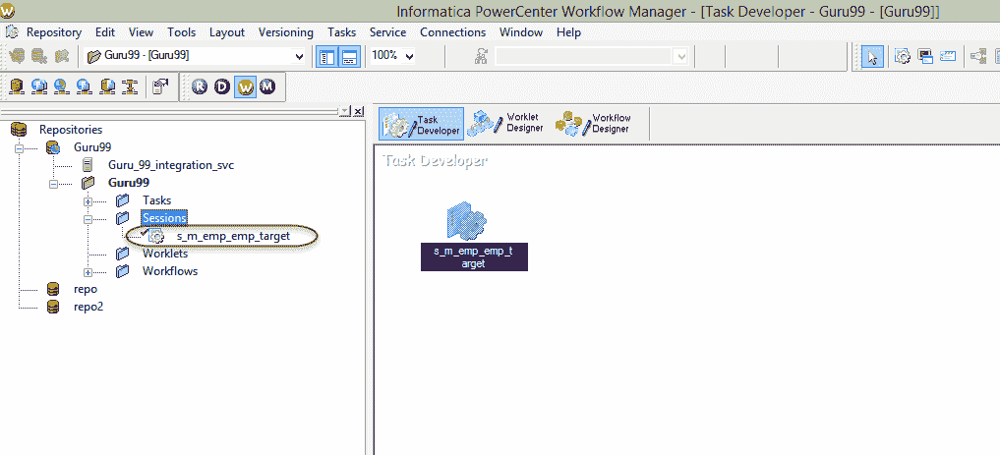

**步骤 2）**双击 Task Developer 中的会话图标以打开编辑任务窗口。

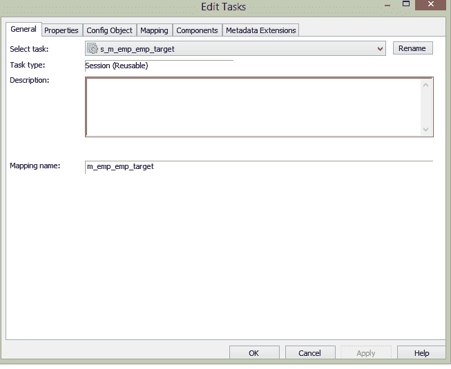

**步骤 3）**在“编辑任务”窗口内，单击属性选项卡。

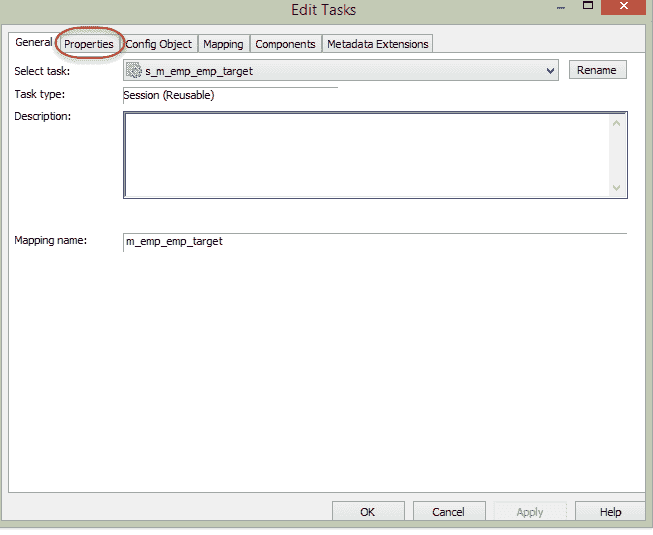

**步骤 4）**在“属性”选项卡中，它将显示会话的属性

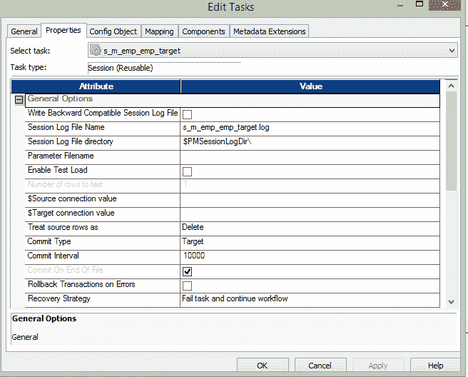

## 将源行视为属性

此属性使您可以定义源数据如何影响目标表。 例如，您可以定义源记录应插入到目标中或从目标中删除。

此属性有四个选项–

*   插
*   更新资料
*   删除
*   数据驱动

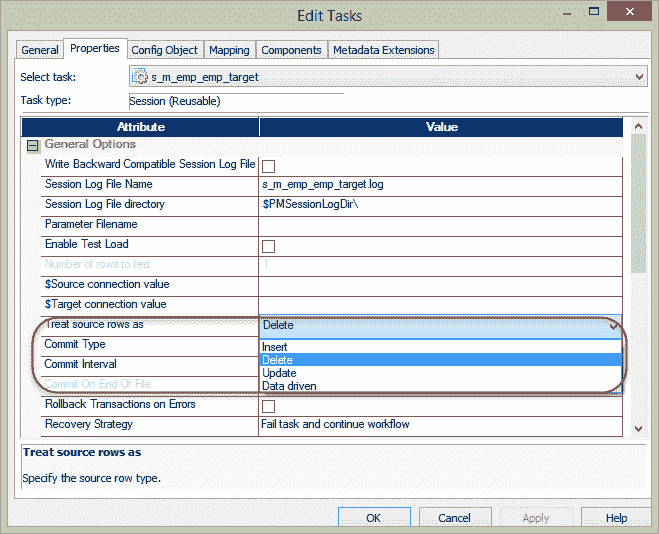

*   当将此属性设置为**时，请插入**，源数据将被标记为要插入。 这意味着将仅插入数据。
*   当属性设置为 **update** 时，目标数据将由源数据更新。 为了更新数据，需要在目标表中定义主键。
*   当属性设置为**时，请删除**，目标中已经存在的源数据将从目标表中删除。 为了使该属性执行和应用更改，应在目标表中定义主键。
*   将属性设置为**数据驱动**时，Informatica 会检查标记了哪些源记录。 如果在映射中将源记录标记为插入，则记录将被插入目标。 如果记录在映射中被标记为更新，则记录将在目标中更新。 因此，将在目标上执行什么操作取决于在映射内部如何处理记录。

## 如何制作对待源行–删除

**步骤 1-**

1.  在会话任务的属性选项卡中，在“将源行作为”中选择“删除”选项。
2.  选择确定按钮

**步骤 2** –要在目标表中定义主键，请打开 Informatica designer

1.  开放目标设计师
2.  双击“ emp_target”表

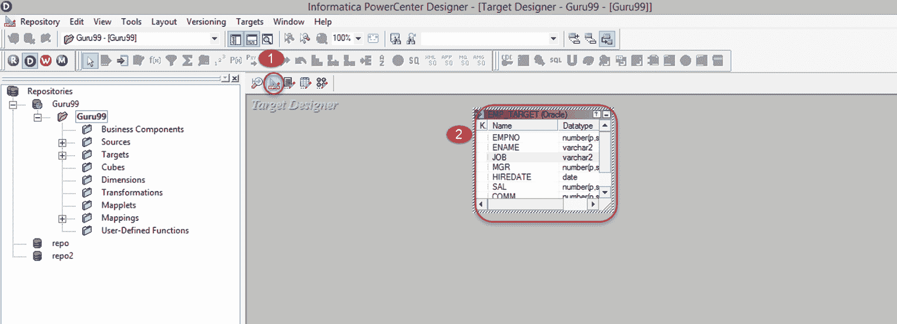

这将为我们的目标表打开一个“编辑表”。

**步骤 3** –在目标表的编辑窗口中

1.  对于 EmpNo 列，从下拉菜单中选择键类型作为“主键”，然后
2.  选择确定按钮。

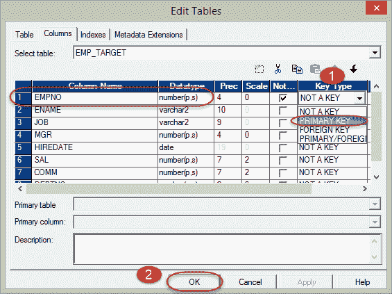

**步骤 4 –** 将更改保存在 Informatica 中，并执行此映射的工作流程。

当您执行此映射时，**目标中已经存在的源记录将被删除。**

## 提交间隔-属性

此属性定义了 Informatica 对目标表进行提交操作之前的时间间隔。

例如，如果要在目标表中插入 20,000 条记录，并且将提交间隔定义为 5,000，则在目标中每插入 5,000 条记录后，将执行一次提交操作。

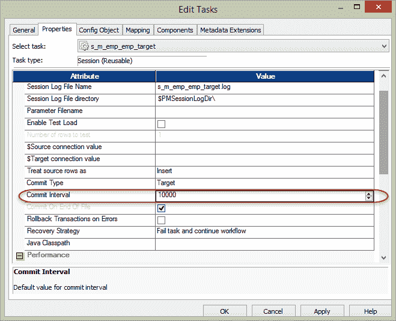

## 会话日志文件名&会话日志文件目录

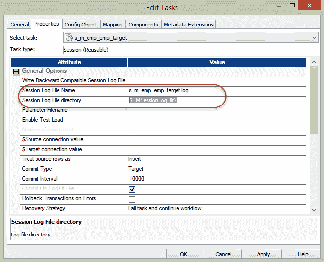

配置此属性以进行修改

*   默认会话日志文件名和
*   日志文件的路径

$ PMSessionLogDir \是一个 Informatica 变量，在 Windows 中，它指向以下默认位置“ C：\ Informatica \ 9.6.1 \ server \ infa_shared \ SessLogs”。

## 启用测试负载

使用此属性，您可以测试会话和映射。 使用此功能并执行会话时，将从源中获取记录，但不会将它们加载到目标中。 因此，此功能有助于[测试](/software-testing.html)映射，参数文件的正确性，映射内部各种转换的功能。

如果启用此功能，则还有另一个属性–“要测试的行数”，应该为要从测试加载源中获取的记录数配置此属性。

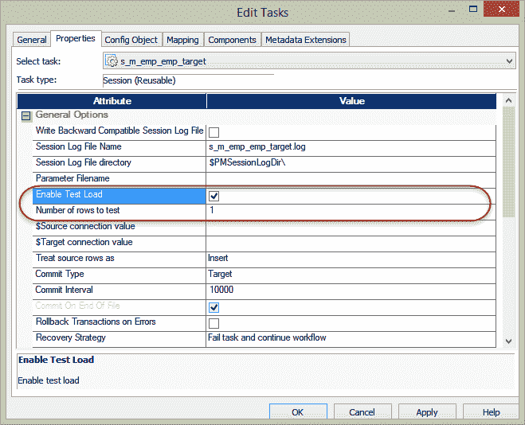

## 内存属性

内存属性使我们可以灵活地微调分配给 Informatica 的内存，以优化性能。 当瓶颈高且性能不佳时，可以尝试使用内存属性来提高性能。

要配置内存属性，请单击编辑任务窗口的“配置对象”选项卡。 它将打开另一个窗口，您可以在其中配置更改。

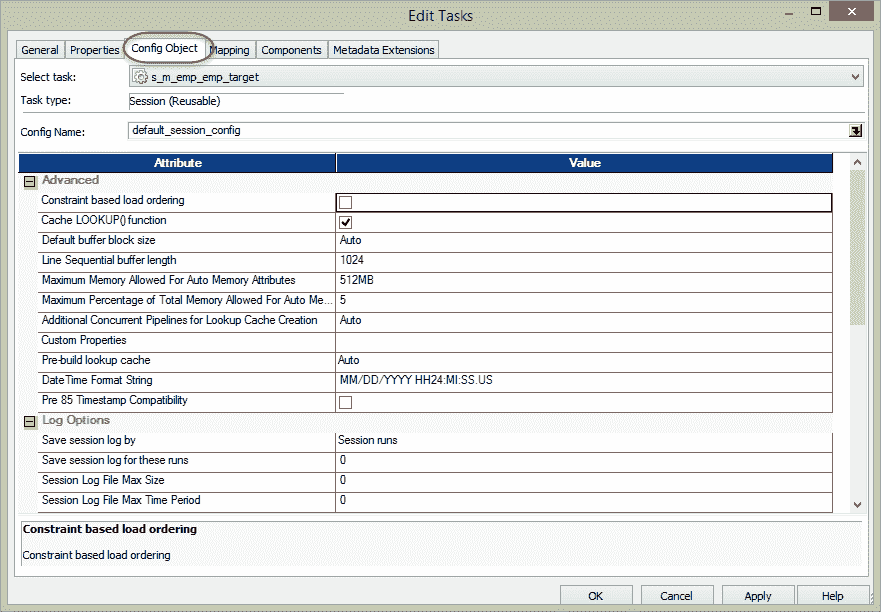

在本节中，您可以配置内存属性。 例如，默认缓冲区块大小，顺序缓冲区长度等。对此属性的更改将确定应为 Informatica 服务分配多少内存以用于其操作。

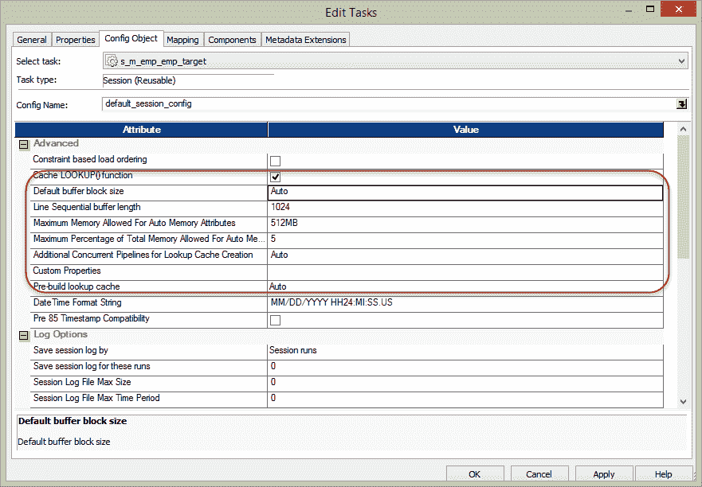

## 日志选项

在此属性部分中，您可以配置会话的日志属性。 您可以为会话要保存的日志数（会话日志文件的最大大小）设置“否”。

## 错误处理

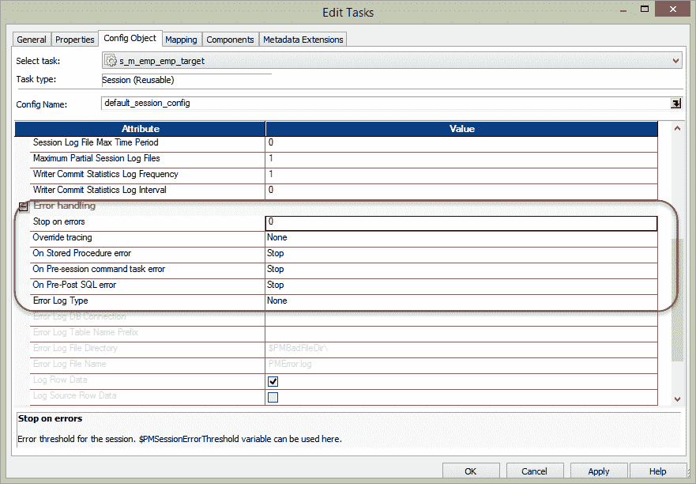

在本部分中，您可以配置会话的错误属性。

使用**在错误**上停止，您可以配置必须停止多少次会话之后的错误。

使用**覆盖跟踪**，您可以覆盖映射跟踪级别。

您还可以针对遇到的各种错误配置会话的行为，例如存储过程错误，预发布 SQL 错误等。

## 映射和源/目标属性

在会话的编辑任务窗口的映射选项卡中，您可以配置与映射及其源/目标和转换相关的属性。 使用此部分属性，您可以覆盖源和目标的属性。 对于源和目标，我们可以覆盖表名，可以应用表名前缀。 在映射内部，我们可以配置各种转换，源和目标的属性，此外，在本节中，我们还可以查看和覆盖这些属性。 就像查看所有这些属性的一个地方。

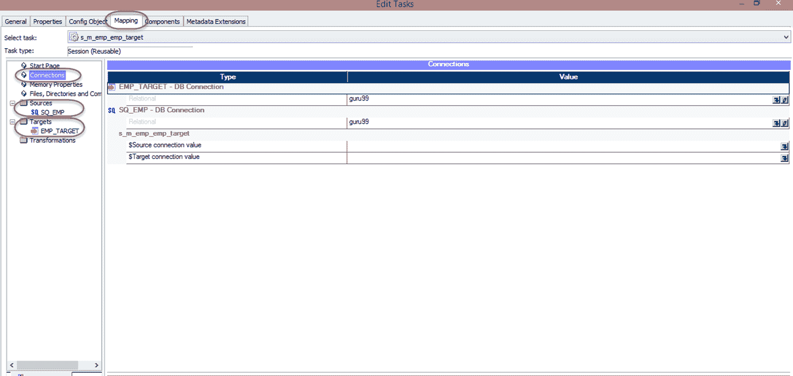

## 映射中的连接属性

使用此属性，可以定义源和目标的数据库连接。

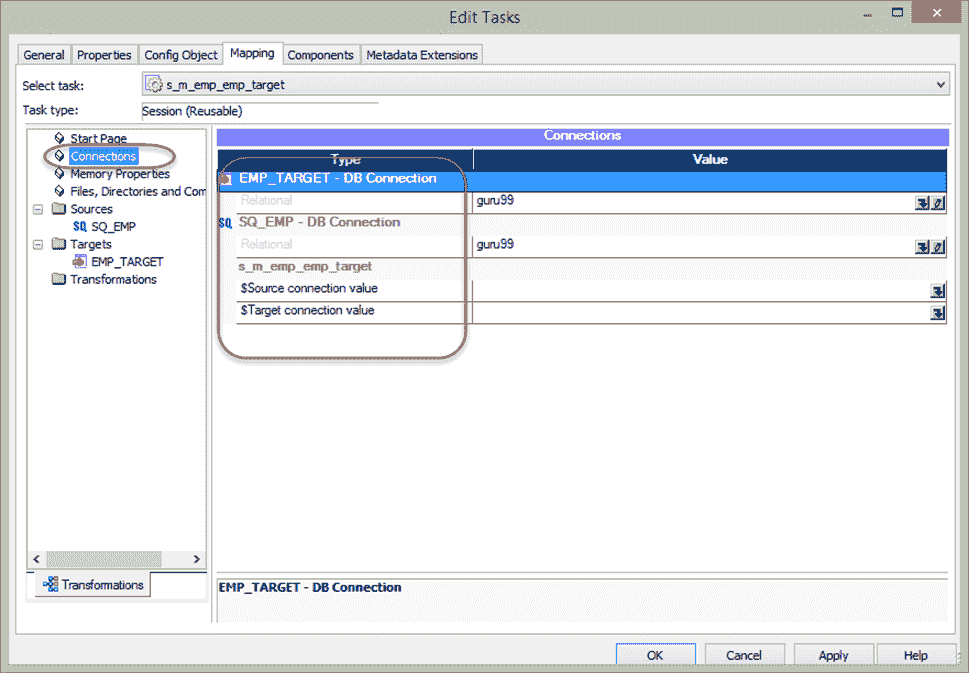

## 来源属性

在本部分中，您可以配置与映射源相关的属性。 您可以为源配置前置和后置 SQL 脚本。

使用 SQL 查询属性，可以覆盖源的 SQL。 您也可以在此部分中覆盖源表名称。

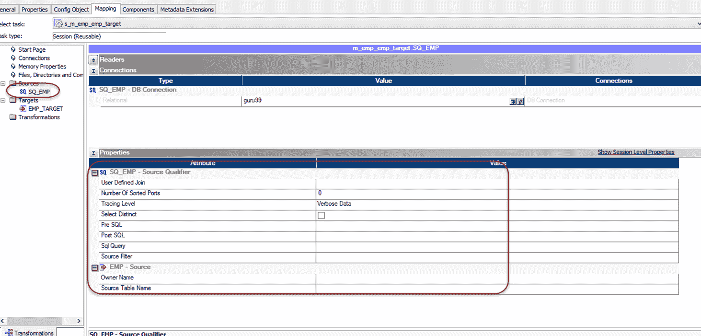

## 目标属性

在本部分中，您可以配置目标的详细信息。 您可以定义目标负载必须是批量负载还是正常模式。

在批量加载中，由于在加载期间没有数据库管理的重做日志缓冲区，因此可以实现性能提升。

另一方面，与大容量负载相比，正常负载速度较慢，但​​是在发生故障的情况下，可以进行数据库恢复。

您也可以定义属性以在填充目标表之前截断它。 这意味着在将任何记录加载到目标中之前，目标表将被截断，然后将执行加载。 当我们为舞台加载创建映射时，此属性很有用。

我们还可以在 SQL 之前和之后定义目标表。 Pre SQL 是在目标表中执行插入操作之前将执行的 SQL 代码，而 Post SQL 将在目标表的加载完成后执行。

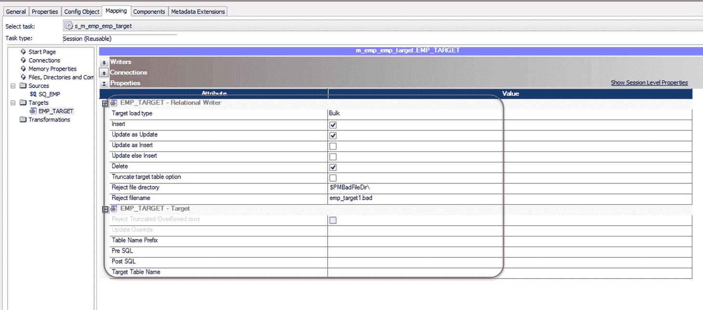

## 会话任务的成功或失败

当工作流程中有多个会话时，可能会出现一个或多个会话失败的情况。 在这种情况下，会有一个问题，就是工作流程的状态如何，因为您的工作流程中失败的任务很少，而成功的任务也很少。 为了处理此类情况，Informatica 提供了在工作流中设置此故障特定属性的选项。 要配置这种行为–

**步骤 1** –打开我们先前创建的工作流程“ wkf_run_command”

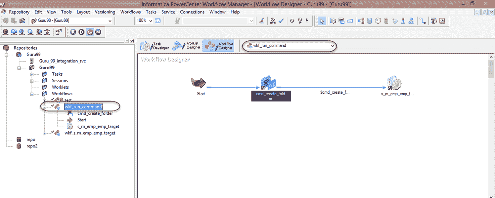

**步骤 2** –双击命令任务，这将打开编辑任务窗口

1.  选择常规标签
2.  选中属性“如果此任务失败，则使父项失败”复选框
3.  选择确定按钮

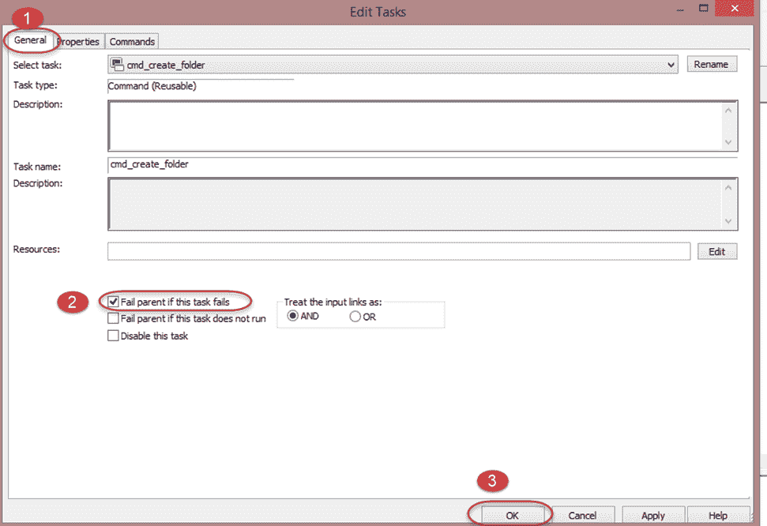

**步骤 3** –双击会话任务，这将打开编辑任务窗口

1.  选择常规标签
2.  选中属性“如果此任务失败，则使父项失败”复选框
3.  选择确定按钮

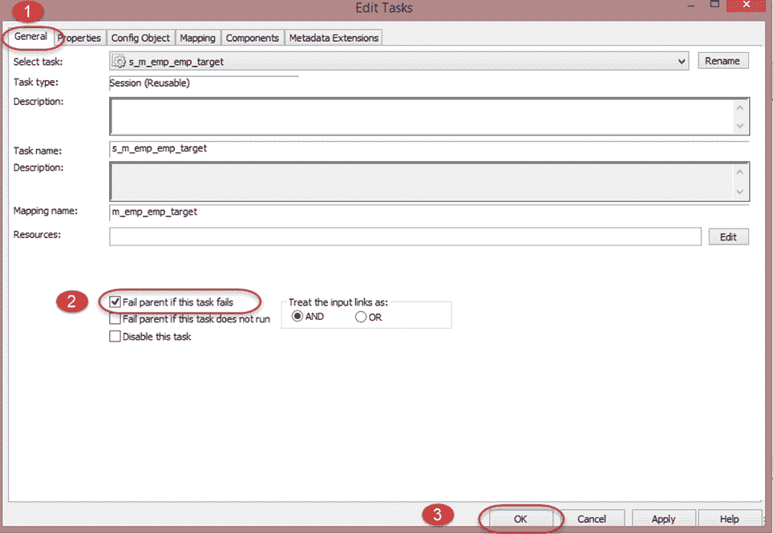

**步骤 4** –使用 ctrl + s 快捷方式保存更改。

在进行了以上更改后，如果您执行此工作流，但任何任务失败，则工作流状态将被视为失败。 因此您可以确定在执行工作流程期间，其某些任务已失败。