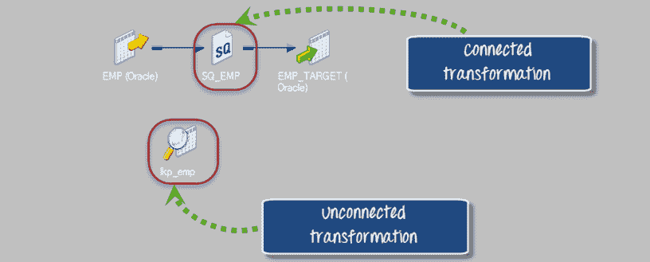
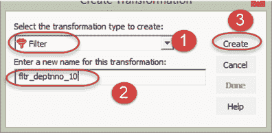
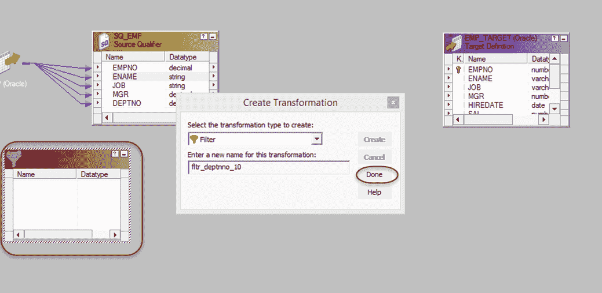
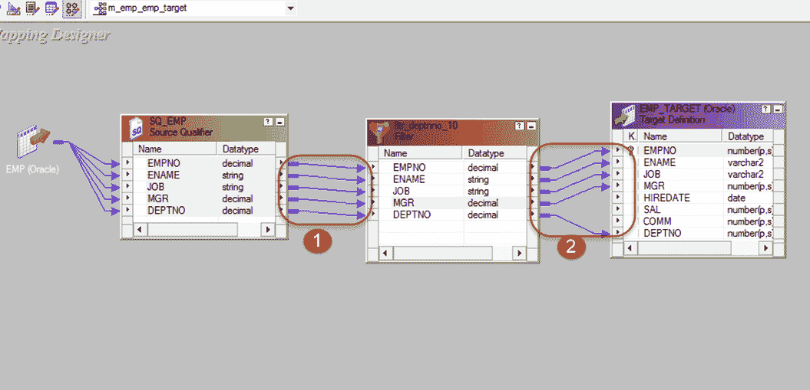
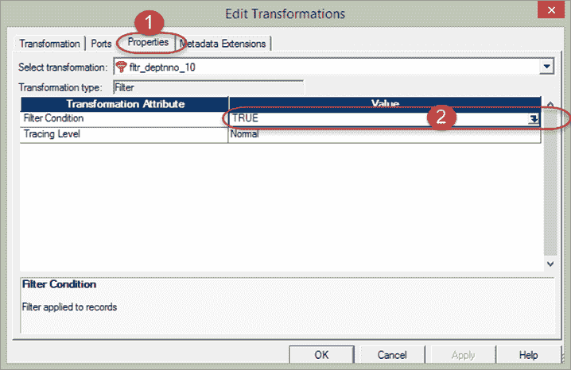
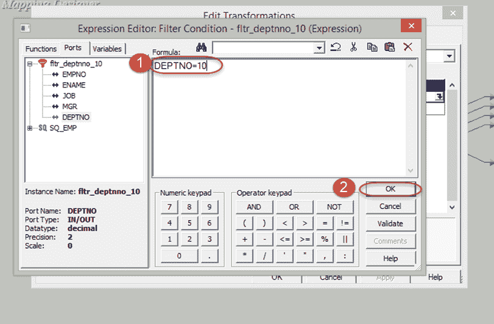
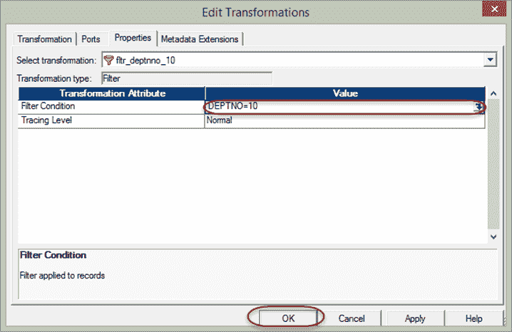

# INFORMATICA 转换教程&过滤器转换

> 原文： [https://www.guru99.com/introduction-transformations-informatica-and-filter-transformation.html](https://www.guru99.com/introduction-transformations-informatica-and-filter-transformation.html)

##### 什么是转型？

Informatica 中的转换是创建，修改数据或将数据传递到已定义的目标结构（表，文件或任何其他目标）的对象。

Informatica 中转换的目的是根据目标系统的要求修改源数据。 它还可以确保将数据加载到目标中的质量。

Informatica 提供了各种转换来执行特定功能。

例如，根据源数据执行税额计算，数据清理操作等。在转换中，我们连接端口以将数据传递给它，然后转换通过输出端口返回输出。

在本教程中，您将学习

*   [转换的分类](#1)
*   [过滤器转换](#2)

## 转换分类

转换分为两类，一类基于连接性，另一类基于行数的变化。 首先，我们将研究基于连接的转换。

基于连通性的转换类型

*   关联的转换
*   未关联的转换

在 Informatica 中，在映射期间，与其他转换连接的转换称为连接转换。

例如，源表 EMP 的源限定符转换连接到过滤器转换以过滤部门的员工。

未与任何其他转换连接的那些转换称为非连接转换。

通过在其他转换（如 Expression 转换）中调用它们来使用它们的功能。 这些转换不是管道的一部分。

当为每个输入行调用转换或期望转换返回值时，首选连接转换。 例如，对于每行中的邮政编码，转换将返回城市名称。

当仅定期或根据某些条件要求其功能时，未连接的转换将非常有用。 例如，如果没有税收值，则计算税收明细。

基于行数变化的转换类型

*   主动转换
*   被动变换

活动转换是那些修改数据行和传递给它们的输入行数的控件。 例如，如果某个转换接收到十行的行作为输入，并且返回十五行的行作为输出，则它是一个活动转换。 行中的数据也在活动转换中被修改。

被动转换是那些不更改输入行数的转换。 在无源转换中，输入和输出行的数量保持不变，仅在行级别修改数据。

在被动转换中，不会创建新行，也不会删除现有行。

## 以下是 Informatica 中的转换列表

*   源限定符转换
*   聚合转型
*   路由器转换
*   细木工转换
*   等级转换
*   序列发生器转换
*   交易控制转换
*   查找和可重复使用的转换
*   归一化变换
*   转型的性能调优
*   外部转型
*   表达转换

## 什么是滤波器转换？

筛选器转换是一个活动的转换，因为它更改了记录数。

使用过滤器转换，我们可以根据过滤条件过滤记录。 筛选器转换是一种主动转换，因为它更改了记录数。

例如，对于仅加载 deptno 等于 10 的员工记录，我们可以将过滤器转换放在过滤条件为 deptno = 10 的映射中。 因此，只有那些具有 deptno = 10 的记录才可以通过过滤器转换传递，其余的其他记录将被丢弃。

如何使用过滤器转换-

**步骤 1** –创建一个具有源“ EMP”和目标“ EMP_TARGET”的映射

**步骤 2** –然后在映射中

1.  选择转换菜单
2.  选择创建选项

**步骤 3** -然后在创建转换窗口中

1.  从列表中选择过滤器转换
2.  输入转换名称“ fltr_deptno_10”
3.  选择创建选项

**步骤 4** –将创建过滤器转换，在创建转换窗口中选择“完成”按钮

**步骤 5** –在映射中

1.  将所有“源”限定符列拖放到过滤器转换
2.  将过滤器转换中的列链接到目标表

**步骤 6** –双击过滤器转换以打开其属性，然后

1.  选择属性菜单
2.  单击过滤条件编辑器

**步骤 7** –然后在过滤条件表达式编辑器中

1.  输入过滤条件– deptno = 10
2.  选择确定按钮

**步骤 8** –现在再次在“属性”选项卡的编辑转换窗口中，您将看到过滤条件，选择“确定”按钮

现在保存映射，并在创建会话和工作流之后执行它。 在目标表中，将仅加载 deptno = 10 的记录。

这样，您可以使用过滤器转换来过滤源记录。