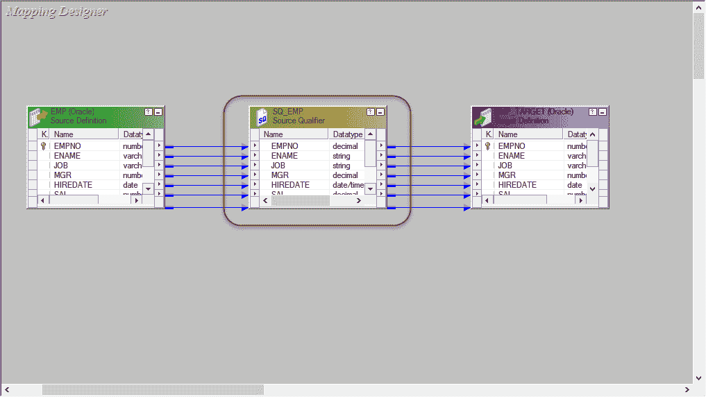
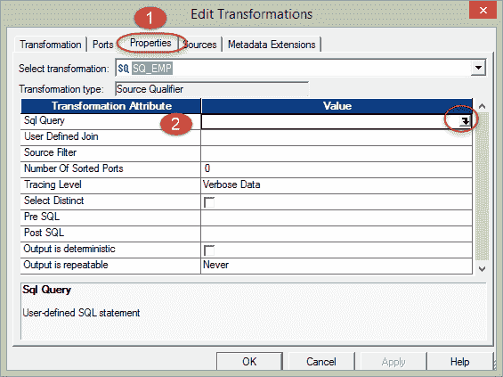
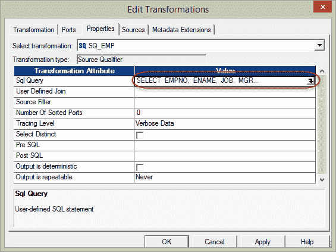
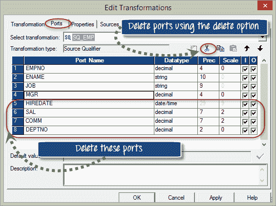
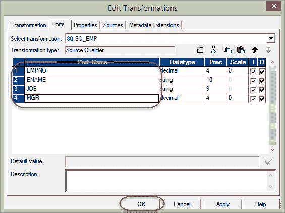
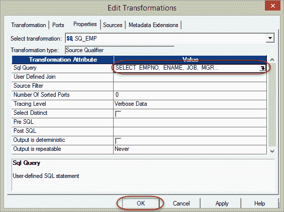
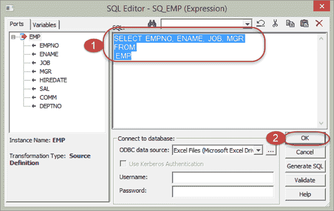
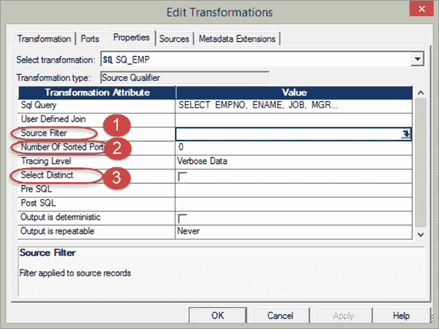

# Informatica 中的源限定符转换（带有示例）

> 原文： [https://www.guru99.com/source-qualifier-transformation-informatica.html](https://www.guru99.com/source-qualifier-transformation-informatica.html)

**What is Source Qualifier Transformation?**

源限定符转换是一个活动的，已连接的转换，用于表示集成服务读取的行。 每当我们将关系源或平面文件添加到映射时，都需要进行源限定符转换。 当我们向映射添加源时，将自动添加源限定符转换。 使用源限定符，我们可以定义和覆盖如何从源中获取数据。

在以下示例中，我们将修改映射“ m_emp_emp_target”的源限定符，因此，除了返回所有列之外，它仅返回选定的列。

**步骤 1** –在映射设计器中打开映射“ m_emp_emp_target”。

**步骤 2** –双击源限定符转换“ SQ_EMP”。 它将为此打开编辑转换属性窗口。 然后

1.  单击属性选项卡
2.  单击 [SQL](/sql.html) 查询修改选项，这将打开一个 SQL 编辑器窗口

**步骤 3** –在 SQL 编辑器窗口中

1.  Enter the following query

    从 EMP 中选择 EMPNO，ENAME，作业，MGR

    **注意** –我们从源中选择列 EMPNO，ENAME 和 JOB & MANAGER，因此我们仅将那些保留在选择查询中

2.  选择确定按钮

**步骤 4** –在“编辑转换”窗口中，

1.  从菜单中选择端口选项卡
2.  在“端口”选项卡下，您将看到所有端口。 仅保留端口 EMPNO，ENAME，JOB，MGR 并删除其他端口

**步骤 5** –删除端口后，选择确定按钮

现在，再次单击“编辑转换”窗口中的“属性”选项卡，您将仅看到所选的那些数据。

当您单击“确定”按钮时，它将打开“ SQL 编辑器”窗口，并且

1.  它将确认您选择的数据是正确的，并准备好加载到目标表中
2.  单击确定按钮以进一步处理

保存映射（使用 ctrl + s 快捷键）并执行工作流程，执行后仅将选定的列加载到目标中。

这样，您可以在源限定符中覆盖需要从源&提取哪些列的方法，这是覆盖将哪些特定列带入映射的唯一方法。

## 源限定符的属性

您可以使用 Source Qualifier 的各种属性来确定需要将哪种类型的源数据转换为目标表。

1.  **源过滤器** –使用源过滤器属性，您可以过滤源记录的数量。 例如，您只想获取 deptno 10 的雇员，然后可以在源过滤器属性中输入过滤条件 deptno = 10 并执行数据。
2.  **Number for sorted ports** – In source qualifier transformation, you can also sort the input records based on the ports number. So when the data is passed on to the transformations inside the mapping, it will read the port number and sort the data accordingly.

    由于可以根据单个或多个端口对数据进行排序，因此您必须提供将用于排序的端口数。 如果您将值设为 1，则仅 empno 数据将被排序。 如果您将值设为 2，则将在 empno 和 ename 上的两列中对数据进行排序。

3.  **选择 Distinct** –使用此属性只能从源中获取不同的记录。 当您选择选择独特的选项时，源限定符将仅获取原始数据的独特组合。

