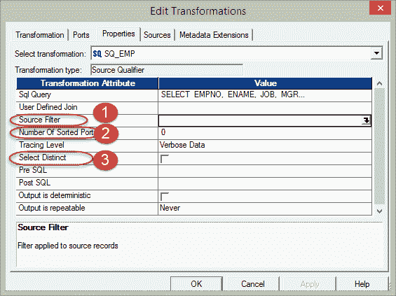
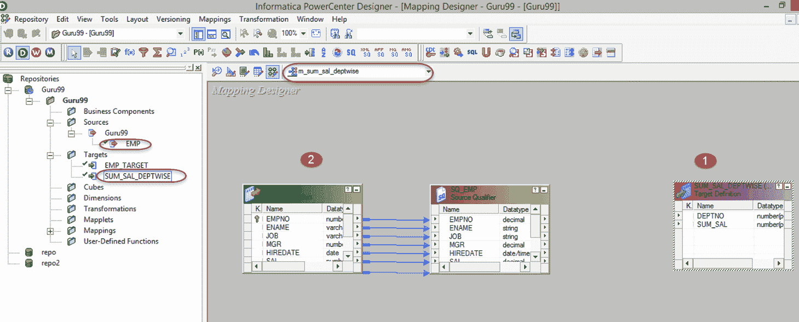
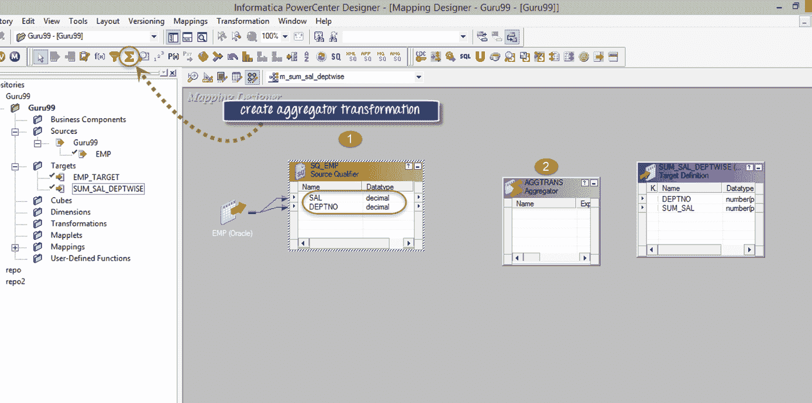
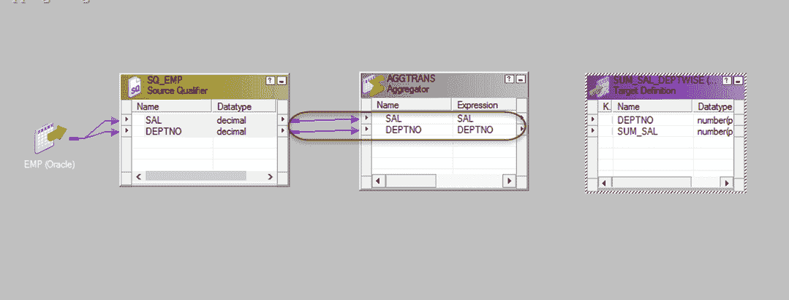
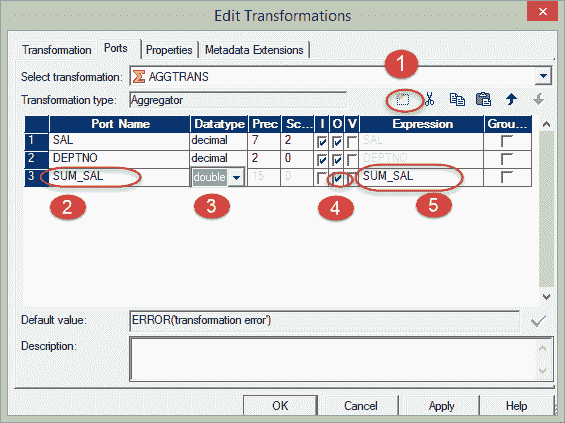
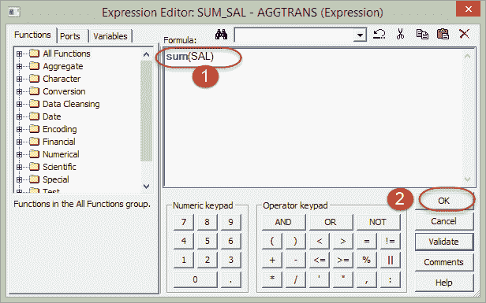
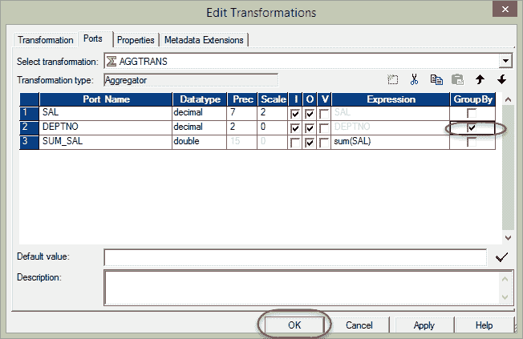
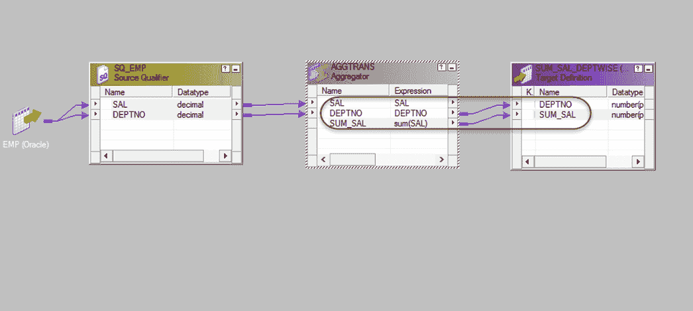

# Informatica 中的聚合器转换示例

> 原文： [https://www.guru99.com/aggregator-transformation-informatica.html](https://www.guru99.com/aggregator-transformation-informatica.html)

**What is Aggregator Transformation?**

聚合器转换是一种主动转换，用于执行聚合计算，例如求和，平均值等。

例如，如果您想明智地计算所有员工部门的薪金总和，我们可以使用聚合器转换。

聚合操作是在一组行上执行的，因此需要一个临时占位符来存储所有这些记录并执行计算。

为此，使用了聚合器缓存。 这是一个临时的主内存，已分配给聚合器转换以执行此类操作。

在此示例中，我们将明智地计算薪资部门的总和。 为此，我们需要一个新列来存储此总和。 因此，首先，我们将准备一个新列。

**步骤 1** –使用以下脚本创建一个新的数据库目标表，例如说“ sum_sal_deptwise”。 在下一步中，您将看到在 Target 文件夹下创建了新的数据库目标表。

[下载上面的 Create_table_sal_deptwise.txt 文件](https://drive.google.com/uc?export=download&id=0ByI5-ZLwpo25X2NOdDZ3MGxXUTA)

**步骤 2 –** 创建新映射“ m_ sum_sal_deptwise”。

为了创建新的映射，我们需要在映射设计器中同时使用源表（EMP）和目标表（sum_sal_deptwise），为此

1.  在映射中导入目标表“ sum_sal_deptwise”。
2.  导入源表“ emp”。

**步骤 3** –在映射中，

1.  从 Source Qualifier 中删除 empno，ename，job，mgr，hiratedate & comm 列，以便仅保留 deptno 和 sal 列。
2.  使用工具箱菜单创建一个新的聚合器转换，如屏幕截图所示。 当您单击聚合器图标时，将创建一个新的聚合器转换。

**步骤 4** -将 SAL & DEPTNO 列从源限定符（SQ_EMP）拖放到聚合器转换

**步骤 5** –双击聚合器转换以打开其属性，然后

1.  在转换中添加新端口
2.  将端口名称重命名为 SUM_SAL
3.  将此新端口的数据类型更改为双倍
4.  通过选中输出端口的复选框，将该端口作为输出端口。
5.  单击表达式选项

**步骤 6** –在表达式窗口中

1.  添加表达式 sum（SAL），您必须编写此表达式。
2.  选择确定按钮，这将返回编辑转换窗口。

**步骤 7** –在编辑转换窗口中，通过在 deptno 列上选中复选框来选择选项“ GroupBy”，然后单击“确定”（通过在 deptno 上选择 group by，我们指示 Informatica 按 deptno 对薪水进行分组）

**步骤 8** –将来自聚合器转换的 deptno 和 sum_sal 列链接到目标表

现在保存映射，并在为此映射创建新会话之后执行它。 目标表将包含部门薪金总额。 这样，我们可以使用聚合器转换来计算聚合结果。