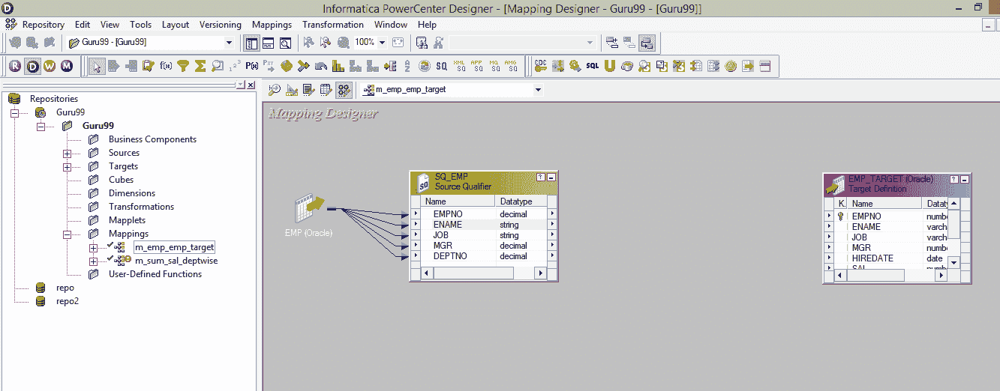
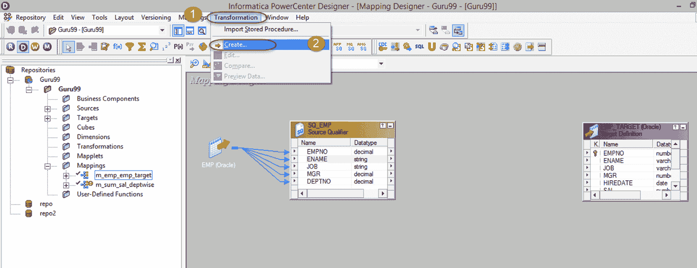
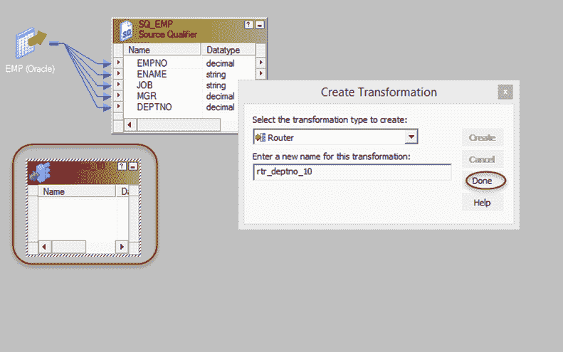
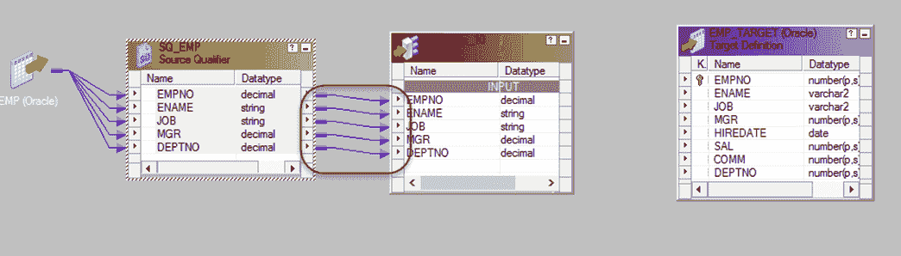
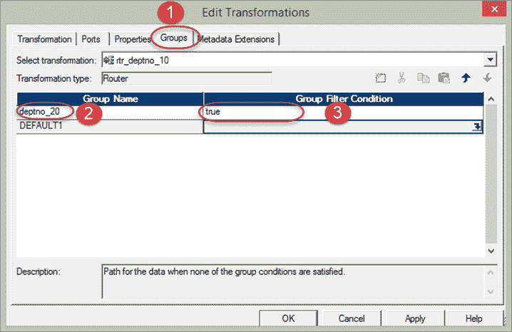
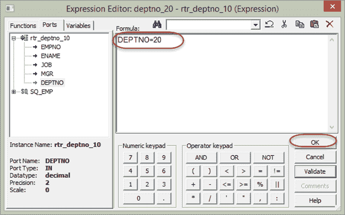
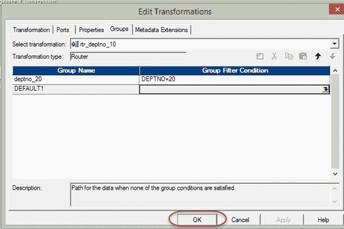
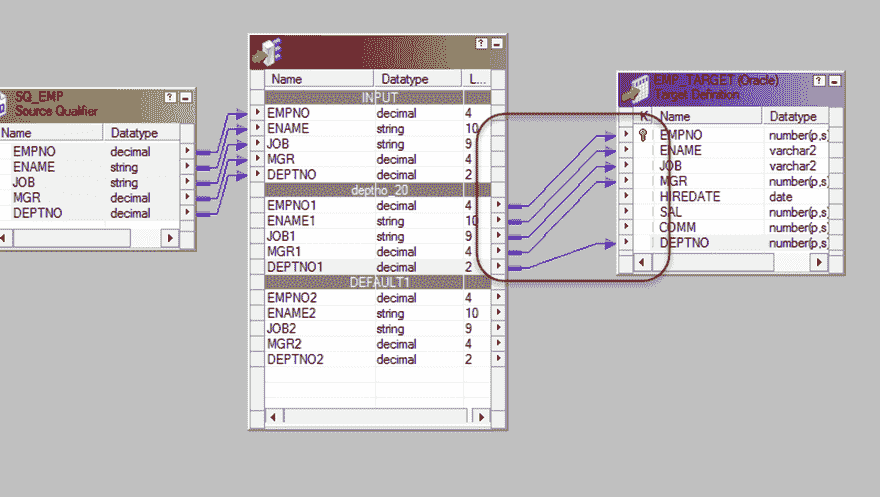

# Informatica 中的路由器转换：多个条件示例

> 原文： [https://www.guru99.com/router-transformation-informatica.html](https://www.guru99.com/router-transformation-informatica.html)

**What is Router Transformation?**

路由器转换是一种主动和连接的转换，类似于筛选器转换，用于筛选源数据。

过滤旁边提供的其他功能是，也可以在映射中收集丢弃的数据（过滤出的数据），并且可以应用多个过滤条件来获取多组数据。

例如，当过滤数据格式为 deptno = 10 时，我们还可以得到 deptno 不等于 10 的那些记录。因此，路由器转换给出了多个输出组，每个输出组可以有自己的过滤条件。

此外，还有一个默认组，该默认组的记录集不满足任何组条件。 例如，如果您分别为过滤条件 deptno = 10 & dept = 20 创建了两个组，则那些没有 deptno 10 和 20 的记录将被传递到该默认组中。 简而言之，过滤器组拒绝的数据将由此默认组收集，有时可能需要存储这些拒绝的数据。 在这种情况下，默认输出组可能很有用。

为了允许多个过滤条件，路由器转换提供了组选项。

*   有一个默认输入组，它接收输入数据
*   还有一个默认输出组，它提供所有未通过任何过滤条件传递的数据。
*   对于每个过滤条件，都会在路由器转换中创建一个输出组。 您可以将不同的目标连接到这些不同的组。

创建路由器转换

**步骤 1** –创建一个具有源“ EMP”和目标“ EMP_TARGET”的映射。

**步骤 2** –然后在映射中

1.  选择转换菜单
2.  选择创建选项

**步骤 3** –在创建转换窗口中

1.  选择路由器转换
2.  输入转换“ rtr_deptno_10”的名称
3.  选择创建选项

**步骤 4** –路由器转换将在映射中创建，在窗口中选择完成选项

**步骤 5** –将所有列从 Source 限定符拖放到路由器转换

**步骤 6** –双击路由器转换，然后在其转换属性中

1.  选择组选项卡
2.  输入群组名称“ deptno_20”
3.  单击组过滤条件

**步骤 7** –在表达式编辑器中，输入过滤条件 deptno = 20 并选择“确定”按钮。

**步骤 8** –在组窗口中选择“确定”按钮

**步骤 9** –将端口从路由器转换的组 deptno_20 连接到目标表端口

现在，当您执行此映射时，已过滤的记录将被加载到目标表中。