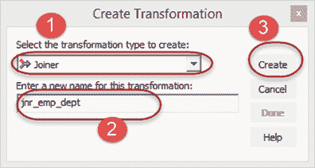
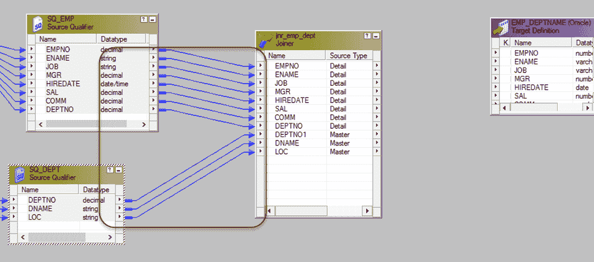
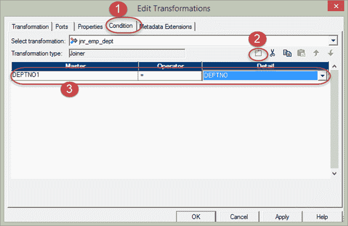
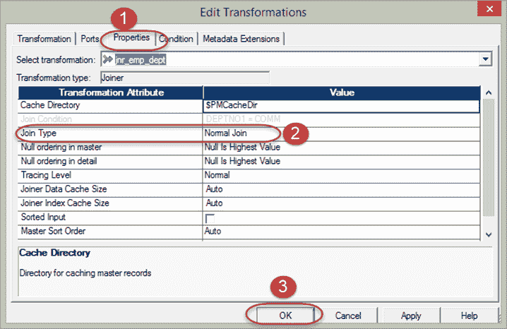
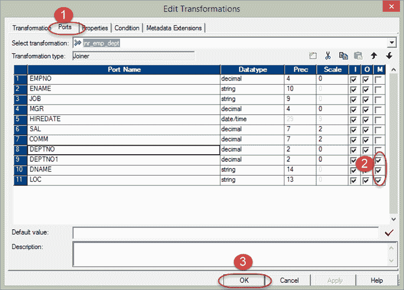
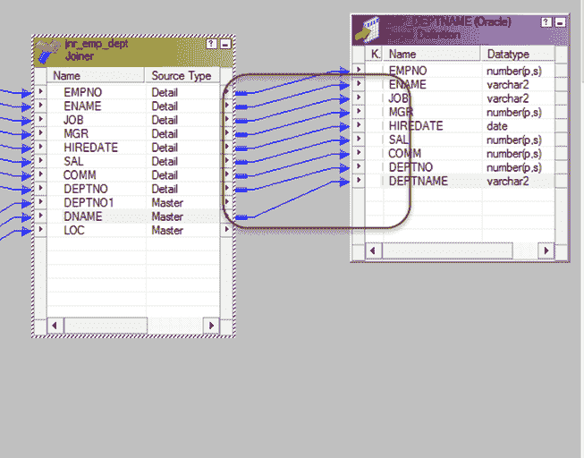

# 示例中 Informatica 中的 Joiner 转换

> 原文： [https://www.guru99.com/joiner-transformation-informatica.html](https://www.guru99.com/joiner-transformation-informatica.html)

##### 什么是 Joiner Transformation？

Joiner 转换是一种活动的连接转换，可为您提供在 Informatica 中创建连接的选项。 使用联接器转换创建的联接类似于数据库中的联接。 联接器转换的优点是可以为异构系统（不同的数据库）创建联接。

在细木工转换中，有两个源将用于连接。 这两个来源称为

*   主源
*   详细信息来源

在联接器转换的属性中，可以选择哪个数据源可以为主数据源，哪个数据源可以为明细数据源。

在执行期间，主源被缓存到内存中以进行连接。 因此，建议选择记录数量较少的源作为主源。

可以使用 Joiner 转换创建以下联接

1.  Master outer join

    在主外部联接中，联接将返回明细源中的所有记录，并且仅返回主源中的匹配行。

2.  Detail outer join

    详细而言，外部联接仅从明细源返回匹配的行，而从主源返回所有行。

3.  Full outer join

    在完全外部联接中，将返回来自两个源的所有记录。 主外部连接和详细信息外部连接等效于 SQL 中的左外部连接。

4.  Normal join

    在普通联接中，两个源仅返回匹配的行。

在此示例中，我们将使用联接器转换联接 emp 和 dept 表

**步骤 1** –使用以下脚本在数据库中创建一个新的目标表 EMP_DEPTNAME，并将该表导入 Informatica 目标中。

[下载上面的 emp_deptname.sql 文件](https://drive.google.com/uc?export=download&id=0ByI5-ZLwpo25bVRfOXdQRkNRMGM)

**步骤 2** -创建新的映射并导入在上一步中创建的源表“ EMP”和“ DEPT”以及目标表

**步骤 3** –从转换菜单中，选择创建选项。

1.  选择连接器转换
2.  输入转换名称“ jnr_emp_dept”
3.  选择创建选项

**步骤 4** –将所有列从两个源限定符拖放到 Joiner 转换中

**步骤 5** -双击连接器转换，然后在编辑转换窗口中

1.  选择条件选项卡
2.  单击添加新条件图标
3.  在主列和明细列列表中选择 deptno

**步骤 6** -然后在同一窗口中

1.  选择属性选项卡
2.  选择普通联接作为联接类型
3.  选择确定按钮

为了优化性能，我们将主源分配给记录较少的源表管道。 要执行此任务–

**步骤 7** –双击连接器转换以打开“编辑属性”窗口，然后

1.  选择端口选项卡
2.  在特定来源中选择要用作母版的任何列
3.  选择确定

**步骤 8** –将相关的列从连接器转换链接到目标表

现在，保存映射并在为其创建会话和工作流之后执行它。 将使用 Informatica 联接器创建联接，并且将从两个表中获取相关详细信息。