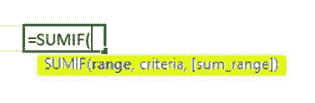
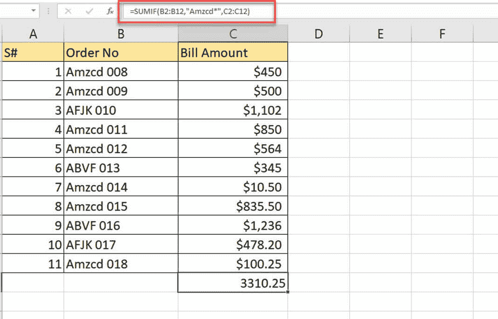
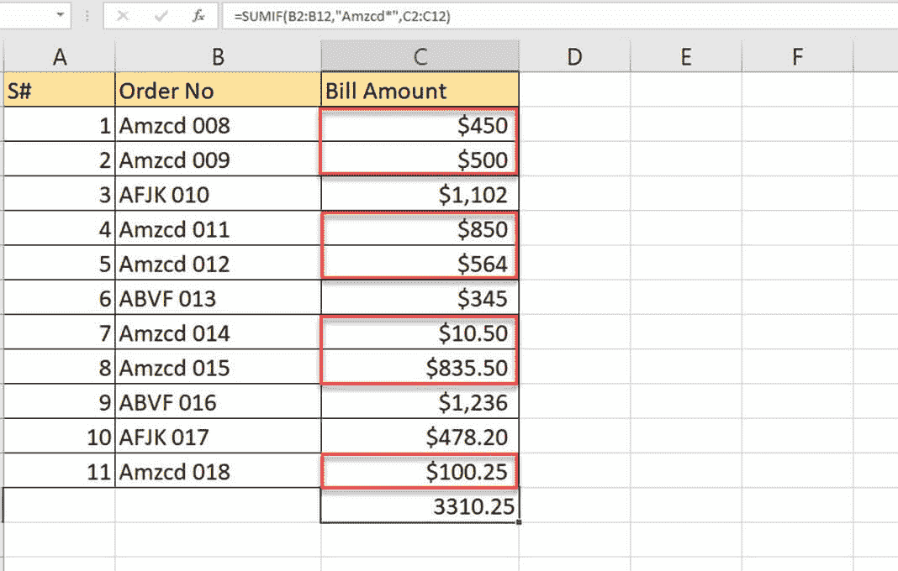
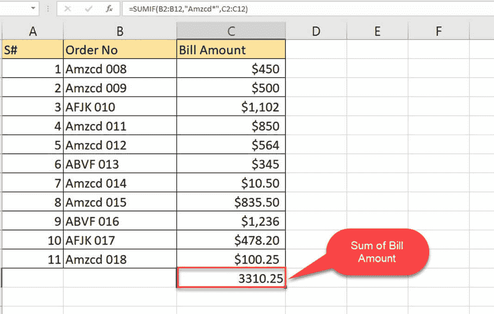
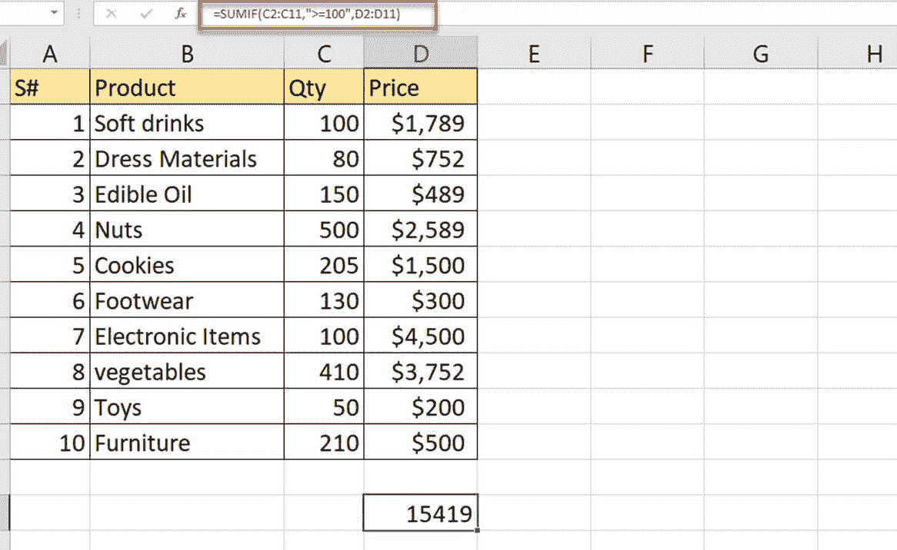
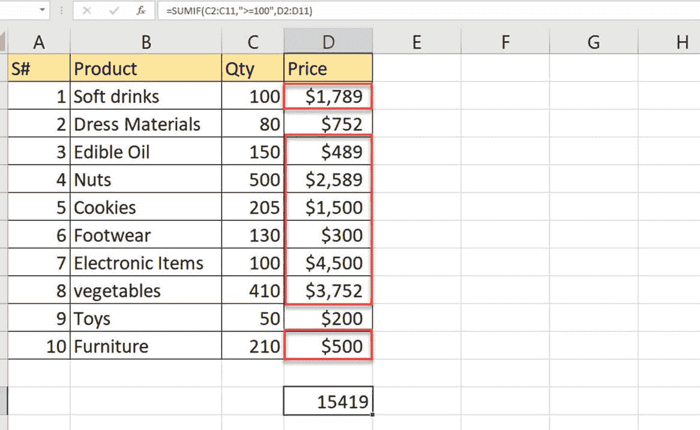
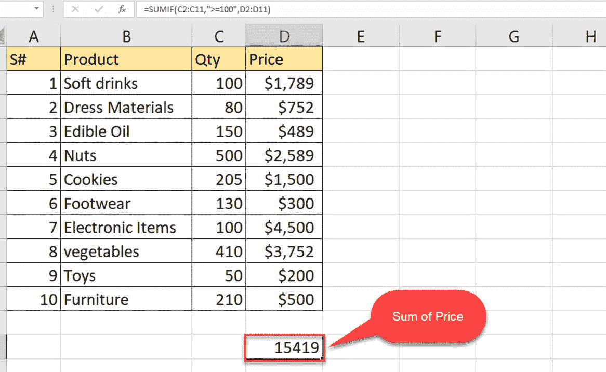
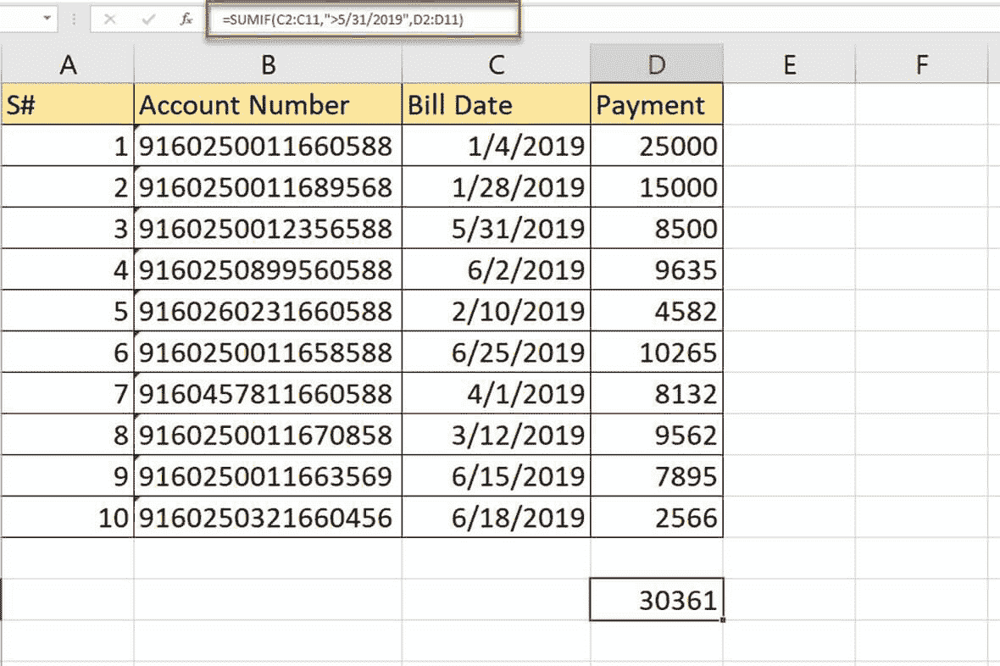
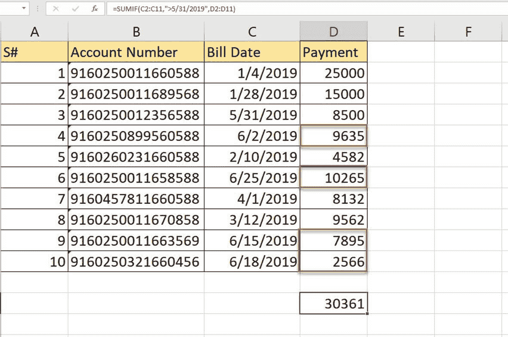
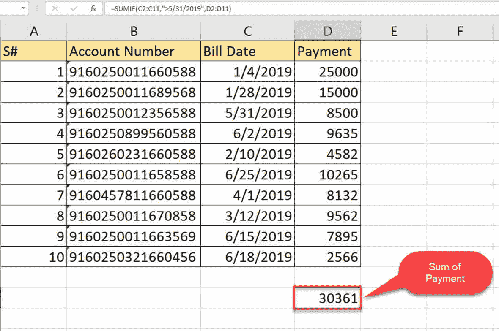

# Excel 中的 SUMIF 函数：通过示例学习

> 原文： [https://www.guru99.com/sumif-function-excel.html](https://www.guru99.com/sumif-function-excel.html)

## 什么是 SUMIF 函数？

SUMIF 是用于根据单个条件对值求和的函数。 使用此功能，您可以找到一个范围内应用条件的数字总和。 此函数在数学&三角函数下。 与名称相似，如果满足给定的条件，则将求和。 此函数用于查找大型数据集中特定数字的总和。

在本教程中，您将学习-

*   [什么是 SUMIF 函数？](#6)
*   [如何使用 SUMIF 功能？](#1)
*   [MS SUMIF](#2) 的公式
*   [示例 1：使用 SUMIF](#3)
*   [示例 2：如何将 SUMIF 与比较运算符一起使用](#4)
*   [示例 3：如何在日期中使用 SUMIF](#5)

## 如何使用 SUMIF 功能？

SUMIF 将根据指定的标准对单元格范围求和。 应在其中应用条件的像元范围，将要计算总和的约束条件，需要在条件内指定要根据条件计算总和的像元范围。

## MS SUMIF 的公式

通常，遵循需要提供标准和条件范围等的格式。

```
SUMIF(range,criteria,sum range)
```



*   **范围**：包含条件的单元格范围
*   **条件**：必须满足的条件
*   **总和范围**：如果满足条件，则要添加的单元格范围。

## 示例 1：使用 SUMIF

给定具有订单号和账单金额的数据表。 需要查找特定订单的账单金额之和。

**步骤 1）**您想要查找特定品牌订单的账单金额之和，其中订单号以“ Amzcd”开头。

| S＃ | 订单号 | 账单金额 |
| 1 | Amzcd 008 | $450 |
| 2 | Amzcd 009 | $500 |
| 3 | AFJK 010 | $1,102 |
| 4 | Amzcd 011 | $850 |
| 5 | Amzcd 012 | $564 |
| 6 | ABVF 013 | $345 |
| 7 | Amzcd 014 | $10.50 |
| 8 | Amzcd 015 | $835.50 |
| 9 | ABVF 016 | $1,236 |
| 10 | AFJK 017 | $478.20 |
| 11 | Amzcd 018 | $100.25 |

**步骤 2）**在帐单金额中选择下面的单元格，并应用公式来查找仅针对订单的帐单金额总和（以“ Amzcd”开头）。



**步骤 3）**应用的公式为

```
'=SUMIF (B2: B12, "Amzcd*," C2: C12)'
```

*   B2：B12 是要检查条件的单元格范围。
*   “ Amzcd *”是在订单号开头处应用的条件。
*   C2：C12 是根据条件要添加的单元格范围

**步骤 4）**如果您检查表格，突出显示的是根据给定标准汇总的账单金额。 选择以“ Amzcd”开头的每个订单的账单金额，然后将找到总金额。



**步骤 5）**检查列账单金额的末尾，以查看满足给定条件的账单金额之和。

[ ](/images/1/052819_1101_SUMIFfuncti4.jpg) 

## 示例 2：如何将 SUMIF 与比较运算符一起使用

Excel 中存在一组比较运算符。 SUMIF 函数可以与比较运算符一起使用。 比较运算符可以用来指定 SUMIF 函数中的条件。 因此，如果比较操作返回一个真值，它将对这些值求和。

**步骤 1）**您具有包含名称产品，数量和价格的数据表。 您如何找到数量大于等于 100 的产品的总价？

| S# | 产品 | 数量 | 价钱 |
| 1 | 软饮料 | 100 | $1,789 |
| 2 | 服饰材料 | 80 | $752 |
| 3 | 食用油 | 150 | $489 |
| 4 | 坚果类 | 500 | $2,589 |
| 5 | 饼干 | 205 | $1,500 |
| 6 | 鞋类 | 130 | $300 |
| 7 | 电子物品 | 100 | $4,500 |
| 8 | 蔬菜 | 410 | $3,752 |
| 9 | 玩具 | 50 | $200 |
| 10 | 家具类 | 210 | $500 |

**步骤 2）**如果将标准应用为逻辑格式'数量> = 100'，则 SUMIF 公式可以形成如下。



**Step 3)** The formula applied is

```
=SUMIF (C2: C11,">=100", D2: D11)
```

*   C2：C11 是条件将要查找的单元格范围
*   '> = 100'是用比较运算符表示大于等于的条件
*   D2：D11 是根据条件求和的范围

**步骤 4）**突出显示的单元格是满足条件的价格，其中> = 100



**步骤 5）**值的总和位于单元格 D13 中； 它是数量大于或等于 100 的产品的价格总和。



## 示例 3：如何使用带日期的 SUMIF

在此示例中，您将学习如何将 SUMIF 函数与日期一起使用。 标准还可以以日期的形式给出。

**步骤 1）**表格显示了不同的帐号，账单日期和付款。 该金额需要在给定的帐单日期内支付到相应的帐户。 通过使用 SUMIF，您可以尝试查找 6 月份要支付的金额之和。

| S# | 账号 | 帐单日期 | 付款 |
| 1 | 9160250011660588 | 1/4/2019 | 25000 |
| 2 | 9160250011689568 | 1/28/2019 | 15000 |
| 3 | 9160250012356588 | 1/31/2019 | 8500 |
| 4 | 9160250899560588 | 6/2/2019 | 9635 |
| 5 | 9160260231660588 | 2/10/2019 | 4582 |
| 6 | 9160250011658588 | 6/25/2019 | 10265 |
| 7 | 9160457811660588 | 3/1/2019 | 8132 |
| 8 | 9160250011670858 | 3/12/2019 | 9562 |
| 9 | 9160250011663569 | 6/15/2019 | 7895 |
| 10 | 9160250321660456 | 6/18/2019 | 2566 |

**步骤 2）**由于日期与您在一起，因此标准可以形成为[> 5/31/2019”，指的是 5 月之后的日期。 这里，SUMIF 一次使用比较运算符和日期。



**Step 3)** The formula applied is

```
=SUMIF (C2: C11,">5/31/2019", D2: D11)
```

*   C2：C11 是给出日期的单元格范围，也是要寻找给定条件的范围
*   '> 5/31/2019'是日期大于'5/31/2019'的条件
*   D2：D11 满足条件后要添加的数字范围

**步骤 4）**以下是满足所应用条件的单元格值，并将得出这些值的总和。



**步骤 5）**总和在 D13 中。 并且是 6 月份要支付给多个帐户的总金额。



[下载上面的 Excel 数据文件](https://drive.google.com/uc?export=download&id=1nnqbpSgH5eVIW2RJpKrwCfrk8foR08SL)

## 摘要

*   SUMIF 函数将根据给定的标准求和。
*   SUMIF 函数与数字，日期，文本数据兼容
*   条件可以从其他函数或运算符的结果表达出来
*   SUMIF 函数一次只能应用于一列
*   允许使用 SUMIF 函数检查唯一条件
*   当范围与标准范围不匹配时，＃VALUE 将是错误结果
*   单词或句子的一部分将使用通配符进行匹配。 星号符号与一系列字符和单个字符的问号一起使用。
*   在将文本与数字值一起使用时，条件应该用双引号引起来，但如果它仅由数字值组成，则不要用双引号引起来。