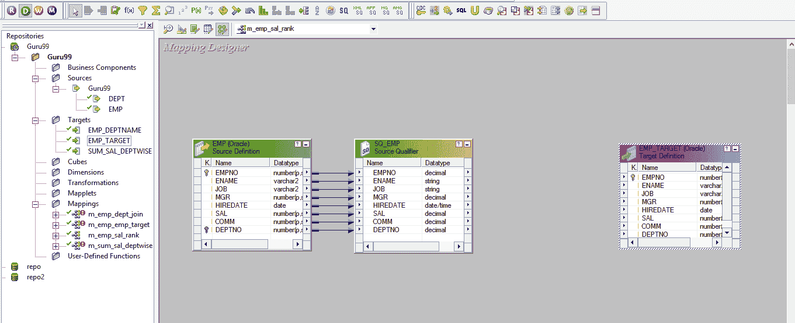
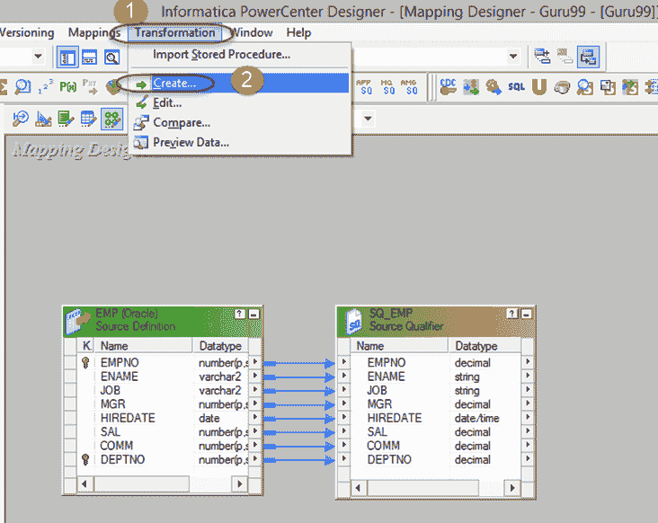
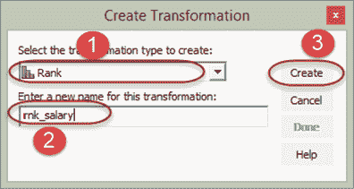
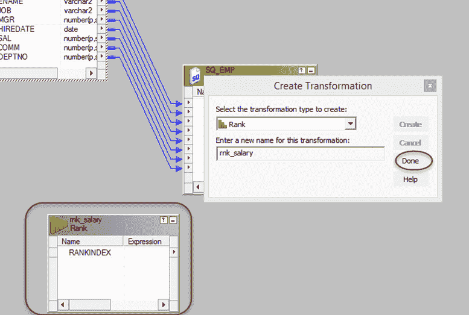
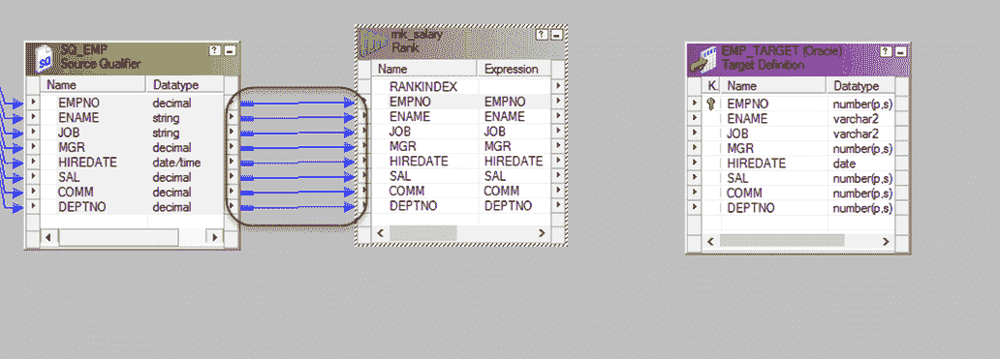
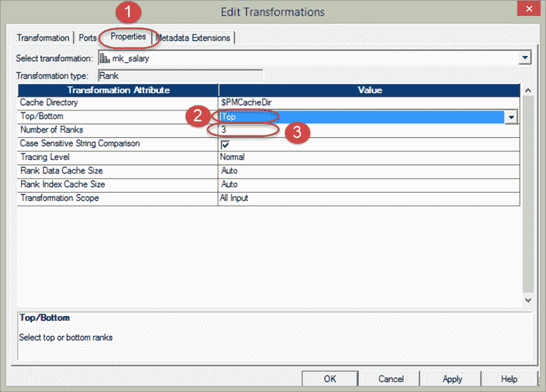
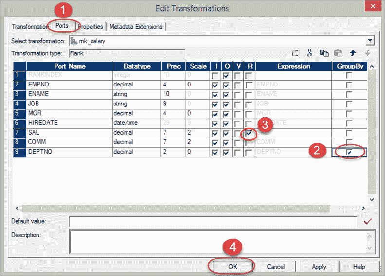
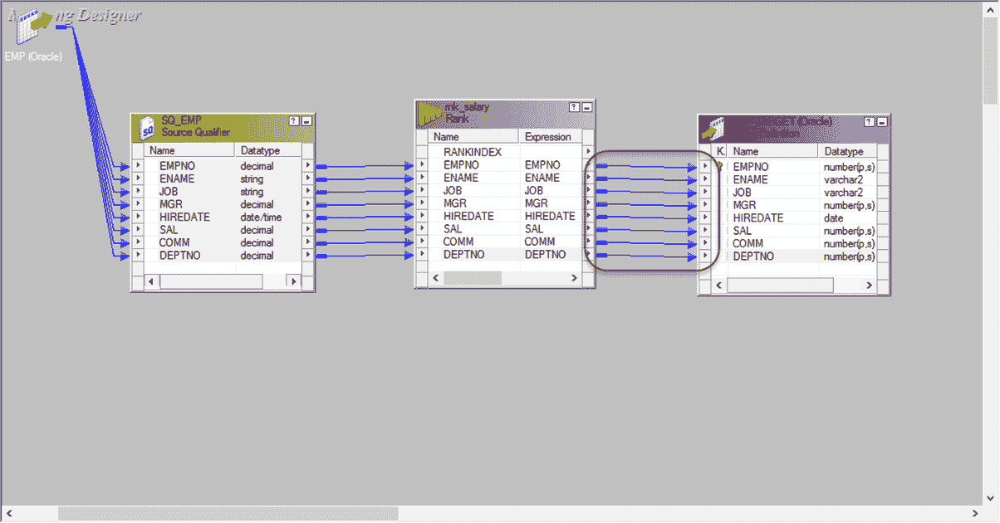

# Informatica 中的排名转换（带有示例）

> 原文： [https://www.guru99.com/rank-transformation-informatica.html](https://www.guru99.com/rank-transformation-informatica.html)

**What is Rank Transformation?**

等级转换是一种主动的连接转换，它根据组和等级执行数据过滤。 例如，您要获取十个薪水最高的员工记录，可以通过等级转换来进行这种过滤。

排名转换还提供了基于组进行排名的功能。 就像您想明智地获得薪水最高的十个员工部门一样，可以通过此转换完成此分组。

等级转换是一种主动转换，因为它影响输出行的数量。

等级转换具有一个输出端口，通过该端口可以为行分配等级。

我们的要求是为每个部门加载前 3 名受薪员工； 我们将使用等级转换来实现。

**步骤 1** -创建具有源 EMP 和目标 EMP_TARGET 的映射

**步骤 2** -然后在映射中

1.  选择转换菜单
2.  Select create option

    

**步骤 3** –在创建转换窗口中

1.  选择等级转换
2.  输入转换名称“ rnk_salary”
3.  选择创建按钮

**步骤 4** –将在映射中创建等级转换，在窗口中选择完成按钮

**步骤 5** –将所有端口从源限定符连接到等级转换

**步骤 6** -双击等级转换，它将打开“编辑转换窗口”。 在这个窗口

1.  选择属性菜单
2.  从“顶部/底部”属性中选择“顶部”选项
3.  在等级数中输入 3

**步骤 7** –再次在“编辑转换”窗口中

1.  选择端口选项卡
2.  为部门编号列选择按选项分组
3.  在薪资栏中选择排名
4.  选择确定按钮

**步骤 8** –将端口从等级转换连接到目标表

现在，保存映射并在创建会话和工作流之后执行它。 源限定符将获取所有记录，但是排名转换将仅通过每个部门具有三项高薪的记录。