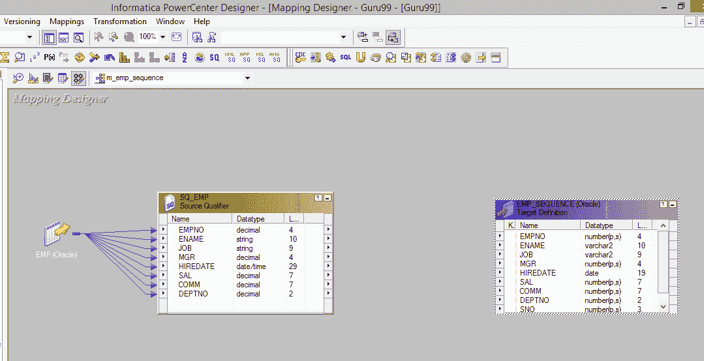
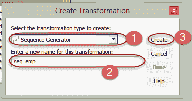
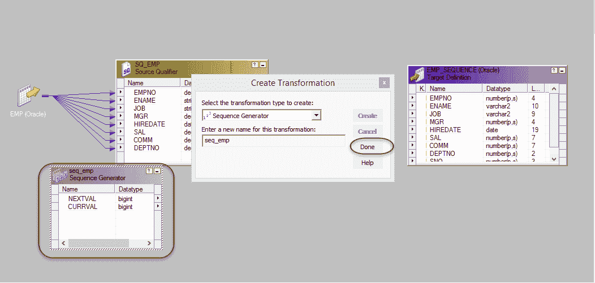
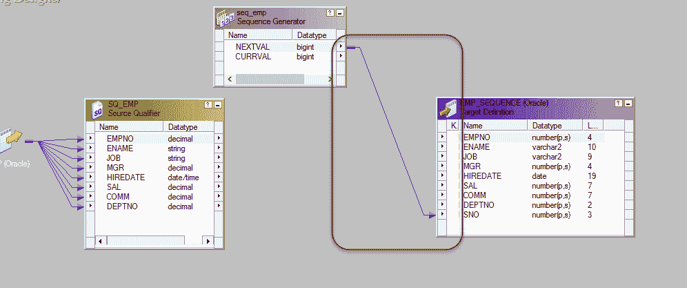
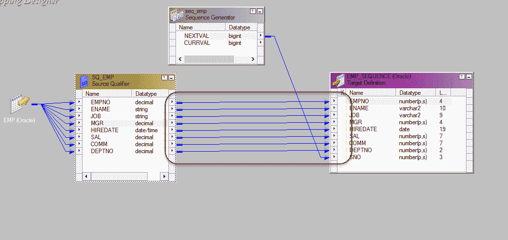
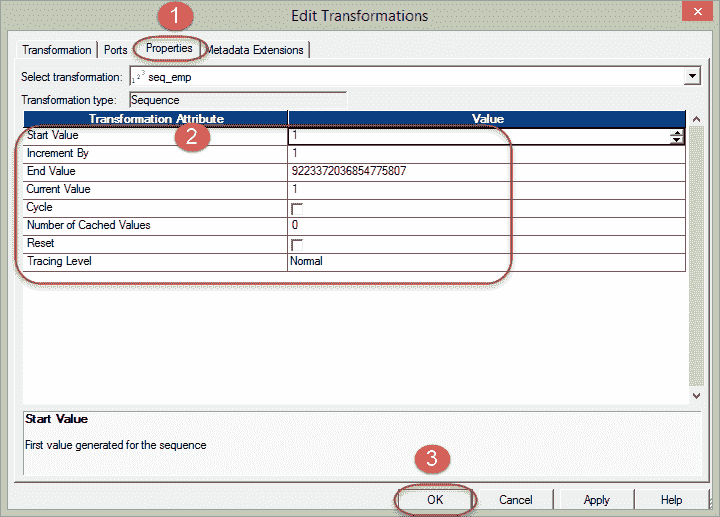

# Informatica 中的序列转换示例

> 原文： [https://www.guru99.com/sequence-generator-transformation-informatica.html](https://www.guru99.com/sequence-generator-transformation-informatica.html)

**What is Sequence Generator Transformation?**

序列生成器转换是被动的，因此不会影响输入行的数量。 序列生成器用于生成主键值&，用于生成数字序列值，例如 1、2、3、4、5 等。

例如，您要为源记录分配序列值，然后可以使用序列生成器。 取决于转换的配置属性，生成的序列值可以像 5、10、15、20、25 等或 10、20、30、40、50 等。

序列发生器有两个输出端口

*   CURRVAL
*   下一个

CURRVAL 端口值始终为 NEXTVAL + 1。

为了生成序列号，我们始终使用 NEXTVAL 列。

序列生成器转换的属性

*   起始值–这是转换将生成的第一个值，默认值为 0。
*   递增量–这是您要递增值的数字。 默认值为 1。
*   最终值–这是转换应生成的最大值。
*   Cycle –如果设置了此选项，则在到达值的结尾后，转换将从起始值重新开始。

在此示例中，我们将生成序列号并存储在目标中。

**步骤 1** –使用以下脚本创建目标表。

[下载上面的 emp_sequence.sql 文件](https://drive.google.com/uc?export=download&id=0ByI5-ZLwpo25VDZKTWR5dWNMMGM)

**步骤 2** -将 Informatica 中的表导入为目标表

**步骤 3** –创建新的映射并导入 EMP 源和 EMP_SEQUENCE 目标表

**步骤 4** –在映射中创建新的转换

1.  选择序列转换作为类型
2.  输入转换名称“ seq_emp”
3.  选择创建选项

**步骤 5** -将创建序列生成器转换，选择完成选项

**步骤 6** -将序列生成器的 NEXTVAL 列链接到目标中的 SNO 列

**步骤 7** –将其他列从源限定符转换链接到目标表

**步骤 8** –双击序列生成器以打开属性窗口，然后

1.  选择属性选项卡
2.  输入起始值为= 1 的属性，其余属性保留为默认值
3.  选择确定按钮

现在，保存映射并在创建会话和工作流之后执行它。

目标中的 sno 列将包含由序列生成器转换生成的序列号。

在我们的示例中，序列将类似于 1 – Scott，2 – King，3 – Adam，4 – Miller 等。