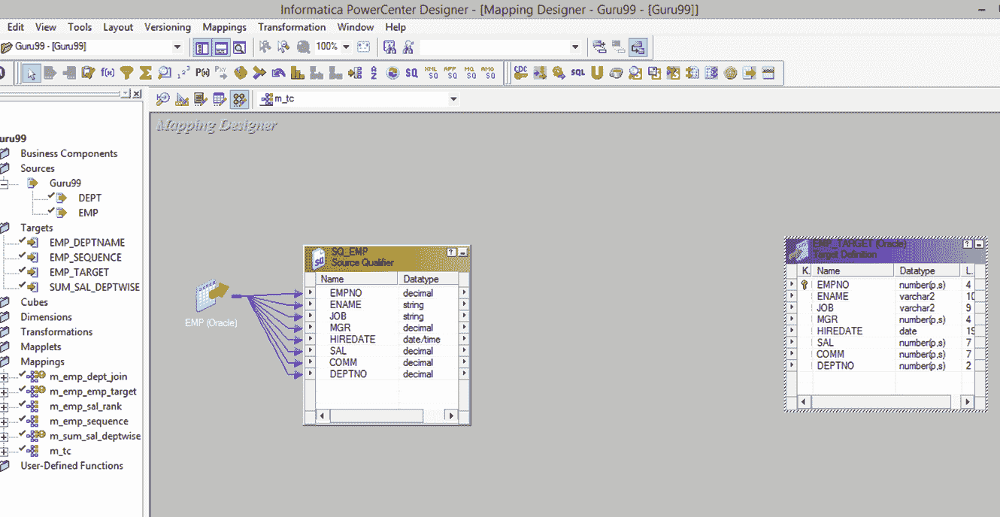
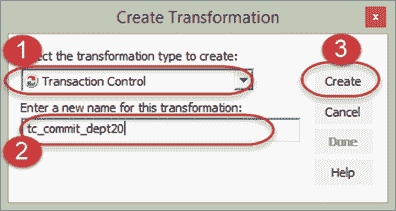
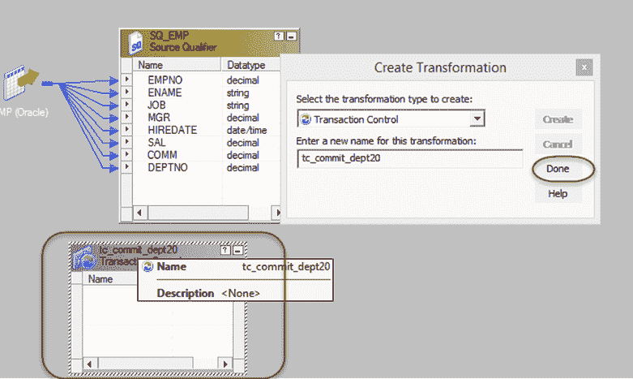
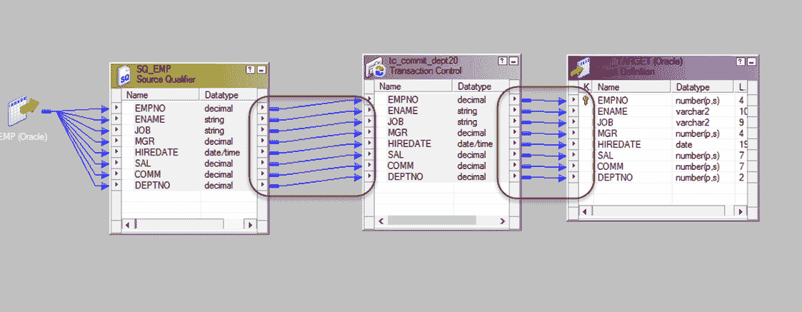
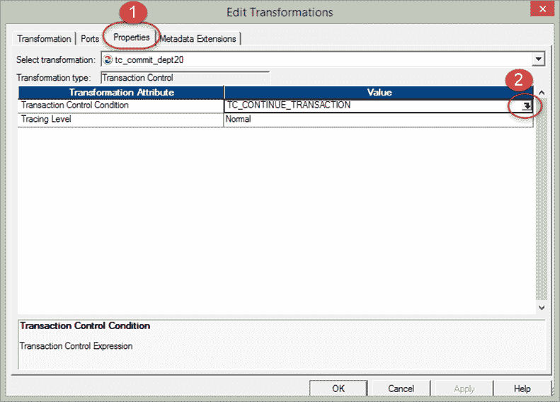
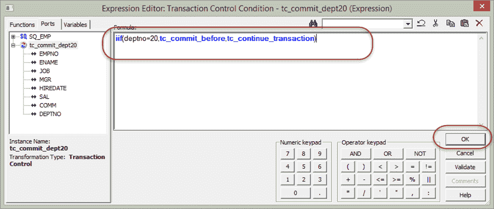
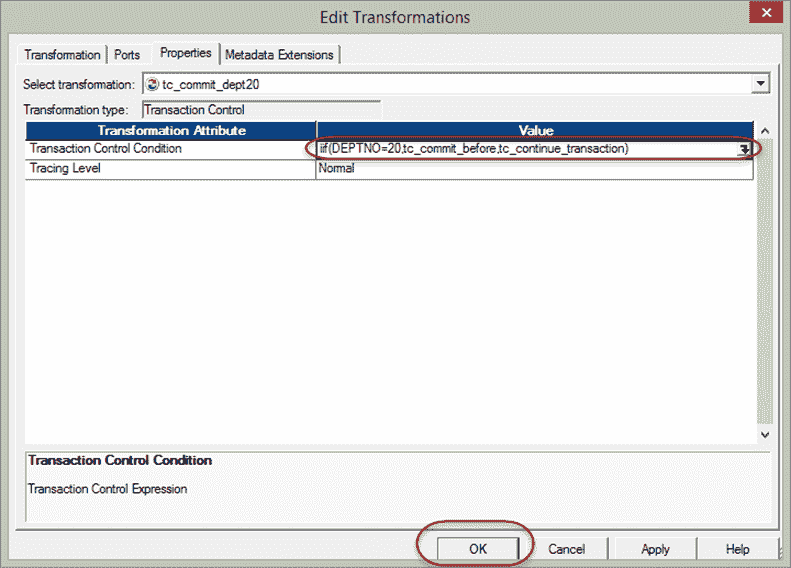

# Informatica 中的事务控制转换：TCL 命令

> 原文： [https://www.guru99.com/transaction-control-transformation-informatica.html](https://www.guru99.com/transaction-control-transformation-informatica.html)

#### 什么是事务控制转换？

事务控制是一种主动的关联转换，它使我们能够在执行映射期间提交或回滚事务。 提交和回滚操作非常重要，因为它可以保证数据的可用性。

当处理大量数据时，可能存在将数据提交给目标的情况。 如果提交的执行频率太高，那么这将是系统的开销。 如果提交执行得太晚，则在失败的情况下，有丢失数据的机会。

因此，为了提供灵活性，提供了事务控制转换。

## TCL COMMIT & ROLLBACK 命令

此转换中有五个可用的内置变量来处理操作。

```
TC_CONTINUE_TRANSACTION

```

In tc_continue_transaction there are no operations performed, the process of data load continues as it is.

```
TC_COMMIT_BEFORE

```

In tc_commit_before when this flag is found set, a commit is performed before the processing of current row.

```
TC_COMMIT_AFTER

```

In tc_commit_after the current row is processed then a commit is performed.

```
TC_ROLLBACK_BEFORE

```

In tc_rollback_before, rollback is performed first then data is processed to write.

```
TC_ROLLBACK_AFTER

```

In tc_rollback_after data is processed then the rollback is performed.

## 例：

在此示例中，当找到 dept no = 20 条件为 true 时，我们将向目标提交数据

**步骤 1** –创建一个映射，其中 EMP 为源，EMP_TARGET 为目标



**步骤 2** –使用转换菜单创建一个新转换，然后

1.  选择一个事务控件作为新的转换
2.  输入转换名称“ tc_commit_dept20”
3.  选择创建选项



**步骤 3** –将创建事务控制转换，选择完成按钮



**步骤 4** -将所有列从源限定符拖放到事务控制转换，然后将所有列从事务控制转换链接到目标表



**步骤 5** –双击事务控制转换，然后在“编辑属性”窗口中

1.  选择属性选项卡
2.  单击事务控制编辑器图标



**步骤 6** –在表达式编辑器中输入表达式–

**“** iif（deptno = 20，tc_commit_before，tc_continue_transaction）”，然后选择确定

这意味着如果找到 deptno 20，则在目标中提交事务，否则继续当前处理。



**步骤 7** –在上一个窗口中选择“确定”



现在，保存映射并在创建会话和工作流之后执行它。 只要在数据中找到部门编号 20，此映射就会将数据提交给目标。