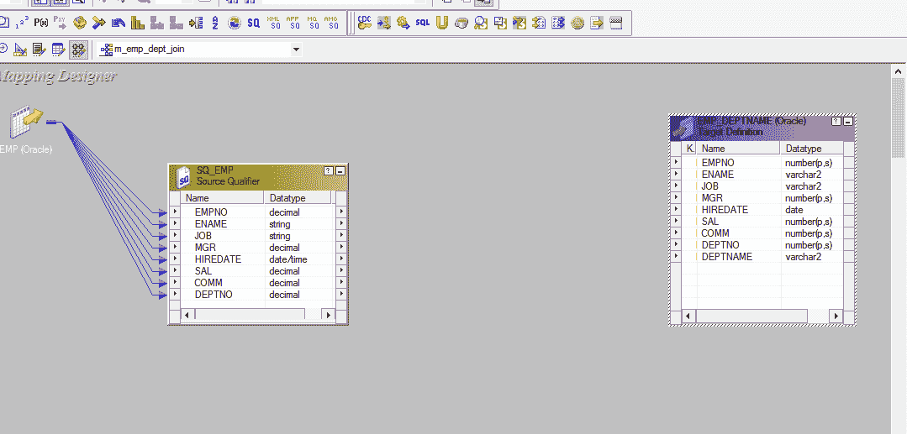
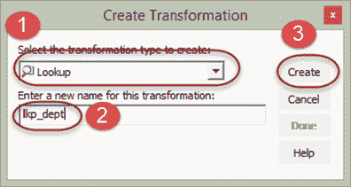
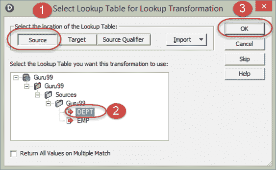
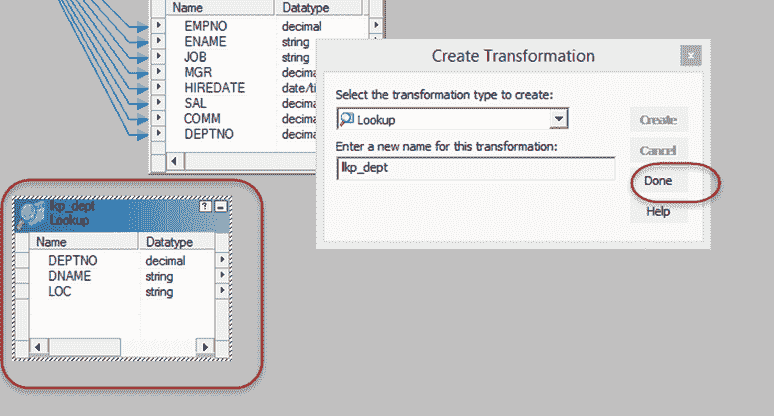
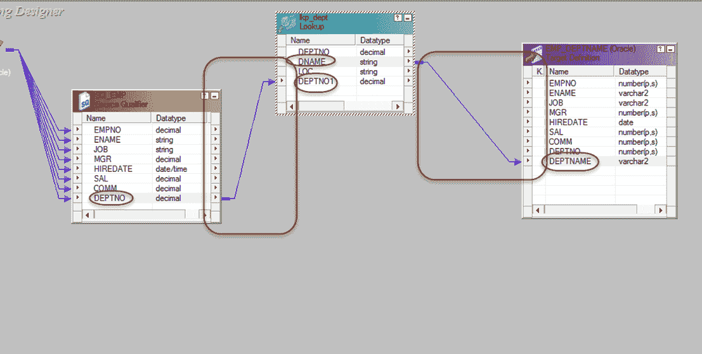
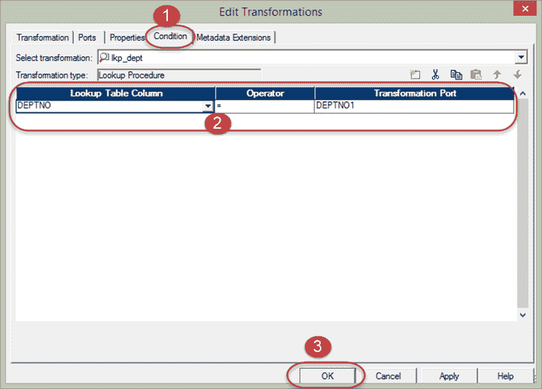
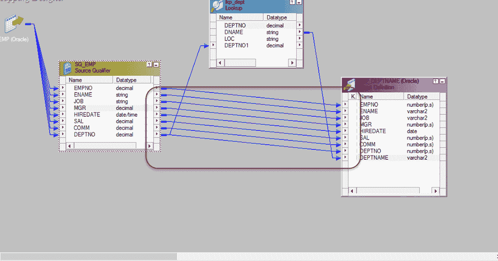
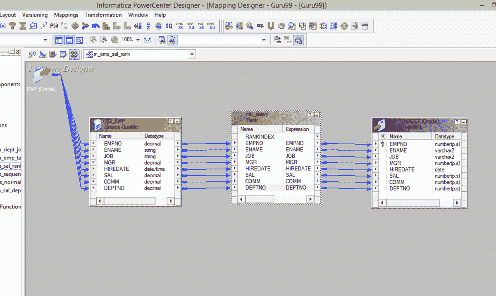
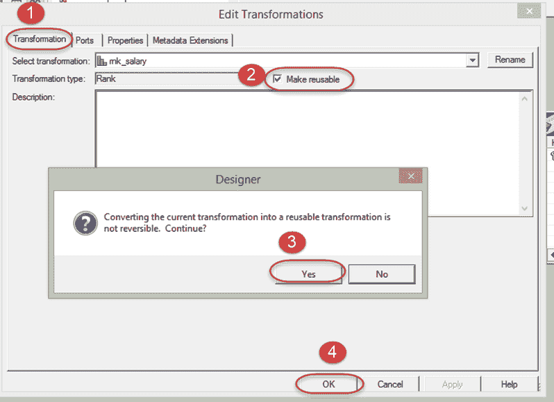

# Informatica &可重用转换示例中的查找转换

> 原文： [https://www.guru99.com/lookup-re-usable-transformation-informatica.html](https://www.guru99.com/lookup-re-usable-transformation-informatica.html)

##### 什么是查找转换？

查找转换是一种被动转换，用于查找源，源限定符或目标以获取相关数据。 基本上，这是一种联接操作，其中一个联接表是源数据，另一个联接表是查找表。

在先前的主题中，我们使用联接程序转换将“ emp”和“ dept”表联接在一起以带来部门名称。

在本节中，我们将使用查找转换实现相同的功能。

**步骤 1** –创建一个新映射，将 EMP 作为源，将 EMP_DEPTNAME 作为目标

**步骤 2** –使用转换菜单创建一个新转换，然后

1.  选择查找转换作为转换
2.  输入转换名称“ lkp_dept”
3.  选择创建选项

**步骤 3** –这将打开查找表窗口，在此窗口中

1.  选择源按钮
2.  选择 DEPT 表
3.  选择确定按钮

**步骤 4** -将使用 DEPT 表的列创建查找转换，现在选择完成按钮

**步骤 5** -将 DEPTNO 列从源限定符拖放到查找转换，这将在查找转换中创建一个新列 DEPTNO1。 然后将查找转换中的 DNAME 列链接到目标表。

查找转换将根据 DEPTNO1 值进行查找并返回部门名称。

**步骤 6** –双击查找转换。 然后在编辑转换窗口中

1.  选择条件选项卡
2.  将条件列设置为 DEPTNO = DEPTNO1
3.  选择确定按钮

**步骤 7** –将其余列从源限定符链接到目标表

现在，保存映射并在创建会话和工作流之后执行它。 此映射将使用查找转换获取部门名称。

查找转换设置为在部门表上查找。 并根据部门编号设置加入条件。

## 可重用转换

普通变换是属于映射的对象，并且只能在该映射内部使用。 但是，通过使转换可重用，它可以在多个映射中重新使用。

例如，可以在需要员工详细信息的多个映射中使用基于员工编号获取员工详细信息的查找转换。

通过使用可重用的转换，它减少了再次创建相同功能的工作量。

使转换可重用–

**步骤 1** –打开进行转换的映射，这里使等级转换可重用。

**步骤 2** –双击转换以打开编辑转换窗口。 然后

1.  在窗口中选择“转换”选项卡
2.  选中复选框以使转换可重复使用
3.  在确认窗口中选择是
4.  在转换属性窗口中选择确定。

这将使转换可重用。