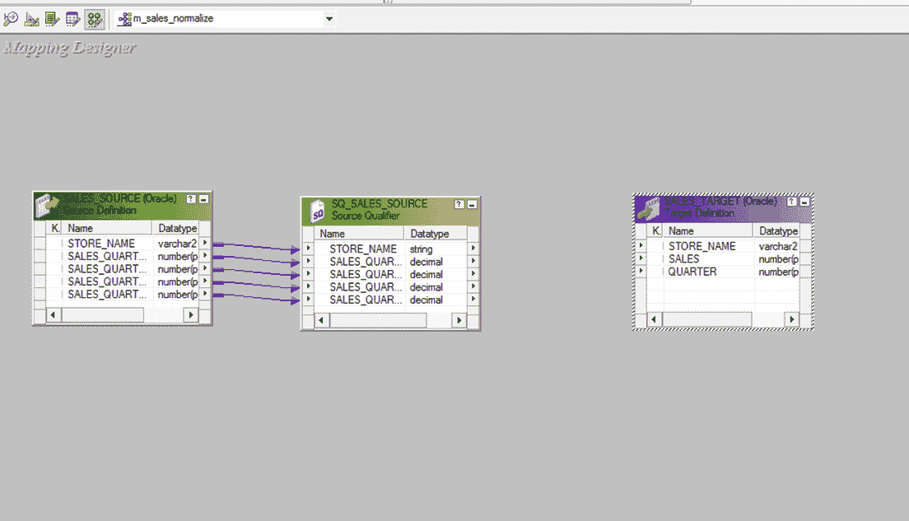
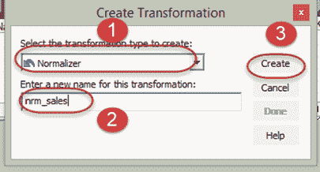
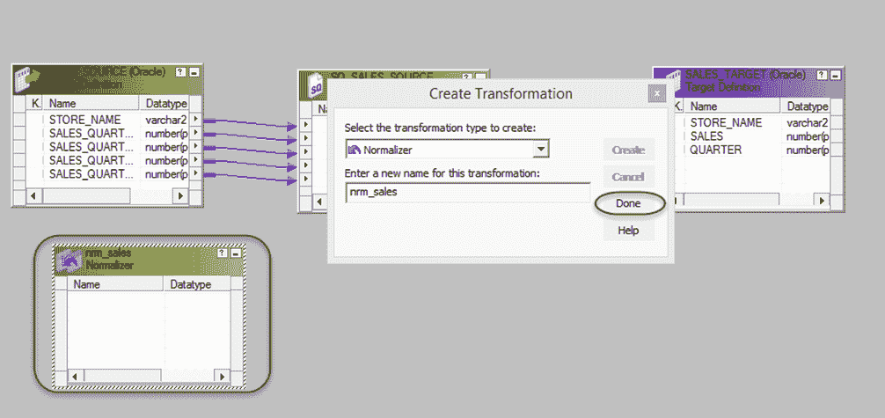
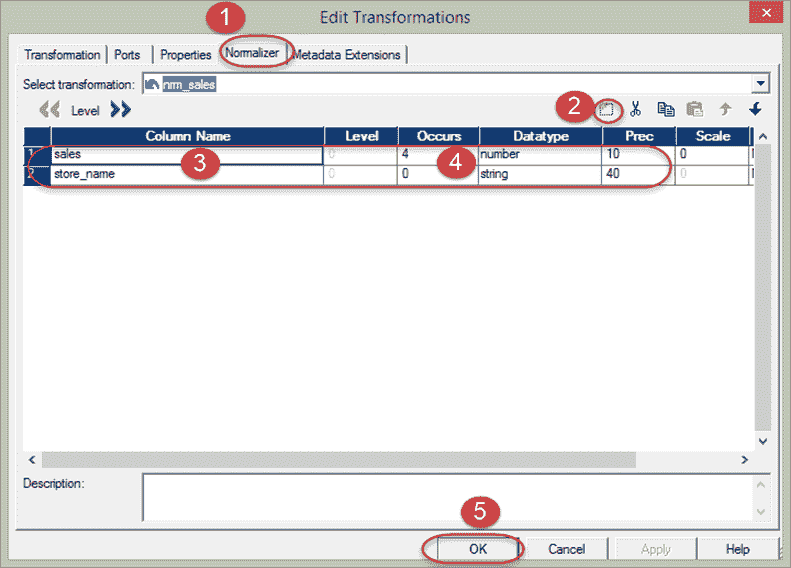
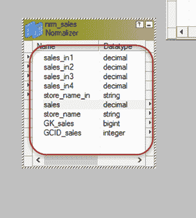
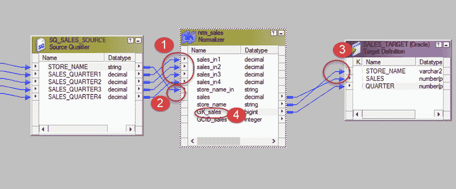

# Informatica 中的规范化器转换（带有示例）

> 原文： [https://www.guru99.com/normalizer-transformation-informatica.html](https://www.guru99.com/normalizer-transformation-informatica.html)

**What is Normalizer Transformation?**

Normalizer 是一种主动转换，用于将单行转换为多行，反之亦然。 这是一种以更有条理的方式表示数据的聪明方法。

如果在单行中有多列重复数据，则可以将其拆分为多行。 有时我们在多个出现的列中都有数据。 例如

| **学生姓名** | **9 级成绩** | **10 级得分** | **11 级成绩** | **12 级得分** |
| 学生 1 | 50 | 60 | 65 | 80 |
| 学生 2 | 70 | 64 | 83 | 77 |

在这种情况下，班级得分栏将在四栏中重复。 使用规范化器，我们可以将其拆分为以下数据集。

| **Student Name** | **类** | **得分** |
| Student 1 | 9 | 50 |
| Student 1 | 10 | 60 |
| Student 1 | 11 | 65 |
| Student 1 | 12 | 80 |
| Student 2 | 9 | 70 |
| Student 2 | 10 | 64 |
| Student 2 | 11 | 83 |
| Student 2 | 12 | 77 |

**步骤 1** –使用脚本创建源表“ sales_source”和目标表“ sales_target”，并将其导入 Informatica

[下载上述 Sales_Source.txt 文件](https://drive.google.com/uc?export=download&id=0ByI5-ZLwpo25aTJ6cDJfTVNZczA)

**步骤 2 –** 创建一个具有源“ sales_source”和目标表“ sales_target”的映射

**步骤 3** –从转换菜单创建一个新转换

1.  选择标准化器作为​​变换
2.  输入名称“ nrm_sales”
3.  选择创建选项

**步骤 4** –将创建转换，选择完成选项

**步骤 5** –双击标准化器转换，然后

1.  选择规范化器选项卡
2.  单击图标创建两列
3.  输入列名
4.  设置销售次数为 4，商店名称为 0
5.  选择确定按钮

列将在转换中生成。 我们将出现次数设置为 4，您将看到 4 number of sales 列。

**步骤 6** –然后在映射中

1.  将四分之四的源限定符的四列分别链接到规范化器列。
2.  将商店名称列链接到规范化列
3.  从规范化器将 store_name &销售列链接到目标表
4.  将 GK_sales 列从规范化器链接到目标表

保存映射并在创建会话和工作流之后执行它。 对于商店的每个季度销售额，将通过规范化转换创建单独的一行。

我们的映射输出将像–

| **商店名称** | **季度** | **销售** |
| 德里 | 1 | 150 |
| DELHI | 2 | 240 |
| DELHI | 3 | 455 |
| DELHI | 4 | 100 |
| 孟买 | 1 | 100 |
| MUMBAI | 2 | 500 |
| MUMBAI | 3 | 350 |
| MUMBAI | 4 | 340 |

源数据具有重复列，即 QUARTER1，QUARTER2，QUARTER3 和 QUARTER4。 在归一化器的帮助下，我们重新排列了数据以使其适合 QUARTER 的单个列，并且对于一个源记录，在目标中创建了四个记录。

这样，您可以规范化数据并为单个数据源创建多个记录。