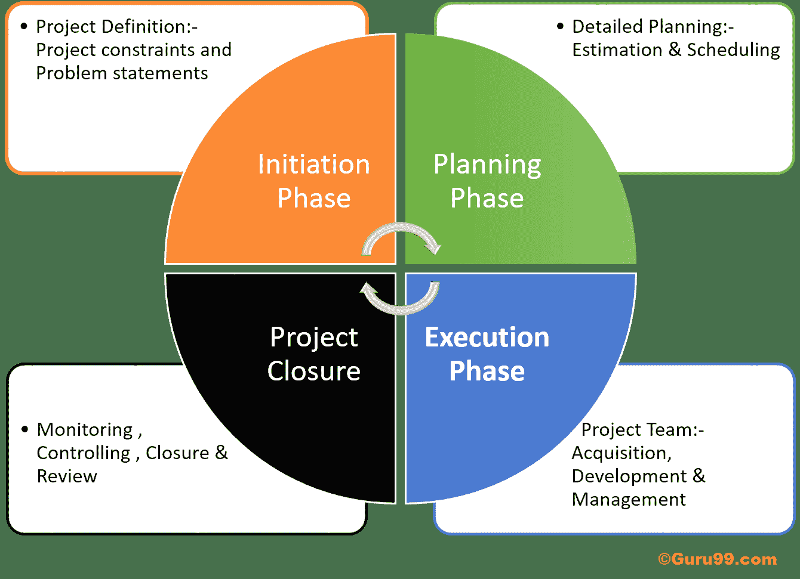
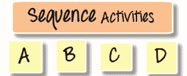
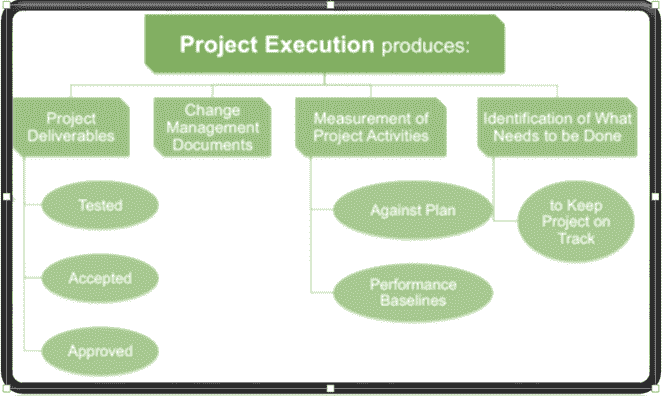

# 项目管理生命周期的各个阶段

> 原文： [https://www.guru99.com/initiation-phase-project-management-life-cycle.html](https://www.guru99.com/initiation-phase-project-management-life-cycle.html)

## 什么是项目生命周期？

项目生命周期是一系列活动，这些活动对于实现项目目标至关重要。 项目可能具有不同的维度和难度级别，但是无论大小：大或小，可能所有项目都可以映射到给定的生命周期结构。 该项目的生命周期包括四个阶段-

*   [启动阶段](#1)
*   [规划阶段](#2)
*   [执行阶段](#3)
*   [监视，控制&关闭阶段](#4)

Project Life Cycle Diagram

我们将首先探讨启动阶段

## 项目启动阶段

启动阶段定义了启动新项目所需的那些过程。 项目启动阶段的目的是确定项目应完成的工作。

这个阶段主要包括两个主要活动

*   制定项目章程并
*   确定利益相关者

与项目有关的所有信息都输入到项目章程和利益相关者登记册中。 项目章程获得批准后，该项目将获得正式授权。

### 项目章程

项目章程定义了项目的主要内容

*   项目目标
*   项目约束和问题陈述
*   指派项目经理
*   利益相关者名单
*   高级别的时间表和预算
*   大事记
*   批准书

该文档使项目经理可以为项目使用组织资源。 要创建项目章程，所需的输入将是企业环境因素，业务案例，协议，项目工作说明书和组织过程资产。

### 识别利益相关者

[利益相关者](/stakeholder-needs-analysis.html)可以影响项目的成功与失败。 为了记录有关利益相关者的信息，使用了利益相关者登记簿。

利益相关者登记册将包含以下信息：

*   利益相关者类型
*   利益相关者的期望
*   在项目中的角色（业务分析师，技术架构师，客户经理）
*   任命（董事，业务主管等）
*   交流类型（每周/每月）
*   对项目的影响（部分/支持/有影响力）

发起流程组所涉及的其他活动是：

*   指派项目经理
*   确定利益相关者的需求，期望和高层要求
*   定义项目成功标准
*   确定特定阶段的特定预算
*   确保项目符合组织的战略目标

利益相关者登记册和项目章程被用作其他开发组（例如计划流程组）的输入。

## 项目规划阶段

项目计划阶段涵盖了整个过程的约 50％。 计划阶段确定项目范围以及项目目标。 它从启动阶段（章程，初步范围声明和项目经理）的输出开始。 计划阶段的输出用作执行阶段的输入。

计划过程的重要方面是

*   在完成初始计划之前，不应执行计划阶段
*   在执行过程开始之前，您不应该停止修改计划

### 创建工作分解结构（WBS）

对于任何成功的项目，WBS（工作分解结构）都很重要。 以下是创建 WBS 的步骤。

*   进行头脑风暴，列出所有任务
*   让您的整个团队进行头脑风暴
*   写下任务的结构树，也称为 WBS（工作分解结构）
*   将您的顶级 WBS 进一步细分为一系列活动，例如类别，子类别等。例如，硬件，软件，受训者，管理团队等。
*   定义如何将项目记录到您的 WBS 中
*   询问其他人-它可以是专家，经验丰富的人员等。
*   粒度-您的任务应该有多详细？ 估计较高粒度所需的成本和时间很困难，而对于较低粒度则将因为过于详细的信息而陷入困境
*   粒度应该在适当的水平，不要太高或太低

### 计划进度管理

计划计划是建立用于计划，管理，执行和控制项目计划的过程，策略和文档的过程。 这些活动的投入包括

*   项目管理计划
*   项目章程
*   企业环境因素
*   组织过程资产

计划进度管理的输出包括

*   进度管理计划

### 定义活动

定义活动是记录和识别为产生项目可交付成果而要执行的特定操作的过程。

在定义活动中，每个工作包都分解为单独的工作计划活动。 定义性活动的输入包括

*   进度管理计划
*   范围基准
*   企业环境因素
*   组织过程资产

这些活动的产出是

*   活动清单
*   活动属性
*   里程碑清单

### 序列活动

顺序活动不过是在逻辑上组织“定义活动”的输出。 它确定了执行活动的顺序。

序列活动过程的主要输出是“网络图”。

**网络图**只是按照逻辑顺序将任务发布在板上。

例如，您想在国外开展业务，您的活动清单将是什么，应该执行的顺序是什么？

您将按以下顺序执行活动

1.  选择一个国家
2.  取得营业许可证
3.  聘请经理
4.  买房
5.  购买家具等
6.  开门营业

### 估算活动资源

此阶段说明估计完成任务所需的工作量和资源的过程。 在此阶段必须考虑的另一个因素是资源的可用性。

在估算资源时，重点应放在计划的最长路径（关键路径）上，这将消耗更多的时间和金钱。

您必须估算两个任务的资源

*   **关键任务**
*   **浮动任务**

确保准确估计您的关键任务（完成时间）。

有五项投入用于估算活动资源

*   进度管理计划
*   活动清单
*   资源日历
*   企业环境因素
*   组织过程资产

该阶段的输出是

*   活动资​​源需求
*   资源分解结构
*   项目文件更新

**注意**：到目前为止，所有已完成的活动（定义活动+序列活动+估计活动资源）将在“开发计划”中提供帮助。

### 估算活动时间

估算活动持续时间是估算使用估算资源完成单个任务所需的工作时间（周/月）数的过程。 此步骤定义单个任务将花费多少时间。

如果不计算完成任务所需的工作量和资源，就无法计算活动持续时间。 估算过程应按此顺序进行

*   首先估算工作量
*   其次是资源估算
*   随后估算任务的持续时间

要估算活动持续时间，您需要输入

*   活动清单
*   活动属性
*   资源日历
*   项目范围说明书
*   组织过程资产
*   企业环境因素

虽然有两个主要输出

*   估计活动时间
*   估计活动持续时间-项目文档更新

该技术也称为 PERT（项目评估和审查技术）估计。

### 制定时间表

开发进度表是分析活动序列，资源需求，持续时间和进度表约束以创建项目进度表模型的过程。 在安排每个任务时，要考虑三个主要因素

*   持续时间
*   任务依赖性
*   约束条件

项目使用这些因素来计算每个任务的开始日期和完成日期。

调度软件可用于创建调度。 它生成带有计划日期的进度模型，以完成项目活动。

该工具的输入包括

*   进度管理计划
*   活动清单
*   活动属性
*   项目进度表–网络图
*   活动资​​源需求
*   资源日历
*   活动持续时间估算
*   项目范围说明书
*   风险登记册
*   项目人员分配
*   资源分解结构
*   企业环境因素
*   组织过程资产

这样的输出是

*   项目进度
*   项目网络图
*   甘特图或条形图
*   里程碑图
*   时间表基准
*   预定数据
*   项目文件更新

### 控制时间表

计划阶段的最后阶段是控制计划。 它是监视项目活动状态以更新项目过程和管理对计划基准的更改的过程。

如果需要对时间表进行更改，则它们必须经过更改控制过程。 时间表应由经理主动管理或控制。

控制计划过程有四个主要输出

*   项目管理计划
*   时间表基准
*   进度管理计划
*   项目进度
*   工作绩效信息
*   组织过程资产

控制进度有五个输出

*   工作绩效管理
*   组织流程资产更新
*   改变请求
*   项目管理计划更新
*   项目文件更新

## 项目执行阶段

执行阶段包括项目管理计划中定义的那些活动。 此过程涉及管理利益相关者的期望，与人员和资源进行协调以及执行与项目可交付成果相关的其他活动。

在执行阶段，结果可能需要重新确定基准并更新现有项目要求。 在执行阶段采取的行动可能会影响项目管理计划或文件。

### 指导和管理项目执行

这个阶段消耗了大部分项目成本，时间和资源，因为这是产生项目可交付成果的过程。

指导和管理项目执行有四个输入

*   项目管理计划
*   批准的变更请求
*   EEF（企业环境因素）
*   OPA（组织过程资产）

虽然有五个输出

*   可交付成果
*   工作绩效数据
*   改变请求
*   项目管理计划更新
*   项目文件更新

在此阶段，专家的判断，会议和报告 KPI（关键绩效指标）至关重要。

### 进行质量保证

执行[质量保证](/all-about-quality-assurance.html)是审核质量要求和质量控制测量结果的过程。 这是记录和监视质量活动结果以评估绩效的过程。 各种工具，例如控制图，成本效益分析，流程图，运行图，散点图，检查&审查等，均可用于此过程。

主要输入是

*   项目管理计划
*   质量指标
*   质量控制测量
*   工作绩效信息

虽然，这是

*   改变请求
*   项目管理计划更新
*   项目文件更新
*   组织流程资产更新

### 收购项目团队

在执行阶段，将进行项目团队的获取，这是因为在此过程中更有可能需要具有不同技能的个人。

收购项目团队有三个主要投入

*   角色和责任
*   项目组织图
*   人员配备管理计划

虽然有三个输出

*   项目人员分配
*   资源日历
*   项目管理计划更新

### 开发项目团队

大多数人力资源流程都涉及执行流程，开发项目团队也是其中的一部分。 发展项目团队的主要目的是提高团队成员的整体绩效。 此阶段必须在项目的早期开始。

项目开发团队的投入包括

*   人力资源管理计划
*   项目人员分配
*   资源日历

该过程的输出包括

*   团队绩效评估
*   EEF 更新

### 管理项目团队

管理项目团队是项目管理的重要组成部分之一。 这是项目管理中最复杂的领域，因为很多时候经理不会与团队成员直接接触，在这种情况下分析他们的绩效并确定其薪酬变得困难。

有五个输入可管理项目团队流程

*   项目人员分配
*   团队绩效评估
*   绩效报告
*   项目管理计划
*   组织过程资产

有四个主要输出

*   组织流程资产更新
*   企业环境因素更新
*   改变请求
*   项目管理计划更新

### 管理通讯

在三种通讯属性中，一种属于执行过程。 在通信管理程序中，需要监视三个主要的通信方面。

1.  项目团队成员到项目经理
2.  项目经理到项目经理
3.  利益相关者或其他赞助者的计划经理

管理通讯的输入包括

*   通讯管理计划
*   工作绩效报告
*   电动势
*   指南

此阶段的输出为

*   项目通讯
*   项目管理计划更新
*   项目文件更新
*   OPA 更新

### 进行采购

在此阶段，有两个主要角色涉及买方和卖方。 在采购过程中，涉及的活动是

1.  向潜在卖家发出报价包
2.  举行投标人会议
3.  评估潜在的卖方建议
4.  选择获奖的卖方提案

采购过程的输出包括

*   项目管理计划
*   进行采购文件
*   来源选择标准
*   合格卖方清单
*   卖家建议
*   项目文件
*   做出或购买决定
*   合伙协议（团队协议）
*   组织过程资产

同时，您将有六个输出

*   精选卖家
*   采购合同授予
*   资源日历
*   变更要求
*   项目管理计划更新

### 管理利益相关者的参与

这个阶段包括在整个项目中积极管理利益相关者。 为了避免意外的项目延迟或放弃中间的项目，可以确定并迅速解决利益相关者的期望。

有五项投入来管理利益相关者流程

*   利益相关者登记册
*   利益相关者管理策略
*   项目管理计划
*   问题记录
*   变更记录
*   组织过程资产

该过程的输出包括

*   组织流程资产更新
*   改变请求
*   项目管理计划更新
*   项目文档更新

**项目阶段审核**

在执行阶段结束时，将完成项目阶段审查。 它可以帮助您记录以下活动

*   记录项目管理评审的结果
*   通知赞助商项目进度
*   识别影响项目的任何风险或问题
*   展示项目期间交付给利益相关者的成果
*   寻求批准，进入下一阶段

## 项目监视和控制&结束阶段

在执行阶段之后，要检查项目是否正确，监视和控制阶段将变为活动状态。 在此阶段，进行了各种更改和审查以增强项目绩效。

### 监控项目工作

此阶段涉及跟踪，审查和调整进度，以实现项目目标。 它还确保可交付成果符合项目管理计划。 此步骤的主要重点是确定从项目管理计划的角度进行的任何更改，以确定适当的预防措施。

此阶段的输入包括

*   项目管理计划
*   绩效报告
*   费用预测
*   安排预报
*   验证变更
*   企业环境因素
*   组织过程资产

虽然输出包括

*   变更要求
*   项目管理计划更新
*   项目文件更新

### 执行综合变更控制

这是项目管理中最重要的过程之一。 在此阶段，将根据项目评估任何更改的影响。 如果在项目的任何一部分发生此阶段的更改，将对整个项目进行评估。 最好在项目的早期阶段执行更改，因为随着项目的进行，实施更改的成本也会增加。

此阶段的输入包括

*   项目管理计划
*   工作绩效报告
*   变更要求
*   电动势
*   指南

虽然输出是

*   批准的变更请求
*   变更记录
*   项目管理计划更新
*   项目文件更新

### 验证范围

验证范围包括验证可交付成果是否满足客户接受标准。 与客户或利益相关者进行的外部检查是“验证范围管理”的一部分。

验证范围的输入包括

*   项目管理计划
*   要求
*   文献资料
*   需求可追溯性矩阵
*   经过验证的可交付成果
*   工作绩效数据

范围验证的输出包括

*   可接受的可交付成果
*   变更要求
*   工作绩效信息
*   项目文件更新

### 控制范围

控制范围确保了它是唯一确定为交付范围内的工作。 将实际结果与合并范围基准进行比较，并确保实际上已交付所有批准的合并范围。

控制范围过程的输入包括

*   项目管理计划
*   工作绩效信息
*   需求文件
*   需求可追溯性矩阵
*   组织过程资产

While the output includes

*   工作绩效评估
*   组织流程资产更新
*   变更要求
*   项目管理计划更新
*   项目文件更新

### 控制时间表

控制计划流程可以在许多方面为您提供帮助。 它可以帮助您捕获当前计划状态，确定计划基准的差异，了解差异的性质并采取适当的措施进行响应。

如果需要对时间表进行更改，则它们必须经过更改控制流程，应该重新评估更改，然后才可以使用它来更新时间表基准。

控制时间表有四个主要输入

*   项目管理计划
*   时间表基准
*   进度管理计划
*   项目进度
*   工作绩效信息
*   组织过程资产

输出包括

*   工作绩效评估
*   组织流程资产更新
*   变更要求
*   项目管理计划更新
*   项目文件更新

### 控制成本

控制成本是将每个可交付成果的基准成本与实际成本进行比较。 成本基准仅应响应已执行“执行集成变更控制”流程的变更请求而更改。 控制成本可确保您的项目不受资金限制。

控制成本的输入包括

*   项目管理计划
*   项目资金需求
*   工作绩效信息
*   控制成本组织过程资产

此输出包括

*   挣值工作绩效评估
*   控制成本的盈余预算预测
*   变更要求
*   项目管理计划更新
*   项目文件更新
*   组织流程资产更新

### 控制品质

控制质量可确保随质量管理计划一起交付项目和产品。 它可以确保工作是否正确执行。 控制质量的主要输出是质量管理计划。 虽然其他有用的信息是

*   现有流程图
*   控制图中包含的上，下控制和规格限制
*   引用了诸如样本标准，样本数量，测量值和可变样本之类的信息
*   质量指标-这是满足质量要求的标准测量
*   它确保遵循正确的步骤，以便遵守流程，政策或法规等方面

执行质量控制过程有四个主要输出：

*   集成变更控制
*   批准的变更请求
*   批准的变更请求审核
*   验证的更改

### 控制通讯

控制通信确保正确的信息到达利益相关者。 控制通信信息包括属于该过程的输入，工具和技术以及输出。

控制通信可以是任何格式，可以是

*   趋势数据
*   列表信息
*   S 曲线
*   仪表板格式
*   使用直方图

在控制通信过程中，工作信息取自其他各种过程，而性能报告则用作各种监视和管理过程的输入。 控制通信过程的主要可交付成果是性能记录。

### 控制风险

在整个项目周期中，风险分析是一个连续的过程。 不断分析，识别和应对风险非常重要。 活动包括控制风险

*   追踪现有风险
*   监控残留风险
*   识别新风险
*   实施风险应对计划
*   持续评估风险过程

控制风险的输入是

*   风险登记册
*   工作绩效信息
*   绩效报告
*   储量分析
*   风险审计

控制风险的输出为

*   更新风险登记册
*   风险管理计划

### 控制采购

在四个采购计划中，第三个采购过程属于“监视&执行过程”组。 此阶段涉及监视供应商的绩效，并确保满足所有合同要求。

控制采购过程涉及验证

*   是否交付商品或服务
*   是否准时交货
*   发票是否收取正确的数量
*   是否满足合同的所有条件
*   买卖双方之间的关系是否得到妥善管理

采购过程的主要投入是

*   项目管理计划
*   采购文件
*   协议书
*   批准的变更请求
*   工作绩效报告
*   工作绩效数据

采购的产出是

*   工作绩效信息
*   变更要求
*   项目管理计划更新
*   项目文件更新
*   OPA 更新

### 控制利益相关者管理

由于利益相关者管理不足，许多项目失败了。 如果利益相关者得到妥善管理，项目成功的机会就更大。 在此过程中，我们会监控利益相关者当前的参与程度，并采取相应的措施。

所有这些活动的输入和输出包括

| **输入** | **输出** |
| 

*   计划涉众管理

 | 

*   工作绩效信息

 |
| 

*   问题日志

 | 

*   更改请求

 |
| 

*   工作绩效数据

 | 

*   项目管理计划更新

 |
| 

*   项目文档

 | 

*   项目文档更新

 |
|   | 

*   OPA 更新

 |

### 结束阶段

结束阶段是最终控制项目关闭的过程。 在一个项目中，正在进行三项关闭活动

*   产品关闭-如果项目是外部项目，则使客户接受最终的交付成果
*   关闭项目-包括正式关闭行政程序，更新项目文档并归档这些数据库&文档
*   关闭项目背后的资源-应该退还该项目的财务，分配给该项目的资源

此过程的输入包括

*   项目管理计划
*   可接受的可交付成果
*   指南

The output of this process include

*   最终输出，服务或结果转换
*   OPA 更新

### 结束采购

对于每个项目开发生命周期阶段的计划，执行，监视和控制&结束，都有一个采购过程。 根据买卖双方之间的合同完成最后的采购。

结束活动和可交付成果包括：

*   项目绩效评估，包括风险和问题的管理
*   更新了项目管理计划以反映实际结果
*   已将最终报告分发给适当的利益相关者

完成采购的输入包括

*   项目管理计划
*   采购文件

而输出包括

*   封闭采购
*   OPA 更新

**项目管理道德规范和行为**

最后，您将了解项目管理道德规范和行为准则，涉及各种人类行为方面，例如

*   责任
*   尊重
*   公平
*   诚实
*   文化能力

练习该代码可以增强信心，并在项目经理中带来共同的行为框架。

### 摘要：

启动阶段定义了启动新项目所需的那些过程。 它定义了什么项目应该在适当的时间完成。

初始阶段主要包括两个主要活动

*   制定项目章程
*   确定利益相关者

利益相关者注册和项目章程在项目管理的其他过程组（如计划过程）中也很有用。

计划阶段确定项目的范围和目标。 它涉及创建一套计划，以指导您完成项目的执行和结束阶段。

执行阶段包括项目管理计划中定义的那些活动。 这是项目生命周期中最长的阶段，消耗的能源和资源最多。 在执行阶段采取的行动可能会影响项目管理计划或文件。

执行阶段的关键任务是

*   执行项目管理计划
*   指导和管理项目执行
*   执行任务分配
*   进行进度状态会议等

在执行阶段，结果可能需要重新确定基准并更新现有项目要求。

监视和控制阶段可确保在完成阶段之前，可交付成果符合项目管理计划。

此阶段的主要重点是确定从项目管理计划的角度进行的任何更改，以确定针对任何意外结果的预防措施。

结束阶段是最终控制项目关闭的过程。