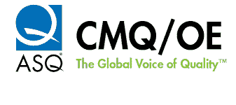
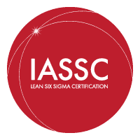
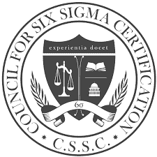

# 六西格码认证指南：绿色，黄色，黑色皮带详细信息

> 原文： [https://www.guru99.com/six-sigma-certification.html](https://www.guru99.com/six-sigma-certification.html)

## 什么是六西格码？

六西格码（Six Sigma）是一种质量管理方法，可以使个人或组织受益于最大限度地减少/消除产品和服务中的缺陷。 这是一组可以帮助您提高质量的技术。

六西格玛方法基于统计分析，而不是凭空猜测来改进未知问题的流程。

Sigma 一词是一个统计术语，可帮助专业人士判断特定过程需要完善的程度。

在本培训教程中，您将学习：

*   [什么是六西格码？](#1)
*   [为什么我们需要六个西格玛？ 主要优点](#2)
*   [六西格玛](#3)的历史
*   [什么是六西格码认证？](#4)
*   [六西格玛认证的类型](#5)
*   [六西格码认证的学习目标](#6)
*   [我如何开始？](#7)
*   [当前的工作前景](#8)

## 为什么我们需要六个西格玛？ 主要好处

这是六西格码制程的主要优点：

*   大大降低任何组织的成本并提高客户满意度
*   缩短上市时间
*   减少缺陷，废品，返工并帮助您简化操作。
*   提高竞争地位。
*   在六个西格玛过程中，预计 99.9999966％的产品无缺陷。

| **Process Sigma** | **DPMO（每百万机会缺陷数）** | **工艺产量** |
| --- | --- | --- |
| 6.0 | 3.4 | 99.99966% |
| 5.0 | 230 | 99.97700% |
| 4.0 | 6210 | 99.37900% |
| 3.0 | 66,800 | 93.32000% |
| 2.0 | 308000 | 69.20000% |
| 1.0 | 690000 | 31.0% |

*   该过程使您可以消除浪费和低效率，从而根据客户的期望提供结果，从而提高客户满意度。

## 六西格码的历史

在这里，是六个西格玛历史的重要地标：

*   在 1970 年，Motorola 开始尝试使用统计分析来解决问题。
*   1986 年，在摩托罗拉工作的资深科学家比尔·史密斯（Bill Smith）提出了 6 sigma 的概念，以标准化计算缺陷的方式。
*   1987 年-摩托罗拉公司正式启动了其 6 西格玛计划。
*   1991 年-摩托罗拉（Motorola）认证了第一位黑带六西格玛专家。
*   2000 年-今年，六西格码有效地确立为行业标准。 六西格码方法论的培训，咨询和实施已正式确定。

## 什么是 6 Sigma 认证？

认证课程可确保六西格玛认证的专业人员应接触完整的六西格玛知识体系（BoK）。 他们应该能够达到 6 sigma 及其实施的最低熟练水平。

六西格码认证有五个级别

1.  白带
2.  黄带
3.  绿化带
4.  黑带
5.  黑带大师

但是，没有必要在所有三个级别中都通过六西格玛皮带认证。 您可以根据自己的职业目标选择最合适的级别。

## 六西格玛认证的类型

六种 sigma 认证培训的五种类型是：

*   六西格玛白带
*   六西格玛黄带
*   六西格玛绿带
*   六西格玛黑带
*   六西格玛大师黑带

### 六西格玛白带

六西格玛白带认证培训课程旨在为您提供对六西格玛精益大纲的基本理解。 它涉及过程改进，可变性，对过程性能的不利影响。 它提供了有关每个团队成员扮演的特定角色的简要信息。

### 六西格玛黄带

六西格玛黄带是基础课程。 它教您一些基本方法。 它还涵盖了一些基本的改进过程以及重要的指标。

### 六西格玛绿带

六西格玛绿带认证培训和认证课程使个人可以学习如何创建图表，流程图和控制整个计划，以指导其他员工描述组织中的六西格玛角色。 绿带的名称主要属于团队负责人或直接与团队负责人一起工作的团队高级成员。

### 六西格玛黑带

六西格玛黑带认证课程使个人可以进行阶乘实验，多元回归并描述各种类型的过程优化。 黑带应该能够理解团队动态并根据其技能水平分配团队成员角色。

### 黑带大师

为期两周的“黑带大师”培训是最高的 6 Sigma 认证计划。 它提供了一种高级且高度集中的方法“六西格玛”项目和统计方法。

对于与团队打交道或作为高级领导人员的人员而言，这是一门有用的认证课程。 黑带六西格玛大师（Master Black Black Belt 6 Sigma）专业人员应该能够回答程序问题并能够解决任何复杂的技术问题。

## 六西格玛认证的学习目标

以下是六个 sigma 认证的基本学习目标：

*   六西格码（Singa Sigma）认证可帮助您增加对雇主及其客户的价值。
*   帮助您提高客户满意度以及产品和服务的质量
*   减少工艺周期时间，因此可以节省高达 30％的总体成本
*   帮助您在项目定义阶段确定和改进需求。
*   说明如何衡量产品和过程
*   帮助您执行数据分析和假设检验。
*   它允许针对变体的性能采取可能的改进措施。
*   他们是实现组织目标的合适人选。
*   您将在组织中获得更高的职位。
*   该认证培训可提高您晋升的机会。
*   通过应用“六西格码”工具和技术，可以使现有工作更轻松。
*   整体业务改善

## 如何开始？

Sig Sigma 证书主要由 [ASQ](https://asq.org/) ， [CSSC](https://www.sixsigmacouncil.org/) 和 [IASSC 进行。](https://www.iassc.org/)

### 什么是 ASQ？

美国质量学会也称为 [ASQ](https://asq.org/) 为不同的知识分子提供 18 种不同的认证。 该组织主要提供黄带，绿带，黑带和黑带大师证书。

申请 ASQ 认证的候选人可以成为会员省钱。 每年的费用在 29 美元到 159 美元之间，具体取决于您是以学生，准会员还是全职级别加入。

下表显示了 ASQ 认证的考试费用结构。

| **考试** | **费用（会员）** | **费用（非会员）** | **取款费** |
| --- | --- | --- | --- |
| ASQ 黄带 | $244 | $ 394 美元

 | $184 |
| ASQ 绿带 | $438 | $ 299

 | $239 |
| ASQ 黑带 | $538 | $ 388

 | $338 |
| ASQ Master 黑带* | $2,229 | $ 2,074

 | $ 2,229（会员）/ $ 2,074（非会员） |

*正在申请“黑带大师”的候选人还需要支付 650 美元（如果是会员，则需要支付 495 美元进行投资组合审查）

### 什么是 IASSC 认证？

[IASSC](https://www.iassc.org/) 或国际六西格码认证协会是一个专业协会，致力于在六西格码精益社区中发展和增强标准。 虽然，IASSC 从不提供任何培训，指导和辅导。 他们仅对候选人进行六西格码证书考试。

IASSC 提供的认证是：

*   黑带
*   绿化带
*   黄带

申请黄带认证的候选人花费您 195.00 美元，而绿带认证（高级课程）花费 295 美元，要实现黑带，您需要支付 395.00 美元。

### 什么是 CSSC？

六西格玛认证委员会（ [CSSC](https://www.sixsigmacouncil.org/) ）是六西格玛认证的官方行业标准，旨在获得六西格玛认证和培训。

本课程的主要目的是确保该人可以学习完整的 6 Sigma 认证知识。 该专业人员应能够达到最低熟练度标准，成为 6 sigma 专业人士。

六西格玛证书理事会提供以下课程：

*   白带认证
*   黄带认证
*   绿带认证
*   黑带认证
*   黑带大师认证

候选人可以免费申请基本的白带课程。 要获得黄带，他需要支付 79 美元，绿带 119 美元和 159 美元才能获得黑带认证。

### 如何获得六个西格玛证书？

要获得 6 西格玛证书，候选人应该能够满足经验要求，需要表现出其所应用技能的能力，并最终需要通过书面认证考试。

笔试大部分是选择题，在每个认证级别上分配的时间和难度都会增加。

例如，黄带考试可能需要 90 分钟。 黑带可能需要四个小时。 认证测试的动手部分可能需要您使用签署的誓章来完成一项或多项质量项目管理。

### 谁需要参加六个 sigma 认证培训？

这些培训被认为与之非常相关的一些专业人士是：

1.  质量控制专业人员
2.  流程改进专家
3.  生产经理
4.  过程控制专家
5.  一线和工厂主管
6.  人力资源等管理专业人员
7.  IT 和财务工程师
8.  业务分析师

## 当前的工作前景

六西格码专业人员的市场非常健康。 求职门户网站（例如 Simply Hired 和 Indeed.com）显示，六西格玛绿带认证的职位超过 2500 个，黑带约为 3000 个。 对于黄带专业人士来说，这个数字要低得多。 Master Black Belts 每天还有 1000 个职位发布。

在薪资方面，PayScale 和 Glassdoor 的数据表明，在美国，黄带六西格玛认证专业人员的平均年薪约为 53,901 美元，绿带为 42,053 美元。 一条黑带可以得到大约 90,000 美元，而黑带大师平均可以得到 119,000 美元，有时甚至更高。

## 摘要

*   六西格码（Six Sigma）是一种质量管理方法，它可以使个人或组织受益于最大限度地减少/消除产品和服务中的缺陷/错误。
*   六个西格玛方法可帮助您降低任何组织的成本并提高客户满意度。
*   六西格玛（Six Sigma）认证有五个级别，分别是白带，黄带，绿带，黑带，主黑带。
*   6 西格玛（Sigma）认证可帮助您增加对客户和公司的价值。
*   Sig Sigma 证书主要由 CSSC，ASQ 和 IASSC 进行。
*   “六个西格玛认证”的平均薪水从业务顾问每年大约 68,642 美元到高级质量工程师每年 89,727 美元之间不等。