# 面试中提出的十大 Excel 公式&答案

> 原文： [https://www.guru99.com/excel-formulas-interview-questions.html](https://www.guru99.com/excel-formulas-interview-questions.html)

[下载 PDF](https://www.guru99.com/pdf/excel-formulas-interview-questions.pdf)

以下是面试中最常见的 Excel 公式

**1）SUM 公式：= SUM（C2，C3，C4，C5）**

在 excel 中， **SUM** 公式用于计算总数。 例如，在这里，我们使用**公式= SUM（C2，C3，C4，C5）**计算出了在美国不同地区销售的计算机产品的总数，最后得到的总金额为 20，500 美元， 如下式所示。 在公式中的方括号内，您必须提及要添加的列号或行号。

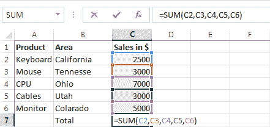

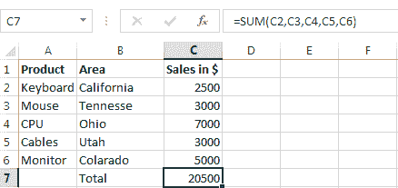

**2）平均值公式：=平均值（C2，C3，C4，C5）**

在 excel 中，平均值公式用于检索任意数字的平均值。 就像我们已经计算出了美国计算机产品的平均销售量一样。第一个屏幕截图突出显示了公式，即我们申请数据的 **=平均值（C2，C3，C4，C5）**。

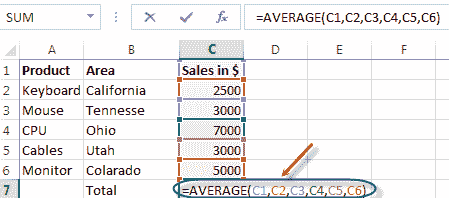

下面的屏幕截图显示了应用公式后我们保留的平均数量。

**3）SumIF 公式= SUMIF（A2：A7，“所需商品”，D2：D7）**

SumIF 给出选定范围内任何项目的总数。 例如，在这里我们只想计算**软件项目的总销售额，**为此，我们将公式应用为 **= SUMIF（A2：A7，“软件”，D2：D7）。** 在此，A2 和 A7 定义了软件的范围，并且我们可以通过同样的方式来找到硬件的销售额。 **（A2：A7，“硬件”，D2：D7）。**

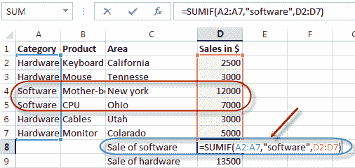

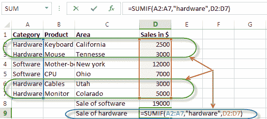

屏幕截图下方显示了表格中硬件和软件的总销售额。

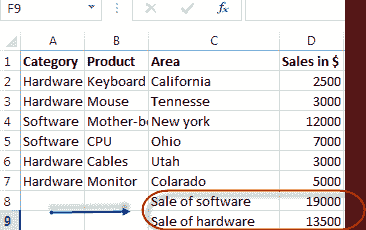

**4）COUNTIF 公式：COUNTIF（D2：D7，“功能”）**

COUNTIF 函数提供了广泛的应用； 您可以根据应用公式。 在这里，我们以 COUNTIF 函数为例，目的是查找值大于$ 3000 的单元格总数。 为了知道我们将应用公式 **= COUNTIF（D2：D7，“ 3000”）。**

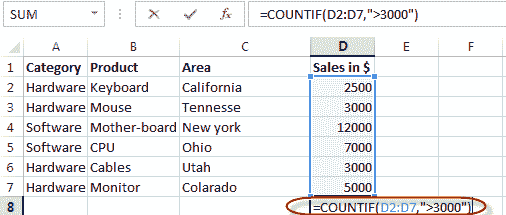

屏幕截图下方显示了值大于 3000 的单元格总数。

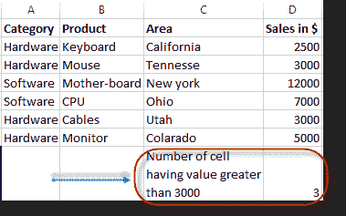

**5）串联函数：= CONCATENATE（C4，Text，D4，Text，...）**

串联功能在 excel 中用于连接不同的段或文本以显示为单个句子。 例如，在这里我们要显示文本为“纽约的最高销售额为 12000 美元”，为此，我们将使用公式= CONCATENATE（C4，“最高的销售额”，D4，美元”）。

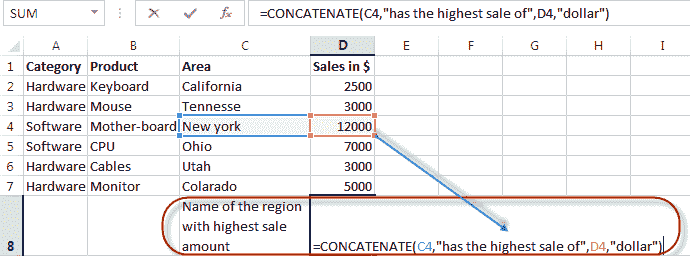

执行公式并显示文本时，如下面的屏幕截图所示

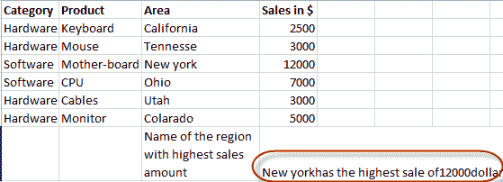

**6）Int 公式：int（此数字）**

如以下示例所示，使用 Int 公式从数字中删除整数。

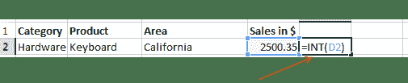

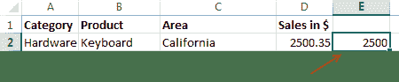

**7）MAX 公式：= Max（D2：D7）**

此 excel 公式将保留列中具有最高值的单元格，例如，在这里我们要了解计算机项的最高值，并且保留值$ 12000。 同样，您可以执行相同的公式以获取最小值，在该公式中，必须将 Max 替换为 Min。

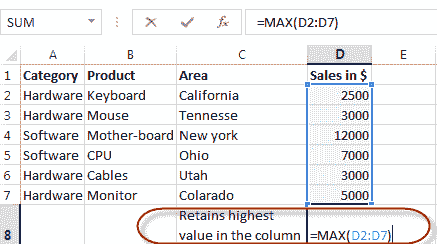

下面的屏幕截图显示了该列中的最大值。

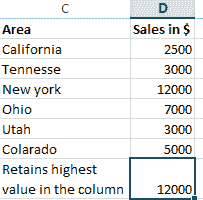

**8）阶乘公式= FACT（数字）**

阶乘公式将返回数字的阶乘。 要知道 3 的阶乘数，我们使用此公式。 您可以使用此公式来知道任意数字的概率，这里我们将得到因子 3 = 3x2x1。

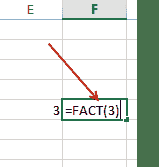

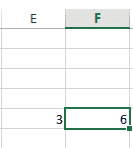

**9）VLookup 公式= Vlookup（列中的值，范围和获取值，是对我的列表进行排序）**

当您知道任何对象或个人的任何细节，并根据该细节保留其他形式时，将使用 VLookup 公式。 例如，这里有一个键盘示例，您知道键盘的零售价格，但您不知道它在加利福尼亚州通过销售键盘的总销售额。 要知道您将使用 **= Vlookup（20，D2：D7,2，False）。** 此公式将为您提供基于零售价的总销售额。 在应用此公式时，您要确保放置的所有引用都必须是唯一的，例如，您正在寻找具有其 ID 号的任何特定员工，否则不应将其分配给其他人，否则它将显示错误。

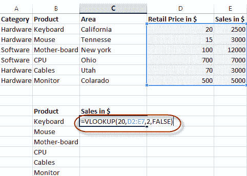

执行公式后，显示的总销售额为 2500 美元

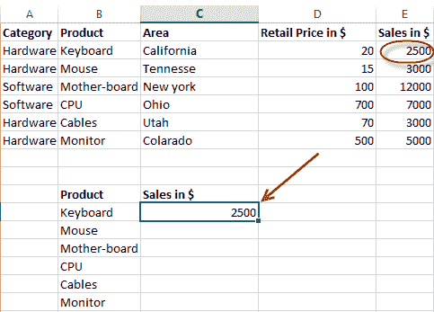

**10）IF 函数公式：IF（E2 > 2000，正确/不正确）**

这里我们使用了 **IF** 函数； 当您要参考满足以下条件是否正确时，可以使用此功能。 这里我们使用“良好”，因为任何销售额大于 2000 的都应标记为“良好”。 同样，您可以将其设置为“不良”，“正确”或“错误”。

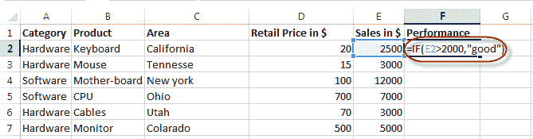

下表显示了当我们应用公式时，突出显示的单元格为“良好”。

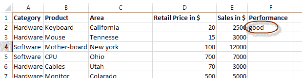

面试中还问您其他哪些公式？ 在下面的评论中让我们知道-