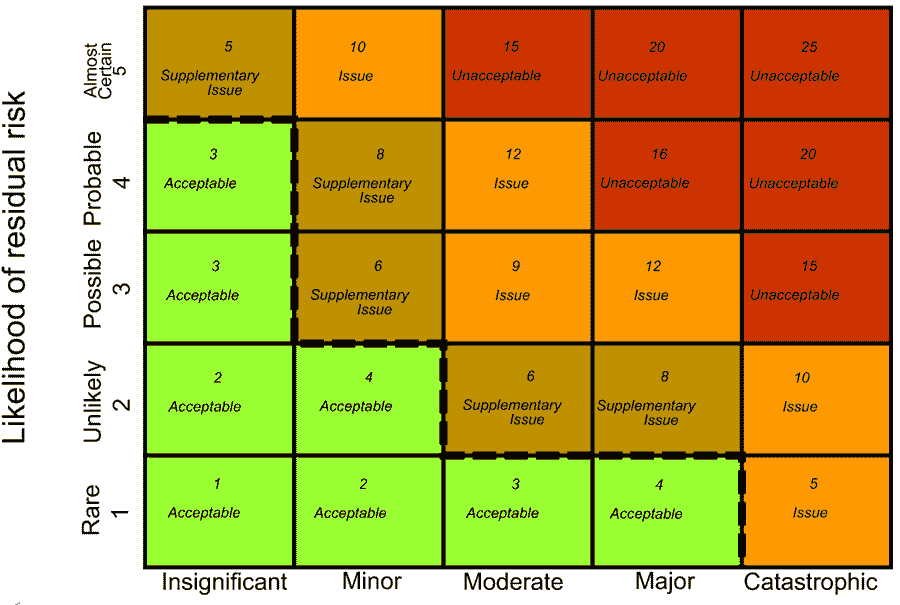

# 项目管理中的风险分析&风险管理

> 原文： [https://www.guru99.com/risk-analysis-project-management.html](https://www.guru99.com/risk-analysis-project-management.html)

## 什么是风险分析？

风险分析是指风险管理计划，风险分析，识别和控制项目风险的过程顺序。

适当的风险管理是对可能对整个项目造成负面影响的未来事件的控制。 它更多的是主动的然后是被动的过程。

## 如何管理风险？

风险管理流程主要涉及以下活动

## 

1.  计划风险管理

它是定义如何执行项目风险管理活动的过程。

## 

2.  风险识别

这是确定哪种风险可能对项目影响最大的过程。 此过程涉及现有风险的记录。

用于识别风险的输入将是

*   风险管理计划
*   项目范围说明书
*   成本管理计划
*   进度管理计划
*   人力资源管理计划
*   范围基准
*   活动费用估算
*   活动持续时间估算
*   利益相关者登记册
*   项目文件
*   采购文件
*   沟通管理计划
*   企业环境因素
*   组织过程资产
*   进行定性风险分析
*   进行定量风险分析
*   计划风险应对
*   监控风险

该过程的输出将是

*   风险登记簿

## 

3.  进行定性风险分析

它是通过组合和评估风险发生和影响的可能性来确定风险优先级以进行进一步分析或采取行动的过程。 它可以帮助管理人员减少不确定性水平，并专注于高优先级风险。

计划风险管理应在项目的早期进行，它可能影响各个方面，例如：成本，时间，范围，质量和采购。

定性风险分析的输入包括

*   风险管理计划
*   范围基准
*   风险登记册
*   企业环境因素
*   组织过程资产

此阶段的输出为

*   项目文件更新

## 

4.  定量风险分析

它是对确定的风险对总体项目目标的影响进行数值分析的过程。 为了使项目的不确定性最小化，这种分析对于决策非常有帮助。

Risk Management Matrix

这个阶段的输入是

*   风险管理计划
*   成本管理计划
*   进度管理计划
*   风险登记册
*   企业环境因素
*   组织过程资产

虽然输出将是

*   项目文件更新

## 

5.  计划风险应对措施

为了增加机会并最大程度地减少对项目目标的威胁，计划风险应对措施很有帮助。 它按照风险的优先级，预算，进度和项目管理计划中的活动来处理风险。

计划风险应对措施的输入为

*   风险管理计划
*   风险登记册

而输出是

*   项目管理计划更新
*   项目文件更新

## 

6.  控制风险

控制风险是跟踪已识别风险，识别新风险，监视剩余风险并评估风险的过程。

此阶段的输入包括

*   软件项目管理计划
*   风险登记册
*   工作绩效数据
*   工作绩效报告

The output of this stage would be

*   工作绩效信息
*   变更要求
*   项目管理计划更新
*   项目文件更新
*   组织流程资产更新

## 项目采购管理

项目采购管理包括购买或获取经营业务所需产品的过程。 该组织可以是卖方，买方或服务提供商。

项目采购管理还包括控制外部组织签发的任何合同，并在项目团队之外完成工作。

计划采购管理包括四个阶段，例如

*   计划采购管理
*   进行采购
*   控制采购
*   结束采购

计划采购管理中的输入是

*   需求文档
*   合作协议
*   风险登记册
*   范围基准
*   项目进度
*   活动费用估算
*   成本绩效基准
*   风险相关的合同决定
*   企业环境因素
*   组织过程资产

**进行采购流程**

行为采购流程涉及诸如

*   选择卖家
*   收到卖家回应
*   授予合同

进行采购过程的好处是，它通过既定协议使外部和内部利益相关者的期望保持一致。

行为采购过程的输入包括

*   项目管理计划
*   采购文件
*   来源选择标准
*   合格卖方清单
*   卖家建议
*   项目文件
*   做出或购买决定
*   合作协议
*   组织过程资产

**控制采购**

这是监视合同执行情况和根据指南进行更正的过程。 它将确保买卖双方都按照法律协议的条款满足采购要求。

控制采购的输入包括

*   项目管理计划
*   采购文件
*   协议书
*   批准的变更请求
*   工作绩效报告
*   工作绩效数据

输出包括

*   工作绩效信息
*   变更要求
*   项目管理计划更新
*   项目文件更新
*   组织流程资产更新

**封闭采购**

此步骤涉及记录协议和其他文档以供将来参考。

该工具的输入包括

*   项目管理计划
*   采购文件

该工具的输出包括

*   封闭式采购
*   组织流程资产更新

## 管理涉众参与

[利益相关者](/stakeholder-needs-analysis.html)是任何项目的组成部分； 他们的决定会对项目可交付成果产生深远影响。 在此过程中，第一部分是确定可能影响项目的人员，团体或组织，而第二部分是分析利益相关者的期望。

它还关注与利益相关者的持续沟通，以了解他们的需求和期望。

**识别涉众**

这是确定可能影响项目成果的团体，人员或组织的过程。 它使项目经理可以确定适当的利益相关者。

**计划利益相关者管理**

这是准备在整个项目生命周期中让利益相关者参与的策略的过程。 它定义了清晰，可操作的计划以与项目涉众进行交互。

计划利益相关者管理的输入包括

*   项目管理计划
*   利益相关者登记册
*   企业环境因素
*   组织过程资产

这个的输出

*   利益相关者管理计划
*   项目文件更新

**管理涉众参与度**

在此阶段，与利益相关者进行沟通以了解他们的期望，解决问题并促进适当的利益相关者参与项目活动。 它使项目经理可以在不与利益相关者的决定相冲突的情况下实现项目成功。

The input of this stage is

*   利益相关者管理计划
*   沟通管理计划
*   变更记录
*   组织流程资产

虽然这个阶段的输出是

*   问题记录
*   改变请求
*   项目管理计划更新
*   项目文件更新
*   组织流程资产更新

**控制利益相关者参与**

它是监视利益相关者参与项目并根据要求调整策略的过程。 随着项目的发展和进展，它将增加利益相关者的参与活动。

此阶段的输入包括

*   项目管理计划
*   问题记录
*   工作绩效数据
*   项目文件

该阶段的输出包括

*   工作绩效信息
*   变更要求
*   项目管理计划更新
*   项目文件更新
*   组织流程资产更新

**摘要**

在本教程中，您了解了：

风险管理包括执行风险管理计划，风险分析，识别和控制项目风险的过程。

这些步骤可用于管理组织中的风险

*   风险识别
*   风险资格
*   风险应对
*   风险监控

采购管理，包括购买或获取经营业务所需产品的过程。 这是根据指南监视合同绩效和合同更正的过程

利益相关者的参与重点在于整个项目生命周期中的持续沟通。 利益相关者的决定会对项目的可交付成果产生深远影响。