# 2020 年 20 种最佳 Excel 课程

> 原文： [https://www.guru99.com/excel-courses.html](https://www.guru99.com/excel-courses.html)

Following is a curated list of 20 Excel Courses for professionals and even enthusiasts. Excel is an indispensable tool for IT, Finance, Commerce and gaining mastery in Excel will remove the pain in your daily tasks. The courses cover concepts like Excel Basics, Functions, Formatting, Charts, List, Data Validation, etc.
Most of the courses are available at a discount. The discount coupon is pre-applied, click on the link to activate it.

#### 畅销课程

* * *

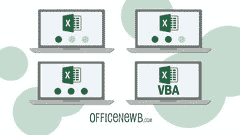 [#### Microsoft Excel-从入门到高级的 Excel

Excel with this A-Z Microsoft Excel Course. Microsoft Excel 2010, 2013, 2016, Excel 2019 and Office 365Bestseller 4.6  (91,250 ratings)  Current price$11.99](https://bit.ly/2SPal56)

* * *

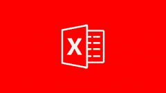 [#### Microsoft Excel-在 6 小时内从初学者到专家

This Microsoft Excel class will make you a master of Microsoft Excel. The training uses Excel 2013 for Windows.4.4  (12,162 ratings)  Current price$11.99](https://bit.ly/2tvpOML)

* * *

 [#### 在 Excel 中成为 Pro 的初学者：财务建模和评估

Financial Modeling in Excel that would allow you to walk into a job and be a rockstar from day one!Bestseller 4.5  (97,219 ratings)  Current price$11.99](https://bit.ly/2Fh6ntV)

* * *

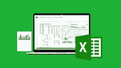 [#### 终极 Excel 程序员课程

Learn Excel VBA from Scratch with Dan Strong, Bestselling Excel Expert..Bestseller 4.5  (11,401 ratings)  Current price$11.99](https://bit.ly/35nA8Um)

* * *

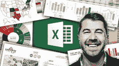 [#### Microsoft Excel-高级 Excel 公式&函数

Master 75+ Excel formulas with hands-on demos from a best-sellingBestseller 4.6  (21,065 ratings)  Current price$11.99](https://bit.ly/2MQXiMy)

* * *

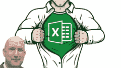 [#### Excel Essentials：完整的 Excel 系列-1、2 级& 3

Excel: The WHOLE Excel Mastery Series In One! From Excel Novice To VBA Programmer4.5  (11,872 ratings)  Current price$11.99](https://bit.ly/2QGgT3g)

* * *

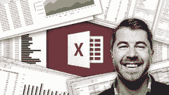 [#### Microsoft Excel-使用 Excel 数据透视表进行数据分析

Master Excel Pivot Tables & data analysis with real-world cases from a best-selling Excel instructorBestseller 4.5  (12,882 ratings)  Current price$11.99](https://bit.ly/36kaIbv)

* * *

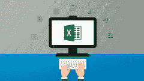 [#### Microsoft Excel 2013 高级

Master Advanced Excel 2013 Features. Become A Expert And Learn To Use Excel4.7  (3,051 ratings)  Current price$11.99](https://bit.ly/2ZOrFbW)

* * *

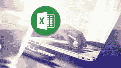 [#### 快速学习 Excel。 掌握 Microsoft Excel 功能，数据透视图& Excel 快捷方式。

Learn4.5  (3,578 ratings)  Current price$11.99](https://bit.ly/2trV7bg)

* * *

 [#### Microsoft Excel 2010 课程初学者

Learn to Invoke the Power of Microsoft Excel in easy to follow stages4.5  (2,187 ratings)  Current price$11.99](https://bit.ly/37BbYrb)

* * *

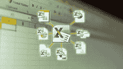 [#### Microsoft Excel 2010：高级培训

Master Advanced Excel 2010 Features. Become A Expert And Learn To Use Excel4.5  (2,241 ratings)  Current price$11.99](https://bit.ly/2trVfHM)

* * *

 [#### Microsoft Excel-数据可视化，Excel 图表&图形

Master 20+ Excel charts & graphs and build custom visuals with a best-selling Excel instructorBestseller 4.6  (5,565 ratings)  Current price$11.99](https://bit.ly/2rUGYmO)

* * *

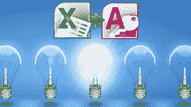 [#### Excel 访问：Excel 用户的 Microsoft Access 简介

Learn Access quickly and understand how it works with Excel.4.6  (2,666 ratings)  Current price$11.99](https://bit.ly/2QG8psS)

* * *

 [#### 具有顶级 Microsoft Excel 技巧的 Excel

Learn these Hidden Excel Gems to Become an Excel Master4.7  (1,516 ratings)  Current price$11.99](https://bit.ly/2ZO1NNl)

* * *

 [#### Microsoft Excel-基础入门

Learn to use Functions & Formulas, Charts, Filters, Keyboard Shortcuts4.4  (1,350 ratings)  Current price$11.99](https://bit.ly/2QH4uMf)

* * *

 [#### Microsoft Excel 2016 大师班

Quickly learn how use Excel 2016 the right way and make your life easier4.5  (1,366 ratings)  Current price$11.99](https://bit.ly/2MR5egF)

* * *

 [#### 视觉效果出色的 Excel 仪表板

Actionable Excel Tips (Templates Included) You Can Use Right Now to Create Eye-CatchingBestseller 4.6  (6,192 ratings)  Current price$11.99](https://bit.ly/2MPSEP1)

* * *

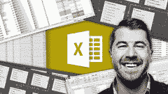 [#### Microsoft Excel-Excel Power Query，Power Pivot & DAX

Learn Excel business intelligence (Power Query, Power Pivot & DAX) with a best-selling Excel instructorBestseller 4.7  (5,713 ratings)  Current price$11.99](https://bit.ly/2trVB14)

* * *

 [#### 掌握 Microsoft Excel 宏和 Excel VBA

Project Based Course on Excel VBA (Visual Basic for Applications) and Excel MacrosBestseller 4.5  (7,262 ratings)  Current price$11.99](https://bit.ly/36jGRju)

* * *

 [#### 解锁 Excel VBA 和 Excel 宏

Automate Complex Tasks with Microsoft Excel VBA & Excel Macros (Real-World Projects included).Bestseller 4.6  (12,955 ratings)  Current price$11.99](https://bit.ly/39DORxN)