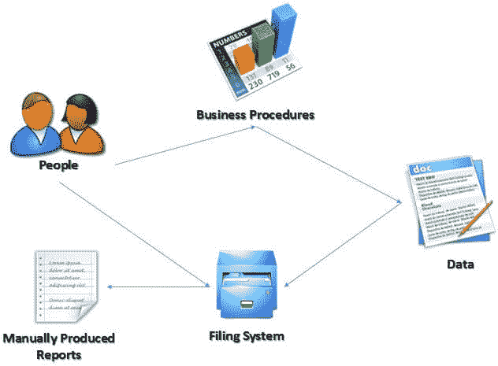

# 什么是 MIS？ 简介&定义

> 原文： [https://www.guru99.com/mis-definition.html](https://www.guru99.com/mis-definition.html)

## 什么是 MIS？

**MIS** 是使用信息技术，人员和业务流程来记录，存储和处理数据，以生成决策者可以用来进行日常决策的信息。 MIS 的完整形式是**管理信息系统**。 MIS 的目的是从各种来源中提取数据并获得推动业务增长的见解。

在本教程中，我们将学习，

*   [MIS 的组成部分](#1)
*   [信息系统的类型](#2)
*   [手动信息系统与计算机信息系统（MIS）](#3)
*   [手动信息系统](#4)的优缺点
*   [计算机信息系统（MIS）的优缺点](#5)

**对 MIS 的需求**

以下是拥有 MIS 系统的一些理由

*   **决策者需要信息来制定有效的决策。** 管理信息系统（MIS）使这成为可能。
*   **MIS 系统促进了组织内部和外部的通信** –组织内的员工能够轻松访问日常运营所需的信息。 诸如短消息服务（SMS）&电子邮件之类的便利功能使您可以从组织使用的 MIS 系统中与客户和供应商进行通信。
*   **记录保存** –管理信息系统记录组织的所有业务交易，并为交易提供参考点。

## MIS 的组件

典型的 MIS 长格式（管理信息系统）的主要组件是：

*   **人员** –使用信息系统的人员
*   **数据** –信息系统记录的数据
*   **业务流程** –有关如何记录，存储和分析数据的流程
*   **硬件** –这些包括服务器，工作站，网络设备，打印机等。
*   **软件** –这些是用于处理数据的程序。 这些包括电子表格程序，数据库软件等程序。

## 信息系统的类型

用户使用的信息系统的类型取决于他们在组织中的级别。 下图显示了组织中用户的三个主要级别以及他们使用的信息系统的类型。

**交易处理系统（TPS）**

这种信息系统用于记录企业的日常交易。 交易处理系统的一个示例是销售点（POS）系统。 POS 系统用于记录每日销售额。

**管理信息系统（MIS）**

缩写为 MIS 的管理信息系统用于指导战术管理者做出半结构化决策。 交易处理系统的输出用作 MIS 系统的输入。

**决策支持系统（DSS）**

高层管理人员使用决策支持系统来进行半结构化决策。 管理信息系统的输出用作决策支持系统的输入.DSS 系统还从外部资源（例如当前市场力量，竞争等）获取数据输入。

## 手动信息系统 VS 计算机信息系统（MIS）

数据是任何业务实体的血液。 组织中的每个人都需要信息来制定决策。 信息系统是记录，存储数据和检索信息的组织方式。

在本节中，我们将研究手动信息系统与计算机信息系统。

**手动信息系统**

手动信息系统不使用任何计算机设备。 数据的记录，存储和检索是由负责信息系统的人员手动完成的。

以下是手册信息系统的主要组成部分

*   **人员–** 人员是信息系统的接收者
*   **业务流程–** 这些措施已经到位，它们定义了处理数据，存储数据，分析数据和产生信息的规则
*   **数据–** 这些是记录的日常交易
*   **归档系统–** 这是一种有组织的信息存储方式
*   **报告–** 报告是在手动分析来自归档系统的数据并进行编译后生成的。

下图说明了典型的手动信息系统的工作方式

## 手动信息系统的优点和缺点

**优势：**

以下是手动信息系统的优点

*   **具有成本效益–** 与计算机系统相比便宜，因为不需要购买昂贵的设备，例如服务器，工作站，打印机等。
*   **灵活–** 不断发展的业务需求可以轻松地实施到业务流程中并立即实施

**缺点：**

以下是手动信息系统的一些缺点。

*   **耗时–** 所有数据条目都需要在归档之前进行验证，这是人工完成的一项耗时任务。 从归档系统检索数据也需要花费大量时间
*   **容易出错–** 与计算机系统进行的验证相比，当人类进行验证和验证时，数据的准确性更容易出错。
*   **缺乏安全性–** 手动系统的安全性是通过限制对文件室的访问来实现的。 经验表明，未经授权的人可以轻松进入文件室
*   **数据重复–** 组织中的大多数部门都需要访问相同的数据。 在手动系统中，通常会复制此数据以使所有授权用户都可以轻松访问。 当需要更新相同数据时，挑战就来了
*   **数据不一致–** 由于数据重复，更新一个文件中的数据而不更新其他文件是很常见的。 这导致数据不一致
*   **缺少备份–** 如果文件丢失或处理不当，恢复数据的机会几乎为零。

**计算机信息系统**

开发了计算机化系统来应对手动信息系统的挑战。 手动信息系统和计算机信息系统之间的主要区别在于，计算机系统使用软件和硬件的组合来记录，存储，分析和检索信息。

## 计算机信息系统（MIS）的优缺点

以下是计算机信息系统的一些缺点。

**Advantages:**

以下是计算机信息系统的优势

*   **快速数据处理和信息检索-**这是计算机信息系统的最大优点之一。 它处理数据并以更快的速度检索信息。 这样可以改善客户/客户服务
*   **提高了数据准确性–** 与手动系统相比，在计算机系统中易于实施数据验证和验证检查。
*   **改进的安全性–** 除了限制对数据库服务器的访问外，计算机信息系统还可以实施其他安全控制，例如用户身份验证，生物特征认证系统，访问权限控制等。
*   **减少了数据重复–** 数据库系统的设计方式是最大限度地减少了数据重复。 这意味着在一个部门中更新数据会自动将其提供给其他部门
*   **改进的备份系统–** 采用现代技术，可以将备份存储在云中，如果用于存储数据的硬件和软件发生问题，则可以轻松恢复数据
*   **易于获取信息–** 大多数企业高管需要旅行，仍然能够根据信息做出决定。 网络和[移动](/mobile-testing.html)技术可以从任何地方访问数据。

**缺点：**

*   **设置和配置非常昂贵–** 组织必须购买硬件和所需的软件才能运行信息系统。 除此之外，将需要修改业务程序，并且需要对员工进行有关如何使用计算机信息系统的培训。
*   **严重依赖技术–** 如果硬件或软件发生故障，导致其停止运行，则只有在替换了所需的硬件或软件之后，才能访问该信息。
*   **欺诈风险–** 如果没有适当的控制和检查，则入侵者可以过帐未经授权的交易，例如从未交付的货物的发票等。

**摘要**

*   MIS 代表管理信息系统。 它是人员，过程，数据和信息技术的集合，可帮助管理人员做出明智的决策。
*   与手动信息系统相比，计算机信息系统效率更高。 手动信息系统比计算机信息系统便宜。
*   交易处理系统（TPS）由运营人员记录日常业务交易，并用于制定结构化决策
*   中层管理人员使用管理信息系统（MIS）进行半结构化决策
*   决策支持系统由高层管理人员使用，它们可以帮助高层管理人员制定非结构化的决策。