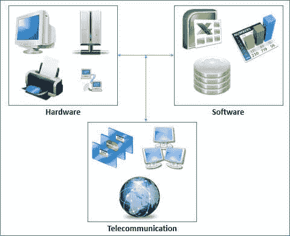
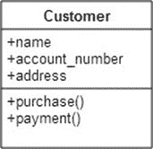

# MIS（管理信息系统）的目标&

> 原文： [https://www.guru99.com/mis-objectives-needs.html](https://www.guru99.com/mis-objectives-needs.html)

## MIS 目标

MIS 是使用硬件，软件和电信网络来实现业务目标。

例如，如果某人在一家公司工作，而该公司的客户位于许多不同的位置，则将要求他们不时拜访客户。

在旅行时，他们将需要使用现金，并且需要现金才能前往最近的 ATM 机。他们甚至可以使用手机中的[移动](/mobile-testing.html)货币，并从任何代理商提取现金 。

下图显示了典型的 MIS 基础架构的体系结构；

## 计算机硬件

计算机硬件是指物理设备，例如服务器，台式计算机，笔记本电脑，便携式设备，网络设备，存储设备和打印机等。现在让我们分别看一下每个元素

**服务器** –服务器是具有强大计算能力和存储空间的计算机，用于托管共享资源。 该服务器可用作存储所有业务交易的数据库服务器。 电子邮件服务器可以用于公司的所有电子邮件。 文件共享可用于存储组织员工等的各个文件。

**台式计算机** –这些工作站工作站客户端通常连接到服务器以发布，处理和检索信息。 例如，安装在台式计算机上的销售点系统，用于连接到服务器上的 POS 数据库以发布和检索数据。

**便携式计算机** **和便携式设备** –便携式计算机具有与台式计算机相同的计算能力，但具有便携式的优势。 随着 Internet 和虚拟专用网络的出现，员工可以携带笔记本电脑前往偏远地区，并且仍然能够访问总部的服务器。

与笔记本电脑相比，平板电脑更容易携带，并且许多组织都有从平板电脑运行的业务应用程序。 它们还能够通过 Internet 连接到服务器。

**联网设备** –联网设备用于互连计算资源，以便它们可以相互通信。 常见的网络设备包括网络集线器和交换机，Wi-Fi 路由器等。集线器和交换机用于通过物理电缆提供网络连接，并且通常用于连接台式计算机。 Wi-Fi 路由器用于提供无线网络功能。 Wi-Fi 路由器通常用于将笔记本电脑和移动设备连接到公司网络。

**打印机** –打印机用于打印报告的硬拷贝。 它们根据用途而变化。 一些打印机具有联网功能，可以安装在网络上，并且可以由多个人使用。 这减少了为每台计算机购买单独打印机的成本。 点矩阵打印机通常在销售点和银行出纳员处很常见，用于打印收据，存款单等。

**存储设备** –存储设备用于存储数据。 数据可以采用文档，音频，视频，软件安装包，数据库备份等形式。最常见的存储设备是外部光盘。 还存在具有联网功能的存储设备，可用于共享网络上的文件。 IT 部门通常根据部门和要存储的数据类型创建文件存储目录。

## MIS 系统软件，应用软件，打包软件解决方案

该软件在硬件之上运行。 软件是指执行特定任务的计算机程序。 该软件通常分为两大类，即系统软件和应用程序软件。

**MIS 系统软件**

系统软件通常是指操作系统。 操作系统是一种计算机软件，可促进硬件与用户之间的通信。 Microsoft Windows 是世界上最常用的操作系统。

操作系统的其他示例包括由 Apple 开发的 Mac OS，以及其他基于 Linux 的操作系统，例如 Ubuntu，Fedora 等。

**应用软件**

应用程序软件在操作系统之上运行，并执行非常专门的任务。 例如，Microsoft Word 是用于创建和编辑文档的应用程序软件的示例。 Microsoft Excel 是用于处理数字数据的应用程序软件的另一个示例。

诸如 Excel 和 Word 之类的应用程序被称为现成的软件包。 这意味着您可以从授权经销商处购买它们，然后开始使用它们而无需任何更改。 如果现成的软件不符合组织的要求，则必须开发满足用户要求的定制软件。 此类软件通常由专门从事软件开发的公司开发。

## 数据库功能，数据管理，设计数据库

数据库是一组相关数据的存储，这些数据以最小的冗余度存储在一个地方。 大多数业务应用程序通过这些数据库记录日常业务交易。 有各种数据库可用于访问和存储数据，例如 RDBMS，NoSQL，XML 等。

*   关系数据库管理系统（RDBMS）模型使用表存储数据，这是最常用的数据库模型。
*   使用结构化查询语言（SQL）查询数据。
*   关系数据库表中的记录是使用主键唯一标识的，该主键对于每个记录都应该是唯一的。
*   出现在另一个表中的主键称为外键。

关系数据库系统可以是独立的，也可以基于客户端-服务器。 独立数据库不同时支持多个用户。 独立数据库系统的示例包括；

*   Microsoft Access
*   SQLIte
*   Microsoft [SQL](/sql.html) Server Compact

客户端-服务器数据库一次可以支持多个用户。 数据库引擎通常安装在服务器计算机上，并且用户从远程工作站连接到它。 客户端-服务器数据库系统的示例包括

*   的 MySQL
*   Microsoft SQL 服务器
*   甲骨文
*   PostgreSQL 的

现在正在流行的另一种数据库类型是 NoSQL 数据库。 它们是非关系性的，用于处理大量数据，而不会降低系统性能。 处理大量数据的公司，例如 Facebook，Google，Amazon 等，都使用 NoSQL 数据库。

NoSQL 数据库的示例包括

*   CouchDB
*   Oracle NoSQL 数据库
*   MongoDB
*   Neo4J

数据库设计涉及了解组织的数据存储和检索要求以及开发数据库的详细数据模型。

## 电信系统和网络

电信是远距离的信息交换。 电信使用发射机和接收机来促进通信。 信号可以通过物理电缆发送，也可以通过无线网络发送。

电信网络是指交换数据的多个发送器和接收器。 互联网是大型电信网络的一个示例。 广域网（WAN），电话通信网络等都是电信网络的示例。

网络设备用于将计算机和其他电信设备链接在一起。 用于创建网络的设备取决于所需的网络工作类型。 例如，有线局域网（LAN）将需要网络交换机和 RJ-45 电缆。

网络路由器用于促进两个或多个网络之间的通信。 无线路由器用于提供无线访问点。 无线接入点用于将电子设备（例如计算机，智能手机等）连接到计算机网络

## 数据结构和算法

想想像 Facebook 这样的公司。 每月有数十亿用户向 Facebook 提交数据。 反过来，Facebook 使用此数据来准确选择与用户相关的帖子，并向朋友提出几乎每次 100％准确的建议。

数据结构和算法是组织和管理数据（尤其是大型数据集）的有效方法。 数据结构通常是指数据的存储方式。

例如，类是现实世界实体的表示。 客户类别将包含属性（即名称，帐号，地址等）和方法（即进行购买，付款等）。

下图说明了类的概念；

数据结构的其他示例包括数组，记录，集合和图形。

算法是指可以对数据执行的操作。

让我们以亚马逊为例。 如果您曾经在 Amazon 购买商品或浏览过目录，Amazon 会推荐您可能感兴趣的其他商品。Amazon 使用历史数据来预测您也可能感兴趣的其他商品。

**摘要**：

从长远来看，信息技术作为一种业务工具可用于有效地归档业务目标并降低运营成本。 信息技术的实现至少需要硬件，软件和电信网络。

硬件是指物理设备，例如服务器，工作站，打印机等。最常用的软件包括数据库服务器，电子邮件服务器，电子表格应用程序，文字处理器等。局域网（有时甚至是广域网）用于在用户之间共享资源。 。