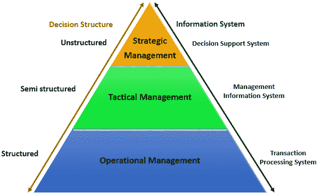

# 信息系统类型：TPS，DSS &金字塔图

> 原文： [https://www.guru99.com/mis-types-information-system.html](https://www.guru99.com/mis-types-information-system.html)

一个典型的组织分为运营，中级和上级。 每个级别的用户对信息的要求都不同。 为此，有许多信息系统支持组织中的每个级别。

本教程将探讨信息系统的不同类型，使用它们的组织级别以及特定信息系统的特征。

在本教程中，您将学习不同的信息分类。

*   [组织级别和信息要求的金字塔图](#1)
*   [交易处理系统（TPS）](#2)
*   [管理信息系统（MIS）](#3)
*   [决策支持系统（DSS）](#4)
*   [商业人工智能技术](#5)
*   [在线分析处理（OLAP）](#6)

## 组织级别和信息要求的金字塔图

了解组织的各个级别对于了解在各自级别上运行的用户所需的信息至关重要。

下图说明了典型组织的各个级别。

**运营管理级别**

运营级别与执行组织的日常业务交易有关。

处于此管理级别的用户示例包括销售点的出纳员，银行出纳员，医院的护士，客户服务人员等。

此级别的用户可以使用结构化的决策。 这意味着他们已经定义了指导他们进行决策的规则。

例如，如果一家商店以信贷方式出售商品，而他们的信贷政策对借贷设置了一定的限制。 所有销售人员需要根据系统中当前的信用信息来决定是否向客户提供信用。

**战术管理级别**

该组织级别由中层经理，部门负责人，主管等控制。该级别的用户通常在运营管理级别监督用户的活动。

战术用户做出半结构化的决策。 决策部分基于既定的准则和判断力。 例如，战术经理可以检查客户的信用额度和付款历史，并决定进行例外处理以提高特定客户的信用额度。 从某种意义上说，决策的结构是战术经理必须使用现有信息来确定对组织有利的付款历史和允许的增长百分比。

**战略管理级别**

这是组织中的最高级别。 此级别的用户做出非结构化的决定。 高级管理人员关心组织的长期计划。 他们在制定非结构化决策时会使用战术管理人员提供的信息和外部数据来指导他们。

## 交易处理系统（TPS）

交易处理系统用于记录组织的日常业务交易。 用户在运营管理级别使用它们。 交易处理系统的主要目标是回答诸如以下的常规问题：

*   今天如何出售打印机？
*   我们手头有多少库存？
*   John Doe 的欠款是多少？

通过记录日常业务交易，TPS 系统可以及时提供上述问题的答案。

*   运营经理的决策是例行且高度结构化的。
*   从交易处理系统产生的信息非常详细。

例如，发放贷款的银行要求工作人员所在的公司应与银行签订谅解备忘录（MoU）。 如果其雇主与银行有谅解备忘录的人申请贷款，则操作人员所要做的就是核实所提交的文件。 如果符合要求，则处理贷款申请文件。 如果他们不符合要求，则建议客户与战术管理人员联系，以查看签署谅解备忘录的可能性。

交易处理系统的例子包括：

*   **销售点系统** –记录每日销售额
*   **薪资系统** –处理员工工资，贷款管理等
*   **库存控制系统** –跟踪库存水平
*   **航空公司预订系统**-航班预订管理

## 管理信息系统（MIS）

战术管理者使用管理信息系统（MIS）来监视组织的当前绩效状态。 交易处理系统的输出用作管理信息系统的输入。

MIS 系统使用常规算法对输入进行分析，即汇总，比较和总结结果，以生成报告，战术管理者使用这些报告来监视，控制和预测未来的表现。

例如，来自销售点系统的输入可用于分析性能良好的产品和性能不好的产品的趋势。 该信息可用于做出未来的库存订单，即增加性能良好产品的订单，减少性能不好的产品的订单。

管理信息系统的例子包括：

*   **销售管理系统** –它们从销售点系统获取输入
*   **预算系统** –概述了组织内短期和长期花费的资金。
*   **人力资源管理系统** –员工的整体福利，员工流动等

战术经理负责半结构化决策。 MIS 系统提供做出结构化决策所需的信息，并根据战术管理人员的经验做出判断，即根据第一季度的销售额预测第二季度应订购的商品或库存量。

## 决策支持系统（DSS）

决策支持系统被高级管理层用来做出非常规决策。 决策支持系统使用来自内部系统（事务处理系统和管理信息系统）和外部系统的输入。

决策支持系统的主要目标是为独特且频繁变化的问题提供解决方案。 决策支持系统回答以下问题：

*   如果我们将工厂的生产量增加一倍，对员工绩效的影响将是什么？
*   如果有新的竞争对手进入市场，我们的销售将会怎样？

决策支持系统使用复杂的数学模型和统计技术（概率，预测建模等）来提供解决方案，并且它们具有很高的交互性。

决策支持系统的示例包括；

*   **财务计划系统** –使经理能够评估实现目标的其他方法。 目的是找到实现目标的最佳方法。 例如，企业的净利润是使用总销售额减去（商品成本+费用）公式计算得出的。 财务计划系统将使高级管理人员能够提出疑问，并调整总销售额，商品成本等价值，以了解决策的效果和对净利润的影响，并找到最佳方法。
*   **银行贷款管理系统** –用于验证贷款申请人的信用并预测收回贷款的可能性。

## 商业中的人工智能技术

人工智能系统模仿人类的专业知识来识别大数据集中的模式。 诸如 Amazon，Facebook 和 Google 等公司使用人工智能技术来识别与您最相关的数据。

让我们以 Facebook 为例，Facebook 通常会对您可能认识或上学的人做出非常准确的预测。 他们使用您提供给他们的数据，朋友提供的数据，并基于此信息对您可能认识的人进行预测。

亚马逊也使用人工智能技术，根据您目前所获得的商品来建议您应该购买的产品。

Google 还使用人工智能，根据您与 Google 的互动以及您所在的位置为您提供最相关的搜索结果。

这些技术极大地帮助了这些公司取得成功，因为它们能够为客户提供价值。

## 在线分析处理（OLAP）

在线分析处理（OLAP）用于查询和分析多维数据，并生成可以使用多维使用不同方式查看的信息。

假设一家公司销售笔记本电脑，台式机和[移动](/mobile-testing.html)设备。 他们有四（4）个分支 A，B，C 和 D。OLAP 可用于查看所有产品在所有地区的总销售额，并将实际销售额与预期销售额进行比较。

每条信息（例如产品，销售数量，销售价值）都代表一个不同的维度

OLAP 系统的主要目标是在最短的时间内为临时查询提供答案，而不管所使用的数据集的大小如何。