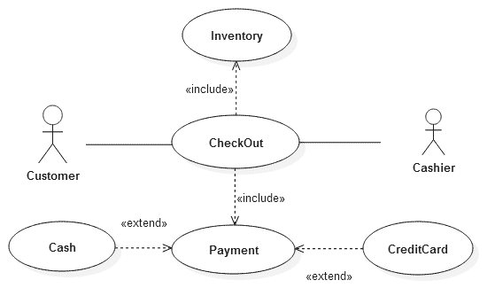
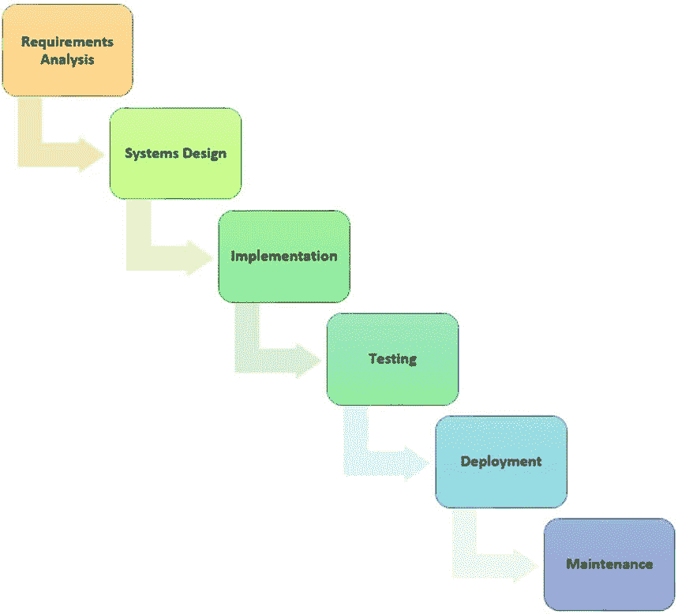
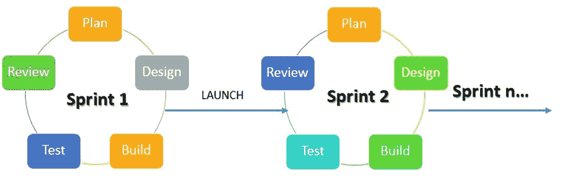
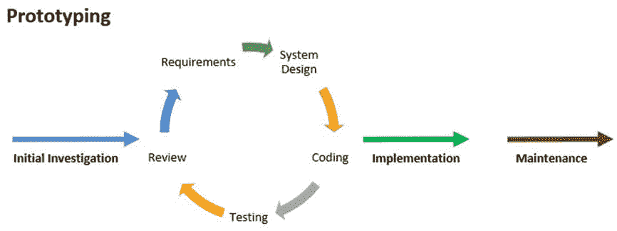

# SDLC &敏捷的 MIS 开发流程

> 原文： [https://www.guru99.com/mis-development-process.html](https://www.guru99.com/mis-development-process.html)

该软件是管理信息系统的主要组件之一。 MIS 系统中使用的某些软件是现成的。 这些包括电子表格程序，数据库应用程序等软件包。

但是，有时这些软件无法满足业务需求。 解决此问题的方法是定制软件。

本教程将重点介绍用于开发定制软件的方法。

在本教程中，您将学习-

*   [信息系统开发利益相关者](#1)
*   [MIS 系统分析和设计](#2)
*   [MIS 面向对象的分析和设计](#3)
*   [MIS 系统开发生命周期（SDLC）](#4)
*   [瀑布模型](#5)
*   [敏捷开发](#6)
*   [原型制作](#7)

## 信息系统开发涉众

典型的信息系统开发通常具有三（3）个利益相关者；即

*   **用户** –用户是在开发系统以执行日常任务后使用系统的用户。
*   **项目发起人**-此类利益相关者负责项目的财务方面，并确保项目完成。
*   **Developers** – this category is usually made up of systems analysts and programmers. The system analysts are responsible for collecting the user requirements and writing system requirements.

    程序员根据系统分析师开发的系统需求来开发所需的系统。

项目中最重要的利益相关者是用户。 为了使一个项目被接受为完成项目，用户必须接受并使用它。 如果用户不接受系统，则该项目将失败。

## MIS 系统分析与设计

系统分析和设计是指两个紧密相关的学科**系统分析**和**系统设计。**

*   **系统分析**与理解业务目标，目的和开发业务流程有关。 系统分析的最终产品是系统规格。
*   **系统设计**使用系统分析的输出作为输入。 系统设计的主要目标是将系统要求解释为如何实现信息系统的体系结构，逻辑和物理设计。

## MIS 面向对象的分析与设计

面向对象的分析和设计（OOAD）与系统分析和设计紧密相关。 面向对象的分析和设计（OOAD）与系统分析和设计之间的主要区别在于 OOAD 使用对象来表示真实世界的实体。

面向对象的分析和设计使用视觉建模来改善所有利益相关者之间的沟通并生产高质量的产品。

对象是现实世界实体（例如客户，产品，员工等）的表示。统一建模语言（UML）是用于创建系统视觉设计的通用语言。

下图显示了示例 UML 图，该图显示了用户与销售点系统的交互

## MIS 系统开发生命周期（SDLC）

系统开发生命周期指的是规划，创建，测试和部署信息系统的过程。 系统开发生命周期的主要目标是在规定的预算和时间范围内生产出满足或超过用户期望的高质量信息系统。

SDLC 使用多种开发方法来实现此目标。 下一节将讨论一些最受欢迎的开发方法。

## 瀑布模型

瀑布模型使用顺序设计模型。 下一阶段仅在上一阶段完成后才开始。 通常将第一阶段绘制在顶部，将其后的阶段绘制在左下方。 这形成了瀑布般的结构，这就是名字的来历。

瀑布模型的主要目标是

*   规划
*   时间安排
*   预算编制和
*   一次实施整个系统

当清楚了解用户需求并且在信息系统开发过程中不会期望其发生根本变化时，瀑布模型是理想的选择。 瀑布模型是项目具有固定范围，固定时间范围和固定价格的情况的理想选择。

瀑布模型的最大挑战是采用变更。 合并新的用户要求并不容易。

## 敏捷开发

敏捷开发是传统项目管理的替代方法，可促进自适应计划，渐进式开发，及早交付，持续改进，并鼓励对变化做出快速而灵活的响应。

敏捷冲刺是一项明确定义的任务，需要在给定时间内完成。 Sprint 的目标和持续时间由客户和开发团队确定。 所有利益相关者必须亲自见面以获取对冲刺的反馈，然后他们才能继续进行下一个冲刺（如有）。

敏捷方法通常遵循敏捷宣言。 敏捷宣言基于以下十二（12）个原则

1.  通过早期和持续交付软件使客户满意
2.  在项目的任何时候都欢迎需求的变化
3.  通常每周一次频繁发布工作软件
4.  在项目上进行业务人员与开发人员之间的协作
5.  围绕积极进取和值得信赖的个人建立的项目
6.  高效有效的面对面会议
7.  根据工作软件衡量进度
8.  可持续发展，赞助者，用户和开发者应能够无限期保持恒定的步伐
9.  持续关注技术卓越性和良好的设计可增强敏捷性。
10.  简单
11.  自组织团队
12.  团队会定期思考如何提高效率，然后相应地调整和调整其行为。

下图说明了如何实现敏捷开发方法。

## 原型设计

原型是要开发的实际系统的半功能仿真模型。 原型开发方法论利用原型。 原型使开发人员和用户都能及早获得反馈。

原型使用户可以轻松地指定他们的需求，并且开发人员可以通过原型了解用户的需求。 原型方法论应识别基本系统需求，尤其是系统的输入和输出。 然后将这些要求用于创建用户可以与之交互并提供反馈的仿真模型。 用户反馈用于增强原型并做出其他重要决定，例如项目成本核算和可行的时间表。

下图说明了原型制作的阶段

**摘要**：

信息系统开发是指开发新信息系统或升级现有系统以满足不断发展的用户需求所涉及的方法和步骤。

简而言之，开发方法必须首先识别和了解现有系统的问题，然后找到解决该问题的解决方案。

选择的方法取决于项目的性质和用户需求。

*   当预计项目不会有太大变化时，瀑布模型是理想的选择
*   当项目在开发过程中会发生变化且必须进行更改时，敏捷方法，原型方法等方法是理想的选择。