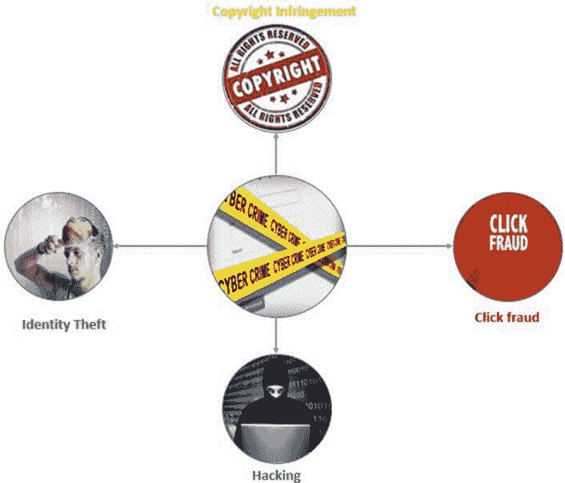
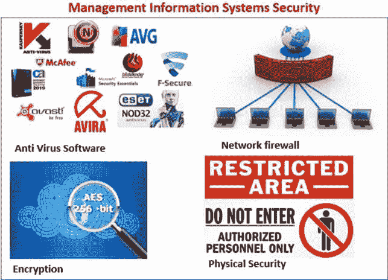

# 信息系统中的道德&安全问题

> 原文： [https://www.guru99.com/mis-ethical-social-issue.html](https://www.guru99.com/mis-ethical-social-issue.html)

信息系统已使当今许多企业成功。 没有信息技术，就不会有 Google，Facebook，EBay 等公司。 但是，信息技术使用不当会给组织和员工带来麻烦。

犯罪分子获得信用卡信息的使用权可能导致卡所有者或金融机构遭受经济损失。 使用组织信息系统，即使用公司帐户在 Facebook 或 Twitter 上发布不适当的内容可能会导致诉讼和业务损失。

本教程将解决信息系统带来的挑战以及如何使风险最小化或消除风险。

在本教程中，您将学习–

*   [网络犯罪](#1)
*   [信息系统安全性](#2)
*   [信息系统伦理](#3)
*   [信息通信技术（ICT）政策](#4)

## 网络犯罪

网络犯罪是指使用信息技术进行犯罪。 网络犯罪的范围从简单烦人的计算机用户到巨大的财务损失，甚至是生命损失。 可访问互联网的智能手机和其他高端[移动](/mobile-testing.html)设备的增长也推动了网络犯罪的增长。

**网络犯罪的类型**

**身份盗用**

当网络犯罪分子冒充他人身份以进行故障操作时，就会发生身份盗用。 这通常是通过访问他人的个人详细信息来完成的。 在此类犯罪中使用的详细信息包括社会安全号码，出生日期，信用卡和借记卡号码，护照号码等。

一旦信息被网络罪犯获取，它就可以用于在线购买，同时冒充他人。 网络犯罪分子用来获取此类个人详细信息的方法之一是网络钓鱼。 **网络钓鱼涉及创建看起来像合法商业网站或电子邮件**的伪造网站。

例如，看起来来自 YAHOO 的电子邮件可能会要求用户确认其个人详细信息，包括联系电话和电子邮件密码。 如果用户迷上了窍门并更新了详细信息并提供了密码，则攻击者将有权访问个人详细信息和受害者的电子邮件。

如果受害者使用 PayPal 之类的服务，则攻击者可以使用该帐户进行在线购买或转移资金。

其他网络钓鱼技术涉及使用伪造的 Wi-Fi 热点，这些热点看起来像合法的热点。 这在饭店和机场等公共场所很常见。 如果毫无戒心的用户登录到网络，则网络犯罪可能会尝试获取对敏感信息的访问，例如用户名，密码，信用卡号等。

根据美国司法部的说法，一名前国务院雇员使用电子邮件网络钓鱼来访问数百名妇女的电子邮件和社交媒体帐户，并访问露骨的照片。 他能够使用这些照片来勒索妇女，并威胁说，如果这些照片不符合他的要求，便会公开。

**侵犯版权**

盗版是数字产品的最大问题之一。 诸如海盗湾之类的网站用于分发受版权保护的材料，例如音频，视频，软件等。侵犯版权是指未经授权使用受版权保护的材料。

快速的互联网访问和降低的存储成本也促进了侵犯版权犯罪的增长。

**点击欺诈**

广告公司（例如 Google AdSense）提供按点击付费的广告服务。 当某人单击这样的链接，无意更多地了解点击，而是想赚更多钱时，就会发生点击欺诈。 这也可以通过使用自动点击的软件来完成。

**预付款欺诈**

将向目标受害者发送一封电子邮件，向他们许诺很多钱，以帮助他们要求继承财产。

在这种情况下，罪犯通常会假装是一个非常富有的知名死者的近亲。 他/她声称已继承了已故富人的财富，需要帮助来主张继承。 他/她将要求经济援助，并承诺稍后再奖励。 如果受害者将钱寄给诈骗者，则诈骗者将消失，受害者将损失金钱。

**骇客**

黑客用于绕过安全控制，以获取对系统的未授权访问。 一旦攻击者获得了对系统的访问权限，他们就可以做他们想做的任何事情。 系统被黑客入侵时完成的一些常见活动包括：

*   安装程序，使攻击者可以监视用户或远程控制其系统
*   污损网站
*   窃取敏感信息。 可以使用 [SQL](/sql.html) 注入，利用数据库软件中的漏洞来获取访问权限，利用社会工程学技术诱使用户提交 ID 和密码等技术来完成此任务。

**计算机病毒**

病毒是未经授权的程序，可以使用户烦恼，窃取敏感数据或用于控制由计算机控制的设备。

## 信息系统安全

MIS 安全性是指为防止信息系统资源受到未经授权的访问或受到破坏而采取的措施。 安全漏洞是计算机系统，软件或硬件中的弱点，攻击者可以利用这些弱点来获得未经授权的访问或破坏系统。

人们也可以使用社会工程技术来开发信息系统组件中的一部分。 社会工程学的目标是获得系统用户的信任。

现在，让我们看一下信息系统面临的一些威胁，以及如果威胁要现实的话，可以采取哪些措施来消除或最小化损害。

**计算机病毒** –如上节所述，它们是恶意程序。 通过使用防病毒软件并遵循组织的最佳安全性最佳做法，可以消除病毒造成的威胁或将影响最小化。

**未经授权的访问** –标准约定是使用用户名和密码的组合。 如果用户不遵循安全最佳实践，黑客将学会如何规避这些控件。 大多数组织都增加了对移动设备（如电话）的使用，以提供额外的安全保护。

让我们以 Gmail 为例，如果 Google 怀疑帐户登录，他们会要求要登录的人使用其 Android 驱动的移动设备确认其身份，或者发送带有 PIN 码的 SMS，该 PIN 码应作为用户名和 密码。

如果公司像 Google 一样没有足够的资源来实现额外的安全性，则可以使用其他技术。 这些技术可以包括在注册过程中向用户提问，例如他们长大的城镇，第一只宠物的名字等。如果此人提供了对这些问题的准确答案，则可以访问系统。

**数据丢失** –如果数据中心起火或被洪水淹没，则包含数据的硬件可能会损坏，并且其上的数据也将丢失。 作为标准的安全性最佳实践，大多数组织将数据备份保存在远程位置。 备份是定期进行的，通常放在一个以上的远程区域。

生物特征识别–现在正变得非常普遍，尤其是在智能手机等移动设备上。 手机可以记录用户指纹并将其用于身份验证目的。 这使得攻击者更难获得对移动设备的未经授权的访问。 此类技术还可用于阻止未经授权的人员访问您的设备。

## 信息系统伦理

道德规范是指人们用来做出选择以指导自己的行为的是非规则。 MIS 中的道德规范试图通过负责任地使用信息系统来保护和维护个人与社会。 大多数专业通常都定义了道德规范或行为规范准则，所有与该专业相关的专业人员都必须遵守。

简而言之，道德准则使个人按照自己的自由意志行事并对自己的行为负责。 可以在英国计算机协会（BCS）网站上找到针对 MIS 专业人士的《道德守则》的示例。

## 信息通信技术（ICT）政策

ICT 策略是一组准则，定义了组织应如何负责任地使用信息技术和信息系统。 ICT 政策通常包括有关以下方面的指南：

*   购买和使用硬件设备以及如何安全处置它们
*   仅出于安全考虑，仅使用许可软件，并确保所有软件都是最新补丁程序
*   有关如何创建密码（强制执行复杂性），更改密码等的规则。
*   可接受使用信息技术和信息系统
*   培训所有参与使用 ICT 和 MIS 的用户

**摘要：**

拥有权利的同时也被赋予了重大的责任。 信息系统为我们的经商方式带来了新的机遇和优势，但同时也带来了可能对社会产生负面影响的问题（网络犯罪）。 组织需要解决这些问题，并提出解决这些问题的框架（MIS 安全性，ICT 策略等）。