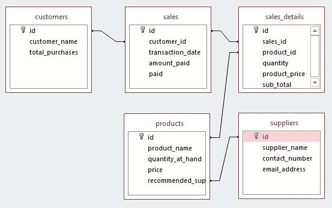
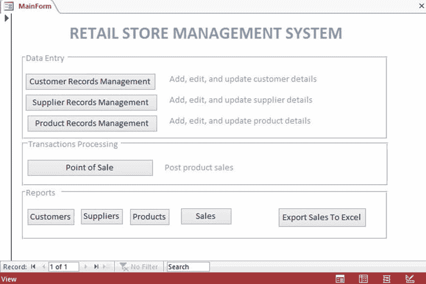
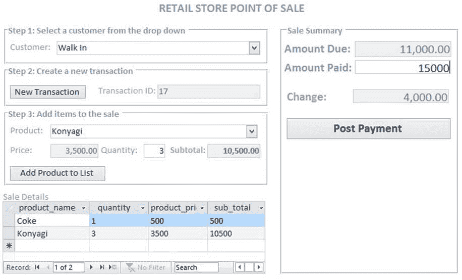
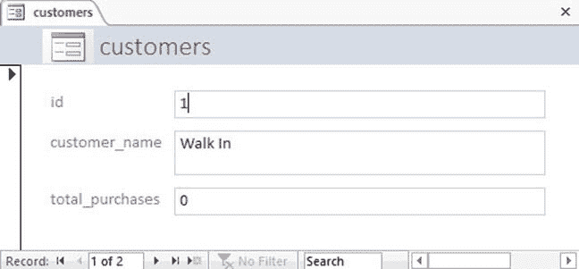

# 决策支持系统（DSS）：零售商店的演示 PoS

> 原文： [https://www.guru99.com/mis-demo-retail-store.html](https://www.guru99.com/mis-demo-retail-store.html)

在本教程中，我们将为虚拟零售商店创建一个简单的销售点系统。 运营人员将使用该系统记录日常业务交易，战术人员还将使用该系统监视零售商店的当前绩效。

该系统将能够导出数据到 excel。 Excel 将用作**决策支持系统**工具来分析数据。 Excel 中的数据也可以与其他来源的数据合并。

## 零售商店 MIS 组件

**1.业务程序**

业务程序定义了必须如何进行日常业务交易。 销售点系统将用于记录每日销售额。

下表概述了客户购买商品时要进行的活动

1.  客户出示要购买的物品直至现金
2.  收银员在系统中搜索系统中显示的项目以检索价格
3.  收银员输入所购买物料的数量，然后系统计算总成本。 对所有购买的物品重复此过程
4.  如果收银员错误地将物料或物料数量添加到系统中，那么如果尚未过帐付款，他们应该可以将其删除。 如果付款已过帐，出纳员将无法删除任何东西。
5.  验证总客户账单后，系统应允许收银员过帐客户付款并为客户打印收据。

**2.人员**

将使用该系统的用户将是收银员，会计师和库存控制用户。 所有用户必须从字面上理解计算机，并接受有关如何使用销售点系统的培训。

**3.硬件**

销售点系统将 Microsoft Access 作为数据库引擎。 Microsoft Access 是一个独立的数据库引擎，因此，该系统将在单台计算机上运行。 使用的计算机将需要具有以下规格。

*   至少 1GB RAM
*   数据库所在的本地驱动器上至少有 10GB 的可用存储空间
*   该计算机应至少在 Windows XP 和更高版本上运行基于 Windows 的操作系统
*   处理器速度至少应为 1GHz

**4.软件**

与系统一起使用的计算机应具有以下最低规格。

*   基于 Microsoft 的操作系统
*   Microsoft Office Suite（特别是 Microsoft Word 和 Microsoft Access）

**5.数据**

日常业务交易将存储在 Microsoft Access 数据库中。

## 销售点数据库字典

数据库字典描述了数据库字段，它们的作用以及数据类型。

下面描述了我们数据库中将具有的表。 为了简单起见，我们将表的数量保持为仅四（4）个。

**产品表**

| **S / N** | **字段名称** | **数据类型** | **说明** |
| 1 | ID | 数字 | 记录主键 |
| 2 | 产品名称 | 串 | 产品名称 |
| 3 | 价钱 | Numeric | 产品价格 |
| 4 | 数量 | Numeric | 任何给定时间的可用数量 |
| 5 | Recommendation_supplier_id | Numeric | 链接到供应商表的外键 |

**客户表**

| **S/N** | **Field Name** | **Data Type** | **Description** |
| 1 | id | Numeric | Record primary key |
| 2 | 顾客姓名 | String | 客户名称 |
| 3 | 采购总额 | Numeric | 特定客户的总销售额累计值 |

**供应商表**

| **S/N** | **Field Name** | **Data Type** | **Description** |
| 1 | id | Numeric | Record primary key |
| 2 | 供应商名称 | String | Name of the customer |
| 3 | 联系电话 | Numeric | 供应商联系电话 |
| 4 | 电子邮件地址 | String | 供应商的电子邮件地址 |

**销售表**

| **S/N** | **Field Name** | **Data Type** | **Description** |
| 1 | id | Numeric | Record primary key |
| 2 | 顾客 ID | Numeric | 客户唯一标识符 |
| 3 | 交易日期 | 日期 | 记录交易的日期 |
| 4 | 支付的金额 | Numeric | 总购买金额 |
| 5 | 已付费 | 布尔型 | 布尔字段，显示客户是否已付款 |

**销售明细表**

| **S/N** | **Field Name** | **Data Type** | **Description** |
| 1 | id | Numeric | Record primary key |
| 2 | sales_id | Numeric | Customer unique identifier |
| 3 | 产品编号 | Date | The date that the transaction was recorded |
| 4 | 数量 | Numeric | Total purchase amount |
| 5 | Paid | Boolean | Boolean field that shows whether a customer has paid or not |

## 销售点数据库实体关系图

实体关系图显示数据库中表之间的关系。 下表描述了数据库表之间的关系

| **S/N** | **关系** | **主要** | **外键** | **关系性质** |
| 1 | 产品销售 | 产品编号 | 销售中的 product_id | 一对多 |
| 2 | 向客户销售 | 客户编号 | 销售中的 Customer_id | 多对多 |
| 3 | 供应商产品 | 供应商编号 | 产品中的 Recommendation_supplier_id | 多对一 |

下图显示了数据库中表之间的关系。

系统中交易的处理方式

1.  系统从客户表中检索所有客户记录，并填充下拉组合
2.  收银员点击新交易按钮。 这将在 sales 表中创建新记录并生成交易 ID。
3.  系统从产品表中检索所有产品并填充下拉组合
4.  收银员从下拉列表中选择一种产品。 系统保留当前商品的产品编号和价格。
5.  收银员输入购买的数量。 系统根据存储的价格和输入的数量计算小计。 重复此过程，直到所有产品都已发布到系统中为止。
6.  收银员输入客户已支付的金额。 如果客户支付的价格高于价格，则系统会计算更改。
7.  收银员单击后付款按钮。 系统更新；
    1.  产品表中的现有产品数量
    2.  更新已付款金额字段并将交易标记为已在销售表中
    3.  更新客户表中的“购买总额”字段

## 销售点图形用户界面屏幕截图

**系统主窗口** –这是进入系统的入口。 它允许用户输入数据，处理交易，打印报告以及将销售数据导出到 Excel 进行进一步分析。

在这里，我们展示了 POS 期间使用的各种数据输入窗口，以概述执行交易时填写的字段。

**收银员在现金点**使用的销售点窗口

用户界面的设计方式可引导收银员完成发布成功的购买交易所涉及的步骤。

**客户数据输入窗口**

**产品数据输入窗口**

**摘要**

本教程向您展示了开发信息系统所涉及的实际步骤，并介绍了 POS（销售点）系统的原型。 该系统是使用 Microsoft Access 中的 Visual Basic for Applications（VBA）开发的。

*   [下一个](/pmp-tutorial.html)