# 如何在 Excel 中编写宏：分步入门指南

> 原文： [https://www.guru99.com/introduction-to-macros-in-excel.html](https://www.guru99.com/introduction-to-macros-in-excel.html)

## 什么是 Excel 宏？

**EXCEL MACRO** 是一种记录和播放工具，它仅记录您的 Excel 步骤，并且宏将根据需要播放任意多次。 VBA 宏可自动执行重复任务，从而节省了时间。 这是一段可在 Excel 环境中运行的编程代码，但您无需成为编码器即可对宏进行编程。 但是，您需要 VBA 的基础知识才能在宏中进行高级修改。

在本教程中，您将学习

*   [为什么在 Excel 中使用 Excel 宏？](#2)
*   [外行人使用的 VBA 是什么？](#3)
*   [宏基础知识](#4)
*   [在 Excel 中记录宏的分步示例](#5)

## 为什么在 Excel 中使用 Excel 宏？

作为人类，我们是习惯的产物。 我们每天每个工作日都会做某些事情。 如果有某种神奇的方法可以按一个按钮并且完成了我们所有的例行任务，这会更好吗？ 我能听到你说是的。 宏可以帮助您实现这一目标。 用外行语言来说，宏定义为您在 Excel 中的常规步骤的记录，您可以使用单个按钮进行重放。

例如，您正在作为自来水公司的出纳员。 一些客户通过银行付款，最终，您需要从银行下载数据并以符合业务需求的方式对其进行格式化。

您可以将数据导入 Excel 和格式。 第二天，您将需要执行相同的仪式。 它将很快变得无聊和乏味。 **宏通过自动执行此类常规任务**解决了此类问题。 您可以使用宏来记录以下步骤

*   导入数据
*   对其进行格式化以满足您的业务报告要求。

## 外行语言的 VBA 是什么？

**VBA 是 Visual Basic for Applications 的缩写。** 这是一种编程语言，Excel 在执行日常任务时会使用它来记录您的步骤。 您无需成为程序员或技术人员就可以享受 Excel 中宏的好处。 Excel 具有自动为您生成源代码的功能。 阅读有关 Vba 的文章以了解更多详细信息。

## 宏基础知识

**宏是开发人员功能之一。 默认情况下，开发人员选项卡不显示在 excel 中。 您需要通过自定义报告**显示它

攻击者可以使用宏来破坏您的系统。 默认情况下，它们在 excel 中被禁用。 如果需要运行宏，则将需要启用运行宏，并且仅运行您知道来自受信任来源的宏

如果要保存宏，则必须将工作簿保存为启用宏的格式* .xlsm

宏名称不得包含任何空格。

创建宏时，请务必填写宏的描述。 这将帮助您和其他人了解宏在做什么。

## 在 Excel 中记录宏的分步示例

我们将使用宏 excel 重要性中描述的方案进行工作。 我们将使用以下 CSV 文件。

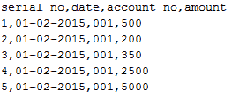

您可以在此处下载以上文件

[下载上述 CSV 文件&宏](https://drive.google.com/uc?export=download&id=0BwL5un1OyjsdcEl4Y1N6SGZkWWs)

我们将创建一个启用宏的模板，该模板将导入上述数据并对其进行格式化，以满足我们的业务报告要求。

 **## 启用开发者选项** 

要执行 VBA 程序，您必须有权访问 Excel 中的开发人员选项。 如下所示启用开发人员选项，然后将其固定到 Excel 中的主要功能区。

**步骤 1）**转到主菜单“文件”

选择选项“选项”。

[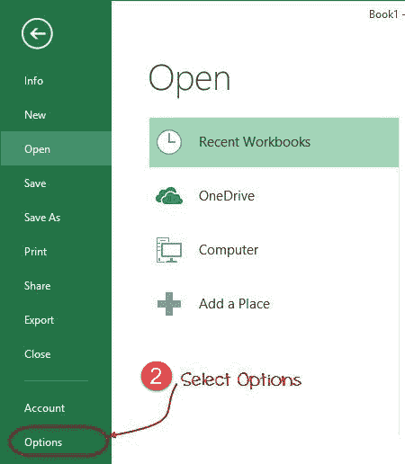 ](/images/vba/062416_1048_WhatisVBA2.png) 

**步骤 2）**现在将打开另一个窗口，在该窗口中执行以下操作

*   单击自定义功能区
*   将复选框标记为开发人员选项
*   点击确定按钮

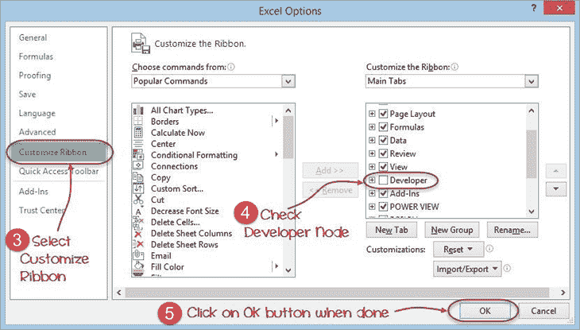

**步骤 3）**开发人员标签

现在，您将能够在功能区中看到“开发人员”选项卡

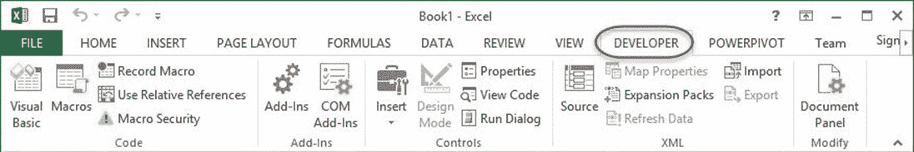

**步骤 4）**下载 CSV

首先，我们将看到如何在电子表格上创建命令按钮并执行程序。

*   在驱动器 C 中创建一个名为 Bank Receipts 的文件夹
*   粘贴您下载的 receives.csv 文件

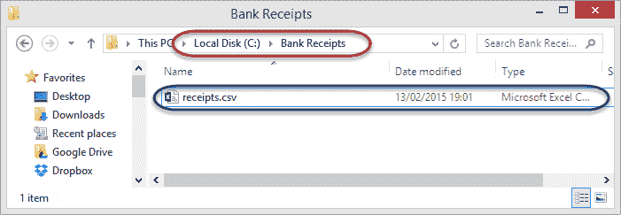

**步骤 5）**记录宏

1.  单击开发人员选项卡
2.  单击记录宏，如下图所示

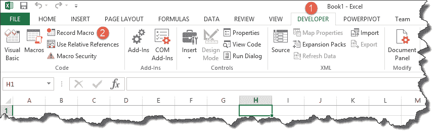

您将获得以下对话窗口

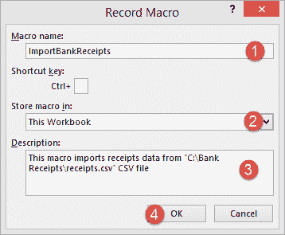

1.  输入 ImportBankReceipts 作为宏名称。
2.  第二步将默认存在
3.  输入说明，如上图所示
4.  点击“确定”标签

**步骤 6）**执行您要记录的宏操作/步骤

*   将光标放在单元格 A1 中
*   单击数据选项卡
*   单击“获取外部数据”功能区栏上的“来自文本”按钮

You will get the following dialogue window

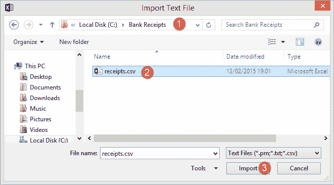

1.  转到存储 CSV 文件的本地驱动器
2.  选择 CSV 文件
3.  点击导入按钮

您将获得以下向导

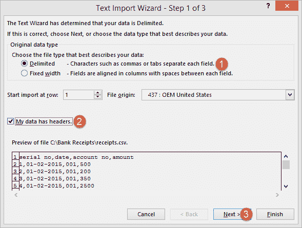

完成上述步骤后，单击“下一步”按钮

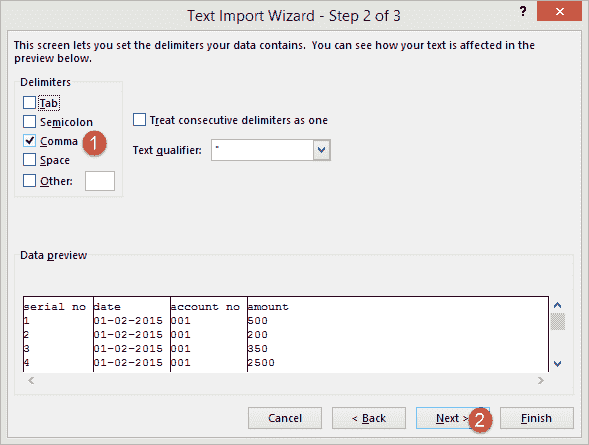

请按照上述步骤操作，然后单击下一步按钮

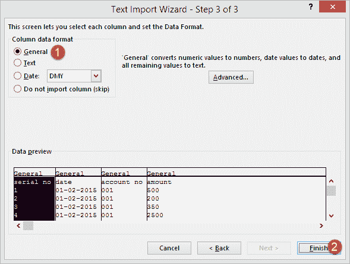

*   点击完成按钮
*   您的工作簿现在应如下所示

[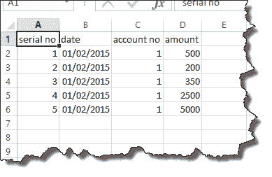 ](/images/5-2015/050215_1033_Introductio10.png) 

**步骤 7）**格式化数据

将列设为粗体，添加总计，然后使用 SUM 函数获取总计。

**步骤 8）**停止录制宏

现在我们已经完成了日常工作，我们可以单击停止录制宏按钮，如下图所示

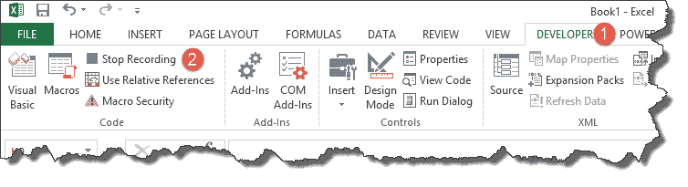

**步骤 9）**重播宏

在保存工作簿之前，我们将需要删除导入的数据。 我们将执行此操作以创建一个模板，该模板将在每次我们有新的收据并要运行 ImportBankReceipts 宏时复制。

*   突出显示所有导入的数据
*   右键单击突出显示的数据
*   点击删除
*   单击另存为按钮
*   将工作簿保存为启用宏的格式，如下所示

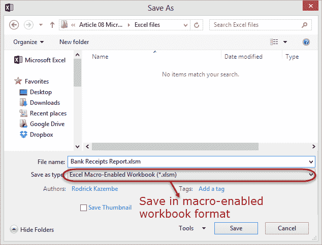

*   复制新保存的模板
*   打开它
*   单击开发人员选项卡
*   单击宏按钮

You will get the following dialogue window

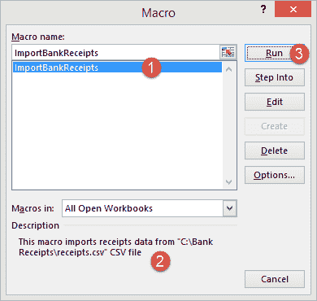

1.  选择 ImportBankReceipts
2.  突出显示您的宏的描述
3.  点击运行按钮

您将获得以下数据

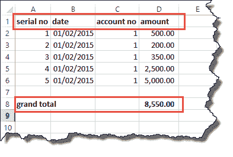

恭喜，您刚刚在 excel 中创建了第一个宏。 

## 摘要

宏通过使我们执行的大多数日常工作自动化来简化我们的工作生活。 Excel 中的宏由 Visual Basic for Applications 驱动。

To execute VBA program, you have to have access to developer option in Excel. Enable the developer option as shown below and pin it into your main ribbon in Excel.

**Step 1)**Go to main menu "FILE"

Select option "Options."

 

**Step 1)**Go to main menu "FILE"

Select option "Options."

**Step 2)** Now another window will open, in that window do following things

*   单击自定义功能区
*   将复选框标记为开发人员选项
*   点击确定按钮

**Step 2)** Now another window will open, in that window do following things

*   单击自定义功能区
*   将复选框标记为开发人员选项
*   点击确定按钮

**Step 3)** Developer Tab

You will now be able to see the DEVELOPER tab in the ribbon

**Step 3)** Developer Tab

You will now be able to see the DEVELOPER tab in the ribbon

**Step 4)** Download CSV

First, we will see how we can create a command button on the spreadsheet and execute the program.

*   在驱动器 C 中创建一个名为 Bank Receipts 的文件夹
*   粘贴您下载的 receives.csv 文件

**Step 4)** Download CSV

First, we will see how we can create a command button on the spreadsheet and execute the program.

**Step 5)** Record Macro

1.  单击开发人员选项卡
2.  单击记录宏，如下图所示

You will get the following dialogue window

1.  输入 ImportBankReceipts 作为宏名称。
2.  第二步将默认存在
3.  输入说明，如上图所示
4.  点击“确定”标签

**Step 5)** Record Macro

1.  单击开发人员选项卡
2.  单击记录宏，如下图所示

**Step 6)** Perform Macro Operations/Steps you want to record

*   将光标放在单元格 A1 中
*   单击数据选项卡
*   单击“获取外部数据”功能区栏上的“来自文本”按钮

You will get the following dialogue window

1.  转到存储 CSV 文件的本地驱动器
2.  选择 CSV 文件
3.  点击导入按钮

You will get the following wizard

Click on Next button after following the above steps

Follow the above steps and click on next button

*   点击完成按钮
*   您的工作簿现在应如下所示

 

**Step 6)** Perform Macro Operations/Steps you want to record

*   将光标放在单元格 A1 中
*   单击数据选项卡
*   单击“获取外部数据”功能区栏上的“来自文本”按钮

**Step 7)** Format the Data

Make the columns bold, add the grand total and use the SUM function to get the total amount.

**Step 7)** Format the Data

Make the columns bold, add the grand total and use the SUM function to get the total amount.

**Step 8)** Stop Recording Macro

Now that we have finished our routine work, we can click on stop recording macro button as shown in the image below

**Step 8)** Stop Recording Macro

Now that we have finished our routine work, we can click on stop recording macro button as shown in the image below

**Step 9)** Replay the Macro

Before we save our work book, we will need to delete the imported data. We will do this to create a template that we will be copying every time we have new receipts and want to run the ImportBankReceipts macro.

*   突出显示所有导入的数据
*   右键单击突出显示的数据
*   点击删除
*   单击另存为按钮
*   将工作簿保存为启用宏的格式，如下所示

*   复制新保存的模板
*   打开它
*   单击开发人员选项卡
*   单击宏按钮

You will get the following dialogue window

1.  选择 ImportBankReceipts
2.  突出显示您的宏的描述
3.  点击运行按钮

You will get the following data

Congratulations, you just created your first macro in excel. 

**Step 9)** Replay the Macro

Before we save our work book, we will need to delete the imported data. We will do this to create a template that we will be copying every time we have new receipts and want to run the ImportBankReceipts macro.