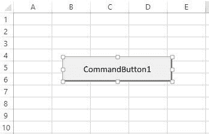
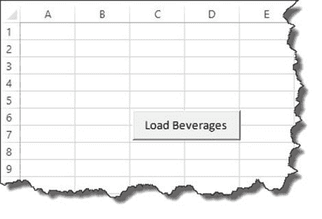
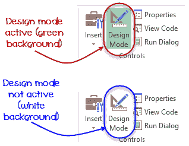
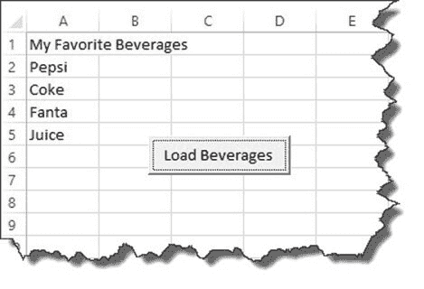

# Excel VBA 数组：带示例的动态多维类型

> 原文： [https://www.guru99.com/vba-arrays.html](https://www.guru99.com/vba-arrays.html)

## 什么是 VBA 阵列？

数组定义为能够存储多个值的存储位置。 这些值都必须具有相同的数据类型。 假设您要在单个变量中存储自己喜欢的饮料列表，则可以使用数组来实现。

通过使用数组，可以使用相同的名称引用相关值。 您可以使用索引或下标来区分它们。 各个值称为数组的元素。 它们从索引 0 到最高索引值是连续的。

本教程假定您正在使用 Microsoft Excel 版本 2013。该知识仍然同样适用于其他版本的 Microsoft Excel。

在本 VBA 编程教程中，您将学习-

*   [数组的优点是什么？](#2)
*   [数组的类型](#3)
*   [如何在 Excel VBA 中使用数组](#4)
*   [测试我们的应用程序](#5)

## 数组的优点是什么？

以下是数组函数提供的一些好处

1.  将逻辑上相关的数据分组在一起-假设您要存储学生列表。 您可以使用单个数组变量来为学生类别（例如，更亲切的花园，小学，中学，高中等）分配不同的位置。
2.  数组使编写可维护代码变得容易。 对于相同的逻辑相关数据，它允许您定义一个变量，而不是定义多个变量。
3.  更好的性能–定义数组后，检索，排序和修改数据的速度就会更快。

## 数组类型

VBA 支持两种类型的数组：

*   **Static** – These types of arrays have a fixed pre-determined number of elements that can be stored. One cannot change the size of the data type of a Static Array. These are useful when you want to work with known entities such as the number of days in a week, gender, etc.

    **例如**：Dim ArrayMonth（12）作为字符串

*   **Dynamic** – These types of arrays do not have a fixed pre-determined number of elements that can be stored. These are useful when working with entities that you cannot predetermine the number.

    **例如**：Dim ArrayMonth（）作为变量

**声明数组的语法**

**静态数组**

声明 **STATIC** 数组的语法如下：

```
Dim arrayName (n) as datatype
```

**此处，**

| **代码** | **动作** |
| 昏暗的 arrayName（n）数据类型 | 

1.  它声明了一个名为 arrayName 的数组变量，大小为 n，数据类型为。 大小是指数组可以存储的元素数。

 |

**动态数组**

声明 **DYNAMIC** 数组的语法如下：

```
Dim arrayName() as datatype
ReDim arrayName(4)
```

**HERE,**

| **Code** | **Action** |
| 昏暗的 arrayName（）数据类型 | 

1.  声明了一个名为 arrayName 的数组变量，但未指定元素数

 |
| ReDim arrayName（4） | 

2.  它在定义数组后指定数组大小。

 |

**阵列尺寸**

数组可以是一维，二维或多维。

*   **一维**：在这一维中，数组仅使用一个索引。 例如，每个年龄段都有许多人。
*   **二维**：在此维度中，数组使用两个索引。 例如，每个班级有许多学生。 它要求班级数和每个班级的学生人数
*   **多维**：在此维度上，数组使用两个以上的索引。 例如，白天的温度。 （30，40，20）。

## 如何在 Excel VBA 中使用数组

我们将创建一个简单的应用程序。 此应用程序使用数组变量中的数据填充 Excel 工作表。 在此示例中，我们将执行以下操作。

*   创建一个新的 Microsoft Excel 工作簿并将其另存为 Excel Macro-Enabled Workbook（* .xlsm）
*   将命令按钮添加到工作簿
*   设置命令按钮的名称和标题属性
*   对填充 Excel 工作表的 VBA 进行编程

让我们逐步进行这项练习，

**步骤 1 –创建一个新工作簿**

1.  开启 Microsoft Excel
2.  将新工作簿另存为 VBA Arrays.xlsm

**步骤 2 –添加命令按钮**

**注意**：本部分假定您熟悉在 excel 中创建接口的过程。 如果您不熟悉，请阅读教程 [VBA Excel 表单控件& ActiveX 控件](/vba-operators.html)。 它将向您展示如何创建界面

1.  将命令按钮添加到工作表



2.  将名称属性设置为 cmdLoadBeverages
3.  将标题属性设置为“加载饮料”

您的 GUI 现在应如下所示



**步骤 3 –保存文件**

1.  单击另存为按钮
2.  选择 Excel 启用宏的工作簿（* .xlsm），如下图所示


**步骤 4 –编写代码**

现在，我们将为我们的应用程序编写代码

1.  右键单击“加载饮料”按钮，然后选择查看代码
2.  将以下代码添加到 cmdLoadBeverages 的 click 事件中

```
Private Sub cmdLoadBeverages_Click()
    Dim Drinks(1 To 4) As String

    Drinks(1) = "Pepsi"
    Drinks(2) = "Coke"
    Drinks(3) = "Fanta"
    Drinks(4) = "Juice"

    Sheet1.Cells(1, 1).Value = "My Favorite Beverages"
    Sheet1.Cells(2, 1).Value = Drinks(1)
    Sheet1.Cells(3, 1).Value = Drinks(2)
    Sheet1.Cells(4, 1).Value = Drinks(3)
    Sheet1.Cells(5, 1).Value = Drinks(4)
End Sub

```

**HERE,**

| **代码** | **动作** |
| 细线饮料（1 到 4）作为琴弦 | 

*   它声明了一个名为 Drinks 的数组变量。 第一个数组索引为 1，最后一个数组索引为 4。

 |
| 饮品（1）=“百事可乐” | 

*   将值 Pepsi 分配给第一个数组元素。 其他类似的代码对数组中的其他元素执行相同的操作。

 |
| Sheet1.Cells（1，1）.Value =“我的最爱饮料”。 | 

*   将值“我的最爱饮料”写入单元格地址 A1 中。 Sheet1 引用该工作表，而 Cells（1,1）引用第 1 行和第 1 列（B）

 |
| Sheet1.Cells（2，1）.Value = Drinks（1） | 

*   将索引为 1 的数组元素的值写入第 1 列的第二行。

 |

## 测试我们的应用程序

选择开发人员选项卡，并确保“设计模式”按钮为“关闭”。 指示符是，它将具有白色背景，而不是彩色（绿色）背景。 （见下图）



单击加载饮料按钮

您将获得以下结果



下载包含以上代码的 Excel

[下载上面的 Excel 代码](https://drive.google.com/uc?export=download&id=0ByI5-ZLwpo25NVJIV2ZBRTJSNms)

**摘要**

1.  数组是一个能够存储多个值的变量
2.  VBA 支持静态和动态数组
3.  与声明逻辑上相关的数据的许多变量相比，数组使编写可维护的代码更容易。